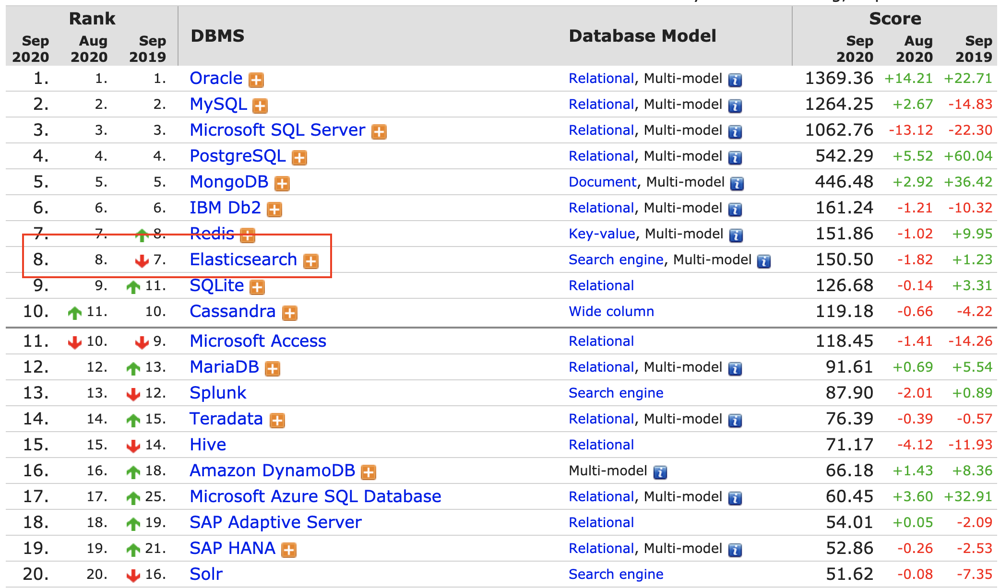
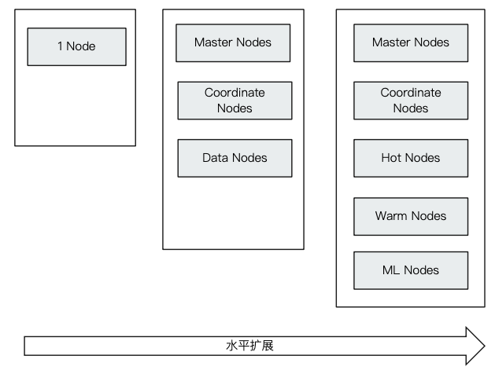
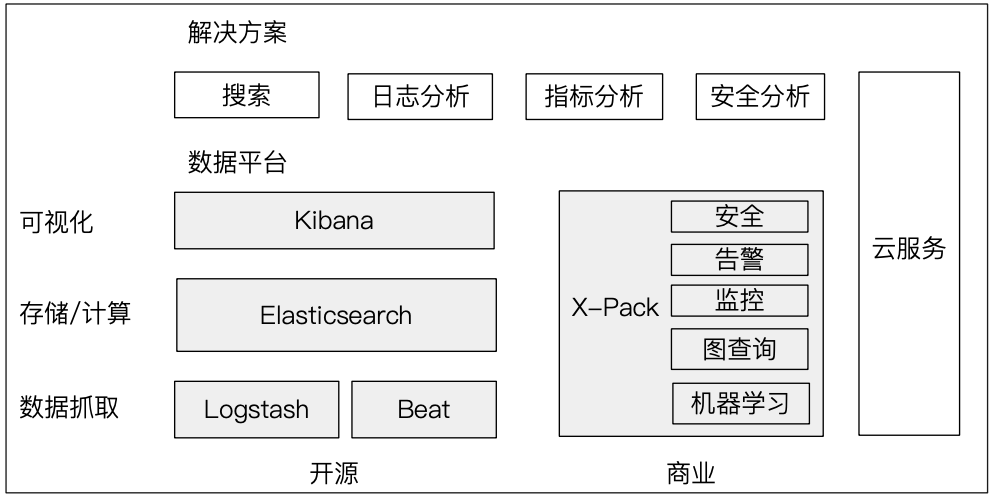
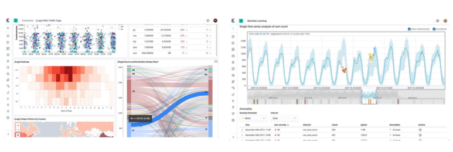
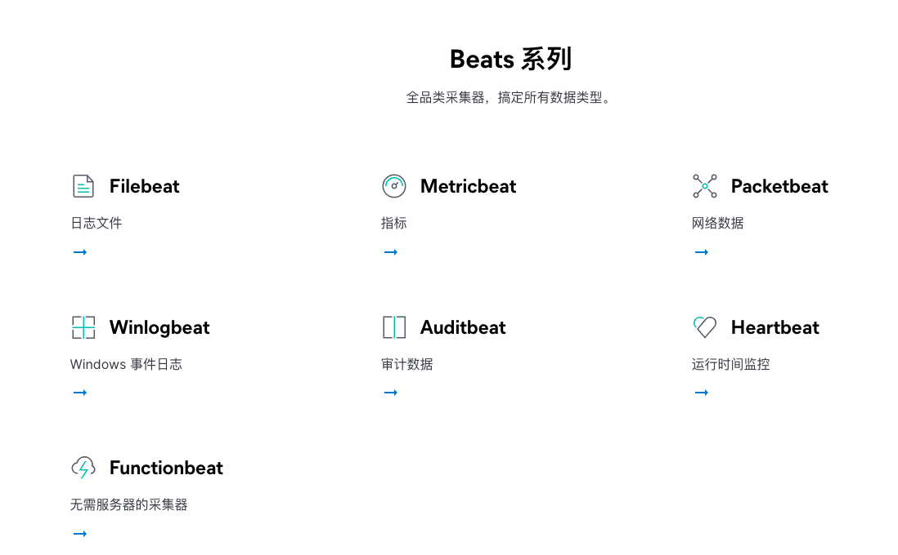
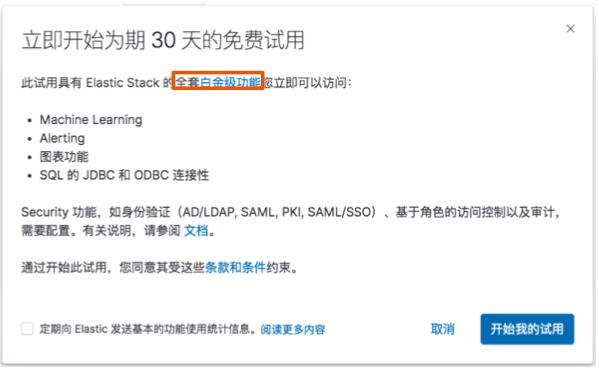
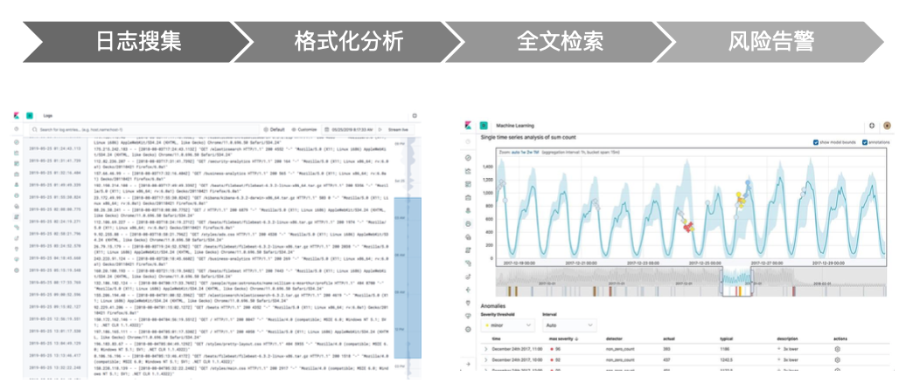
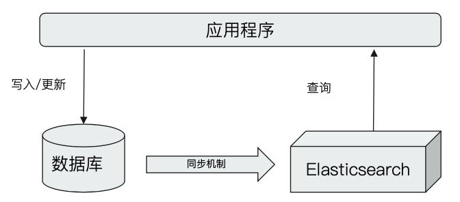
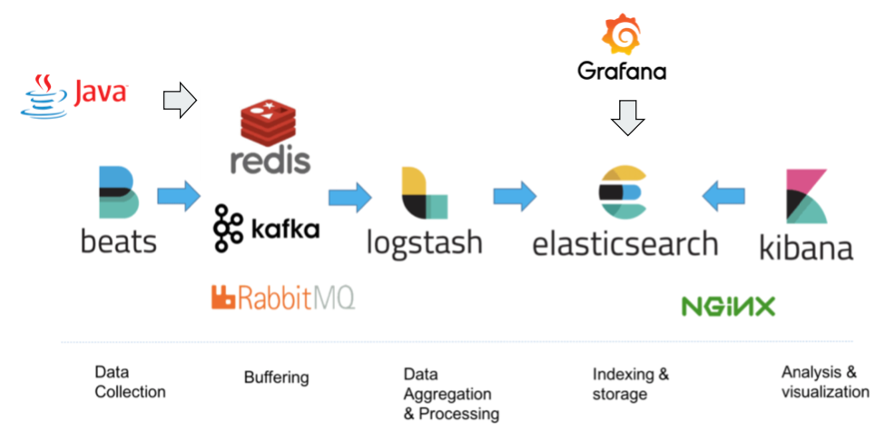
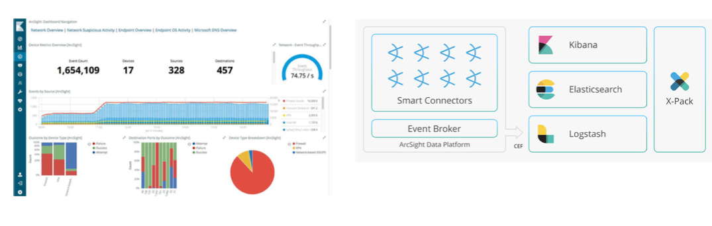

# **第一节 ElasticSearch 概述**

## 1、**􏰋􏰌􏲊􏰿􏱻􏰍􏰎􏰋􏰌􏲊􏰿􏱻􏰍􏰎􏰋􏰌􏲊􏰿􏱻􏰍􏰎􏰋􏰌􏲊􏰿􏱻􏰍􏰎本书内容与结构**

### 1-1 Elasticsearch入门与深入 

* 环境搭建／搜索与聚合／架构原理／数据建模 

### 1-2 Elasticsearch集群管理 

* 水平扩展及胜能优化／最佳实践 

### 1-3 ELK进行大数据分析 

* 可视化分析／时序型数据／异常检测 

### 1-4 项目实战和知识点回顾 

* 电影搜索／问卷分析／Elastic认证 

## 2、**Elasticsearch简介及其发展历史**

* 产品特性及发展历史
* 公司愿景与商业模型

### 2-1 从开源到上市

* Elastic Inc一开源软件／上市公司 
* 当前市值超过50亿美金，开盘当天涨幅达94% 
* Elasticsearch软件下载量，超3.5亿次 
* 10万＋的社区成员 
* 7200＋订阅用户，分布在100＋国家 
* 云服务一Elastic, Amazon，阿里巴巴，腾讯 

### 2-2 Elasticsearch 客户

### 2-3 Elasticsearch简介 

* Elasticsearch一开源分布式搜索分析引擎 
	* 近实时（Near Real Time) 
	* 分布式存储／搜索／分析引擎 
* Solr (Apache开源项目） 
* Splunk（商业上市公司） 

> https://db-engines.com/en/ranking

### 2-4 起源 - Lucene

* 基于Java语言开发的搜索引家库类 
* 创建于1999年2005年成为Apache顶级开源项目 
* 具有高性能易扩展的优点
*  Lucene的局限性 
	* 只能基于Java语言开发 
	* 类库的接口学习曲线陡峭 
	* 原生并不支持水平扩展 

### 2-5 Elasticsearch的诞生 

* 2004年Shay Banon基于Lucene开发了Compass 
* 2010年Shay Banon重写了Compass，取名Elasticsearch 
	* **支持分布式，可水平扩展** 
	* 降低全文检索的学习曲线，可以被任何编程语言调用 

􏰙􏰚􏰛􏰜􏰝􏰞􏰟􏰜􏰠􏰛􏲋􏲌􏱻􏲍
### 2-6 Elasticsearch的分布式架构 

* 集群规模可以从单个扩展至数百个节点 
* 高可用＆水平扩展 
	* 服务和数据两个纬度 
* 支持不同的节点类型 
	* **支持Hot&Warm架构** 
	

### 2-7 支持多种方式集成接入 

* 多种编程语言的类库（https://www.elastic.co/guide/en/elasticsearch/client/index.html) 
	* Java/NET/Python/Ruby/PHP/Grooy／Perl 

* **RESTful API vs Transport API** 
	* 9200 vs 9300（建议使用RESTful API) 
* **JDBC & ODBC** 

### 2-8 新特性 5.X

* **Lucene 6.X 性能提升默认打分机制从TF-IDF改为BM 25** 
* 支持Ingest节点/Painless Scripting/Completion suggested 支持／原生的Java REST客户端 
* **Type标记成deprecated, 支持了Keyword的类型 **
* 性能优化 
	* 内部引擎移除了避免同一文档并发更新的竞争锁,带来15％一20％的性能提升 
	* Instant aggregation支持分片上，聚合的缓存 
	* 新增了Profile API 

### 2-9 新特性6.x

* Lucene 7.x 
* 新功能 
	* 跨集群复制(OCR) 
	* 索引生命周期管理
	* SQL的支持
* 更友好的的升级及数据迁移 
	* 在主要版本之间的迁移更为简化体验升级 
	* 全新的基于操作的数据复制框架可加决疚复数据 
* 性能优化
	* 有效存储稀疏宇段的新方法降低了存储成本 
	* 在索引时进行排序，可加快排序的查询性能 

### 2-10 新特性 7.x

* Lucene 8.0 
* 重大改进 - 正式废除单个索引下多Type的支持 
* 7.1开始Security 功能免费使用 
* ECK Elastic Operator on Kubernetes 
* 新功能 
	* New Custer coordination 
	* Feature - Complete High level REST Client 
	* Script Score Query 
* 性能优化 
	* **默认的Primary Shard数从5改为1,避免Over Sharding**
	* 性能优化更决的Top K 

### 2-11 本节回顾 

* Elastcsearch是款基于Lunece的开源分布式搜索分析引擎 
	* 查询性能好(Near Real Time) 
	* 分布式设计，非常方便的支持水平扩展 
	* 支持多种语言的集成 
* 超过2.5亿的下载量，Elasticsearch不仅有看良好的开发者社区, 更有着商业分司支撑 
	* 大量的互联网公司使用 

## 3、**ELK Stack家族成员及其应用场景** 

### 􏰆􏲌􏴤3-1 本节知识点
 
* Elastic Stack的产品生态圈 
* 核心产品ELKB的简介 
* Elastic Stack的使用场景与用例 
* Elastic公司的开源策略与商业模式 
* Elastic Stack数据接入的方法及通用的系统架构 
 􏲆􏰊􏰈􏰌􏱝 􏱄􏶢􏰸􏰹􏱩􏶣􏴸􏰾􏴶􏱯

### 􏰆􏲌􏴤3-2 Elastic Stack 生态圈

### 􏰆􏲌􏴤3-3 Log stash:数据处理管道 

* 开源的服务器端数据处理管道，支持从不同来源采集数据， 转换数据并将数据发送到不同的存储库中 
* Loqstash诞生于2009年，最初用来做日志的采集与处理 
* 2013年被Elasticsearch收购 

### 􏰆􏲌􏴤3-4 Logstash特性 

* 实时解析和转换数据 
	* 从IP地址破译出地理坐标 
	* 将PII数据匿名化，完全排除敏感字段 
* 可扩展 
	* 200多个插件（日志/数据库/Arcsigh/Netflow) 
* 可靠性安全性 
	* Logstash会通过持久化队列来保证至少将运行中的事件送达一次 
	* 数据传输加密 
* 监控 

### 􏰆􏲌􏴤3-5 Kibana:可视化分析利器 

* Kibana名字的含义＝Kiwifruit+Banana 
* 数据可视化工具，帮助用户解开对数据的任何疑问 
* 基于Logstash的工具，2013年加入Elastic公司 

**Kibana特性**

### 􏰆􏲌􏴤3-6 Elastic的发展 

* 2015年3月收购Elastic Cloud提供Cloud服务 
* 2015年3月收购PacketBeat
* 2016年9月收购 PreAlert - Machine Leanning 异常检测 
* 2017年6月收购Opbeat进军APM 
* 2017年11月收购SaaS厂商Swifttype提供网站和App搜索 
* 2013年X-Pack开源 

### 􏰆􏲌􏴤3-7  BEATS - 轻量的数据采集器

https://www.elastic.co/cn/beats/

beats是轻量级的数据shipper，使用go语言开发，主要用来做数据采集，数据的enrichment相关的功能比较少，更多的是以agent的方式启动在数据源的机器上。

* beats可以和es连接也可以和logstash连接。
* logstash比较重，更加多的用来创建数据管道，具有很强的数据二次加工的能力。

### 􏰆􏲌􏴤3-8 X-Pack：商业化套件

* 6.3 之前的版本X-Pack以插件方式安装 
* X-Pack开源之后Elasticsearch&Kibana支持oss版和Basic两种版本 
	* 部分X-Pack功能支持免费使用，6.8和 7.1开始，Security功能免费 
* OSS， Basic黄金级白金级 

### 􏰆􏲌􏴤3-9 ELK客户及应用场景 

* 应用场景 
	* 网站搜索／垂直搜索／代码搜索 
* 日志管理与分析／安全指标监控 ／应用性能监控／WEB抓取舆情分析

􏰫􏰊􏰊􏱗􏰉􏱘􏰓􏰓􏱙􏱙􏱙􏰰􏰩􏰇􏰈􏰉􏰊􏰋􏰌􏰰􏰌􏱋􏰓􏱜􏰉􏰩􏰐􏰌􏰈􏰉􏰩􏰉􏰓> https://www.elastic.co/customers/

**日志的重要性**

* 为什么重要 
	* 运维：医生给病人看病。日志就是病人对自己的陈述 
	* 恶意攻击恶意注册刷单恶意密码猜II 
* 挑战
	* 关注点很多任伺一个点都有可能引起问题 
	* 日志分散在很多机器出了问题时才发现日志被删了 
	* 很多运维人员是消防员哪里有问题去哪里 

**日志管理**

### 􏰆􏲌􏴤3-10 Elastichsearch与数据库的集成 

* 单独使用Elasticsearch存储 
* 以下情况可考虑与数据库集成 
	* 与现有系统的集成 
	* 需考虑事务性 
	* 数据更新频繁 

### 􏰆􏲌􏴤3-11 指标分析/日志分析

### 􏰆􏲌􏴤3-12 安全分析：集成ArcSight 

### 􏰆􏲌􏴤3-13 本节回顾 

* Elastic Stack围绕着 ELKB构建出一套生态系统适合大量的应用场景 
	* Elastic公司通过并购向用户提供ML,APM网站搜索等服务 
	* Elasticsesrch从6.3开始开源了所有的代码包括X-Pack 
* X-Pack的三种订阅模式模式（基础版免费） 
* 具体的架构需要结合业务场景和需求具体情况具体分析 
	* 搜索类集成数据库同步数据／独立作为数据存储使用（不推荐） 
	* 日志型- Logstash和Beats满足不同的数据源，Kafka作为消息队列 