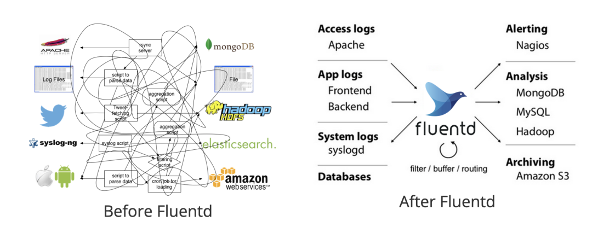
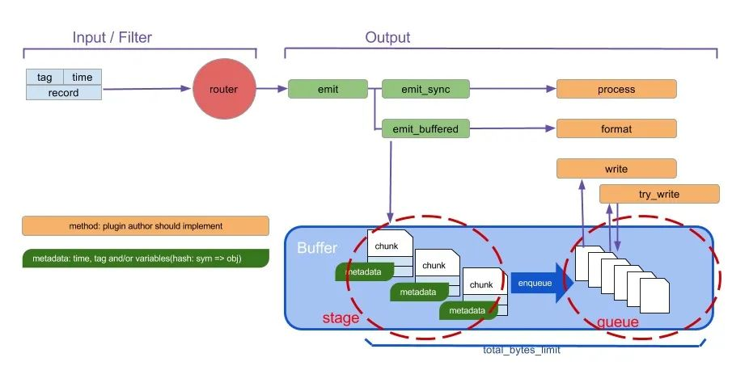
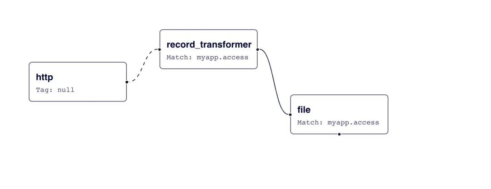

# **第八节 日志收集工具 Fluentd 使用教程**

Fluentd 是一个开源的数据收集器，致力于为用户搭建统一的日志收集层，它可以让你统一日志的收集和消费，以便更好地使用和理解日志，统一的日志记录层可让你和你的团队更好地利用数据并更快地迭代你的应用。




## **安装**

Fluentd 有多种安装方式，比如可以通过 Docker 或者手动进行安装，在手动安装 Fluentd 之前，请确保你的环境已正确设置，以避免以后出现任何不一致。

### **环境配置**

请遵循以下建议：

* 设置 NTP
* 增加文件描述符的最大数量
* 优化网络内核参数

### **设置 NTP**

强烈建议你在节点上设置 NTP 守护进程（例如 chrony、ntpd 等）以获得准确的当前时间戳，这对于所有生产服务至关重要。

**增加文件描述符的最大数量**

我们可以使用 `ulimit -n` 命令查看现有配置：

```
$ ulimit -n

65535
```

如果你的控制台显示 1024，那是不够的。请将以下几行添加到 `/etc/security/limits.conf` 文件并重启机器：

```
root soft nofile 65536

root hard nofile 65536

* soft nofile 65536

* hard nofile 65536
```

使用 sysctl -p 命令或重新启动节点使更改生效。

### **`td-agent` 包**

这里我们使用 td-agent deb 包进行安装，这是由 Treasure Data, Inc 和 Calyptia, Inc 维护的稳定 Fluentd 分发包。

Fluentd 是用 Ruby 编写的，具有灵活性，对性能敏感的部分用 C 语言编写。但是，一些用户可能难以安装和操作 Ruby 守护程序。所以 Treasure Data, Inc 专门提供了一个 Fluentd 的稳定发行版，称为 td-agent。

我这里是 Ubuntu Focal 的版本，可以使用下面的命令进行一键安装：

```
curl -fsSL https://toolbelt.treasuredata.com/sh/install-ubuntu-focal-td-agent4.sh | sh
```

上面的脚本会自动配置 systemd 的启动脚本，脚本内容如下所示：

```
$ cat /lib/systemd/system/td-agent.service;

[Unit]

Description=td-agent: Fluentd based data collector for Treasure Data

Documentation=https://docs.treasuredata.com/display/public/PD/About+Treasure+Data%%27s+Server-Side+Agent

After=network-online.target

Wants=network-online.target

  

[Service]

User=td-agent

Group=td-agent

LimitNOFILE=65536

Environment=LD_PRELOAD=/opt/td-agent/lib/libjemalloc.so

Environment=GEM_HOME=/opt/td-agent/lib/ruby/gems/2.7.0/

Environment=GEM_PATH=/opt/td-agent/lib/ruby/gems/2.7.0/

Environment=FLUENT_CONF=/etc/td-agent/td-agent.conf

Environment=FLUENT_PLUGIN=/etc/td-agent/plugin

Environment=FLUENT_SOCKET=/var/run/td-agent/td-agent.sock

Environment=TD_AGENT_LOG_FILE=/var/log/td-agent/td-agent.log

Environment=TD_AGENT_OPTIONS=

EnvironmentFile=-/etc/default/td-agent

PIDFile=/var/run/td-agent/td-agent.pid

RuntimeDirectory=td-agent

Type=forking

# XXX: Fix fluentd executables path

ExecStart=/opt/td-agent/bin/fluentd --log $TD_AGENT_LOG_FILE --daemon /var/run/td-agent/td-agent.pid $TD_AGENT_OPTIONS

ExecStop=/bin/kill -TERM ${MAINPID}

ExecReload=/bin/kill -HUP ${MAINPID}

Restart=always

TimeoutStopSec=120

  

[Install]

WantedBy=multi-user.target
```

所以我们可以使用 systemctl 来管理 td-agent 服务：

```
$ sudo systemctl start td-agent

$ sudo systemctl status td-agent

● td-agent.service - td-agent: Fluentd based data collector for Treasure Data

Loaded: loaded (/lib/systemd/system/td-agent.service; enabled; vendor preset: enabled)

Active: active (running) since Sat 2022-06-11 11:00:04 CST; 4min 6s ago

Docs: https://docs.treasuredata.com/display/public/PD/About+Treasure+Data%27s+Server-Side+Agent

Process: 3664 ExecStart=/opt/td-agent/bin/fluentd --log $TD_AGENT_LOG_FILE --daemon /var/run/td-agent/td-agent.pid $TD_AGE>

Main PID: 3677 (fluentd)

Tasks: 9 (limit: 19106)

Memory: 99.0M

CGroup: /system.slice/td-agent.service

├─3677 /opt/td-agent/bin/ruby /opt/td-agent/bin/fluentd --log /var/log/td-agent/td-agent.log --daemon /var/run/td>

└─3680 /opt/td-agent/bin/ruby -Eascii-8bit:ascii-8bit /opt/td-agent/bin/fluentd --log /var/log/td-agent/td-agent.>

  

Jun 11 11:00:03 ydzsio systemd[1]: Starting td-agent: Fluentd based data collector for Treasure Data...

Jun 11 11:00:04 ydzsio systemd[1]: Started td-agent: Fluentd based data collector for Treasure Data.

lines 1-14/14 (END)
```

td-agent 启动后通过下面的命令来发送一条日志：

```
$ curl -X POST -d 'json={"json":"message"}' http://localhost:8888/debug.test
```

发送后查看 td-agent 的日志，正常会收到如下所示的日志信息：

```
$ tail -n 1 /var/log/td-agent/td-agent.log

2022-06-11 11:09:02.377608475 +0800 debug.test: {"json":"message"}
```

### **Docker 方式**

当然更多的时候使用 Docker 方式使用 Fluentd 会更方便，这里我们创建一些简单的文件来进行测试：

```

$ mkdir fluentd

$ cd fluentd

# 创建用于保存 fluentd 的配置文件 etc 目录和保存日志的 logs 目录

$ mkdir -p etc logs

# 添加一个简单的配置文件

$ cat etc/fluentd_basic.conf

  

<source>

@type http

port 8888

bind 0.0.0.0

</source>

<match test.basic>

@type stdout

</match>
```

这里我们创建了一个 fluentd 目录用于测试，其中 etc 目录用于保留配置文件、logs 目录保存日志，首先添加了一个最基本的配置文件 `etc/fluentd_basic.conf`，其中：


* source 部分使用了 http 类型的输入插件，在 8888 端口启动一个服务用于接收日志
* match 部分定义了日志匹配 `test.basic` 标签，就将日志输出到 stdout


使用下面的命令进行 Fluentd 的启动：

```
$ docker run -p 8888:8888 --rm -v $(pwd)/etc:/fluentd/etc -v $(pwd)/logs:/fluentd/logs fluent/fluentd:v1.14-1 -c /fluentd/etc/fluentd_basic.conf -v
```

这里我们将 etc 目录和 logs 目录挂载到容器中，

* 然后通过 `-c` 参数指定 `Fluentd` 的配置文件，
* 最后一个 `-v` 参数是用于设置 `Fluentd` 开启 `verbose` 模式，便于查看 Fluentd 的日志方便调试，正常会看到如下所示的输出信息：

```
2022-06-11 07:23:48 +0000 [info]: fluent/log.rb:330:info: parsing config file is succeeded path="/fluentd/etc/fluentd_basic.conf"

2022-06-11 07:23:48 +0000 [info]: fluent/log.rb:330:info: gem 'fluentd' version '1.14.3'

2022-06-11 07:23:48 +0000 [debug]: fluent/log.rb:309:debug: No fluent logger for internal event

2022-06-11 07:23:48 +0000 [info]: fluent/log.rb:330:info: using configuration file: <ROOT>

<source>

@type http

port 8888

bind "0.0.0.0"

</source>

<match test.basic>

@type stdout

</match>

</ROOT>

2022-06-11 07:23:48 +0000 [info]: fluent/log.rb:330:info: starting fluentd-1.14.3 pid=7 ruby="2.7.5"

2022-06-11 07:23:48 +0000 [info]: fluent/log.rb:330:info: spawn command to main: cmdline=["/usr/bin/ruby", "-Eascii-8bit:ascii-8bit", "/usr/bin/fluentd", "-c", "/fluentd/etc/fluentd_basic.conf", "-v", "--plugin", "/fluentd/plugins", "--under-supervisor"]

2022-06-11 07:23:49 +0000 [info]: fluent/log.rb:330:info: adding match pattern="test.basic" type="stdout"

2022-06-11 07:23:49 +0000 [info]: fluent/log.rb:330:info: adding source type="http"

2022-06-11 07:23:49 +0000 [debug]: #0 fluent/log.rb:309:debug: No fluent logger for internal event

2022-06-11 07:23:49 +0000 [info]: #0 fluent/log.rb:330:info: starting fluentd worker pid=16 ppid=7 worker=0

2022-06-11 07:23:49 +0000 [debug]: #0 fluent/log.rb:309:debug: listening http bind="0.0.0.0" port=8888

2022-06-11 07:23:49 +0000 [info]: #0 fluent/log.rb:330:info: fluentd worker is now running worker=0
```

启动后我们同样可以发送一条日志到 Fluentd 来验证我们的配置：

```
$ curl -X POST -d 'json={"action":"login","user":100}' http://localhost:8888/test.logs
```

发送后正常会在 Fluentd 中查看到如下所示的一条信息：

```
2022-06-11 07:34:29.925695338 +0000 test.logs: {"action":"login","user":100}
```

### **事件生命周期**

Fluentd 是一个日志收集系统，一条日志消息在 Fluentd 中被看成一个 Event 事件，Fluentd 的事件主要由下面三部分组成：

* 标签 tag：用于描述事件来源，可用于后面的事件路由
* 时间 time：事件发生的时间，时间格式为 Unix 时间戳
* 记录 record：事件内容本身，JSON 格式

所有的输入插件都需要解析原始日志，生成满足上面结构的事件字段，比如一条 Apache 的访问日志：

```
192.168.0.1 - - [28/Feb/2013:12:00:00 +0900] "GET / HTTP/1.1" 200 777
```

在通过 `in_tail` 输入插件处理后，会得到如下所示的输出结果：

```
tag: apache.access # 通过配置文件指定

time: 1362020400 # 28/Feb/2013:12:00:00 +0900

record: {"user": "-", "method": "GET", "code": 200, "size": 777, "host": "192.168.0.1", "path": "/"}
```

当 Fluentd 收到一条事件后会经过一系列的处理流程：

* 修改事件的相关字段
* 过滤掉一些不需要的事件
* 路由事件输出到不同的地方

### **过滤器 Filter**

Filter 用于定义一个事件是该被接受或是被过滤掉，接下来我们创建一个新的配置文件新增过滤器。

```
$ cat etc/fluentd_filter.conf

  

<source>

@type http

port 8888

bind 0.0.0.0

</source>

  

<filter test.logs>

@type grep

<exclude>

key action

pattern ^logout$

</exclude>

</filter>

  

<match test.logs>

@type stdout

</match>
```

在该配置文件中我们新增了一个 filter 模块，使用 grep 插件，exclude 部分表示要过滤掉的日志配置，这里我们配置的是 action 这个 key 匹配 `^logout$` 的时候进行过滤，就是直接过滤掉 `logout 日志事件。

使用新的配置文件，重新启动 fluentd：

```
$ docker run -p 8888:8888 --rm -v $(pwd)/etc:/fluentd/etc -v $(pwd)/logs:/fluentd/logs fluent/fluentd:v1.14-1 -c /fluentd/etc/fluentd_filter.conf -v
```

然后重新向 Fluentd 提交两条日志数据：

```
$ curl -X POST -d 'json={"action":"login","user":2}' http://localhost:8888/test.logs

$ curl -X POST -d 'json={"action":"logout","user":2}' http://localhost:8888/test.logs
```

正常这个时候 Fluentd 只会收到第一条日志数据，logout 这条事件被过滤掉了：

```
2022-06-11 07:52:45.555576216 +0000 test.logs: {"action":"login","user":2}
```

**标识符 Labels**

Fluentd 的处理流程是根据我们在配置文件中的定义从上到下依次执行的。**但是假如我们在配置文件中定义了多个输入源，不同的输入源需要使用不同的 Filters 过滤器的时候，那么还按照顺序执行的方式话，配置文件就会变得非常复杂**。为了解决这个问题，Fluentd 中提供了一种标识符 Labels 的方式，可以为不同的输入源指定不同的处理流程。

如下所示创建一个新的配置文件 `fluentd_labels.conf`：

```
<source>

@type http

port 8888

bind 0.0.0.0

@label @TEST

</source>

  

<filter test.logs>

@type grep

<exclude>

key action

pattern ^login$

</exclude>

</filter>

  

<label @TEST>

<filter test.logs>

@type grep

<exclude>

key action

pattern ^logout$

</exclude>

</filter>

  
<match test.logs>

@type stdout

</match>

  
</label>
```

**首先我们在输入源中给日志源定义了一个标签 `@label @TEST`，然后先定义了一个 filter 过滤掉 login 事件，然后在一个 `label` 模块里面过滤了 logout 事件**。

现在我们使用该配置重新启动 Fluentd：

```
$ docker run -p 8888:8888 --rm -v $(pwd)/etc:/fluentd/etc -v $(pwd)/logs:/fluentd/logs fluent/fluentd:v1.14-1 -c /fluentd/etc/fluentd_labels.conf -v
```

然后重新向 Fluentd 提交两条日志数据：

```
$ curl -X POST -d 'json={"action":"login","user":2}' http://localhost:8888/test.logs

$ curl -X POST -d 'json={"action":"logout","user":2}' http://localhost:8888/test.logs
```

正常 Fluentd 中会输出一条日志记录：

```
2022-06-11 08:06:41.977559894 +0000 test.logs: {"action":"login","user":2}
```

**这是因为我们为输入日志设置了 `@TEST` 的标签，因此跳过中间设置的一些过滤器，只运行了 `<label @TEST>...</lable>` 标签块里的过滤器，如果标签块里面没有定义过滤器则就不会过滤日志了**。

## **配置文件**

接下来我们再来详细介绍下 Fluentd 的配置文件，在配置文件中可以使用指令包括：

* `source` 指令确定输入源
* `match` 指令确定输出目的地
* `filter` 指令确定事件处理管道
* `system` 指令设置系统范围的配置
* `label` 指令对内部路由的输出和过滤器进行分组
* `@include` 指令包含其他文件

### **source**

**通过使用 `source` 指令选择和配置所需的输入插件来启用 Fluentd 输入源，Fluentd 标准输入插件包括 http 和 forward**。

**http 提供了一个 HTTP 端点来接受传入的 HTTP 消息，而 forward 提供了一个 TCP 端点来接受 TCP 数据包**。当然，也可以同时是两者。例如：

```
# 在24224端口接受TCP事件

<source>

@type forward

port 24224

</source>

  

# http://<ip>:9880/myapp.access?json={"event":"data"}

<source>

@type http

port 9880

</source>
```

输入源可以一次指定多个，**`@type` 参数用来指定输入插件**，输入插件扩展了 Fluentd，以检索和提取来自外部的日志事件，**一个输入插件通常创建一个线程、套接字和一个监听套接字，它也可以被写成定期从数据源中提取数据**。Fluentd 支持非常多种输入插件，包括：


* `in_tail`
* `in_forward`
* `in_udp`
* `in_tcp`
* `in_unix`
* `in_http`
* `in_syslog`
* `in_exec`
* `in_sample`
* `in_windows_eventlog`

tail 插件应该是平时我们使用得最多的输入插件了，**`in_tail` 输入插件允许 Fluentd 从文本文件的尾部读取事件，其行为类似于 `tail -F` 命令**，比如下面的配置就定义了输入插件为 tail，其中的 path 属性指定了日志的源路径：

```
<source>

@type tail

path /var/log/httpd-access.log

pos_file /var/log/td-agent/httpd-access.log.pos

tag apache.access

<parse>

@type apache2

</parse>

</source>
```

**当 Fluentd 第一次被配置为 `in_tail` 时，它将从该日志的尾部开始读取，而不是从开始，一旦日志被轮转，Fluentd 就会从头开始读取新文件，它保持着对当前 inode 号的跟踪**。

**如果 Fluentd 重新启动，它会从重新启动前的最后一个位置继续读取，这个位置记录在 `pos_file`` 参数指定的位置文件中**。

### **match**

match 用来指定日志的输出目的地，例如：

```
# 将满足 myapp.acccess 标签的事件全部输出到

# /var/log/fluent/access.%Y-%m-%d

<match myapp.access>

@type file

path /var/log/fluent/access

</match>
```

**同样输出也可以一次指定多个，`@type` 参数指定使用哪一个输出插件。** 

Fluentd 输出插件具有三种缓冲和刷新模式：

* **非缓冲模式**不对数据进行缓冲，而是立即输出结果
* **同步缓冲模式** 有一个**暂存的 staged 的缓冲块 chunks**（一个 chunk 是一个事件的集合）和**一个 chunk 队列**，其行为可以由 `<buffer>`  部分控制
* **异步缓冲模式**也有暂存和队列，但输出插件不会在方法中同步提交写块，而是稍后提交



输出插件可以支持所有的模式，但可能只支持其中一种模式，如果配置中没有 `<buffer>` 部分，Fluentd 会自动选择合适的模式。同样 Fluentd 支持多种输出插件, 比如:

* `out_copy`
* `out_null`
* `out_roundrobin`
* `out_stdout`
* `out_exec_filter`
* `out_forward`
* `out_mongo / out_mongo_replset`
* `out_exec`
* `out_file`
* `out_s3`
* `out_webhdfs`
* ......

比如我们使用 `out_file` 作为输出目的地插件，`out_file` 输出插件将事件写入文件。当满足 `timekey` 条件时，将创建该文件，要改变输出频率，需要修改 timekey 的值，如下所示：

```
<match pattern>

@type file

path /var/log/fluent/myapp

compress gzip

<buffer>

timekey 1d

timekey_use_utc true

timekey_wait 10m

</buffer>

</match>
```

### **filter**

使用 filter 可以指定事件的处理流程，多个 filter 可以串联起来使用：

```
Input -> filter 1 -> ... -> filter N -> Output
```

比如我们添加一个标准的 `record_transformer` 过滤器来匹配事件。

```
# http://this.host:9880/myapp.access?json={"event":"data"}

<source>

@type http

port 9880

</source>

  

<filter myapp.access>

@type record_transformer

<record>

host_param "#{Socket.gethostname}"

</record>

</filter>

  

<match myapp.access>

@type file

path /var/log/fluent/access

</match>
```



**接收到的事件 `{"event":"data"}` 首先进入 `record_transformer` 过滤器，该过滤器将 `host_param` 字段添加到事件中，然后过滤后的事件变为 `{"event":"data","host_param":"webserver1"}` 进入 `file` 文件输出插件**。


### **system**

系统范围的配置由 system 指令设置，它们中的大多数也可以通过命令行选项获得。例如可以使用以下配置：

* `log_level`
* `suppress_repeated_stacktrace`
* `emit_error_log_interval`
* `suppress_config_dump`
* `without_source`
* `process_name` (仅在 system 指令中可用，没有 fluentd 选项)

例如下面的配置：

```
<system>

# 等同于 -qq 选项

log_level error

# 等同于 --without-source 选项

without_source

# ...

</system>
```

**此外如果设置了 `process_name` 参数，则 `fluentd supervisor` 和工作进程名称将更改**。

```
<system>

process_name fluentd1

</system>
```

使用此配置，ps 命令显示以下结果：

```
% ps aux | grep fluentd1

foo 45673 0.4 0.2 2523252 38620 s001 S+ 7:04AM 0:00.44 worker:fluentd1

foo 45647 0.0 0.1 2481260 23700 s001 S+ 7:04AM 0:00.40 supervisor:fluentd1
```

### **label**

**`label` 指令可以对内部路由的过滤器和输出进行分组，`label` 降低了 `tag` 处理的复杂性**。
label 参数是内置插件参数，因此需要 `@` 前缀。例如下面的配置示例：

```
<source>

@type forward

</source>

  

<source>

@type tail

@label @SYSTEM

</source>

  

<filter access.**>

@type record_transformer

<record>

# ...

</record>

</filter>

  

<match **>

@type elasticsearch

# ...

</match>

  

<label @SYSTEM>

<filter var.log.middleware.**>

@type grep

# ...

</filter>

<match **>

@type s3

# ...

</match>

</label>
```


**在该配置中，forward 事件被路由到` record_transformer` 过滤器，然后输出到 elasticsearch，而 `in_tail` 事件被路由到 `@SYSTEM` 标签内的 `grep` 过滤器，然后输出到 s3**。

label 参数对于没有 tag 前缀的事件流分离很有用。

**`@ERROR` 标签是一个内置标签，用于插件的 `emit_error_event API` 发出的错误记录。如果设置了 `<label @ERROR>`，则在发出相关错误时将事件路由到此标签，例如缓冲区已满或记录无效**。

`@ROOT` 标签也是一个内置标签，用于通过插件的 `event_emitter_router` API 获取根路由器。从 v1.14.0 开始引入此标签，以将标签分配回默认路由，例如，由 concat 过滤器处理的超时事件记录可以发送到默认路由。

### **`@include`**

**使用 `@include` 指令可以导入单独的配置文件中的指令，例如**：

```
# 包含 ./config.d 目录中的所有配置文件

@include config.d/*.conf
```

**`@include` 指令支持常规文件路径、glob 模式和 http URL 约定**：

```
# 绝对路径

@include /path/to/config.conf

  

# 如果使用相对路径，指令将使用此配置文件的目录名来扩展路径

@include extra.conf

  

# glob 匹配模式

@include config.d/*.conf

  

# http

@include http://example.com/fluent.conf
```

### **parse**

一些 Fluentd 插件支持 `<parse>` 指令来指定如何解析原始日志数据。`<parse>` 指令可以在 `<source>`、`<match>` 或` <filter>` 下配置，例如：

```

<source>

@type tail

path /path/to/input/file

<parse>

@type nginx

keep_time_key true

</parse>

</source>
```

**`<parse>` 中通过 `@type` 参数来指定解析器插件的类型。`Fluentd` 内置了一些有用的解析器插件**，包括：

* regexp
* apache2
* `apache_error`
* nginx
* syslog
* csv
* tsv
* ltsv
* json
* multiline
* none

还有一些第三方的解析器插件：

* grok：如果你熟悉 grok 模式，则 grok-parser 插件很有用
* multi-format-parser：如果你需要在一个数据流中解析多种格式，那么可以使用这个解析器
* protobuf：protocol buffers
* avro：Apache Avro

比如我们的日志事件中有包含多行日志的数据，那么我们就可以使用 multiline 这个解析器来解决，该插件可以用来解析多行日志。这个插件是正则表达式解析器的多行版本。

**多行解析器使用 `formatN` 和 `format_firstline` 参数解析日志，`format_firstline` 用于检测多行日志的起始行。formatN，其中 N 的范围是 `[1..20]`，是多行日志的 Regexp 格式列表**。

**与其他解析器插件不同，此插件需要输入插件中的特殊代码，例如处理 `format_firstline`。目前，`in_tail` 插件适用于多行，但其他输入插件不适用于它**。

比如有一条如下所示的输入日志：

```

Started GET "/users/123/" for 127.0.0.1 at 2013-06-14 12:00:11 +0900

Processing by UsersController#show as HTML

Parameters: {"user_id"=>"123"}

Rendered users/show.html.erb within layouts/application (0.3ms)

Completed 200 OK in 4ms (Views: 3.2ms | ActiveRecord: 0.0ms)
```

我们可以添加如下所示的配置来进行解析：

```
<parse>

@type multiline

format_firstline /^Started/

format1 /Started (?<method>[^ ]+) "(?<path>[^"]+)" for (?<host>[^ ]+) at (?<time>[^ ]+ [^ ]+ [^ ]+)\n/

format2 /Processing by (?<controller>[^\u0023]+)\u0023(?<controller_method>[^ ]+) as (?<format>[^ ]+?)\n/

format3 /( Parameters: (?<parameters>[^ ]+)\n)?/

format4 / Rendered (?<template>[^ ]+) within (?<layout>.+) \([\d\.]+ms\)\n/

format5 /Completed (?<code>[^ ]+) [^ ]+ in (?<runtime>[\d\.]+)ms \(Views: (?<view_runtime>[\d\.]+)ms \| ActiveRecord: (?<ar_runtime>[\d\.]+)ms\)/

</parse>
```

其中的 `format_firstline /^Started/` 用来指定第一行日志的匹配规则，`formatN` 指定后面几行的匹配规则，最后可以解析成如下所示的结果：

```

time:

1371178811 (2013-06-14 12:00:11 +0900)

  

record:

{

"method" :"GET",

"path" :"/users/123/",

"host" :"127.0.0.1",

"controller" :"UsersController",

"controller_method":"show",

"format" :"HTML",

"parameters" :"{ \"user_id\":\"123\"}",

...

}
```

同样有如下所示的 JAVA 日志事件：

```

2013-3-03 14:27:33 [main] INFO Main - Start

2013-3-03 14:27:33 [main] ERROR Main - Exception

javax.management.RuntimeErrorException: null

at Main.main(Main.java:16) ~[bin/:na]

2013-3-03 14:27:33 [main] INFO Main - End
```

我们可以使用下面的配置来解析：

```
<parse>

@type multiline

format_firstline /\d{4}-\d{1,2}-\d{1,2}/

format1 /^(?<time>\d{4}-\d{1,2}-\d{1,2} \d{1,2}:\d{1,2}:\d{1,2}) \[(?<thread>.*)\] (?<level>[^\s]+)(?<message>.*)/

</parse>
```

这样就可以解析成如下所示的结果了：

```
time:

2013-03-03 14:27:33 +0900

record:

{

"thread" :"main",

"level" :"INFO",

"message":" Main - Start"

}

  

time:

2013-03-03 14:27:33 +0900

record:

{

"thread" :"main",

"level" :"ERROR",

"message":" Main - Exception\njavax.management.RuntimeErrorException: null\n at Main.main(Main.java:16) ~[bin/:na]"

}

  

time:

2013-03-03 14:27:33 +0900

record:

{

"thread" :"main",

"level" :"INFO",

"message":" Main - End"

}
```

### **模式匹配**

如上所述，Fluentd 允许你根据事件的 tag 来路由事件，我们可以明确指定需要处理的 tag，比如 `<filter app.log>` 来指定只处理 `tag` 为 `app.log` 的事件，我们也可以在 `filter` 和 `match` 中通过通配符，来处理同一类 `tag` 的事件。

**tag 通常是一个字符串，由 `.` 分隔，比如 `myapp.access`：**

* `*`: 匹配满足一个 tag 部分的事件, 比如: `a.*` 将匹配 a.b 这样的 tag, 但是不会处理 a 或者 a.b.c 这类 tag
* `**`: 匹配满足 0 个或多个 tag 部分的事件，比如 `a.**` 将匹配 a、a.b、a.b.c 这三种 tag
* `{X, Y, Z}`: 匹配满足 X、Y 或者 Z 的 tag，比如` {a, b}` 将匹配 a 或者 b，但是不会匹配 c，这种格式也可以和通配符组合使用,比如 `a.{b.c}.*` 或 `a.{b.c}.**`
* `#{...}` 会把花括号内的字符串当做是 ruby 的表达式处理。比如

```
<match "app.#{ENV['FLUENTD_TAG']}">

@type stdout

</match>
```

如果设置了环境变量 `FLUENTD_TAG` 为 dev，那上面等价于 `app.dev`。

当指定了多个模式时（使用一个或多个空格分开），只要满足其中任意一个就行。比如: `<match a b>` 匹配 a 和 b，`<match a.** b.*>` 匹配 `a, a.b, a.b.c, b.d` 等

当有多个 match，需要注意一下它们的顺序，如下面的例子，第二个 match 永远也不会生效：

```
# ** 匹配所有的 tags. Bad :(

<match **>

@type blackhole_plugin

</match>

  

<match myapp.access>

@type file

path /var/log/fluent/access

</match>
```

正确的写法应该是将确定的 tag 尽量写在前面，模糊匹配的写在后面。

```
<match myapp.access>

@type file

path /var/log/fluent/access

</match>

  

# Capture all unmatched tags. Good :)

<match **>

@type blackhole_plugin

</match>
```

**另外需要注意顺序的是 filter 和 match，如果将 filter 放在 match 之后**，那么它也永远不会生效。

关于 Fluentd 的更多使用配置可以参考官方文档了解更多信息 https://docs.fluentd.org 。

