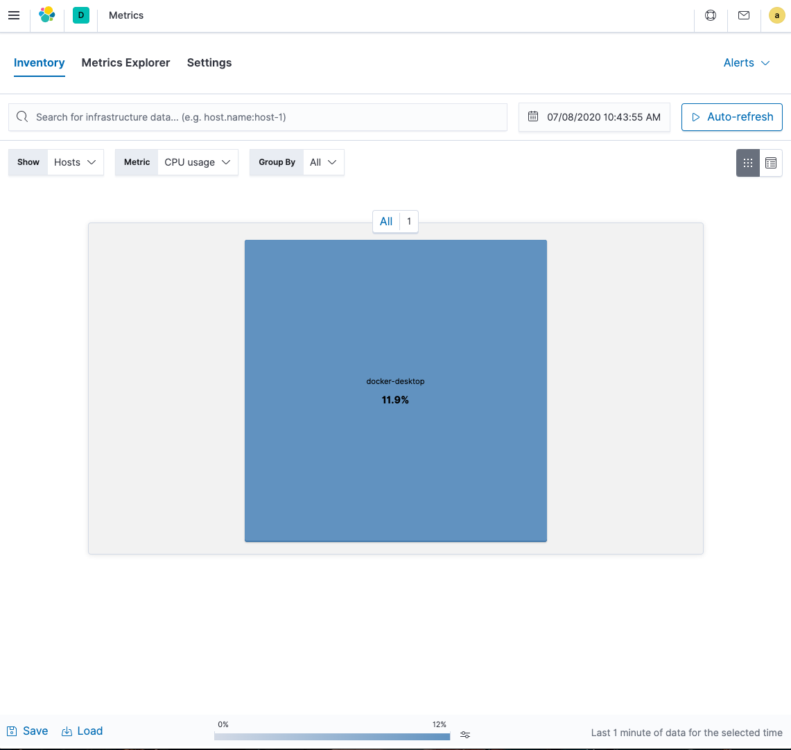
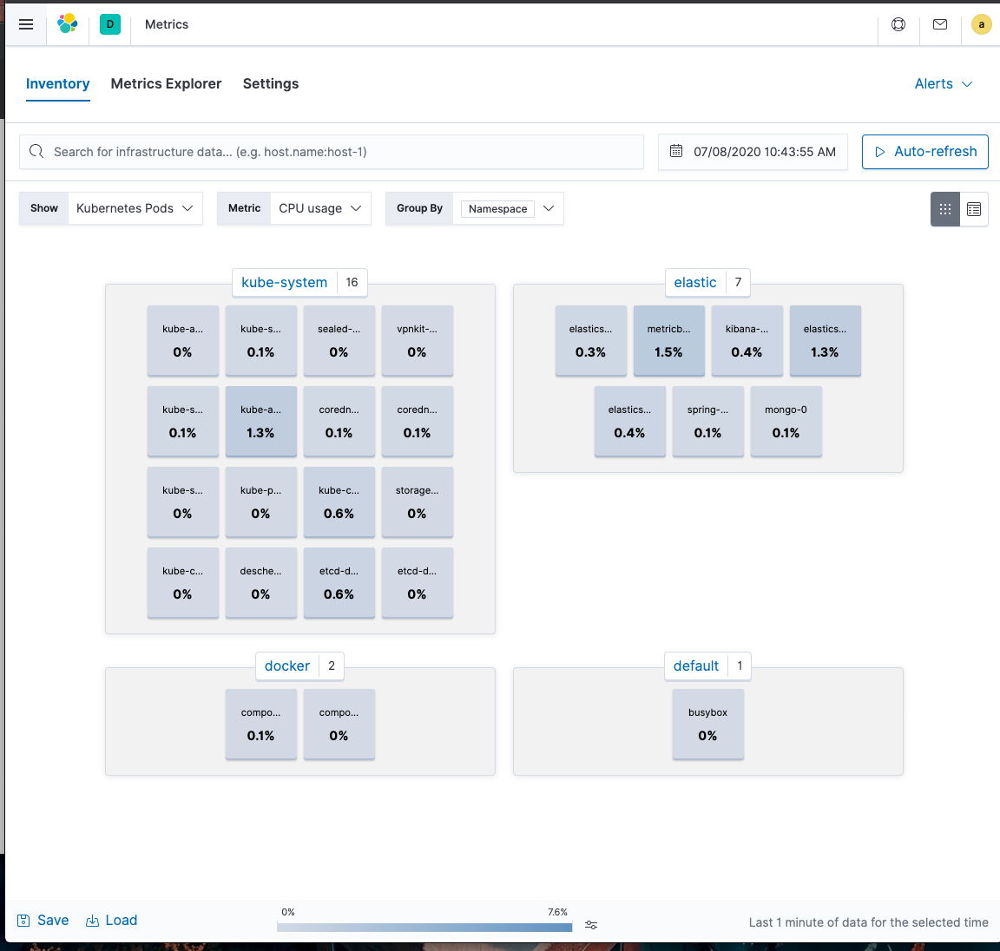
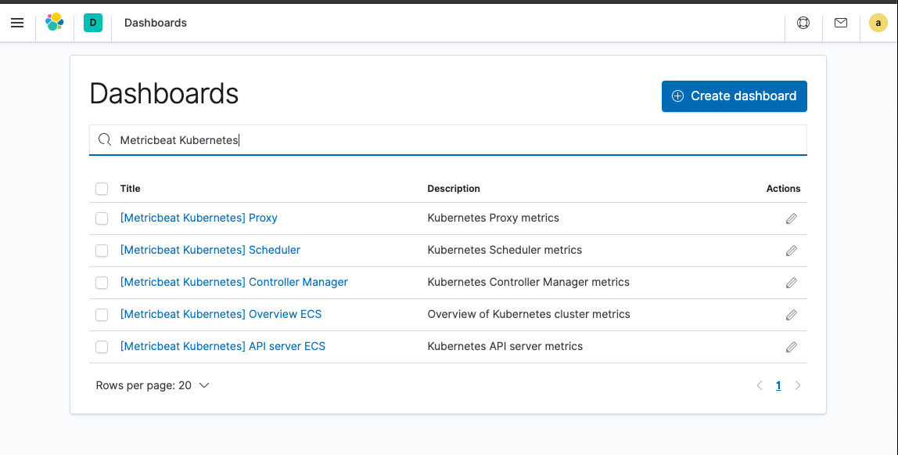
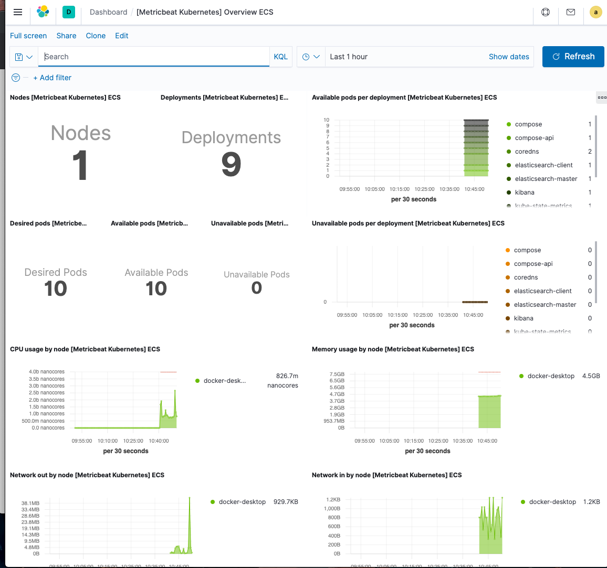
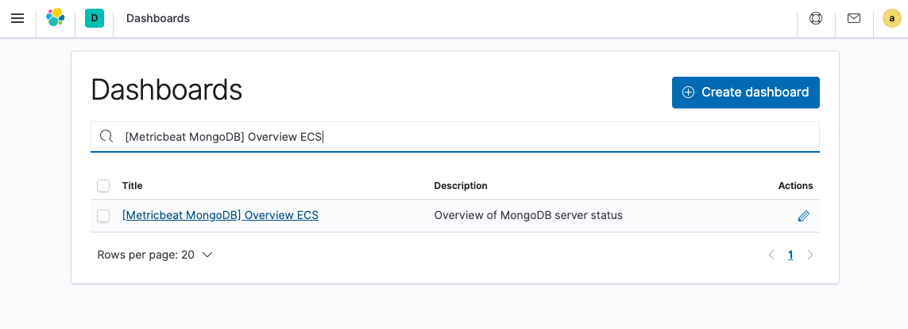
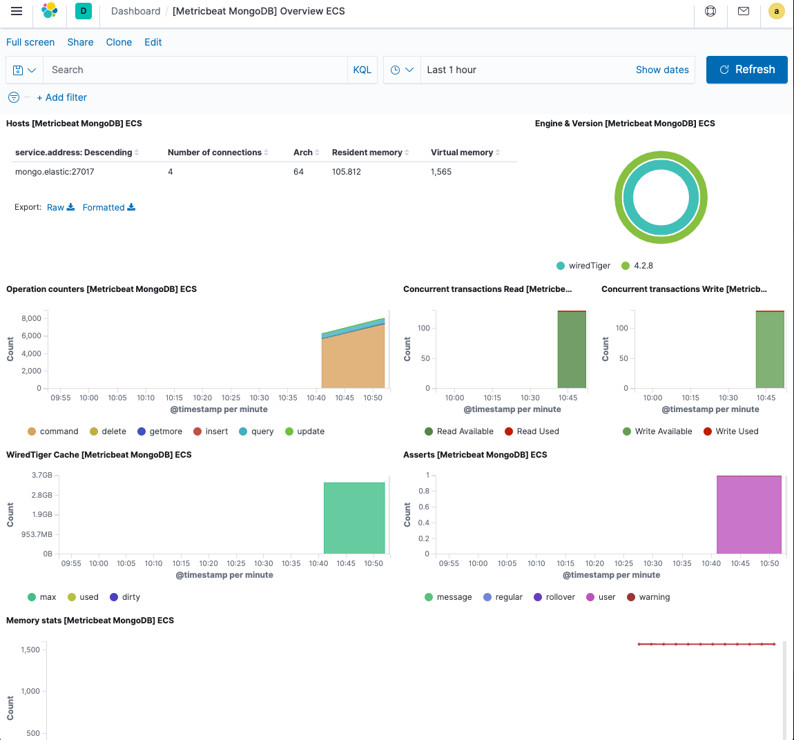
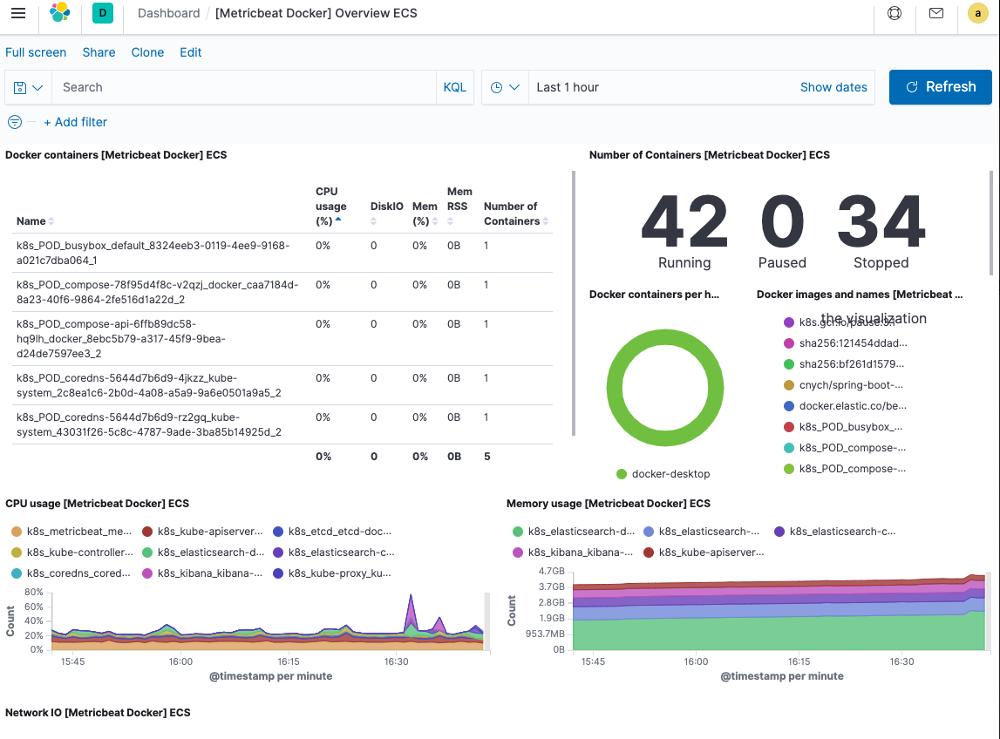

# **第二节 使用 Elastic Stack — Metricbeat 监控安装**

Metricbeat 是一个服务器上的轻量级采集器，用于定期收集主机和服务的监控指标。这也是我们构建 Kubernetes 全栈监控的第一个部分。

Metribeat 默认采集系统的指标，但是也包含了大量的其他模块来采集有关服务的指标，比如 Nginx、Kafka、MySQL、Redis 等等，支持的完整模块可以在 Elastic 官方网站上查看到 https://www.elastic.co/guide/en/beats/metricbeat/current/metricbeat-modules.html。


## **1、`kube-state-metrics`**

首先，**我们需要安装 `kube-state-metrics`，这个组件是一个监听 `Kubernetes API` 的服务，可以暴露每个资源对象状态的相关指标数据。**

要安装 `kube-state-metric`s 也非常简单，在对应的 `GitHub `仓库下就有对应的安装资源清单文件：

```
$ git clone https://github.com/kubernetes/kube-state-metrics.git

$ cd kube-state-metrics
# 执行安装命令
$ kubectl apply -f examples/standard/
clusterrolebinding.rbac.authorization.k8s.io/kube-state-metrics configured
clusterrole.rbac.authorization.k8s.io/kube-state-metrics configured
deployment.apps/kube-state-metrics configured
serviceaccount/kube-state-metrics configured
service/kube-state-metrics configured
```

```
kubectl get pods -n kube-system -l app.kubernetes.io/name=kube-state-metricsNAME                                  READY   STATUS    RESTARTS   AGE
kube-state-metrics-6d7449fc78-ndgdd   1/1     Running   0          98s
```

当 Pod 变成 Running 状态后证明安装成功。

## **2、Metricbeat**

由于我们需要监控所有的节点，所以我们需要使用一个 `DaemonSet` 控制器来安装 `Metricbeat`。

首先，使用一个 `ConfigMap` 来配置 `Metricbeat`，然后通过 `Volume` 将该对象挂载到容器中的 `/etc/metricbeat.yaml `中去。配置文件中包含了 `ElasticSearch` 的地址、用户名和密码，以及 `Kibana` 配置，我们要启用的模块与抓取频率等信息。

**`metricbeat.settings.configmap.yml`**

```
---
apiVersion: v1
kind: ConfigMap
metadata:
  namespace: elastic
  name: metricbeat-config
  labels:
    app: metricbeat
data:
  metricbeat.yml: |-

    # 模块配置
    metricbeat.modules:
    - module: system
      period: ${PERIOD}
      metricsets: ["cpu", "load", "memory", "network", "process", "process_summary", "core", "diskio", "socket"]
      processes: ['.*']
      process.include_top_n:
        by_cpu: 5      # 根据 CPU 计算的前5个进程
        by_memory: 5   # 根据内存计算的前5个进程

    - module: system
      period: ${PERIOD}
      metricsets:  ["filesystem", "fsstat"]
      processors:
      - drop_event.when.regexp:
          system.filesystem.mount_point: '^/(sys|cgroup|proc|dev|etc|host|lib)($|/)'

    - module: docker
      period: ${PERIOD}
      hosts: ["unix:///var/run/docker.sock"]
      metricsets: ["container", "cpu", "diskio", "healthcheck", "info", "memory", "network"]

    - module: kubernetes  # 抓取 kubelet 监控指标
      period: ${PERIOD}
      node: ${NODE_NAME}
      hosts: ["https://${NODE_NAME}:10250"]
      metricsets: ["node", "system", "pod", "container", "volume"]
      bearer_token_file: /var/run/secrets/kubernetes.io/serviceaccount/token
      ssl.verification_mode: "none"
     
    - module: kubernetes  # 抓取 kube-state-metrics 数据
      period: ${PERIOD}
      node: ${NODE_NAME}
      metricsets: ["state_node", "state_deployment", "state_replicaset", "state_pod", "state_container"]
      hosts: ["kube-state-metrics.kube-system.svc.cluster.local:8080"]

    # 根据 k8s deployment 配置具体的服务模块
    metricbeat.autodiscover:
      providers:
      - type: kubernetes
        node: ${NODE_NAME}
        templates:
        - condition.equals:
            kubernetes.labels.app: mongo
          config:
          - module: mongodb
            period: ${PERIOD}
            hosts: ["mongo.elastic:27017"]
            metricsets: ["dbstats", "status", "collstats", "metrics", "replstatus"]

    # ElasticSearch 连接配置
    output.elasticsearch:
      hosts: ['${ELASTICSEARCH_HOST:elasticsearch}:${ELASTICSEARCH_PORT:9200}']
      username: ${ELASTICSEARCH_USERNAME}
      password: ${ELASTICSEARCH_PASSWORD}

    # 连接到 Kibana
    setup.kibana:
      host: '${KIBANA_HOST:kibana}:${KIBANA_PORT:5601}'

    # 导入已经存在的 Dashboard
    setup.dashboards.enabled: true

    # 配置 indice 生命周期
    setup.ilm:
      policy_file: /etc/indice-lifecycle.json
---
```

**`ElasticSearch` 的 `indice` 生命周期表示一组规则，可以根据` indice` 的大小或者时长应用到你的 `indice` 上。比如可以每天或者每次超过 `1GB` 大小的时候对 `indice` 进行轮转，我们也可以根据规则配置不同的阶段**。

由于监控会产生大量的数据，很有可能一天就超过几十G的数据，所以为了防止大量的数据存储，我们可以利用 `indice` 的生命周期来配置数据保留，这个在 `Prometheus `中也有类似的操作。

如下所示的文件中，我们配置成每天或每次超过`1GB`的时候就对 `indice `进行轮转，并删除所有超过10天的 indice 文件，我们这里只保留10天监控数据完全足够了。


**`metricbeat.indice-lifecycle.configmap.yml`**

```
---
apiVersion: v1
kind: ConfigMap
metadata:
  namespace: elastic
  name: metricbeat-indice-lifecycle
  labels:
    app: metricbeat
data:
  indice-lifecycle.json: |-
    {
      "policy": {
        "phases": {
          "hot": {
            "actions": {
              "rollover": {
                "max_size": "1GB" ,
                "max_age": "1d"
              }
            }
          },
          "delete": {
            "min_age": "10d",
            "actions": {
              "delete": {}
            }
          }
        }
      }
    }
---
```

接下来就可以来编写 `Metricbeat` 的 `DaemonSet` 资源对象清单，如下所示：

**`metricbeat.daemonset.yml`**

```
---
apiVersion: apps/v1
kind: DaemonSet
metadata:
  namespace: elastic
  name: metricbeat
  labels:
    app: metricbeat
spec:
  selector:
    matchLabels:
      app: metricbeat
  template:
    metadata:
      labels:
        app: metricbeat
    spec:
      serviceAccountName: metricbeat
      terminationGracePeriodSeconds: 30
      hostNetwork: true
      dnsPolicy: ClusterFirstWithHostNet
      containers:
      - name: metricbeat
        image: docker.elastic.co/beats/metricbeat:7.8.0
        args: [
          "-c", "/etc/metricbeat.yml",
          "-e", "-system.hostfs=/hostfs"
        ]
        env:
        - name: ELASTICSEARCH_HOST
          value: elasticsearch-client.elastic.svc.cluster.local
        - name: ELASTICSEARCH_PORT
          value: "9200"
        - name: ELASTICSEARCH_USERNAME
          value: elastic
        - name: ELASTICSEARCH_PASSWORD
          valueFrom:
            secretKeyRef:
              name: elasticsearch-pw-elastic
              key: password
        - name: KIBANA_HOST
          value: kibana.elastic.svc.cluster.local
        - name: KIBANA_PORT
          value: "5601"
        - name: NODE_NAME
          valueFrom:
            fieldRef:
              fieldPath: spec.nodeName
        - name: PERIOD
          value: "10s"
        securityContext:
          runAsUser: 0
        resources:
          limits:
            memory: 200Mi
          requests:
            cpu: 100m
            memory: 100Mi
        volumeMounts:
        - name: config
          mountPath: /etc/metricbeat.yml
          readOnly: true
          subPath: metricbeat.yml
        - name: indice-lifecycle
          mountPath: /etc/indice-lifecycle.json
          readOnly: true
          subPath: indice-lifecycle.json
        - name: dockersock
          mountPath: /var/run/docker.sock
        - name: proc
          mountPath: /hostfs/proc
          readOnly: true
        - name: cgroup
          mountPath: /hostfs/sys/fs/cgroup
          readOnly: true
      volumes:
      - name: proc
        hostPath:
          path: /proc
      - name: cgroup
        hostPath:
          path: /sys/fs/cgroup
      - name: dockersock
        hostPath:
          path: /var/run/docker.sock
      - name: config
        configMap:
          defaultMode: 0600
          name: metricbeat-config
      - name: indice-lifecycle
        configMap:
          defaultMode: 0600
          name: metricbeat-indice-lifecycle
      - name: data
        hostPath:
          path: /var/lib/metricbeat-data
          type: DirectoryOrCreate
---
```

需要注意的将上面的两个 `ConfigMap` 挂载到容器中去，**由于需要 `Metricbeat` 获取宿主机的相关信息，所以我们这里也挂载了一些宿主机的文件到容器中去，比如 `proc` 目录，`cgroup` 目录以及 `dockersock` 文件。**

由于 `Metricbeat` 需要去获取 `Kubernetes` 集群的资源对象信息，所以同样需要对应的 `RBAC` 权限声明，由于是全局作用域的，所以这里我们使用 `ClusterRole` 进行声明：

**`metricbeat.permissions.yml`**

```
---
apiVersion: rbac.authorization.k8s.io/v1beta1
kind: ClusterRoleBinding
metadata:
  name: metricbeat
subjects:
- kind: ServiceAccount
  name: metricbeat
  namespace: elastic
roleRef:
  kind: ClusterRole
  name: metricbeat
  apiGroup: rbac.authorization.k8s.io
---
apiVersion: rbac.authorization.k8s.io/v1beta1
kind: ClusterRole
metadata:
  name: metricbeat
  labels:
    app: metricbeat
rules:
- apiGroups: [""]
  resources:
  - nodes
  - namespaces
  - events
  - pods
  verbs: ["get", "list", "watch"]
- apiGroups: ["extensions"]
  resources:
  - replicasets
  verbs: ["get", "list", "watch"]
- apiGroups: ["apps"]
  resources:
  - statefulsets
  - deployments
  - replicasets
  verbs: ["get", "list", "watch"]
- apiGroups:
  - ""
  resources:
  - nodes/stats
  verbs:
  - get
---
apiVersion: v1
kind: ServiceAccount
metadata:
  namespace: elastic
  name: metricbeat
  labels:
    app: metricbeat
---
```

直接创建上面的几个资源对象即可：

```
kubectl apply  -f metricbeat.settings.configmap.yml
kubectl apply  -f metricbeat.indice-lifecycle.configmap.yml
kubectl apply  -f metricbeat.daemonset.yml
kubectl apply  -f metricbeat.permissions.yml
```

```
$ kubectl get pods -n elastic -l app=metricbeat
NAME               READY   STATUS    RESTARTS   AGE
metricbeat-ppjgv   1/1     Running   0          113s
```

当 Metricbeat 的 Pod 变成 Running 状态后，正常我们就可以在 Kibana 中去查看对应的监控信息了。

在 `Kibana` 左侧页面 `Observability → Metrics`进入指标监控页面，正常就可以看到一些监控数据了：



也可以根据自己的需求进行筛选，比如我们可以按照 Kubernetes Namespace 进行分组作为视图查看监控信息：




由于我们在配置文件中设置了属性 `setup.dashboards.enabled=true`，所以 `Kibana` 会导入预先已经存在的一些 `Dashboard`。我们可以在左侧菜单进入 `Kibana → Dashboard` 页面，我们会看到一个大约有 `50` 个 `Metricbeat` 的 `Dashboard` 列表，我们可以根据需要筛选 Dashboard，比如我们要查看集群节点的信息，可以查看 `[Metricbeat Kubernetes] Overview ECS` 这个 Dashboard：






我们还单独启用了 mongodb 模块，我们可以使用 **[Metricbeat MongoDB] Overview ECS** 这个 Dashboard 来查看监控信息：





我们还启用了 docker 这个模块，也可以使用 **[Metricbeat Docker] Overview ECS** 这个 Dashboard 来查看监控信息：



到这里我们就完成了使用 Metricbeat 来监控 Kubernetes 集群信息，下一篇文章我们再来学习如何使用 Filebeat 来收集日志以监控 Kubernetes 集群。

