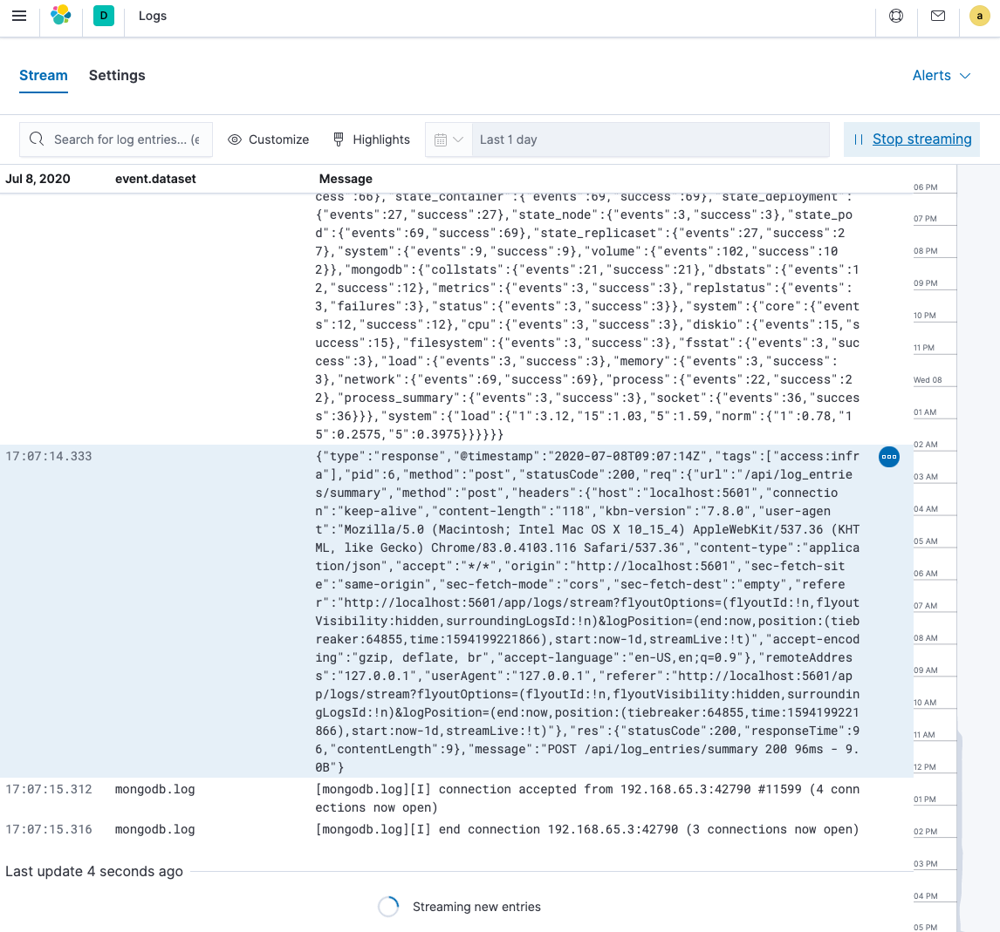

# **第三节 使用 Elastic Stack - Filebeat 日志数据收集安装**

在本节中我们将要安装配置 Filebeat 来收集 Kubernetes 集群中的日志数据，然后发送到 ElasticSearch 去中，Filebeat 是一个轻量级的日志采集代理，还可以配置特定的模块来解析和可视化应用（比如数据库、Nginx 等）的日志格式。

**和 Metricbeat 类似，Filebeat 也需要一个配置文件来设置和 ElasticSearch 的链接信息、和 Kibana 的连接已经日志采集和解析的方式**。

如下所示的 ConfigMap 资源对象就是我们这里用于日志采集的配置信息（可以从官方网站上获取完整的可配置信息）:

**`filebeat.settings.configmap.yml`**

```
---
apiVersion: v1
kind: ConfigMap
metadata:
  namespace: elastic
  name: filebeat-config
  labels:
    app: filebeat
data:
  filebeat.yml: |-
    filebeat.inputs:
    - type: container
      enabled: true
      paths:
      - /var/log/containers/*.log
      processors:
      - add_kubernetes_metadata:
          in_cluster: true
          host: ${NODE_NAME}
          matchers:
          - logs_path:
              logs_path: "/var/log/containers/"
    
    filebeat.autodiscover:
      providers:
        - type: kubernetes
          templates:
            - condition.equals:
                kubernetes.labels.app: mongo
              config:
                - module: mongodb
                  enabled: true
                  log:
                    input:
                      type: docker
                      containers.ids:
                        - ${data.kubernetes.container.id}

    processors:
      - drop_event:
          when.or:
              - and:
                  - regexp:
                      message: '^\d+\.\d+\.\d+\.\d+ '
                  - equals:
                      fileset.name: error
              - and:
                  - not:
                      regexp:
                          message: '^\d+\.\d+\.\d+\.\d+ '
                  - equals:
                      fileset.name: access
      - add_cloud_metadata:
      - add_kubernetes_metadata:
          matchers:
          - logs_path:
              logs_path: "/var/log/containers/"
      - add_docker_metadata:

    output.elasticsearch:
      hosts: ['${ELASTICSEARCH_HOST:elasticsearch}:${ELASTICSEARCH_PORT:9200}']
      username: ${ELASTICSEARCH_USERNAME}
      password: ${ELASTICSEARCH_PASSWORD}

    setup.kibana:
      host: '${KIBANA_HOST:kibana}:${KIBANA_PORT:5601}'

    setup.dashboards.enabled: true
    setup.template.enabled: true

    setup.ilm:
      policy_file: /etc/indice-lifecycle.json
---
```

**我们配置采集 `/var/log/containers/` 下面的所有日志数据，并且使用 `inCluster` 的模式访问 `Kubernetes` 的 `APIServer`，获取日志数据的 `Meta` 信息，将日志直接发送到 `Logstash`，这里将使用 `logstash` 输出插件**。


**`filebeat.indice-lifecycle.configmap.yml`**

```
---
apiVersion: v1
kind: ConfigMap
metadata:
  namespace: elastic
  name: filebeat-indice-lifecycle
  labels:
    app: filebeat
data:
  indice-lifecycle.json: |-
    {
      "policy": {
        "phases": {
          "hot": {
            "actions": {
              "rollover": {
                "max_size": "1GB" ,
                "max_age": "1d"
              }
            }
          },
          "delete": {
            "min_age": "30d",
            "actions": {
              "delete": {}
            }
          }
        }
      }
    }
```

同样为了采集每个节点上的日志数据，我们这里使用一个 DaemonSet 控制器，使用上面的配置来采集节点的日志。

**`filebeat.daemonset.yml`**

```
---
apiVersion: apps/v1
kind: DaemonSet
metadata:
  namespace: elastic
  name: filebeat
  labels:
    app: filebeat
spec:
  selector:
    matchLabels:
      app: filebeat
  template:
    metadata:
      labels:
        app: filebeat
    spec:
      serviceAccountName: filebeat
      terminationGracePeriodSeconds: 30
      containers:
      - name: filebeat
        image: docker.elastic.co/beats/filebeat:7.8.0
        args: [
          "-c", "/etc/filebeat.yml",
          "-e",
        ]
        env:
        - name: ELASTICSEARCH_HOST
          value: elasticsearch-client.elastic.svc.cluster.local
        - name: ELASTICSEARCH_PORT
          value: "9200"
        - name: ELASTICSEARCH_USERNAME
          value: elastic
        - name: ELASTICSEARCH_PASSWORD
          valueFrom:
            secretKeyRef:
              name: elasticsearch-pw-elastic
              key: password
        - name: KIBANA_HOST
          value: kibana.elastic.svc.cluster.local
        - name: KIBANA_PORT
          value: "5601"
        - name: NODE_NAME
          valueFrom:
            fieldRef:
              fieldPath: spec.nodeName
        securityContext:
          runAsUser: 0
        resources:
          limits:
            memory: 200Mi
          requests:
            cpu: 100m
            memory: 100Mi
        volumeMounts:
        - name: config
          mountPath: /etc/filebeat.yml
          readOnly: true
          subPath: filebeat.yml
        - name: filebeat-indice-lifecycle
          mountPath: /etc/indice-lifecycle.json
          readOnly: true
          subPath: indice-lifecycle.json
        - name: data
          mountPath: /usr/share/filebeat/data
        - name: varlog
          mountPath: /var/log
          readOnly: true
        - name: varlibdockercontainers
          mountPath: /var/lib/docker/containers
          readOnly: true
        - name: dockersock
          mountPath: /var/run/docker.sock
      volumes:
      - name: config
        configMap:
          defaultMode: 0600
          name: filebeat-config
      - name: filebeat-indice-lifecycle
        configMap:
          defaultMode: 0600
          name: filebeat-indice-lifecycle
      - name: varlog
        hostPath:
          path: /var/log
      - name: varlibdockercontainers
        hostPath:
          path: /var/lib/docker/containers
      - name: dockersock
        hostPath:
          path: /var/run/docker.sock
      - name: data
        hostPath:
          path: /var/lib/filebeat-data
          type: DirectoryOrCreate
---
```

我们这里使用的是 Kubeadm 搭建的集群，默认 `Master `节点是有污点的，所以如果还想采集 `Master` 节点的日志，还必须加上对应的容忍，我这里不采集就没有添加容忍了。

此外由于需要获取日志在 `Kubernetes` 集群中的 `Meta` 信息，比如 `Pod` 名称、所在的命名空间等，所以 `Filebeat` 需要访问 `APIServer`，自然就需要对应的 `RBAC` 权限了，所以还需要进行权限声明：

**`filebeat.permission.yml`**

```
# filebeat.permission.yml
---
apiVersion: rbac.authorization.k8s.io/v1beta1
kind: ClusterRoleBinding
metadata:
  name: filebeat
subjects:
- kind: ServiceAccount
  name: filebeat
  namespace: elastic
roleRef:
  kind: ClusterRole
  name: filebeat
  apiGroup: rbac.authorization.k8s.io
---
apiVersion: rbac.authorization.k8s.io/v1beta1
kind: ClusterRole
metadata:
  name: filebeat
  labels:
    app: filebeat
rules:
- apiGroups: [""]
  resources:
  - namespaces
  - pods
  verbs:
  - get
  - watch
  - list
---
apiVersion: v1
kind: ServiceAccount
metadata:
  namespace: elastic
  name: filebeat
  labels:
    app: filebeat
---
```

然后直接安装部署上面的几个资源对象即可：

```
kubectl apply  -f filebeat.settings.configmap.yml
kubectl apply  -f filebeat.indice-lifecycle.configmap.yml
kubectl apply  -f filebeat.daemonset.yml
kubectl apply  -f  filebeat.permission.yml
```

当所有的 `Filebeat` 和 `Logstash` 的 `Pod` 都变成 `Running` 状态后，证明部署完成。现在我们就可以进入到 Kibana 页面中去查看日志了。左侧菜单 `Observability → Logs`



此外还可以从上节我们提到的 `Metrics` 页面进入查看 `Pod` 的日志：


点击 Kubernetes Pod logs 获取需要查看的 Pod 日志：


也可以进入 `Kibana -> Discovery` 页面筛选需要查看的日志数据：


如果集群中要采集的日志数据量太大，直接将数据发送给 ElasticSearch，对 ES 压力比较大，这种情况一般可以加一个类似于 Kafka 这样的中间件来缓冲下，或者通过 Logstash 来收集 Filebeat 的日志。

这里我们就完成了使用 Filebeat 采集 Kubernetes 集群的日志，在下篇文章中，我们继续学习如何使用 Elastic APM 来追踪 Kubernetes 集群应用。

