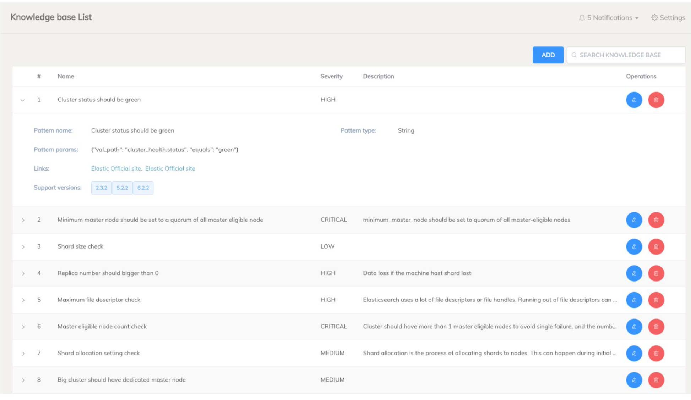
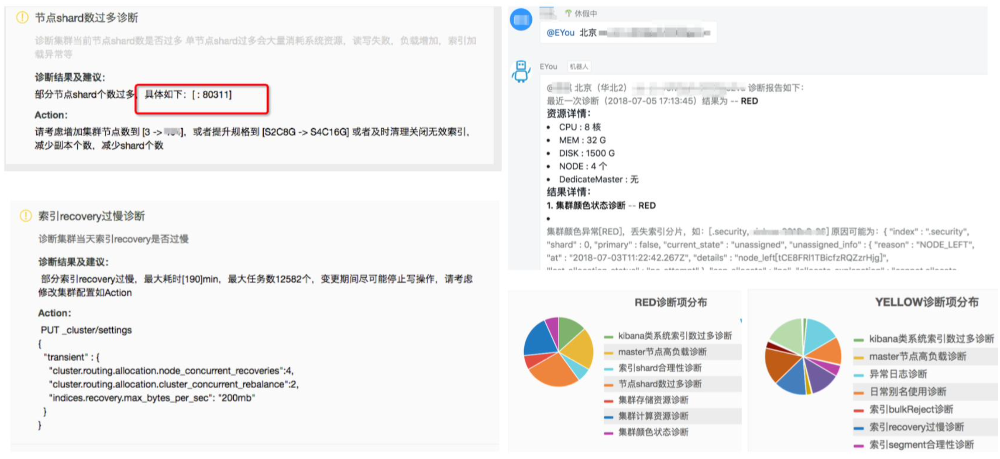
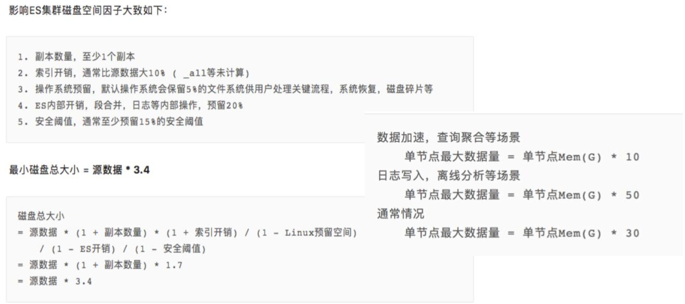
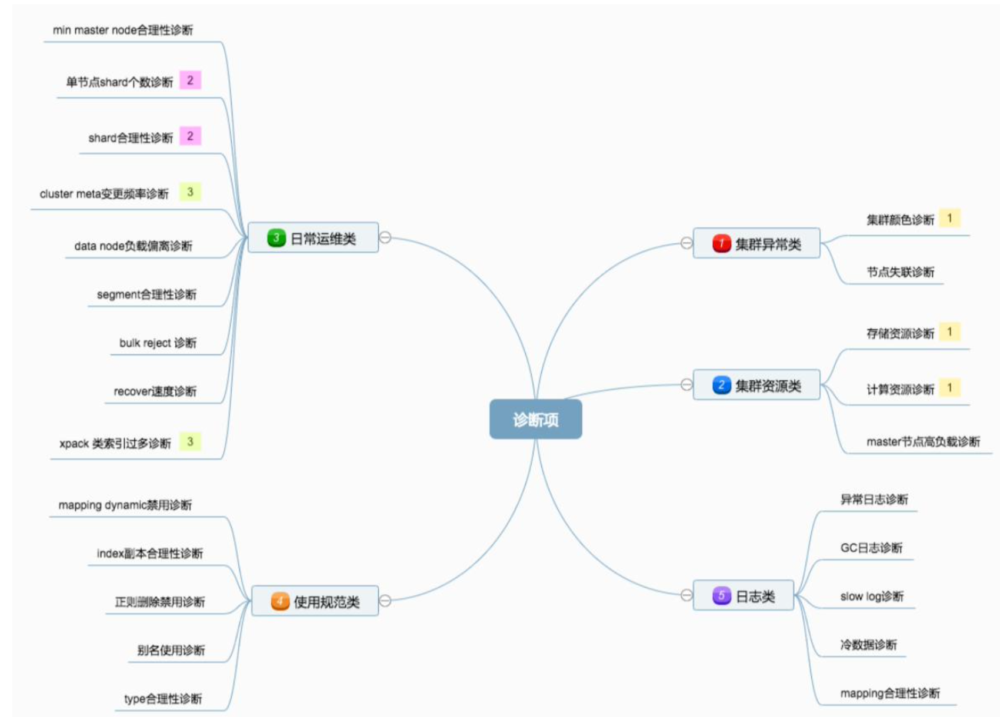

# **第三节 诊断集群的潜在问题**

## **1、集群运维所面临的挑战**

* 用户集群数量多，业务场景差异大
* 使用与配置不当，优化不够
	* 如何让用户更加高效和正确的使用 ES
	* 如何让用户更全面的了解自己的集群的使用状况
* 发现问题滞后，需要防患于未然
	* 需要“有迹可循”，做到“有则改之，无则加勉”
	* Elastic 有提供 Support Diagnostics Tool - [https://github.com/elastic/support-diagnostics](https://github.com/elastic/support-diagnostics) 

## **2、集群绿色，是否意味着足够好**

* 绿色只是其中一项指标。显示分片是否都已正常分配
* 监控指标多并且分散
	*  指标的含义不够明确直观
* 问题分析定位的门槛较高
	* 需要具备专业知识

## **3、为什么要诊断集群的潜在问题**

* 防患于未然，避免集群奔溃
	* **Master 节点 / 数据节点当机 – 负载过高，导致节点失联**
	*  副本丢失，导致数据可靠性受损
	*  集群压力过大，数据写入失败
* 提升集群性能
	* 数据节点负载不均衡(避免单节点瓶颈) / 优化分片，segment
	* 规范操作方式(利用别名 / 避免 Dynamic Mapping 引发过多字段，对索引的合理性进行管控) 

## **4、eBay Diagnostic Tool**

* 集群健康状态，是否有节点丢失
* 索引合理性
	* 索引总数不能过大 
	* 副本分片尽量不要设置为 0 
	* 主分片尺寸检测 
	* 索引的字段总数(Dynamic Mapping 关闭)
	* 索引是否分配不均衡 
	* **索引 segment 大小诊断分析**
* 资源使用合理性
	*  CPU 内存和 磁盘的使用状况分析 
	*  是否存在节点负载不平衡 
	*  是否需要增加节点
* 业务操作合理性
	* **集群状态变更频率，是否在业务高峰期有频繁操作**
	* 慢查询监控与分析

**集群中索引的诊断**

* 索引的总数是否过大
* 是否存在字段过多的情况
* 索引的分片个数是否设置合理
* 单个节点的分片数是否过多
* 数据节点之间的负载偏差是否过大
* 冷热数据分配是否正确(例如，Cold 节点上的索引是否设置成只读)
 
 
## **5、阿里云 – EYOU 智能运维工具**
 
每天凌晨定时诊断，也可以自主诊断。每次诊断耗时 3 分钟 -
 
[ https://help.aliyun.com/document_detail/90391.html]( https://help.aliyun.com/document_detail/90391.html)

### **5-1 诊断 Shard 数**

### **5-2 磁盘容量估算**

## **6、多维度检测，构建自己的诊断工具**

