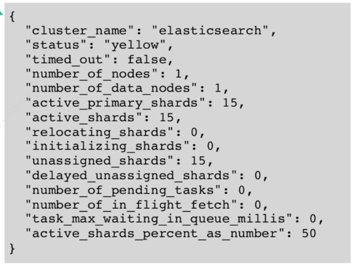
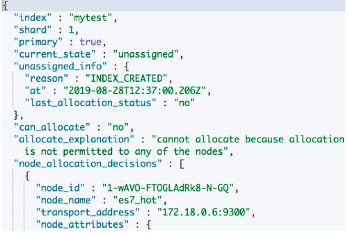
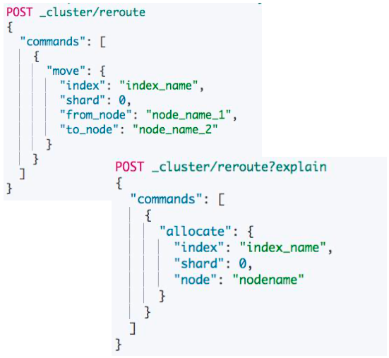

# **第四节 解决集群 Yellow 与 Red 的问题**

## **1、集群健康度**

**分片健康**

* 红:至少有一个主分片没有分配 
* 黄:至少有一个副本没有分配 
* 绿:主副本分片全部正常分配

**索引健康**: 最差的分片的状态

**集群健康**: 最差的索引的状态




## **2、Health 相关的 API**



* `GET _cluster/health`: 集群的状态(检查节点数量)
* `GET _cluster/health?level=indices`: 所有索引的健康状态 (查看有问题的索引)
* `GET _cluster/health/my_index`: 单个索引的健康状态(查看具体的索引)
* `GET _cluster/health?level=shards`: 分片级的索引
* `GET _cluster/allocation/explain`: 返回第一个未分配 Shard 的原因


### **3-1 案例 1**

* **症状:集群变红**
* 分析:通过 **Allocation Explain API** 发现创建索引失败，因为无法找到标记了相应 box type
的节点
* 解决:
	* 删除索引，集群变绿。
	* 重新创建索引，并且指定正确的 routing box type，索引创建成功。
	* 集群保持绿色状态

### **3-2 案例 2**

* 症状:集群变黄
* **分析:通过 Allocation Explain API 发现无法在相同的节点上创建副本**
* 解决:将索引的副本数设置为 0，或者通过增加节点解决


## **3、分片没有被分配的一些原因**

* `INDEX_CREATE`: 创建索引导致。在索引的全部分片分配完成之前，会有短暂的 Red，不一定代表有问题
* `INDEX_REOPEN`:Open 一个之前 Close 的索引
* `CLUSTER_RECOVER`:集群重启阶段，会有这个问题
* `DANGLING_INDEX_IMPORTED`:一个节点离开集群期间，有索引被删除。这个节点重新返回时，会 导致 Dangling 的问题: 
	* 解决问题： 删除掉索引

[https://www.elastic.co/guide/en/elasticsearch/reference/7.1/cat-shards.html](https://www.elastic.co/guide/en/elasticsearch/reference/7.1/cat-shards.html)


## **4、常见问题与解决方法常见问题与解决方法**

* 集群变红，需要检查是否有节点离线。如果有，通常通过重启离线的节点可以解决问题
* 由于配置导致的问题，需要修复相关的配置(例如错误的 `box_type`，错误的副本数)
	*  如果是测试的索引，可以直接删除
* 因为磁盘空间限制，分片规则(Shard Filtering)引发的，需要调整规则或者增加节点
* 对于节点返回集群，导致的 dangling 变红，可直接删除 dangling 索引

> dangling出现的情况是，用户删除一个索引a，删除的时候恰好nodeA 关机了，或者因为一些原因，离开了集群。这个时候索引a被删除了。然后NodeA又回来了，NodeA里面带有索引a的分片，这样的场景下会导致集群变红。而索引a本来就是用户希望delete的，只是没delete干净，所以不存在你说的丢数据的情况。

## **5、集群 Red & Yellow 问题的总结**

* Red & Yellow 是集群运维中常见的问题
* 除了集群故障，一些创建，增加副本等操作， 都会导致集群短暂的 Red 和 Yellow，所以 监控和报警时需要设置一定的延时
* **通过检查节点数，使用 ES 提供的相关 API， 找到真正的原因**
* **可以指定 Move 或者 Reallocate 分片**



## **6、操作实验**

### **6-1 启动`hot-warm-cold`集群**

`docker-compose.yaml`

```
version: '2.2'
services:
  cerebro:
    image: lmenezes/cerebro:0.8.3
    container_name: hwc_cerebro
    ports:
      - "9000:9000"
    command:
      - -Dhosts.0.host=http://elasticsearch:9200
    networks:
      - hw_hwc_es7net
  kibana:
    image: docker.elastic.co/kibana/kibana:7.9.1
    container_name: hwc_kibana7
    environment:
      #- I18N_LOCALE=zh-CN
      - XPACK_GRAPH_ENABLED=true
      - TIMELION_ENABLED=true
      - XPACK_MONITORING_COLLECTION_ENABLED="true"
    ports:
      - "5601:5601"
    networks:
      - hw_hwc_es7net
  elasticsearch:
    image: docker.elastic.co/elasticsearch/elasticsearch:7.9.1
    container_name: es7_hot
    environment:
      - cluster.name=es-hwc
      - node.name=es7_hot
      - node.attr.box_type=hot
      - bootstrap.memory_lock=true
      - "ES_JAVA_OPTS=-Xms512m -Xmx512m"
      - discovery.seed_hosts=es7_hot,es7_warm,es7_cold
      - cluster.initial_master_nodes=es7_hot,es7_warm,es7_cold
    ulimits:
      memlock:
        soft: -1
        hard: -1
    volumes:
      - hwc_es7data_hot:/usr/share/elasticsearch/data
    ports:
      - 9200:9200
    networks:
      - hw_hwc_es7net
  elasticsearch2:
    image: docker.elastic.co/elasticsearch/elasticsearch:7.9.1
    container_name: es7_warm
    environment:
      - cluster.name=es-hwc
      - node.name=es7_warm
      - node.attr.box_type=warm
      - bootstrap.memory_lock=true
      - "ES_JAVA_OPTS=-Xms512m -Xmx512m"
      - discovery.seed_hosts=es7_hot,es7_warm,es7_cold
      - cluster.initial_master_nodes=es7_hot,es7_warm,es7_cold
    ulimits:
      memlock:
        soft: -1
        hard: -1
    volumes:
      - hwc_es7data_warm:/usr/share/elasticsearch/data
    networks:
      - hw_hwc_es7net
  elasticsearch3:
    image: docker.elastic.co/elasticsearch/elasticsearch:7.9.1
    container_name: es7_cold
    environment:
      - cluster.name=es-hwc
      - node.name=es7_cold
      - node.attr.box_type=cold
      - bootstrap.memory_lock=true
      - "ES_JAVA_OPTS=-Xms512m -Xmx512m"
      - discovery.seed_hosts=es7_hot,es7_warm,es7_cold
      - cluster.initial_master_nodes=es7_hot,es7_warm,es7_cold
    ulimits:
      memlock:
        soft: -1
        hard: -1
    volumes:
      - hwc_es7data_cold:/usr/share/elasticsearch/data
    networks:
      - hw_hwc_es7net


volumes:
  hwc_es7data_hot:
    driver: local
  hwc_es7data_warm:
    driver: local
  hwc_es7data_cold:
    driver: local

networks:
  # hwc_es7net:
  hw_hwc_es7net:
    driver: bridge
```

```
docker-compose up -d
```

```
http://192.168.33.12:9200/_cat/nodes?v

ip         heap.percent ram.percent cpu load_1m load_5m load_15m node.role master name
172.19.0.6           27          95  54    1.88    3.85     2.20 dilmrt    -      es7_hot
172.19.0.2           46          95  54    1.88    3.85     2.20 dilmrt    -      es7_cold
172.19.0.4           45          95  54    1.88    3.85     2.20 dilmrt    *      es7_warm
```

```
http://192.168.33.12:9200/_cat/shards?v

index                          shard prirep state   docs   store ip         node
.kibana_task_manager_1         0     p      STARTED    6 102.6kb 172.19.0.2 es7_cold
.kibana_task_manager_1         0     r      STARTED    6  83.5kb 172.19.0.4 es7_warm
ilm-history-2-000001           0     p      STARTED              172.19.0.6 es7_hot
ilm-history-2-000001           0     r      STARTED              172.19.0.4 es7_warm
.kibana-event-log-7.9.1-000001 0     r      STARTED    1   5.4kb 172.19.0.2 es7_cold
.kibana-event-log-7.9.1-000001 0     p      STARTED    1   5.4kb 172.19.0.6 es7_hot
.kibana_1                      0     r      STARTED    8  10.4mb 172.19.0.2 es7_cold
.kibana_1                      0     p      STARTED    8  10.4mb 172.19.0.6 es7_hot
.apm-agent-configuration       0     p      STARTED    0    208b 172.19.0.6 es7_hot
.apm-agent-configuration       0     r      STARTED    0    208b 172.19.0.4 es7_warm
.apm-custom-link               0     r      STARTED    0    208b 172.19.0.2 es7_cold
.apm-custom-link               0     p      STARTED    0    208b 172.19.0.4 es7_warm
```

### **6-2 案例 1 症状:集群变红**

```
#案例1
DELETE mytest
PUT mytest
{
  "settings":{
    "number_of_shards":3,
    "number_of_replicas":0,
    "index.routing.allocation.require.box_type":"hott"
  }
}
```

**` "index.routing.allocation.require.box_type":"hott"`**

```
# 检查集群状态，查看是否有节点丢失，有多少分片无法分配
GET /_cluster/health/
```

***Output:***

```
{
  "cluster_name" : "es-hwc",
  "status" : "red",
  "timed_out" : false,
  "number_of_nodes" : 3,
  "number_of_data_nodes" : 3,
  "active_primary_shards" : 6,
  "active_shards" : 12,
  "relocating_shards" : 0,
  "initializing_shards" : 0,
  "unassigned_shards" : 3,
  "delayed_unassigned_shards" : 0,
  "number_of_pending_tasks" : 0,
  "number_of_in_flight_fetch" : 0,
  "task_max_waiting_in_queue_millis" : 0,
  "active_shards_percent_as_number" : 80.0
}
```

**查看索引级别,找到红色的索引**

```
# 查看索引级别,找到红色的索引
GET /_cluster/health?level=indices

{
  "cluster_name" : "es-hwc",
  "status" : "red",
  "timed_out" : false,
  "number_of_nodes" : 3,
  "number_of_data_nodes" : 3,
  "active_primary_shards" : 6,
  "active_shards" : 12,
  "relocating_shards" : 0,
  "initializing_shards" : 0,
  "unassigned_shards" : 3,
  "delayed_unassigned_shards" : 0,
  "number_of_pending_tasks" : 0,
  "number_of_in_flight_fetch" : 0,
  "task_max_waiting_in_queue_millis" : 0,
  "active_shards_percent_as_number" : 80.0,
  "indices" : {
    "mytest" : {
      "status" : "red",
      "number_of_shards" : 3,
      "number_of_replicas" : 0,
      "active_primary_shards" : 0,
      "active_shards" : 0,
      "relocating_shards" : 0,
      "initializing_shards" : 0,
      "unassigned_shards" : 3
    },
...
```

**查看索引的分片**

```
#查看索引的分片
GET _cluster/health?level=shards

...
"indices" : {
    "mytest" : {
      "status" : "red",
      "number_of_shards" : 3,
      "number_of_replicas" : 0,
      "active_primary_shards" : 0,
      "active_shards" : 0,
      "relocating_shards" : 0,
      "initializing_shards" : 0,
      "unassigned_shards" : 3,
      "shards" : {
        "0" : {
          "status" : "red",
          "primary_active" : false,
          "active_shards" : 0,
          "relocating_shards" : 0,
          "initializing_shards" : 0,
          "unassigned_shards" : 1
        },
        "1" : {
          "status" : "red",
          "primary_active" : false,
          "active_shards" : 0,
          "relocating_shards" : 0,
          "initializing_shards" : 0,
          "unassigned_shards" : 1
        },
        "2" : {
          "status" : "red",
          "primary_active" : false,
          "active_shards" : 0,
          "relocating_shards" : 0,
          "initializing_shards" : 0,
          "unassigned_shards" : 1
        }
      }
    },
...
```

**Explain 变红的原因**

```
# Explain 变红的原因
GET /_cluster/allocation/explain
```

*Output*

```
"node_allocation_decisions" : [
    {
      "node_id" : "XqZ-rFd8RiuZU2h-u8_s2Q",
      "node_name" : "es7_cold",
      "transport_address" : "172.19.0.2:9300",
      "node_attributes" : {
        "ml.machine_memory" : "3973804032",
        "ml.max_open_jobs" : "20",
        "box_type" : "cold",
        "xpack.installed" : "true",
        "transform.node" : "true"
      },
      "node_decision" : "no",
      "weight_ranking" : 1,
      "deciders" : [
        {
          "decider" : "filter",
          "decision" : "NO",
          "explanation" : """node does not match index setting [index.routing.allocation.require] filters [box_type:"hott"]"""
        }
      ]
    },
 ...
 ```
 
 ```
GET /_cat/shards/mytest
```

*Output:*

```
mytest 1 p UNASSIGNED    
mytest 2 p UNASSIGNED    
mytest 0 p UNASSIGNED  
```

```
GET _cat/nodeattrs
```

*Output:*

```
es7_hot  172.19.0.6 172.19.0.6 ml.machine_memory 3973804032
es7_hot  172.19.0.6 172.19.0.6 ml.max_open_jobs  20
es7_hot  172.19.0.6 172.19.0.6 box_type          hot
es7_hot  172.19.0.6 172.19.0.6 xpack.installed   true
es7_hot  172.19.0.6 172.19.0.6 transform.node    true
es7_cold 172.19.0.2 172.19.0.2 ml.machine_memory 3973804032
es7_cold 172.19.0.2 172.19.0.2 ml.max_open_jobs  20
es7_cold 172.19.0.2 172.19.0.2 box_type          cold
es7_cold 172.19.0.2 172.19.0.2 xpack.installed   true
es7_cold 172.19.0.2 172.19.0.2 transform.node    true
es7_warm 172.19.0.4 172.19.0.4 ml.machine_memory 3973804032
es7_warm 172.19.0.4 172.19.0.4 ml.max_open_jobs  20
es7_warm 172.19.0.4 172.19.0.4 box_type          warm
es7_warm 172.19.0.4 172.19.0.4 xpack.installed   true
es7_warm 172.19.0.4 172.19.0.4 transform.node    true
```

```
DELETE mytest
GET /_cluster/health/
```

*Output:*

```
{
  "cluster_name" : "es-hwc",
  "status" : "green",
  "timed_out" : false,
  "number_of_nodes" : 3,
  "number_of_data_nodes" : 3,
  "active_primary_shards" : 6,
  "active_shards" : 12,
  "relocating_shards" : 0,
  "initializing_shards" : 0,
  "unassigned_shards" : 0,
  "delayed_unassigned_shards" : 0,
  "number_of_pending_tasks" : 0,
  "number_of_in_flight_fetch" : 0,
  "task_max_waiting_in_queue_millis" : 0,
  "active_shards_percent_as_number" : 100.0
}
```

```
PUT mytest
{
  "settings":{
    "number_of_shards":3,
    "number_of_replicas":0,
    "index.routing.allocation.require.box_type":"hot"
  }
}
```

```
GET /_cluster/health/
```

```
{
  "cluster_name" : "es-hwc",
  "status" : "green",
 ...
```

### **6-3 案例2, Explain 看 hot 上的 explain**

```
DELETE mytest

PUT mytest
{
  "settings":{
    "number_of_shards":2,
    "number_of_replicas":1,
    "index.routing.allocation.require.box_type":"hot"
  }
}
```

```
GET _cluster/health

{
  "cluster_name" : "es-hwc",
  "status" : "yellow",
  "timed_out" : false,
```

```
GET _cat/shards/mytest

mytest 1 p STARTED    0 208b 172.19.0.6 es7_hot
mytest 1 r UNASSIGNED                   
mytest 0 p STARTED    0 208b 172.19.0.6 es7_hot
mytest 0 r UNASSIGNED    
```

```
GET /_cluster/allocation/explain


...
  "node_allocation_decisions" : [
    {
      "node_id" : "XqZ-rFd8RiuZU2h-u8_s2Q",
      "node_name" : "es7_cold",
      "transport_address" : "172.19.0.2:9300",
      "node_attributes" : {
        "ml.machine_memory" : "3973804032",
        "ml.max_open_jobs" : "20",
        "box_type" : "cold",
        "xpack.installed" : "true",
        "transform.node" : "true"
      },
      "node_decision" : "no",
      "weight_ranking" : 1,
      "deciders" : [
        {
          "decider" : "filter",
          "decision" : "NO",
          "explanation" : """node does not match index setting [index.routing.allocation.require] filters [box_type:"hot"]"""
        }
      ]
    },
...
```