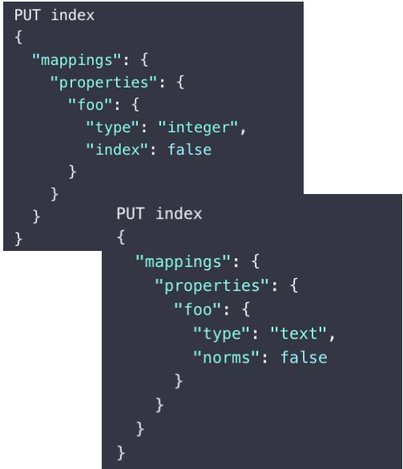
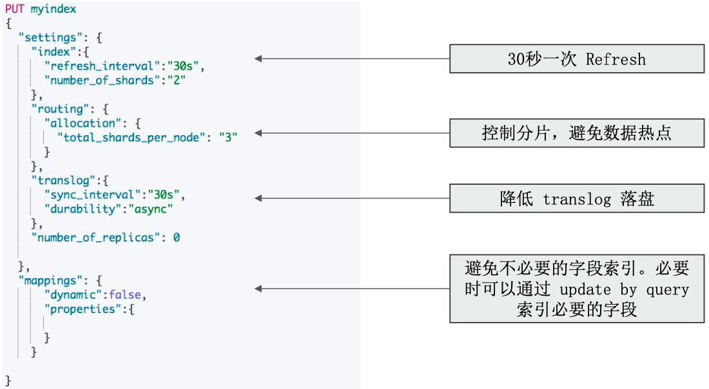
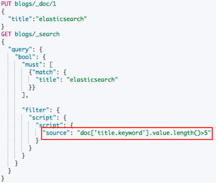
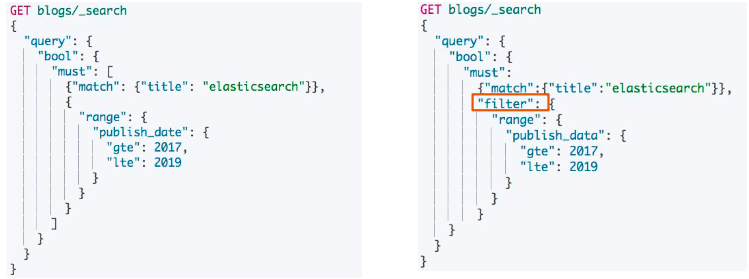
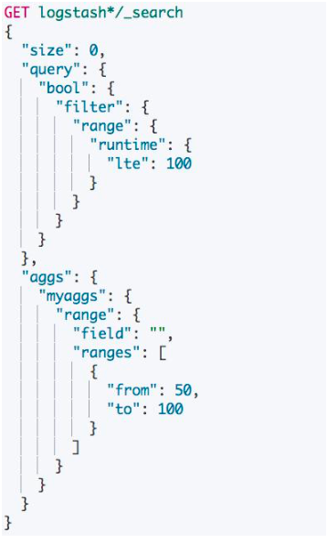
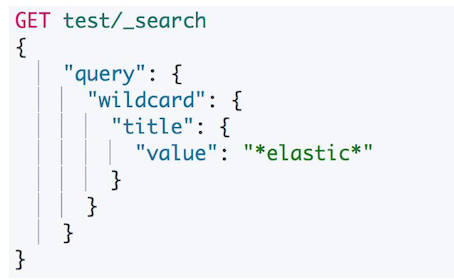

# **第五节 集群写性能优化**

## **1、集群写性能优化**

### **1-1 提高写入性能的方法**

* 写性能优化的目标:**增大写吞吐量(Events Per Second)，越高越好**
* **客户端**:多线程，批量写
	* 可以通过性能测试，**确定最佳文档数量**
	* 多线程:需要观察是否有 HTTP 429 返回，实现 Retry 以及线程数量的自动调节

> The HTTP 429 Too Many Requests response status code indicates the user has sent too many requests in a given amount of time ("rate limiting").

* **服务器端:** 单个性能问题，往往是多个因素造成的。需要先分解问题，在单个节点上进行调整并且结合测试，尽可能压榨硬件资源，以达到最高吞吐量
	* 使用更好的硬件。观察 CPU / IO Block
	*  线程切换 / 堆栈状况

### **1-2 服务器端优化写入性能的一些手段**

* 降低IO操作
	* 使用 ES 自动生成的文档 Id 
	* 一些相关的 ES 配置，如 Refresh Interval
*  降低 CPU 和存储开销
	*  减少不必要分词 
	*  避免不需要的 `doc_values`
	*  **文档的字段尽量保证相同的顺序，可以提高文档的压缩率** 
*  **尽可能做到写入和分片的均衡负载**，实现水平扩展
	*   Shard Filtering 
	*   Write Load Balancer
* 调整 Bulk 线程池和队列

### **1-3 优化写入性能**

*  ES 的默认设置，已经综合考虑了数据可靠性，搜索的实时性质，写入速度，一般不要盲目修改
*  一切优化，**都要基于高质量的数据建模**

### **1-4 关闭无关的功能**

* 只需要聚合不需要搜索， Index 设置成 false
* **不需要算分**， Norms 设置成 false
* **不要对字符串使用默认的 dynamic mapping**。字段数量过多，会对性能产生比较大的影响
* **`Index_options` 控制在创建倒排索引时，哪些内容会被添加到倒排索引中。**优化这些设置，一定程度可以节约 CPU
* 关闭 `_source`，减少 IO 操作;(适合指标型数据)

### **1-5 针对性能的取舍**

如果需要追求极致的写入速度，可以牺牲数据可靠性及搜索实时性以换取性能

*  牺牲可靠性:**将副本分片设置为 0，写入完毕再调整回去**
*  牺牲搜索实时性:**增加 Refresh Interval 的时间**
*  牺牲可靠性:**修改 Translog 的配置**

### **1-6 数据写入的过程**

* **Refresh**

将文档先保存在  Index buffer 中， **以 `refresh_interval` 为间隔时间**，**定期清空 buffer，生成 segment**，借助文件系统缓存的特性，**先将 segment 放在文件系统缓存中，并开放查询，以提升搜索的实时性**

* **Translog**

Segment 没有写入磁盘，即便发生了当机，重启后，数据也能恢复，**默认配置是每次请求都会落盘**

* **Flush**

	* 删除旧的 translog 文件
	* 生成 Segment 并写入磁盘 
	* 更新 commit point 并写入磁盘。 **ES 自动完成，可优化点不多**

### **1-7 Refresh Interval**

* 降低 Refresh 的频率
	* 增加 `refresh_interval` 的数值。**默认为 1s ，如果设置成 -1 ，会禁止自动 refresh**
		* 避免过于频繁的 refresh，而生成过多的 segment 文件
		*  但是会降低搜索的实时性

> 设置成`-1`可以减少相关的操作，提高写入性能。但是文档会无法被搜索。因此要记得在导入数据后将这个数值设置成正常值。

* **增大静态配置参数 `indices.memory.index_buffer_size `**
	* 默认是 10%， 会导致自动触发 refresh

### **1-8 Translog**

*  **降低写磁盘的频率，但是会降低容灾能力**
	*  `Index.translog.durability`:**默认是 request，每个请求都落盘。设置成 async，异步写入**
	*  `Index.translog.sync_interval` 设置为 60s，每分钟执行一次
	*  `Index.translog.flush_threshod_size`: **默认 512 mb，可以适当调大。 当 translog 超过该值，会触发 flush**

### **1-9 分片设定**

* 副本在写入时设为 0，完成后再增加

> 副本的设置 你通通过 put index-name 即可修改。

* **合理设置分片数，确保均匀分配在所有数据节点上**
	* **`Index.routing.allocation.total_share_per_node`**: **限定每个索引在每个节点上可分配的分片数**
	* **5 个节点的集群。 索引有 5 个主分片，1 个副本，应该如何设置?**
		* (5+5)/5=2
		* **生产环境中要适当调大这个数字，避免有节点下线时，分片无法正常迁移**

	 
### **1-10 Bulk，线程池和队列大小**

* **客户端**
	* 单个 bulk 请求体的数据量不要太大，**官方建议大约5-15mb**
	* **写入端的 bulk 请求超时需要足够长，建议60s 以上**
	* 写入端尽量将数据轮询打到不同节点。
* **服务器端**
	* 索引创建属于计算密集型任务，应该使用固定大小的线程池来配置。**来不及处理的放入队列，线程数应该配置成 CPU 核心数 +1 ，避免过多的上下文切换**
	* 队列大小可以适当增加，不要过大，否则占用的内存会成为 GC 的负担

### **1-11 一个索引设定的例子**

## **2、提升集群读性能**

### **2-1 尽量 Denormalize 数据**

* **Elasticsearch != 关系型数据库**
* 尽可能 Denormalize 数据，从而获取最佳的性能
	* *使用 Nested 类型的数据。查询速度会慢几倍*
	* *使用 Parent / Child 关系。查询速度会慢几百倍*

### **2-2 数据建模**

* 尽量将数据先行计算，然后保存到 Elasticsearch 中。**尽量避免查询时的 Script 计算**
* **尽量使用 Filter Context，利用缓存机制，减少不必要的算分**
* **结合 profile，explain API** 分析慢查询的问题，持续优化数据模型
	* **严禁使用 `*` 开头通配符 Terms 查询**: 对整个集群的查询带来大的伤害

### **2-3 避免查询时脚本**

* 可以在 Index 文档时，使用 **Ingest Pipeline**，**计算并写入某个字段，在写入时对keyword进行计算写入到ES的具体字段中**

### **2-4 常见的查询性能问题 - 使用 Query Context**

* 左边的Query Context 无法使用ES Cache,无法提高查询性能
* 右边可以使用Filter 查询， 可以使用ES Cache，提高查询性能

### **2-5 聚合文档消耗内存**

* 聚合查询会消耗内存，特别是针对很大的数据集进行聚合运算
	* **如果可以控制聚合的数量，就能减少内存的开销**
* 当需要使用不同的 Query Scope，可以使用 **Filter Bucket**

### **2-6 通配符开始的正则表达**

通配符开头的正则，性能非常糟糕，需避免使用

### **2-7 优化分片**

* 避免 Over Sharding
	* **一个查询需要访问每一个分片，分片过多，会导致不必要的查询开销**
* 结合应用场景，控制单个分片的尺寸
	* Search: 20GB
	* Logging:40GB
* **Force-merge Read-only 索引** 
	* 使用基于时间序列的索引，将只读的索引进行 force merge，减少 segment 数量 

### **2-8 读性能优化**

* 影响查询性能的一些因素
	* **数据模型和索引配置是否优化**
	* **数据规模是否过大，通过 Filter 减少不必要的数据计算**
	* **查询语句是否优化**

### **2-9 Q&A**

* Q: 文中我们说需要denormalize建模，**denormalize不就是建立内嵌数据或者父子模型吗**，因为normalize是关系型数据库那样建立多个表的，然后设置关联的
	* A:   正常情况下，es不支持两个索引之间的join。当然你可以通过在你实现的代码里面进行join。es支持parent - child ，可以理解成是join。
	* 除此以外，你需要在文档中保存重复的数据。例如一本电影中的演员，我们可以把演员的first name last name，都保存在电影的文档中，而不是保存一个演员的id。这种实现的好处是，逻辑简单，性能好。缺点是，数据有重复，浪费存储，万一真的存在演员改名的情况，那就需要修改所有相关的电影文档。