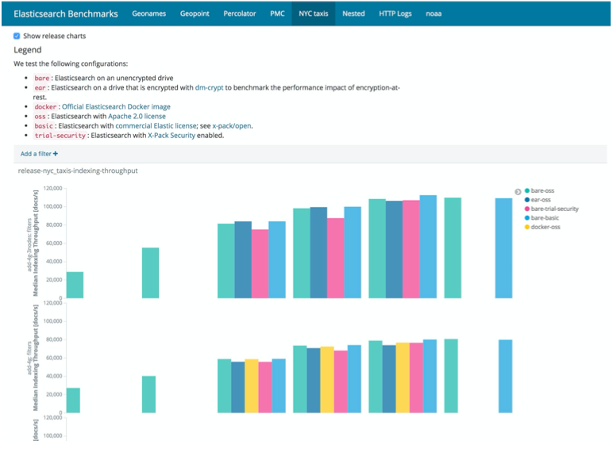
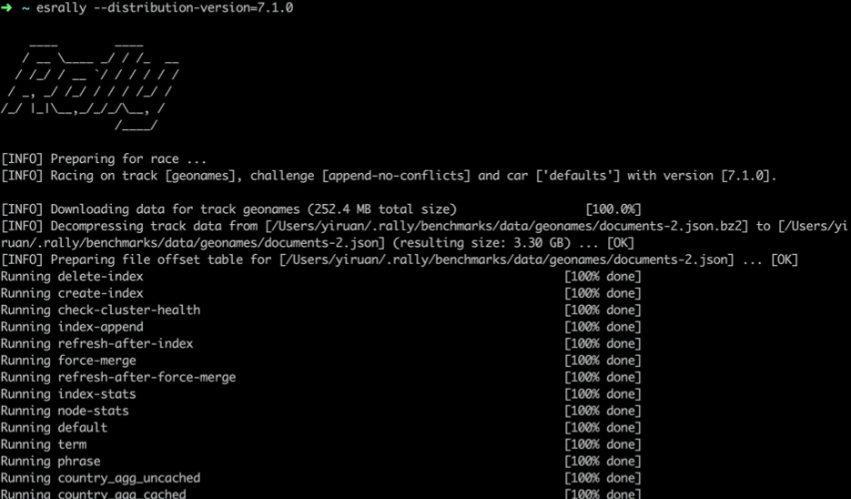

# **第六节 集群压力测试**

## **1、压力测试**

### **1-1 压力测试的目的**

* 容量规划 / 性能优化 / 版本间性能比较 / 性能问题诊断
* 确定系统稳定性，考察系统功能极限和隐患

### **1-2 压力测试的方法与步骤**

* 测试计划(确定测试场景和测试数据集)
* 脚本开发
* 测试环境搭建(不同的软硬件配置) & 运行测试 
* 分析比较结果

## **2、测试目标 & 测试数据**

### **2-1 测试目标**

* 测试集群的读写性能 / 做集群容量规划
* 对 ES 配置参数进行修改，评估优化效果
*  修改 Mapping 和 Setting，对数据建模进行优化，并测试评估性能改进
*  测试 ES 新版本，结合实际场景和老版本进行比较，评估是否进行升级

### **2-2 测试数据**

* 数据量/数据分布

## **3、测试脚本**

*  **ES 本身提供了 REST API，所以，可以通过很多传统的性能测试工具**
	*  Load Runner (商业软件，支持录制+重放 + DSL )
	*  JMeter ( Apache 开源 ，Record & Play)
	*  Gatling (开源，支持写 Scala 代码 + DSL)
*  **专门为 Elasticsearch 设计的工具**
	*  ES Pref & Elasticsearch-stress-test
	*  Elastic Rally

## **4、ES Rally 简介**

* Elastic 官方开源，基于 Python 3 的压力测试工具
	* [https://github.com/elastic/rally](https://github.com/elastic/rally)
	*  性能测试结果比较: [https://elasticsearch-benchmarks.elastic.co](https://elasticsearch-benchmarks.elastic.co)
* 功能介绍
	* 自动创建，配置，运行测试，并且销毁 ES 集群
	* 支持不同的测试数据的比较，也支持将数据导入 ES 集群，进行二次分析
	* 支持测试时指标数据的搜集，方便对测试结果进行深度的分析
* **Rally 的安装以及入门**
	* **安装运行**
		* Python3.4+和pip3 /JDK8 /git1.9+
		* 运行 pip3 install esrally
		* 运行 esrally configure
	* 运行
		* 运行 `esrally –distribution-version=7.1.0`
		*  运行 1000 条测试数据: `esrally –distribution-version=7.1.0 --test-mode ` 

## **5、Rally 基本概念讲解**

[**Elasticsearch 压测方案之 esrally 简介**](https://segmentfault.com/a/1190000011174694)

* **Tournament** – 定义测试目标，由多个 race 组成
	* Esrally list races
* **Track** – 赛道:测试数据和测试场景与策略
	* [https://github.com/elastic/rally- tracks](https://github.com/elastic/rally- tracks
)
	*  **esrally list tracks**
* **Car**– 执行测试方案
	* 不同配置的 es 实例
* **Award** – 测试结果和报告

## **6、Benchmark Reports**



## **7、运行一个测试**

[https://esrally.readthedocs.io/en/stable/tournament.html](https://esrally.readthedocs.io/en/stable/tournament.html)



## **8、什么是压测的流程**

### **8-1 Pipeline 指的是压测的一个流程**

* `Esrally list pipelines`

### **8-2 默认的流程**
 
*  `From-source-complete`
* `From-source-skip-build`
* `From-distribution`
* `Benchmark-only` (对已有的集群进行测试)

## **9、自定义 & 分布式测试**

### **9-1  Car**

 * [https://esrally.readthedocs.io/en/latest/car.html](https://esrally.readthedocs.io/en/latest/car.html) 
 * 使用自建的集群

### **9-2 Track**

* 自带的测试数据集:`Nyc_taxis 4.5 G / logging 1.2G`
* 更多的测试数据集: [https://github.com/elastic/rally-tracks](https://github.com/elastic/rally-tracks)

### **9-3 分布式测试**

[https://esrally.readthedocs.io/en/latest/recipes.html#recipe-distributed-load-driver](https://esrally.readthedocs.io/en/latest/recipes.html#recipe-distributed-load-driver)


## **10、实例:**

### **10-1 比较不同的版本的性能**

**测试**

```
esrally race --distribution-version=6.0.0 --track=nyc_taxis --challenge=append-no-
conflicts --user-tag="version:6.0.0”

esrally race --distribution-version=7.1.0 --track=nyc_taxis --challenge=append-no- conflicts --user-tag="version:7.1.0"
```

**比较结果**

* `esrally list races`
* `esrally compare --baseline=[6.0.0 race] --contender=[7.1.0 race]`


### **10-2 比较不同 Mapping 的性能**

**测试**

* `esrally race --distribution-version=7.1.0 --track=nyc_taxis --challenge=append-no-
conflicts --user-tag="enableSource:true" --include-tasks="type:index”`
* 修改:`benchmarks/tracks/default/nyc_taxis/mappings.json`，修改 `_source.enabled` 为 false
* `esrally race --distribution-version=7.1.0 --track=nyc_taxis --challenge=append-no- conflicts --user-tag="enableSource:false" --include-tasks="type:index`

**比较**

* `esrally compare --baseline=[enableAll race] --contender=[disableAll race]`

### **10-3 测试现有集群的性能**

**测试**

```
esrally race --pipeline=benchmark-only --target-hosts=127.0.0.1:9200 --track=geonames -- challenge=append-no-conflicts
```

## **11、课程demo**

```
$ esrally configure

    ____        ____
   / __ \____ _/ / /_  __
  / /_/ / __ `/ / / / / /
 / _, _/ /_/ / / / /_/ /
/_/ |_|\__,_/_/_/\__, /
                /____/

Running simple configuration. Run the advanced configuration with:

  esrally configure --advanced-config

* Setting up benchmark root directory in /Users/i515190/.rally/benchmarks
* Setting up benchmark source directory in /Users/i515190/.rally/benchmarks/src/elasticsearch

Configuration successfully written to /Users/i515190/.rally/rally.ini. Happy benchmarking!

More info about Rally:

* Type esrally --help
* Read the documentation at https://esrally.readthedocs.io/en/2.0.2/
* Ask a question on the forum at https://discuss.elastic.co/tags/c/elastic-stack/elasticsearch/rally
```

```
$ esrally list pipelines

    ____        ____
   / __ \____ _/ / /_  __
  / /_/ / __ `/ / / / / /
 / _, _/ /_/ / / / /_/ /
/_/ |_|\__,_/_/_/\__, /
                /____/

Available pipelines:

Name                     Description
-----------------------  ----------------------------------------------------------------------------------------------
from-sources             Builds and provisions Elasticsearch, runs a benchmark and reports results.
from-sources-complete    Builds and provisions Elasticsearch, runs a benchmark and reports results [deprecated].
from-sources-skip-build  Provisions Elasticsearch (skips the build), runs a benchmark and reports results [deprecated].
from-distribution        Downloads an Elasticsearch distribution, provisions it, runs a benchmark and reports results.
benchmark-only           Assumes an already running Elasticsearch instance, runs a benchmark and reports results

-------------------------------
[INFO] SUCCESS (took 1 seconds)
-------------------------------
```

### **11-1 只测试 1000条数据**

```
# 只测试 1000条数据
esrally --distribution-version=7.1.0 --test-mode
```

```
$ esrally --distribution-version=7.1.0 --test-mode

    ____        ____
   / __ \____ _/ / /_  __
  / /_/ / __ `/ / / / / /
 / _, _/ /_/ / / / /_/ /
/_/ |_|\__,_/_/_/\__, /
                /____/

[INFO] Preparing for race ...
[INFO] Downloading Elasticsearch 7.1.0 (246.2 MB total size)                        [100%]
[INFO] Downloading data for track geonames (20.5 kB total size)                   [100.0%]
[INFO] Decompressing track data from [/Users/i515190/.rally/benchmarks/data/geonames/documents-2-1k.json.bz2] to [/Users/i515190/.rally/benchmarks/data/geona
mes/documents-2-1k.json] ... [OK]
[INFO] Preparing file offset table for [/Users/i515190/.rally/benchmarks/data/geonames/documents-2-1k.json] ... [OK]
[INFO] Racing on track [geonames], challenge [append-no-conflicts] and car ['defaults'] with version [7.1.0].

Running delete-index                                                           [100% done]
Running create-index                                                           [100% done]
Running check-cluster-health                                                   [100% done]
Running index-append                                                           [100% done]
Running refresh-after-index                                                    [100% done]
Running force-merge                                                            [100% done]
Running refresh-after-force-merge                                              [100% done]
Running wait-until-merges-finish                                               [100% done]
Running index-stats                                                            [100% done]
Running node-stats                                                             [100% done]
Running default                                                                [100% done]
Running term                                                                   [100% done]
Running phrase                                                                 [100% done]
Running country_agg_uncached                                                   [100% done]
Running country_agg_cached                                                     [100% done]
Running scroll                                                                 [100% done]
Running expression                                                             [100% done]
Running painless_static                                                        [100% done]
Running painless_dynamic                                                       [100% done]
Running decay_geo_gauss_function_score                                         [100% done]
Running decay_geo_gauss_script_score                                           [100% done]
Running field_value_function_score                                             [100% done]
Running field_value_script_score                                               [100% done]
Running large_terms                                                            [100% done]
Running large_filtered_terms                                                   [100% done]
Running large_prohibited_terms                                                 [100% done]
Running desc_sort_population                                                   [100% done]
Running asc_sort_population                                                    [100% done]
Running desc_sort_geonameid                                                    [100% done]
Running asc_sort_geonameid                                                     [100% done]

------------------------------------------------------
    _______             __   _____
   / ____(_)___  ____ _/ /  / ___/_________  ________
  / /_  / / __ \/ __ `/ /   \__ \/ ___/ __ \/ ___/ _ \
 / __/ / / / / / /_/ / /   ___/ / /__/ /_/ / /  /  __/
/_/   /_/_/ /_/\__,_/_/   /____/\___/\____/_/   \___/
------------------------------------------------------
            
|                                                         Metric |                           Task |       Value |    Unit |
|---------------------------------------------------------------:|-------------------------------:|------------:|--------:|
|                     Cumulative indexing time of primary shards |                                |   0.0491167 |     min |
|             Min cumulative indexing time across primary shards |                                |  0.00731667 |     min |
|          Median cumulative indexing time across primary shards |                                |  0.00953333 |     min |
|             Max cumulative indexing time across primary shards |                                |     0.01315 |     min |
|            Cumulative indexing throttle time of primary shards |                                |           0 |     min |
|    Min cumulative indexing throttle time across primary shards |                                |           0 |     min |
| Median cumulative indexing throttle time across primary shards |                                |           0 |     min |
|    Max cumulative indexing throttle time across primary shards |                                |           0 |     min |
|                        Cumulative merge time of primary shards |                                |           0 |     min |
|                       Cumulative merge count of primary shards |                                |           0 |         |
|                Min cumulative merge time across primary shards |                                |           0 |     min |
|             Median cumulative merge time across primary shards |                                |           0 |     min |
|                Max cumulative merge time across primary shards |                                |           0 |     min |
|               Cumulative merge throttle time of primary shards |                                |           0 |     min |
|       Min cumulative merge throttle time across primary shards |                                |           0 |     min |
|    Median cumulative merge throttle time across primary shards |                                |           0 |     min |
|       Max cumulative merge throttle time across primary shards |                                |           0 |     min |
|                      Cumulative refresh time of primary shards |                                |   0.0755167 |     min |
|                     Cumulative refresh count of primary shards |                                |          27 |         |
|              Min cumulative refresh time across primary shards |                                |   0.0118333 |     min |
|           Median cumulative refresh time across primary shards |                                |   0.0139833 |     min |
|              Max cumulative refresh time across primary shards |                                |   0.0195667 |     min |
|                        Cumulative flush time of primary shards |                                |           0 |     min |
|                       Cumulative flush count of primary shards |                                |           0 |         |
|                Min cumulative flush time across primary shards |                                |           0 |     min |
|             Median cumulative flush time across primary shards |                                |           0 |     min |
|                Max cumulative flush time across primary shards |                                |           0 |     min |
|                                        Total Young Gen GC time |                                |       0.027 |       s |
|                                       Total Young Gen GC count |                                |           3 |         |
|                                          Total Old Gen GC time |                                |           0 |       s |
|                                         Total Old Gen GC count |                                |           0 |         |
|                                                     Store size |                                | 0.000568046 |      GB |
|                                                  Translog size |                                | 0.000323798 |      GB |
|                                         Heap used for segments |                                |     0.18583 |      MB |
|                                       Heap used for doc values |                                |   0.0184174 |      MB |
|                                            Heap used for terms |                                |    0.141861 |      MB |
|                                            Heap used for norms |                                |   0.0170288 |      MB |
|                                           Heap used for points |                                | 0.000191689 |      MB |
|                                    Heap used for stored fields |                                |   0.0083313 |      MB |
|                                                  Segment count |                                |          28 |         |
|                                                 Min Throughput |                   index-append |     2453.73 |  docs/s |
|                                              Median Throughput |                   index-append |     2453.73 |  docs/s |
|                                                 Max Throughput |                   index-append |     2453.73 |  docs/s |
|                                        50th percentile latency |                   index-append |     388.967 |      ms |
|                                       100th percentile latency |                   index-append |     397.785 |      ms |
|                                   50th percentile service time |                   index-append |     388.967 |      ms |
|                                  100th percentile service time |                   index-append |     397.785 |      ms |
|                                                     error rate |                   index-append |           0 |       % |
|                                                 Min Throughput |                    index-stats |      111.54 |   ops/s |
|                                              Median Throughput |                    index-stats |      111.54 |   ops/s |
|                                                 Max Throughput |                    index-stats |      111.54 |   ops/s |
|                                       100th percentile latency |                    index-stats |     5.73833 |      ms |
|                                  100th percentile service time |                    index-stats |     5.73833 |      ms |
|                                                     error rate |                    index-stats |           0 |       % |
|                                                 Min Throughput |                     node-stats |       101.9 |   ops/s |
|                                              Median Throughput |                     node-stats |       101.9 |   ops/s |
|                                                 Max Throughput |                     node-stats |       101.9 |   ops/s |
|                                       100th percentile latency |                     node-stats |     6.09194 |      ms |
|                                  100th percentile service time |                     node-stats |     6.09194 |      ms |
|                                                     error rate |                     node-stats |           0 |       % |
|                                                 Min Throughput |                        default |       31.92 |   ops/s |
|                                              Median Throughput |                        default |       31.92 |   ops/s |
|                                                 Max Throughput |                        default |       31.92 |   ops/s |
|                                       100th percentile latency |                        default |     6.35889 |      ms |
|                                  100th percentile service time |                        default |     6.35889 |      ms |
|                                                     error rate |                        default |           0 |       % |
|                                                 Min Throughput |                           term |      108.13 |   ops/s |
|                                              Median Throughput |                           term |      108.13 |   ops/s |
|                                                 Max Throughput |                           term |      108.13 |   ops/s |
|                                       100th percentile latency |                           term |     5.45795 |      ms |
|                                  100th percentile service time |                           term |     5.45795 |      ms |
|                                                     error rate |                           term |           0 |       % |
|                                                 Min Throughput |                         phrase |       91.81 |   ops/s |
|                                              Median Throughput |                         phrase |       91.81 |   ops/s |
|                                                 Max Throughput |                         phrase |       91.81 |   ops/s |
|                                       100th percentile latency |                         phrase |     4.26647 |      ms |
|                                  100th percentile service time |                         phrase |     4.26647 |      ms |
|                                                     error rate |                         phrase |           0 |       % |
|                                                 Min Throughput |           country_agg_uncached |       35.53 |   ops/s |
|                                              Median Throughput |           country_agg_uncached |       35.53 |   ops/s |
|                                                 Max Throughput |           country_agg_uncached |       35.53 |   ops/s |
|                                       100th percentile latency |           country_agg_uncached |     4.03273 |      ms |
|                                  100th percentile service time |           country_agg_uncached |     4.03273 |      ms |
|                                                     error rate |           country_agg_uncached |           0 |       % |
|                                                 Min Throughput |             country_agg_cached |      102.24 |   ops/s |
|                                              Median Throughput |             country_agg_cached |      102.24 |   ops/s |
|                                                 Max Throughput |             country_agg_cached |      102.24 |   ops/s |
|                                       100th percentile latency |             country_agg_cached |     6.58807 |      ms |
|                                  100th percentile service time |             country_agg_cached |     6.58807 |      ms |
|                                                     error rate |             country_agg_cached |           0 |       % |
|                                                 Min Throughput |                         scroll |       28.74 | pages/s |
|                                              Median Throughput |                         scroll |       28.74 | pages/s |
|                                                 Max Throughput |                         scroll |       28.74 | pages/s |
|                                       100th percentile latency |                         scroll |     49.4474 |      ms |
|                                  100th percentile service time |                         scroll |     49.4474 |      ms |
|                                                     error rate |                         scroll |           0 |       % |
|                                                 Min Throughput |                     expression |        14.2 |   ops/s |
|                                              Median Throughput |                     expression |        14.2 |   ops/s |
|                                                 Max Throughput |                     expression |        14.2 |   ops/s |
|                                       100th percentile latency |                     expression |     4.38835 |      ms |
|                                  100th percentile service time |                     expression |     4.38835 |      ms |
|                                                     error rate |                     expression |           0 |       % |
|                                                 Min Throughput |                painless_static |       14.65 |   ops/s |
|                                              Median Throughput |                painless_static |       14.65 |   ops/s |
|                                                 Max Throughput |                painless_static |       14.65 |   ops/s |
|                                       100th percentile latency |                painless_static |     4.61457 |      ms |
|                                  100th percentile service time |                painless_static |     4.61457 |      ms |
|                                                     error rate |                painless_static |           0 |       % |
|                                                 Min Throughput |               painless_dynamic |       37.46 |   ops/s |
|                                              Median Throughput |               painless_dynamic |       37.46 |   ops/s |
|                                                 Max Throughput |               painless_dynamic |       37.46 |   ops/s |
|                                       100th percentile latency |               painless_dynamic |     5.86025 |      ms |
|                                  100th percentile service time |               painless_dynamic |     5.86025 |      ms |
|                                                     error rate |               painless_dynamic |           0 |       % |
|                                                 Min Throughput | decay_geo_gauss_function_score |       95.97 |   ops/s |
|                                              Median Throughput | decay_geo_gauss_function_score |       95.97 |   ops/s |
|                                                 Max Throughput | decay_geo_gauss_function_score |       95.97 |   ops/s |
|                                       100th percentile latency | decay_geo_gauss_function_score |     5.43147 |      ms |
|                                  100th percentile service time | decay_geo_gauss_function_score |     5.43147 |      ms |
|                                                     error rate | decay_geo_gauss_function_score |           0 |       % |
|                                                 Min Throughput |   decay_geo_gauss_script_score |       77.94 |   ops/s |
|                                              Median Throughput |   decay_geo_gauss_script_score |       77.94 |   ops/s |
|                                                 Max Throughput |   decay_geo_gauss_script_score |       77.94 |   ops/s |
|                                       100th percentile latency |   decay_geo_gauss_script_score |     4.54284 |      ms |
|                                  100th percentile service time |   decay_geo_gauss_script_score |     4.54284 |      ms |
|                                                     error rate |   decay_geo_gauss_script_score |           0 |       % |
|                                                 Min Throughput |     field_value_function_score |      130.75 |   ops/s |
|                                              Median Throughput |     field_value_function_score |      130.75 |   ops/s |
|                                                 Max Throughput |     field_value_function_score |      130.75 |   ops/s |
|                                       100th percentile latency |     field_value_function_score |     4.21447 |      ms |
|                                  100th percentile service time |     field_value_function_score |     4.21447 |      ms |
|                                                     error rate |     field_value_function_score |           0 |       % |
|                                                 Min Throughput |       field_value_script_score |       73.29 |   ops/s |
|                                              Median Throughput |       field_value_script_score |       73.29 |   ops/s |
|                                                 Max Throughput |       field_value_script_score |       73.29 |   ops/s |
|                                       100th percentile latency |       field_value_script_score |     5.03732 |      ms |
|                                  100th percentile service time |       field_value_script_score |     5.03732 |      ms |
|                                                     error rate |       field_value_script_score |           0 |       % |
|                                                 Min Throughput |                    large_terms |           2 |   ops/s |
|                                              Median Throughput |                    large_terms |           2 |   ops/s |
|                                                 Max Throughput |                    large_terms |           2 |   ops/s |
|                                       100th percentile latency |                    large_terms |     214.641 |      ms |
|                                  100th percentile service time |                    large_terms |     214.641 |      ms |
|                                                     error rate |                    large_terms |           0 |       % |
|                                                 Min Throughput |           large_filtered_terms |         7.4 |   ops/s |
|                                              Median Throughput |           large_filtered_terms |         7.4 |   ops/s |
|                                                 Max Throughput |           large_filtered_terms |         7.4 |   ops/s |
|                                       100th percentile latency |           large_filtered_terms |     119.404 |      ms |
|                                  100th percentile service time |           large_filtered_terms |     119.404 |      ms |
|                                                     error rate |           large_filtered_terms |           0 |       % |
|                                                 Min Throughput |         large_prohibited_terms |       11.45 |   ops/s |
|                                              Median Throughput |         large_prohibited_terms |       11.45 |   ops/s |
|                                                 Max Throughput |         large_prohibited_terms |       11.45 |   ops/s |
|                                       100th percentile latency |         large_prohibited_terms |     73.3847 |      ms |
|                                  100th percentile service time |         large_prohibited_terms |     73.3847 |      ms |
|                                                     error rate |         large_prohibited_terms |           0 |       % |
|                                                 Min Throughput |           desc_sort_population |      118.68 |   ops/s |
|                                              Median Throughput |           desc_sort_population |      118.68 |   ops/s |
|                                                 Max Throughput |           desc_sort_population |      118.68 |   ops/s |
|                                       100th percentile latency |           desc_sort_population |     4.98329 |      ms |
|                                  100th percentile service time |           desc_sort_population |     4.98329 |      ms |
|                                                     error rate |           desc_sort_population |           0 |       % |
|                                                 Min Throughput |            asc_sort_population |      174.72 |   ops/s |
|                                              Median Throughput |            asc_sort_population |      174.72 |   ops/s |
|                                                 Max Throughput |            asc_sort_population |      174.72 |   ops/s |
|                                       100th percentile latency |            asc_sort_population |     3.44778 |      ms |
|                                  100th percentile service time |            asc_sort_population |     3.44778 |      ms |
|                                                     error rate |            asc_sort_population |           0 |       % |
|                                                 Min Throughput |            desc_sort_geonameid |      156.29 |   ops/s |
|                                              Median Throughput |            desc_sort_geonameid |      156.29 |   ops/s |
|                                                 Max Throughput |            desc_sort_geonameid |      156.29 |   ops/s |
|                                       100th percentile latency |            desc_sort_geonameid |     4.53917 |      ms |
|                                  100th percentile service time |            desc_sort_geonameid |     4.53917 |      ms |
|                                                     error rate |            desc_sort_geonameid |           0 |       % |
|                                                 Min Throughput |             asc_sort_geonameid |      174.46 |   ops/s |
|                                              Median Throughput |             asc_sort_geonameid |      174.46 |   ops/s |
|                                                 Max Throughput |             asc_sort_geonameid |      174.46 |   ops/s |
|                                       100th percentile latency |             asc_sort_geonameid |     4.66923 |      ms |
|                                  100th percentile service time |             asc_sort_geonameid |     4.66923 |      ms |
|                                                     error rate |             asc_sort_geonameid |           0 |       % |


---------------------------------
[INFO] SUCCESS (took 162 seconds)
---------------------------------
```

### **11-2 测试完整数据**

```
# 测试完整数据
esrally --distribution-version=7.1.0
```

```
$ esrally --distribution-version=7.1.0

    ____        ____
   / __ \____ _/ / /_  __
  / /_/ / __ `/ / / / / /
 / _, _/ /_/ / / / /_/ /
/_/ |_|\__,_/_/_/\__, /
                /____/

[INFO] Preparing for race ...
[INFO] Downloading data for track geonames (252.9 MB total size)                  [100.0%]
[INFO] Decompressing track data from [/Users/i515190/.rally/benchmarks/data/geonames/documents-2.json.bz2] to [/Users/i515190/.rally/benchmarks/data/geonames
/documents-2.json] (resulting size: 3.30 GB) ... ^C^C[INFO] Please wait a moment for Rally's internal components to shutdown.
^C[INFO] Please wait a moment for Rally's internal components to shutdown.

[WARNING] Terminating now at the risk of leaving child processes behind.

[WARNING] The next race may fail due to an unclean shutdown.


                 uuuuuuu
             uu$$$$$$$$$$$uu
          uu$$$$$$$$$$$$$$$$$uu
         u$$$$$$$$$$$$$$$$$$$$$u
        u$$$$$$$$$$$$$$$$$$$$$$$u
       u$$$$$$$$$$$$$$$$$$$$$$$$$u
       u$$$$$$$$$$$$$$$$$$$$$$$$$u
       u$$$$$$"   "$$$"   "$$$$$$u
       "$$$$"      u$u       $$$$"
        $$$u       u$u       u$$$
        $$$u      u$$$u      u$$$
         "$$$$uu$$$   $$$uu$$$$"
          "$$$$$$$"   "$$$$$$$"
            u$$$$$$$u$$$$$$$u
             u$"$"$"$"$"$"$u
  uuu        $$u$ $ $ $ $u$$       uuu
 u$$$$        $$$$$u$u$u$$$       u$$$$
  $$$$$uu      "$$$$$$$$$"     uu$$$$$$
u$$$$$$$$$$$uu    """""    uuuu$$$$$$$$$$
$$$$"""$$$$$$$$$$uuu   uu$$$$$$$$$"""$$$"
"""      ""$$$$$$$$$$$uu ""$"""
uuuu ""$$$$$$$$$$uuu
u$$$uuu$$$$$$$$$uu ""$$$$$$$$$$$uuu$$$
$$$$$$$$$$""""           ""$$$$$$$$$$$"
   "$$$$$"                      ""$$$$""
     $$$"                         $$$$"


---------------------------------
[INFO] SUCCESS (took 681 seconds)
---------------------------------
```


* https://github.com/elastic/rally
* https://github.com/elastic/rally-tracks
* https://logz.io/blog/rally/