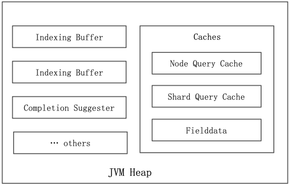
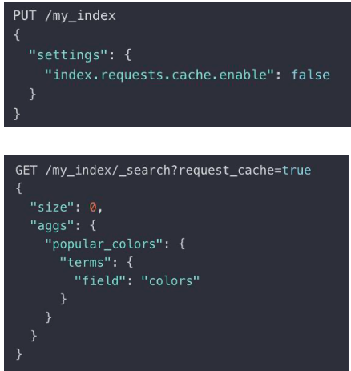
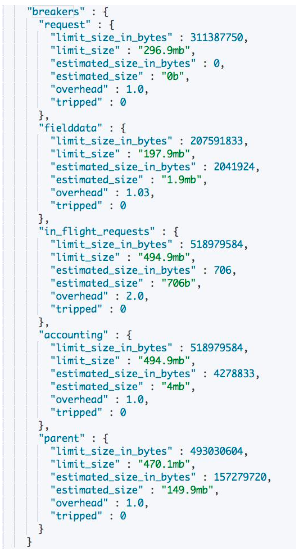

# **第八节 缓存及使用 Circuit Breaker 限制内存使用**

## **1、Inside the JVM Heap**

**Elasticsearch 的缓存主要分成三大类**

*  **Node Query Cache (Filter Context)**
* **Shard Query Cache (Cache Query的结果)**
*  **Fielddata Cache**

## **2、Shard Request Cache**

### **2-1 缓存每个分片上的查询结果**

* 只会缓存设置了 `size=0` 的查询对应的结果。
* 不会缓存` hits`。但是会缓存 `Aggregations `和 `Suggestions`

### **2-2 Cache Key**

 * **LRU 算法，将整个 JSON 查询串作为 Key，与 JSON 对 象的顺序相关**

### **2-3 静态配置**

* **数据节点: `indices.requests.cache.size: “1%”`**
  

## **3、Fielddata Cache**

* 除了 Text 类型，**默认都采用 `doc_values`。节约了内存**
	* **Aggregation 的 Global ordinals 也保存在 Fielddata cache 中**
* Text 类型的字段需要打开 Fileddata 才能对其进行聚合和排序
	* **Text 经过分词，排序和聚合效果不佳，建议不要轻易使用**
* 配置
	* 可以控制 `Indices.fielddata.cache.size`, 避免产生 GC (默认无限制)

## **4、缓存失效**

### **4-1 Node Query Cache**

保存的是 Segment 级缓存命中的结果。Segment 被合并后，缓存会失效

### **4-2 Shard Request Cache**

* 分片 `Refresh` 时候，`Shard Request Cache` 会失效。
* **如果 Shard 对应的数据频繁发生变化，该缓存的效率会很差**

### **4-3 Fielddata Cache**

 Segment 被合并后，会失效
 
## **5、管理内存的重要性**

* Elasticsearch 高效运维依赖于内存的合理分配
	* **可用内存一半分配给 JVM，一半留给操作系统，缓存索引文件**

* 内存问题，引发的问题
	* 长时间 GC，影响节点，导致集群响应缓慢
	*  OOM， 导致丢节点

## **6、诊断内存状况**

**查看各个节点的内存状况**

* `GET _cat/nodes?v`
* `GET _nodes/stats/indices?pretty` 
* `GET _cat/nodes?v&h=name,queryCacheMemory,queryCacheEvictions,requestCacheMemory,reques tCacheHitCount,request_cache.miss_count`
* `GET _cat/nodes?h=name,port,segments.memory,segments.index_writer_memory,fielddata.memo ry_size,query_cache.memory_size,request_cache.memory_size&v`

## **7、一些常见的内存问题**

### **7-1 Segments 个数过多，导致 full GC**
    
*  **现象**:集群整体响应缓慢，也没有特别多的数据读写。但是发现节点在持续进行 Full GC
*  **分析**:查看 Elasticsearch 的内存使用，发现 segments.memory 占用很大空间
*  **解决**:通过 force merge，把 segments 合并成一个。
*  **建议**:
	*  对于不在写入和更新的索引，可以将其设置成只读。
	*  同时，进行 force merge 操作。
	*  如果问题依然存在，则需要考虑扩容。
	*  此外，对索引进行 force merge ，还可以减少对 global_ordinals 数据结构的构建，减少对 fielddata cache 的开销

### **7-2 Field data cache 过大，导致 full GC**

* **现象**:集群整体响应缓慢，也没有特别多的数据读写。但是发现节点在持续进行 Full GC
* **分析**:查看 Elasticsearch 的内存使用，发现 **fielddata.memory.size** 占用很大空间。同时， 数据不存在写入和更新，也执行过 segments merge。
* **解决**:将 indices.fielddata.cache.size 设小，重启节点，堆内存恢复正常
* **建议**:	
	* Field data cache 的构建比较重，Elasticsearch 不会主动释放，
	* 所以这个值应该设置的保守一些。如果业务上确实有所需要，可以通过增加节点，扩容解决

### **7-3 复杂的嵌套聚合，导致集群 full GC**

* **现象**:节点响应缓慢，持续进行 Full GC
* **分析**:导出 Dump 分析。发现内存中有大量 bucket 对象，查看 日志，发现复杂的嵌套聚合
* **解决**:优化聚合
* **建议**:
	* 在大量数据集上进行嵌套聚合查询，需要很大的堆内存来完成。
	* 如果业务场景确实需要。 则需要增加硬件进行扩展。
	* **同时，为了避免这类查询影响整个集群，需要设置 Circuit Breaker 和 `search.max_buckets` 的数值**

## **8、Circuit Breaker**

 包含多种断路器，避免不合理操作引发的 OOM，每个断路器可以指定内存使用的限制
 
 * **Parent circuit breaker**:		设置所有的熔断器可以使用的内存的总量
 * **Fielddata circuit breaker**:	加载 fielddata 所需要的内存
 * **Request circuit breaker**:	防止每个请求级数据结构超过一定的内存(例如聚合计算的内存) 
 * **In flight circuit breaker**:	Request中的断路器
 * **Accounting request circuit breaker**: 请求结束后不能释放的对象所占用的内存

 
## **9、Circuit Breaker 统计信息**

* `GET /_nodes/stats/breaker?`
	* Tripped 大于 0， 说明有过熔断
	* **Limit size 与 estimated size 约接近，越可能引发熔断**
* **千万不要触发了熔断，就盲目调大参数，有可能会导致集群出问题，也不因该盲目调小，需要进行评估**
* 建议将集群升级到 7.x，更好的 Circuit Breaker 实现机制
	* **增加了` indices.breaker.total.use_real_memory` 配置项，可以更加精准的分析内存状况，避免 OOM**

[https://www.elastic.co/blog/improving-node-resiliency-with-the-real-memory-circuit-breaker](https://www.elastic.co/blog/improving-node-resiliency-with-the-real-memory-circuit-breaker)

