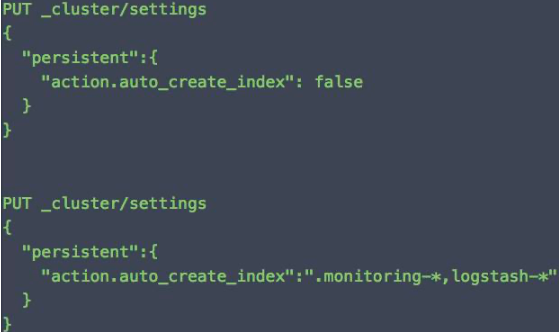
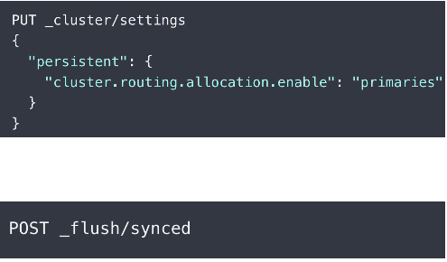
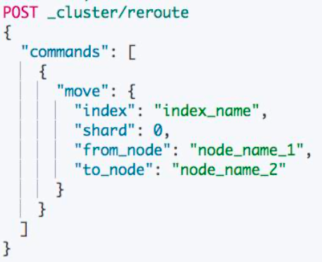
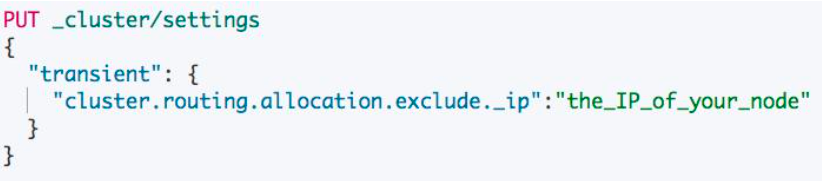
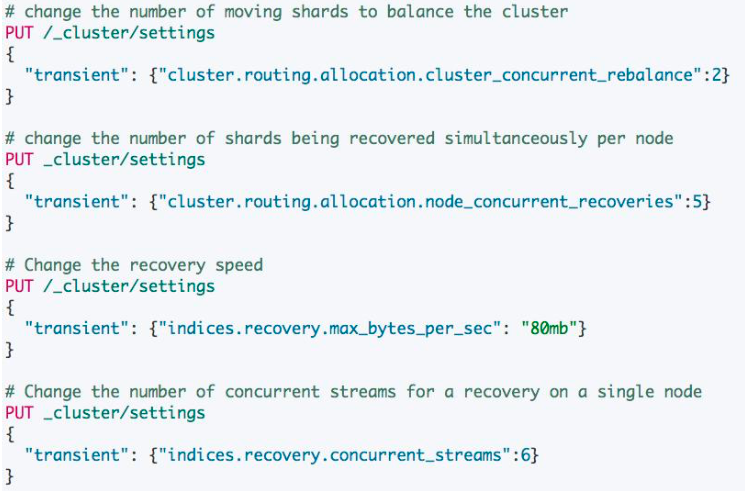
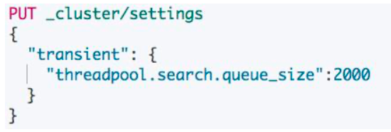
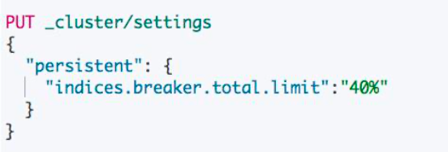

# **第九节 一些运维相关的建议**

# **1、集群的生命周期管理**

### **1-1 预上线**

评估用户的需求及使用场景 / 数据建模 / 容量规划 / 选择合适的部署架构 / 性能测试

### **1-2 上线**

* 监控流量 / 定期检查潜在问题 (防患于未然，发现错误的使用方式，及时增加机器)
* 对索引进行优化(Index Lifecycle Management)，检测是否存在不均衡而导致有部分节点过热
* 定期数据备份 / 滚动升级


### **1-3 下架前监控流量，实现 Stage Decommission**

## **2、部署的建议**

* 根据实际场景，选择合适的部署方式，选择合理的硬件配置
	* 搜索类
	* 日志/指标
* **部署要考虑，反亲和性(Anti-Affinity)**
	* 尽量将机器分散在不同的机架。例如，3 台 Master 节点必须分散在不同的机架上
	* **善用 Shard Filtering 进行配置**
	
## **3、使用要遵循一定的规范**

### **3-1  Mapping**

* **生产环境中索引应考虑禁止 Dynamic Index Mapping**，避免过多字段导致 Cluster State 占用过多
* **禁止索引自动创建的功能，创建时必须提供 Mapping 或通过 Index Template 进行设定**




### **3-2 设置 Slowlogs，发现一些性能不好，甚至是错误的使用 Pattern**

* 例如: 错误的将网址映射成 keyword，然后用通配符查询。应该使用 Text，结合 URL 分词器
* **严禁一切 `“*” `开头的通配符查询**


## **4、对重要的数据进行备份**

* 集群备份
* [https://www.elastic.co/guide/en/elasticsearch/reference/7.1/modules-snapshots.html](https://www.elastic.co/guide/en/elasticsearch/reference/7.1/modules-snapshots.html)


## **5、定期更新到新版本**

* ES 在新版本中会持续对性能作出优化;提供更多的新功能
	* Circuit breaker 实现的改进
*  修复一些已知的 bug 和安全隐患


### **5-1 ES 的版本**

**Elasticsearch 的版本格式是: X.Y.Z**

* X: Major
* Y: Minor
* Z: Patch

**Elasticsearch 可以使用上一个主版本的索引**

* 7.x 可以使用 6.x / 7.x 不支持使用 5.x 
* 5.x 可以使用 2.x


### **5-2 Rolling Upgrade v.s Full Cluster Restart**

**Rolling Upgrade**

* 没有 Downtime
* [https://www.elastic.co/guide/en/elasticsearch/reference/7.1/rolling-upgrades.html](https://www.elastic.co/guide/en/elasticsearch/reference/7.1/rolling-upgrades.html)

**Full Cluster Restart**

* 集群在更新期间不可用 
* **升级更快**


### **5-3 Full Restart 的步骤**

* 停止索引数据，同时备份集群
* **Disable Shard Allocation (Persistent)** 
* **执行 Synced Flush**
* 关闭并更新所有节点
* 先运行所有 Master 节点 / 再运行其他节点 
* **等集群变黄后打开 Shard Allocation**



```
curl -XGET 'http://ip:9200/_cluster/health?pretty=true'
curl -XGET 'http://ip:9200/_cat/indices?v'
```

 **Disable Shard Allocation (Persistent)** 

```
curl -X PUT "http://ip:9200/_cluster/settings" -H 'Content-Type: application/json' -d'

{

   "transient":{

      "cluster.routing.allocation.enable":"none"

   }

}
'
```

**执行 Synced Flush**

`curl -X POST "http://ip:9200/_flush/synced"`


 **等集群变黄后打开 Shard Allocation**
 
 ```
 curl -X PUT "http://ip:9200/_cluster/settings" -H 'Content-Type: application/json' -d'

{

   "transient":{

      "cluster.routing.allocation.enable":"all"

   }

}

'
 ```
 
##  **6、运维 Cheat Sheet**

### **6-1 移动分片**

* **从一个节点移动分片到另外一个节点**
* 使用场景:
	* 当一个数据节点上有过多 Hot Shards; 
	* **可以通过手动分配分片到特定的节点解决**



### **6-2 从集群中移除一个节点**

**使用场景**:当你想移除一个节点，或者对一个机器进行维护。同时你又不希望导致集群的颜色变 黄或者变红



### **6-3 控制 Allocation 和 Recovery**

**使用场景**:控制 Allocation 和 Recovery 的**速率**



### **6-4 Synced Flush**

**使用场景**:需要重启一个节点。

通过 `synced flush`，可以在索引上放置一个 sync ID。这样可以提供这些分片的 Recovery 的时间

```
POST _flush/sycned
```

### **6-5 清空节点上的缓存**

**使用场景**:节点上出现了高内存占用。可以执行清除缓存的操作。这个操作会影响集群的性能， 但是会避免你的集群出现 OOM 的问题

```
POST _cache/clear
```

### **6-6 控制搜索的队列**

**使用场景**: 当搜索的响应时间过长，看到有“reject” 指标的增加，都可以适当增加该数值



### **6-7 设置 Circuit Breaker**

使用场景:设置各类 Circuit Breaker。避免 OOM 的发生。



## **7、运维建议**

* 了解用户场景，选择合适部署 
* 定期检查，发现潜在问题
* 对重要的数据进行备份
* 保持版本升级