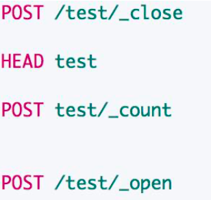
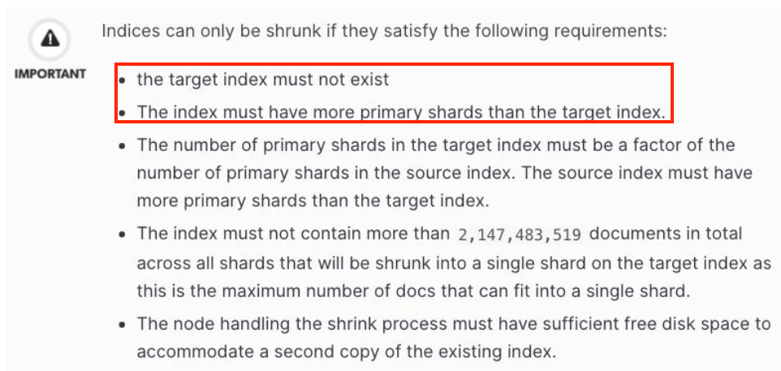
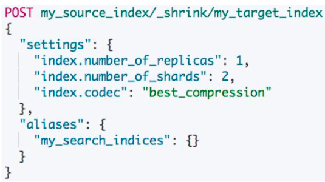
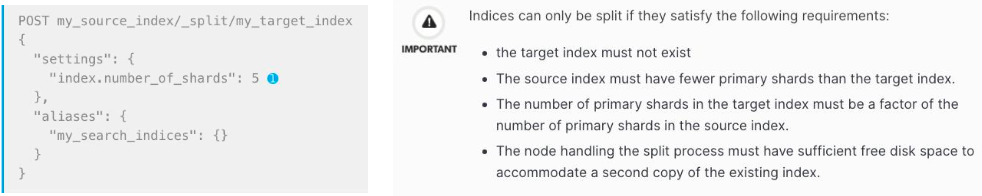
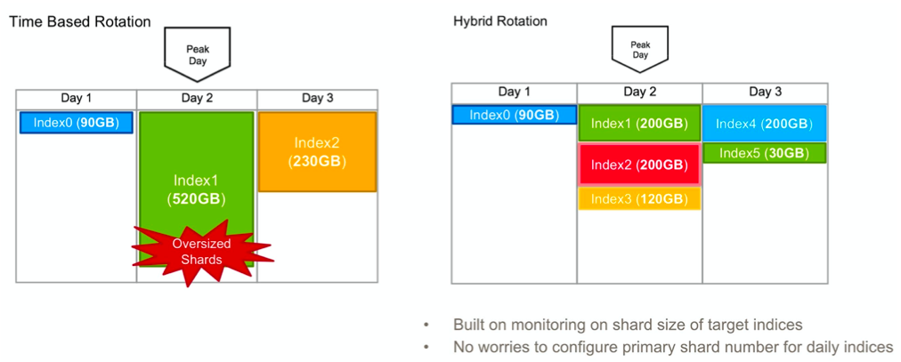
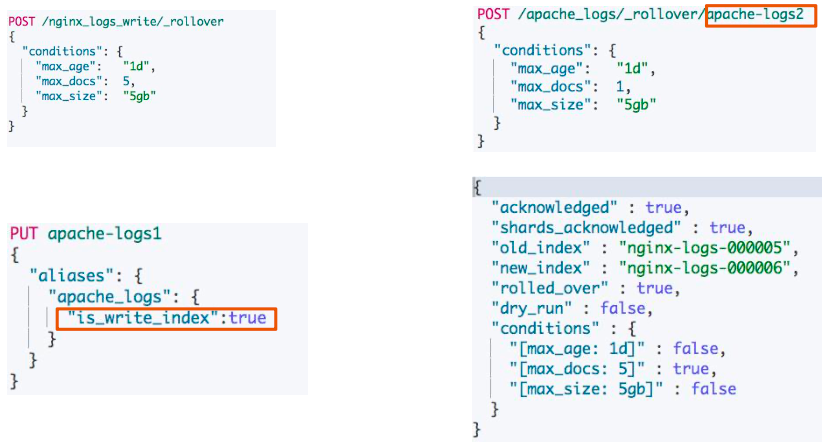

# **第一节 使用 Shrink 与 Rollover API 管理索引**

## **1、索引管理 API**

* **Open / Close Index**: 索引关闭后无法进行读写，但是索引数据不会被删除
*  **Shrink Index**:可以将索引的**主分片数收缩到较小的值**
*  **Split Index**:可以扩大主分片个数
*  **Rollover Index**:类似 **Log4J** 记录日志的方式，**索引尺寸或者时间超过一定值后，创建新的**
* **Rollup Index**:对数据进行处理后，重新写入，减少数据量


## **2、Open / Close Index API**



* **索引关闭后，对集群的相关开销基本降低为 0** 
* 但是无法被读取和搜索
* 当需要的时候，可以重新打开

### **2-1 Open / Close Index API DEMO**

```
# 打开关闭索引
DELETE test
#查看索引是否存在
HEAD test

{"statusCode":404,"error":"Not Found","message":"404 - Not Found"}
```

```
PUT test/_doc/1
{
  "key":"value"
}

#关闭索引
POST /test/_close

{
  "acknowledged" : true,
  "shards_acknowledged" : true,
  "indices" : {
    "test" : {
      "closed" : true
    }
  }
}
```

**索引存在**

```
HEAD test

200 - OK
```

**无法查询**

```
# 无法查询
POST test/_count

{
  "error" : {
    "root_cause" : [
      {
        "type" : "index_closed_exception",
        "reason" : "closed",
        "index_uuid" : "BmN-xvVSR56W5iAq3BvPTw",
        "index" : "test"
      }
    ],
    "type" : "index_closed_exception",
    "reason" : "closed",
    "index_uuid" : "BmN-xvVSR56W5iAq3BvPTw",
    "index" : "test"
  },
  "status" : 400
}
```

**打开索引**

```
#打开索引
POST /test/_open

POST test/_search
{
  "query": {
    "match_all": {}
  }
}

...
 "hits" : {
    "total" : {
      "value" : 1,
      "relation" : "eq"
    },
...
```

```
POST test/_count
```

```
{
  "count" : 1,
  "_shards" : {
    "total" : 1,
    "successful" : 1,
    "skipped" : 0,
    "failed" : 0
  }
}
```

`close` 的索引不能被查询。节约了内存开销。但是磁盘空间还是被占用的。如果你磁盘空间足够当然可以一直`close`并不删除。当然这种情况下，你可以结合hot warm的架构，定期将索引移动到廉价的存储上，再进行`close`

## **3、Shrink API**

* **ES 5.x 后推出的一个新功能，使用场景**
	*  索引保存的数据量比较小，需要重新设定主分片数
	*   索引从 Hot 移动到 Warm 后，需要降低主分片数
* 会使用和源索引**相同的配置**创建一个新的索引，仅仅**降低主分片数**
	* **源分片数必须是目标分片数的倍数。如果源分片数是素数，目标分片数只能为 1**
	* 如果文件系统支持硬链接，会将 Segments 硬连接到目标索引，所以性能好
*  完成后，可以删除源索引


### **3-1 Shrink API**





* 分片必须只读
* 所有的分片必须在同一个节点上 
* **集群健康状态为 Green**

### **3-2 Shrink API Demo**

```
# 在一个 hot-warm-cold的集群上进行测试

GET _cat/nodes

172.19.0.6 49 97 5 0.11 0.21 0.58 dilmrt - es7_warm
172.19.0.3 48 97 5 0.11 0.21 0.58 dilmrt * es7_hot
172.19.0.2 71 97 5 0.11 0.21 0.58 dilmrt - es7_cold

GET _cat/nodeattrs

es7_warm 172.19.0.6 172.19.0.6 ml.machine_memory 3973804032
es7_warm 172.19.0.6 172.19.0.6 ml.max_open_jobs  20
es7_warm 172.19.0.6 172.19.0.6 box_type          warm
es7_warm 172.19.0.6 172.19.0.6 xpack.installed   true
es7_warm 172.19.0.6 172.19.0.6 transform.node    true
es7_hot  172.19.0.3 172.19.0.3 ml.machine_memory 3973804032
es7_hot  172.19.0.3 172.19.0.3 box_type          hot
es7_hot  172.19.0.3 172.19.0.3 xpack.installed   true
es7_hot  172.19.0.3 172.19.0.3 transform.node    true
es7_hot  172.19.0.3 172.19.0.3 ml.max_open_jobs  20
es7_cold 172.19.0.2 172.19.0.2 ml.machine_memory 3973804032
es7_cold 172.19.0.2 172.19.0.2 ml.max_open_jobs  20
es7_cold 172.19.0.2 172.19.0.2 box_type          cold
es7_cold 172.19.0.2 172.19.0.2 xpack.installed   true
es7_cold 172.19.0.2 172.19.0.2 transform.node    true
```

```
DELETE my_source_index
DELETE my_target_index
```

```
PUT my_source_index
{
 "settings": {
   "number_of_shards": 4,
   "number_of_replicas": 0
 }
}

PUT my_source_index/_doc/1
{
  "key":"value"
}

GET _cat/shards/my_source_index
```

```
my_source_index 3 p STARTED 0 208b 172.19.0.2 es7_cold
my_source_index 2 p STARTED 0 208b 172.19.0.3 es7_hot
my_source_index 1 p STARTED 0 208b 172.19.0.6 es7_warm
my_source_index 0 p STARTED 0 208b 172.19.0.2 es7_cold
```

**分片数3，会失败**

```
# 分片数3，会失败
POST my_source_index/_shrink/my_target_index
{
  "settings": {
    "index.number_of_replicas": 0,
    "index.number_of_shards": 3,
    "index.codec": "best_compression"
  },
  "aliases": {
    "my_search_indices": {}
  }
}
```

**Output**

```
{
  "error" : {
    "root_cause" : [
      {
        "type" : "illegal_argument_exception",
        "reason" : "the number of source shards [4] must be a multiple of [3]"
      }
    ],
    "type" : "illegal_argument_exception",
    "reason" : "the number of source shards [4] must be a multiple of [3]"
  },
  "status" : 400
}
```

**报错，因为没有置成 readonly**

```
POST my_source_index/_shrink/my_target_index
{
  "settings": {
    "index.number_of_replicas": 0,
    "index.number_of_shards": 2,
    "index.codec": "best_compression"
  },
  "aliases": {
    "my_search_indices": {}
  }
}
```

**500 - Internal Server Error**

```
{
  "error" : {
    "root_cause" : [
      {
        "type" : "illegal_state_exception",
        "reason" : "index my_source_index must be read-only to resize index. use \"index.blocks.write=true\""
      }
    ],
    "type" : "illegal_state_exception",
    "reason" : "index my_source_index must be read-only to resize index. use \"index.blocks.write=true\""
  },
  "status" : 500
}

```
**将 `my_source_index` 设置为只读**

```
#将 my_source_index 设置为只读
PUT /my_source_index/_settings
{
  "settings": {
    "index.blocks.write": true
  }
}
```

**报错，必须都在一个节点**

```
# 报错，必须都在一个节点
POST my_source_index/_shrink/my_target_index
{
  "settings": {
    "index.number_of_replicas": 0,
    "index.number_of_shards": 2,
    "index.codec": "best_compression"
  },
  "aliases": {
    "my_search_indices": {}
  }
}
```

**500 - Internal Server Error**

```
{
  "error" : {
    "root_cause" : [
      {
        "type" : "illegal_state_exception",
        "reason" : "index my_source_index must have all shards allocated on the same node to shrink index"
      }
    ],
    "type" : "illegal_state_exception",
    "reason" : "index my_source_index must have all shards allocated on the same node to shrink index"
  },
  "status" : 500
}
```

### **3-3 `illegal_state_exception`**

* the number of source shards [4] must be a multiple of [3]
* index `my_source_index` must have all shards allocated on the same node to shrink index
* index `my_source_index` must be read-only to resize index. use \"index.blocks.write=true

```
DELETE my_source_index

## 确保分片都在 hot
PUT my_source_index
{
 "settings": {
   "number_of_shards": 4,
   "number_of_replicas": 0,
   "index.routing.allocation.include.box_type":"hot"
 }
}

PUT my_source_index/_doc/1
{
  "key":"value"
}
```

```
GET _cat/shards/my_source_index
```

**Output**

```
# GET _cat/shards/my_source_index
my_source_index 1 p STARTED 0   0b 172.19.0.3 es7_hot
my_source_index 2 p STARTED 0   0b 172.19.0.3 es7_hot
my_source_index 3 p STARTED 0   0b 172.19.0.3 es7_hot
my_source_index 0 p STARTED 0 208b 172.19.0.3 es7_hot
```

```
#设置为只读
PUT /my_source_index/_settings
{
  "settings": {
    "index.blocks.write": true
  }
}
```

```
POST my_source_index/_shrink/my_target_index
{
  "settings": {
    "index.number_of_replicas": 0,
    "index.number_of_shards": 2,
    "index.codec": "best_compression"
  },
  "aliases": {
    "my_search_indices": {}
  }
}
```

**output:**

```
{
  "acknowledged" : true,
  "shards_acknowledged" : true,
  "index" : "my_target_index"
}
```

```
GET _cat/shards/my_target_index
```

**Output:**

```
my_target_index 1 p STARTED 0  208b 172.19.0.3 es7_hot
my_target_index 0 p STARTED 1 3.7kb 172.19.0.3 es7_hot
```

```
# My target_index状态为也只读
PUT my_target_index/_doc/1
{
  "key":"value"
}
```

***Output:***

```
{
  "error" : {
    "root_cause" : [
      {
        "type" : "cluster_block_exception",
        "reason" : "index [my_target_index] blocked by: [FORBIDDEN/8/index write (api)];"
      }
    ],
    "type" : "cluster_block_exception",
    "reason" : "index [my_target_index] blocked by: [FORBIDDEN/8/index write (api)];"
  },
  "status" : 403
}

```


### **4、Split API**



### **4-1 一个时间序列索引的实际场景**



### **4-2  Split Index Demo**

```
# Split Index
DELETE my_source_index
DELETE my_target_index

PUT my_source_index
{
 "settings": {
   "number_of_shards": 4,
   "number_of_replicas": 0
 }
}

PUT my_source_index/_doc/1
{
  "key":"value"
}


GET _cat/shards/my_source_index
```

***Output***

```
my_source_index 3 p STARTED 0  208b 172.19.0.2 es7_cold
my_source_index 2 p STARTED 0  208b 172.19.0.3 es7_hot
my_source_index 1 p STARTED 0  208b 172.19.0.6 es7_warm
my_source_index 0 p STARTED 1 3.7kb 172.19.0.2 es7_cold
```


**必须是倍数**

```
# 必须是倍数
POST my_source_index/_split/my_target
{
  "settings": {
    "index.number_of_shards": 10
  }
}
```

***Output:***

```
{
  "error" : {
    "root_cause" : [
      {
        "type" : "illegal_argument_exception",
        "reason" : "the number of source shards [4] must be a factor of [10]"
      }
    ],
    "type" : "illegal_argument_exception",
    "reason" : "the number of source shards [4] must be a factor of [10]"
  },
  "status" : 400
}
```

**必须是只读**

```
# 必须是只读
POST my_source_index/_split/my_target
{
  "settings": {
    "index.number_of_shards": 8
  }
}
```

***Output:	500 - Internal Server Error***

```
{
  "error" : {
    "root_cause" : [
      {
        "type" : "illegal_state_exception",
        "reason" : "index my_source_index must be read-only to resize index. use \"index.blocks.write=true\""
      }
    ],
    "type" : "illegal_state_exception",
    "reason" : "index my_source_index must be read-only to resize index. use \"index.blocks.write=true\""
  },
  "status" : 500
}
```

### **4-3 `illegal_argument_exception`**

* the number of source shards [4] must be a factor of [10]
* index `my_source_index` must be read-only to resize index. use \"index.blocks.write=true\"


```
#设置为只读
PUT /my_source_index/_settings
{
  "settings": {
    "index.blocks.write": true
  }
}


POST my_source_index/_split/my_target_index
{
  "settings": {
    "index.number_of_shards": 8,
    "index.number_of_replicas":0
  }
}
```

***Output***

```
{
  "acknowledged" : true,
  "shards_acknowledged" : true,
  "index" : "my_target_index"
}
```

```
GET _cat/shards/my_target_index

my_target_index 5 p STARTED 0  208b 172.19.0.3 es7_hot
my_target_index 2 p STARTED 0  208b 172.19.0.6 es7_warm
my_target_index 3 p STARTED 0  208b 172.19.0.6 es7_warm
my_target_index 6 p STARTED 0  208b 172.19.0.2 es7_cold
my_target_index 1 p STARTED 0  206b 172.19.0.2 es7_cold
my_target_index 4 p STARTED 0  208b 172.19.0.3 es7_hot
my_target_index 7 p STARTED 0  208b 172.19.0.2 es7_cold
my_target_index 0 p STARTED 1 3.7kb 172.19.0.2 es7_cold
```

```
# write block
PUT my_target_index/_doc/1
{
  "key":"value"
}

### Output
{
  "error" : {
    "root_cause" : [
      {
        "type" : "cluster_block_exception",
        "reason" : "index [my_target_index] blocked by: [FORBIDDEN/8/index write (api)];"
      }
    ],
    "type" : "cluster_block_exception",
    "reason" : "index [my_target_index] blocked by: [FORBIDDEN/8/index write (api)];"
  },
  "status" : 403
}
```

## **5、Rollover API**

* 当满足一系列的条件，**Rollover API 支持将一个 Alias 指向一个新的索引**
	*  存活的时间 
	*  最大文档数 
	*  最大的文件尺寸
* 应用场景
	* **当一个索引数据量过大**
* 一般需要和 **Index Lifecycle Management Policies** 结合使用
	* **只有调用 Rollover API 时，才会去做相应的检测**。ES 并不会自动去监控这些索引

	
### **5-1 Rollover API(Demo)**



```
#Rollover API
DELETE nginx-logs*
```

```
# 不设定 is_write_true
# 名字符合命名规范
PUT /nginx-logs-000001
{
  "aliases": {
    "nginx_logs_write": {}
  }
}

# output
{
  "acknowledged" : true,
  "shards_acknowledged" : true,
  "index" : "nginx-logs-000001"
}
```


```
# 多次写入文档 > 5
POST nginx_logs_write/_doc
{
  "log":"something"
}
```

```
POST /nginx_logs_write/_rollover
{
  "conditions": {
    "max_age":   "1d",
    "max_docs":  5,
    "max_size":  "5gb"
  }
}
```

***output: true***

***"[max_docs: 5]" : true,***

```
{
  "acknowledged" : true,
  "shards_acknowledged" : true,
  "old_index" : "nginx-logs-000001",
  "new_index" : "nginx-logs-000002",
  "rolled_over" : true,
  "dry_run" : false,
  "conditions" : {
    "[max_age: 1d]" : false,
    "[max_docs: 5]" : true,
    "[max_size: 5gb]" : false
  }
}
```

```
GET /nginx_logs_write/_count
```

***output: total 返回1***

```
{
  "count" : 0,
  "_shards" : {
    "total" : 1,
    "successful" : 1,
    "skipped" : 0,
    "failed" : 0
  }
}
```

```
# 查看 Alias信息
GET /nginx_logs_write
```

***Output: Alias 指到了新的索引上面***

```
{
  "nginx-logs-000002" : {
    "aliases" : {
      "nginx_logs_write" : { }
    },
    "mappings" : { },
    "settings" : {
      "index" : {
        "creation_date" : "1607726860387",
        "number_of_shards" : "1",
        "number_of_replicas" : "1",
        "uuid" : "xHplu5XTTk2Jbak0ZYxqtw",
        "version" : {
          "created" : "7090199"
        },
        "provided_name" : "nginx-logs-000002"
      }
    }
  }
}

```

```
DELETE apache-logs*
```

### **5-2 Rollover API  `is_write_index`**

```
# 设置 is_write_index
PUT apache-logs1
{
  "aliases": {
    "apache_logs": {
      "is_write_index":true
    }
  }
}
```

```
POST apache_logs/_count
# 0

POST apache_logs/_doc
{
  "key":"value"
}
```

```
# 需要指定 target 的名字
POST /apache_logs/_rollover/apache-logs8xxxx
{
  "conditions": {
    "max_age":   "1d",
    "max_docs":  1,
    "max_size":  "5gb"
  }
}
```

***Output: true***

```
{
  "acknowledged" : true,
  "shards_acknowledged" : true,
  "old_index" : "apache-logs1",
  "new_index" : "apache-logs8xxxx",
  "rolled_over" : true,
  "dry_run" : false,
  "conditions" : {
    "[max_age: 1d]" : false,
    "[max_docs: 1]" : true,
    "[max_size: 5gb]" : false
  }
}
```

```
# 查看 Alias信息
GET /apache_logs

...
"apache-logs8xxxx" : {
    "aliases" : {
      "apache_logs" : {
        "is_write_index" : true
      }
    },
    "mappings" : { },
    "settings" : {
      "index" : {
        "creation_date" : "1607726455652",
        "number_of_shards" : "1",
        "number_of_replicas" : "1",
        "uuid" : "-mb_kDsbSfyt7ECYitkO9A",
        "version" : {
          "created" : "7090199"
        },
        "provided_name" : "apache-logs8xxxx"
      }
    }
  }
```


