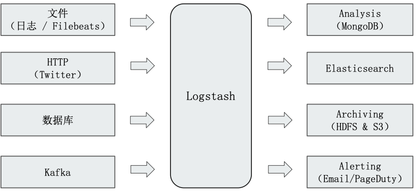
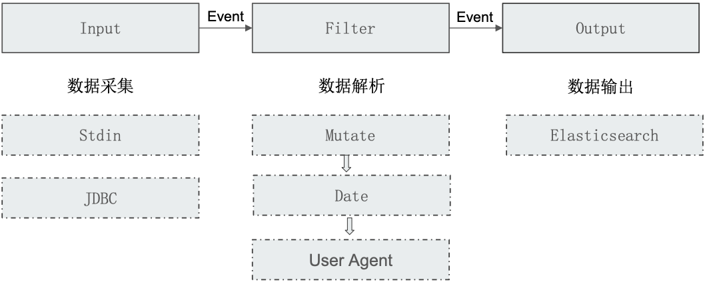
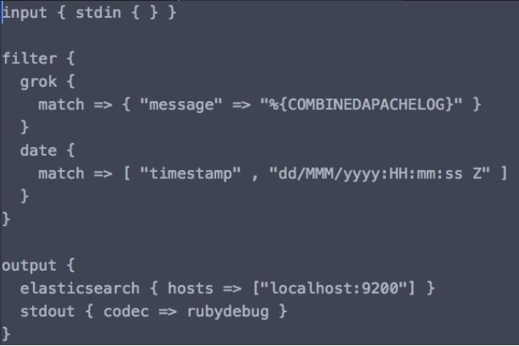
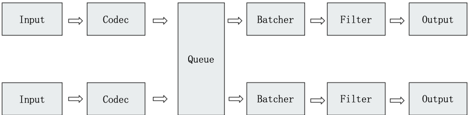
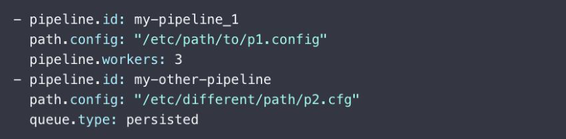
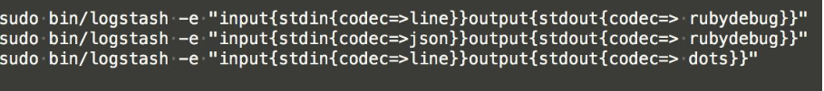
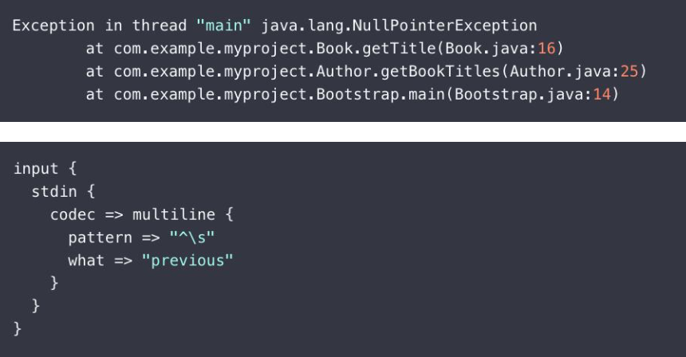

# **第一节 Logstash 入门及架构介绍**


## **1、Logstash**

Logstash: ETL 工具 / 数据搜集处理引擎。**支持 200 多个插件**




## **2、Logstash Concepts**

### **1-1 Pipeline**

* 包含了 `input-filter-output` 三个阶段的处理流程
* 插件生命周期管理
* 队列管理

### **1-2 Logstash Event**

* 数据在内部流转时的具体表现形式。**数据在 `input` 阶段被转换为 `Event`，在 `output` 被转化成目标格式数据**
* **Event 其实是一个 Java Object**，在配置文件中，对 Event 的属性进行增删改查

## **3、Logstash 架构简介**

Codec(Code / Decode):

* 将原始数据 decode 成 Event;
* 将 Event encode 成目标数据



## **4、Logstash 配置文件结构**

* `bin/logstash -f demo.conf`
* Pipeline
	* Input / Filter / Output
* Codec
	* Line / json



* Input: stdin
* filter: 
	* grok
	* date
* output:
	* elasticsearch
	* stdout

### **4-1 Input Plugins**

* 一个 Pipeline 可以有多个 input 插件
	* Stdin / File
	* Beats / Log4J / Elasticsearch / JDBC / Kafka / Rabbitmq / Redis
	*  JMX / HTTP / Websocket / UDP / TCP
	*  Google Cloud Storage / S3
	*  Github / Twitter

### **4-2 Output Plugins**

* **将 Event 发送到特定的目的地，是 Pipeline 的最后一个阶段**
* 常见 Output Plugins: [https://www.elastic.co/guide/en/logstash/7.1/output-plugins.html](https://www.elastic.co/guide/en/logstash/7.1/output-plugins.html)
	*  Elasticsearch
	*  Email / Pageduty
	*  Influxdb / Kafka / Mongodb / Opentsdb / Zabbix 
	*  Http / TCP / Websocket


### **4-3 Codec Plugins**

*  **将原始数据 decode 成 Event;**
*  **将 Event encode 成目标数据**
*   内置的 Codec Plugins [https://www.elastic.co/guide/en/logstash/7.1/codec-plugins.html](https://www.elastic.co/guide/en/logstash/7.1/codec-plugins.html)
	*   Line / Multiline
	*   JSON / Avro / Cef (ArcSight Common Event Format)
	*   Dots / Rubydebug

### **4-4 Filter Plugins**

* 处理 Event
* 内置的 Filter Plugins：[ https://www.elastic.co/guide/en/logstash/7.1/filter-plugins.html]( https://www.elastic.co/guide/en/logstash/7.1/filter-plugins.html)
	* Mutate – 操作 Event 的字段
	*  Metrics – Aggregate metrics
	*  Ruby–执行Ruby代码

## **5、 Queue**



### **5-1 多 Pipelines 实例**

* `Pipeline.works`: **Pipeline 线程数，默认是 CPU 核数**
*  `Pipeline.batch.size`:	Batcher 一次批量获取等待处理的文档数，默认 125。**需结合 `jvm.options`调节**
*  `Pipeline.batch.delay`:	Batcher 等待时间



### **5-1 Logstash Queue**

**In Memory Queue**

进程 Crash，机器当机，都会引起数据的丢失

**Persistent Queue**

* Queue.type.persisted (默认是 memory)
	* `Queue.max_bytes: 4gb`
* 机器当机，数据也不会丢失;
* 数据保证会被消费;
* 可以替代 Kafka 等消息队列缓冲区的作用
* [https://www.elastic.co/guide/en/logstash/7.1/persistent-queues.html](https://www.elastic.co/guide/en/logstash/7.1/persistent-queues.html)

## **6、Codec Plugin**

### **6-1 Single Line**



### **6-2 Multiline**

**设置参数**

* Pattern: 设置行匹配的正则表达式
*  What :如果匹配成功，那么匹配行属于上一个事件还是下一个事件
	*  Previous / Next
*  Negate true / false:是否对 pattern 结果取反
	*  True / False

### **6-3 Codec Plugin – Multiline(异常日志)**



## **7、Input Plugin – File**

* 支持从文件中读取数据，**如日志文件**
* 文件读取需要解决的问题
	* 只被读取一次。**重启后需要从上次读取的位置继续(通过 sincedb 实现)**
*  读取到文件新内容，发现新文件
*  文件发生归档操作(文档位置发生变化，日志 rotation)，不能影响当前的内容读取

## **8、Filter Plugin**

Filter Plugin 可以对 **Logstash Event 进行各种处理，例如解析，删除字段，类型转换**

* Date:日期解析
* Dissect:分割符解析
* Grok:正则匹配解析
* Mutate:处理字段。重命名，删除，替换
* Ruby:利用 Ruby 代码来动态修改 Event

### **8-1 Filter Plugin - Mutate**

对字段做各种操作

* Convert 类型转换
* Gsub 字符串替换
* Split / Join / Merge 字符串切割，数组合并字符串，数组合并数组 
* Rename 字段重命名
* Update / Replace 字段内容更新替换
* `Remove_field` 字段删除


## **9、DEMO**

**JVM 升级导致logstash 启动失败**

```
$ logstash -h
Unrecognized VM option 'UseConcMarkSweepGC'
Error: Could not create the Java Virtual Machine.
Error: A fatal exception has occurred. Program will exit.

vim /usr/share/logstash/config/jvm.options

...
## GC configuration
## -XX:+UseConcMarkSweepGC
## -XX:CMSInitiatingOccupancyFraction=75
## -XX:+UseCMSInitiatingOccupancyOnly
-XX:+UseG1GC
...
```

### **9-1 logstash-filter.conf**

```
input { stdin { } }

filter {
  grok {
    match => { "message" => "%{COMBINEDAPACHELOG}" }
  }
  date {
    match => [ "timestamp" , "dd/MMM/yyyy:HH:mm:ss Z" ]
  }
}

output {
  stdout { codec => rubydebug }
}
```

```
# 一个 Demo， demo 运行
logstash -f logstash-filter.conf
...
[2020-12-12T19:13:11,145][INFO ][logstash.javapipeline    ][main] Pipeline started {"pipeline.id"=>"main"}
[2020-12-12T19:13:11,190][INFO ][logstash.agent           ] Pipelines running {:count=>1, :running_pipelines=>[:main], :non_running_pipelines=>[]}
[2020-12-12T19:13:11,599][INFO ][logstash.agent           ] Successfully started Logstash API endpoint {:port=>9600}

hello world
{
    "@timestamp" => 2020-12-12T19:15:13.324Z,
          "tags" => [
        [0] "_grokparsefailure"
    ],
      "@version" => "1",
       "message" => "hello world",
          "host" => "elasticsearch7"
}
```

### **9-2 `codec=>line`**

```
logstash -e "input{stdin{codec=>line}}output{stdout{codec=> rubydebug}}"

hello world
{
    "@timestamp" => 2020-12-12T19:17:36.692Z,
       "message" => "hello world",
          "host" => "elasticsearch7",
      "@version" => "1"
}
```
### **9-3 `codec=> json `**

```
logstash -e "input{stdin{codec=>json}}output{stdout{codec=> rubydebug}}"

# line: error
hello world
[2020-12-12T19:19:45,222][WARN ][logstash.codecs.jsonlines][main][88ac75a22ddd4bf4cc22d3c0ae803da99e4ef96a529188df0a584d9d02739682] JSON parse error, original data now in message field {:error=>#<LogStash::Json::ParserError: Unrecognized token 'hello': was expecting ('true', 'false' or 'null')
 at [Source: (String)"hello world"; line: 1, column: 6]>, :data=>"hello world"}
{
          "tags" => [
        [0] "_jsonparsefailure"
    ],
    "@timestamp" => 2020-12-12T19:19:45.230Z,
       "message" => "hello world",
          "host" => "elasticsearch7",
      "@version" => "1"
}


# json: successful
{"hello":"world"}
{
         "hello" => "world",
    "@timestamp" => 2020-12-12T19:20:12.973Z,
          "host" => "elasticsearch7",
      "@version" => "1"
}
```

### **9-4 `stdout{codec=> dots}`**

```
logstash -e "input{stdin{codec=>line}}output{stdout{codec=> dots}}"

hello world
.
```

### **9-5 multiline-exception.conf**

**multiline-exception.conf**

```
input {
  stdin {
    codec => multiline {
      pattern => "^\s"
      what => "previous"
    }
  }
}


filter {}

output {
  stdout { codec => rubydebug }
}
```

```
logstash -f multiline-exception.conf

# 多行数据，异常
Exception in thread "main" java.lang.NullPointerException
        at com.example.myproject.Book.getTitle(Book.java:16)
        at com.example.myproject.Author.getBookTitles(Author.java:25)
        at com.example.myproject.Bootstrap.main(Bootstrap.java:14)
hello world
{
    "@timestamp" => 2020-12-12T19:28:38.285Z,
       "message" => "Exception in thread \"main\" java.lang.NullPointerException\n        at com.example.myproject.Book.getTitle(Book.java:16)\n        at com.example.myproject.Author.getBookTitles(Author.java:25)\n        at com.example.myproject.Bootstrap.main(Bootstrap.java:14)",
      "@version" => "1",
          "tags" => [
        [0] "multiline"
    ],
          "host" => "elasticsearch7"
}
```

### **9-6 movielens/logstash.conf**

[logstash.conf](https://chao-xi.github.io/jxes7book/files/chap2/logstash.conf)

```
input {
  file {
    path => "/home/vagrant/logstash/movielens/ml-latest-small/movies.csv"
    start_position => "beginning"
    sincedb_path => "/dev/null"
  }
}
filter {
  csv {
    separator => ","
    columns => ["id","content","genre"]
  }

  mutate {
    split => { "genre" => "|" }
    remove_field => ["path", "host","@timestamp","message"]
  }

  mutate {

    split => ["content", "("]
    add_field => { "title" => "%{[content][0]}"}
    add_field => { "year" => "%{[content][1]}"}
  }

  mutate {
    convert => {
      "year" => "integer"
    }
    strip => ["title"]
    remove_field => ["path", "host","@timestamp","message","content"]
  }

}
output {
   elasticsearch {
     hosts => "http://localhost:9200"
     index => "movies"
     document_id => "%{id}"
   }
  stdout {}
}
```

* path: filter location
* `sincedb_path`: 我们不需要这个功能，所以指定到了**"/dev/null"**
* output: elasticsearch
	* hosts / index / document_id

## **10、Q&A**

**Q: 怎样使用logstash导入word文档到ES呢**

**A:**

logstash 似乎并不能处理word文档。如果需要处理pdf，ppt等文档，需要安装 ingest-attachment插件
[https://www.elastic.co/guide/en/elasticsearch/plugins/current/ingest-attachment.html](https://www.elastic.co/guide/en/elasticsearch/plugins/current/ingest-attachment.html)