# **第三节 Beats 介绍**

## **1、什么是 Beats**

**Light weight data shippers**

* 以搜集数据为主
* 支持与 Logstash 或 ES 集成

**全品类/轻量级/开箱即用/可插拔 / 可扩展 / 可视化**

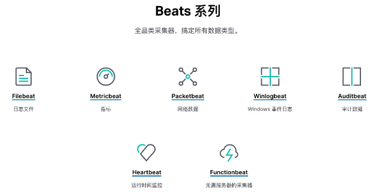


## **2、Metricbeat**

### **2-1 Metricbeat 简介**

* **用来定期搜集操作系统，软件的指标数据**
	* Metric v.s Logs: 
		* Metric – 可聚合的数据，定期搜集
		* Logs 文本数据，随机搜集
* 指标存储在 Elasticsearch 中，可以通过 Kibana 进行实时的数据分析


### **2-2 Metricbeat 组成**

**Module**

搜集的指标对象，**例如不同的操作系统，不同的数据库，不同的应用系统**

**Metricset**

* 一个 Module可以有多个 metricset
* 具体的指标集合。以减少调用次数为原则进行划分
	* **不同的 metricset 可以设置不同的抓取时长**


### **2-3 Module 组成**

* Metricbeat 提供了大量的开箱即用的 Module
	* [https://www.elastic.co/guide/en/beats/metricbeat/7.1/index.html](https://www.elastic.co/guide/en/beats/metricbeat/7.1/index.html)
* 通过执行 `metricbeat module list` 查看
* 通过执行 `metricbeat moudle enable module_name` 定制

### **2-4 Metricsets**

每个 Module 都有自己的 metricsets，以 System Module 为例

* core
* CPU
* disk IO 
* filesystem 
* load
* memory

### **2-5 Metricbeat Event**

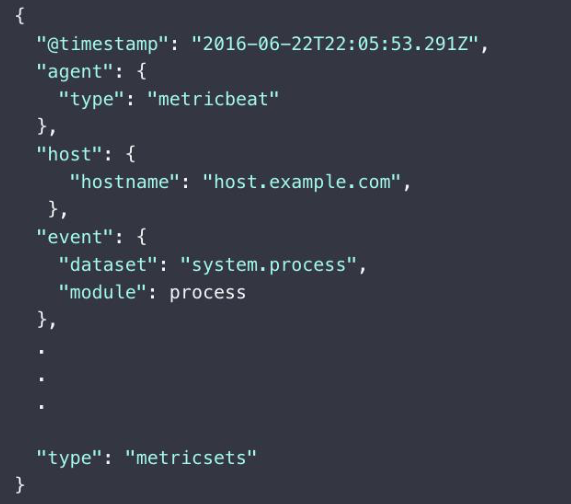


### **2-5 Metricbeat Demo**

*  下载安装并配置 Metricbeat
	* Enable 查看 system & Mysql
	* 定义 interval  
* 配置 Kibana Dashboard
* 运行
* 查看 索引 / Dashboard

[https://www.elastic.co/downloads/beats/metricbeat](https://www.elastic.co/downloads/beats/metricbeat)

```
wget https://artifacts.elastic.co/downloads/beats/metricbeat/metricbeat-7.10.1-linux-x86_64.tar.gz
tar xvzf metricbeat-7.10.1-linux-x86_64.tar.gz
cd metricbeat-7.10.1-linux-x86_64
```

```
./metricbeat modules list

./metricbeat modules list
Enabled:
system

Disabled:
activemq
aerospike
apache
appsearch
aws
azure
beat
beat-xpack
ceph
ceph-mgr
cloudfoundry
cockroachdb
consul
coredns
couchbase
couchdb
docker
dropwizard
elasticsearch
elasticsearch-xpack
envoyproxy
etcd
golang
googlecloud
...
```

```
./metricbeat modules enable docker
./metricbeat modules enable kibana
./metricbeat modules enable elasticsearch
```

```
 ./metricbeat modules list
Enabled:
docker
elasticsearch
kibana
system

Disabled:
activemq
```

```
$ ./metricbeat setup --dashboards
Loading dashboards (Kibana must be running and reachable)
Loaded dashboards
```

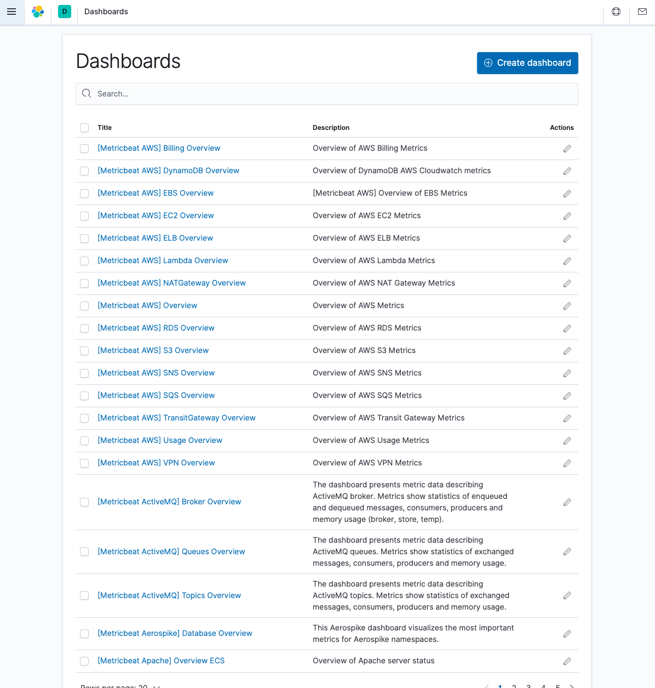

```
vim module/mysql/module.yml

# add db basic infomation
```

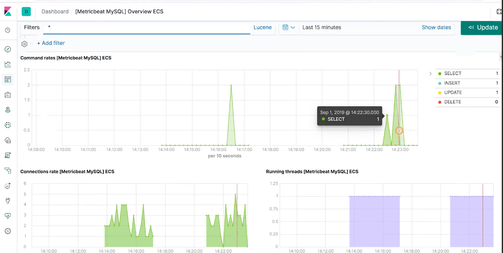

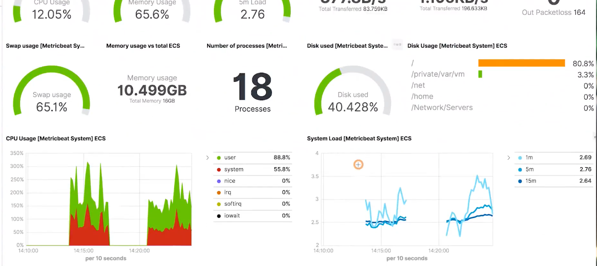


### **2-6 My Metricbeat Experiments**

**Install**

[https://www.elastic.co/guide/en/beats/metricbeat/current/setup-repositories.html](https://www.elastic.co/guide/en/beats/metricbeat/current/setup-repositories.html)

```
sudo vim /etc/yum.repos.d/elastic.repo

[elastic-7.x]
name=Elastic repository for 7.x packages
baseurl=https://artifacts.elastic.co/packages/7.x/yum
gpgcheck=1
gpgkey=https://artifacts.elastic.co/GPG-KEY-elasticsearch
enabled=1
autorefresh=1
type=rpm-md
```
```
sudo yum install metricbeat
sudo systemctl enable metricbeat

sudo systemctl start metricbeat
sudo journalctl -u metricbeat.service -r

config file ("/etc/metricbeat/metricbeat.yml") must be owned by the user identifier (uid=0) or root


sudo chown root:root /etc/metricbeat/metricbeat.yml
sudo systemctl restart metricbeat.service
sudo systemctl status metricbeat.service

$ sudo systemctl status metricbeat.service
● metricbeat.service - Metricbeat is a lightweight shipper for metrics.
   Loaded: loaded (/usr/lib/systemd/system/metricbeat.service; enabled; vendor preset: disabled)
   Active: active (running) since Mon 2020-12-14 04:01:35 UTC; 2h 44min ago
     Docs: https://www.elastic.co/products/beats/metricbeat
 Main PID: 34765 (metricbeat)
   CGroup: /system.slice/metricbeat.service
           └─34765 /usr/share/metricbeat/bin/metricbeat --environment systemd -c /etc/metricbeat/metricbeat.yml --path.home /usr/share/metricbeat --p...

Dec 14 06:41:51 elasticsearch7 metricbeat[34765]: 2020-12-14T06:41:51.066Z        INFO        [add_docker_metadata.docker]        docker/watc...tch call
Dec 14 06:42:05 elasticsearch7 metricbeat[34765]: 2020-12-14T06:42:05.354Z        INFO        [monitoring]        log/log.go:145        Non-zero metr...
Dec 14 06:42:35 elasticsearch7 metricbeat[34765]: 2020-12-14T06:42:35.357Z        INFO        [monitoring]        log/log.go:145        Non-zero metr...
Dec 14 06:43:05 elasticsearch7 metricbeat[34765]: 2020-12-14T06:43:05.353Z        INFO        [monitoring]        log/log.go:145        Non-zero metr...
Dec 14 06:43:35 elasticsearch7 metricbeat[34765]: 2020-12-14T06:43:35.353Z        INFO        [monitoring]        log/log.go:145        Non-zero metr...
Dec 14 06:44:05 elasticsearch7 metricbeat[34765]: 2020-12-14T06:44:05.353Z        INFO        [monitoring]        log/log.go:145        Non-zero metr...
Dec 14 06:44:35 elasticsearch7 metricbeat[34765]: 2020-12-14T06:44:35.354Z        INFO        [monitoring]        log/log.go:145        Non-zero metr...
Dec 14 06:45:05 elasticsearch7 metricbeat[34765]: 2020-12-14T06:45:05.353Z        INFO        [monitoring]        log/log.go:145        Non-zero metr...
Dec 14 06:45:35 elasticsearch7 metricbeat[34765]: 2020-12-14T06:45:35.353Z        INFO        [monitoring]        log/log.go:145        Non-zero metr...
Dec 14 06:46:05 elasticsearch7 metricbeat[34765]: 2020-12-14T06:46:05.354Z        INFO        [monitoring]        log/log.go:145        Non-zero metr...
Hint: Some lines were ellipsized, use -l to show in full.
```

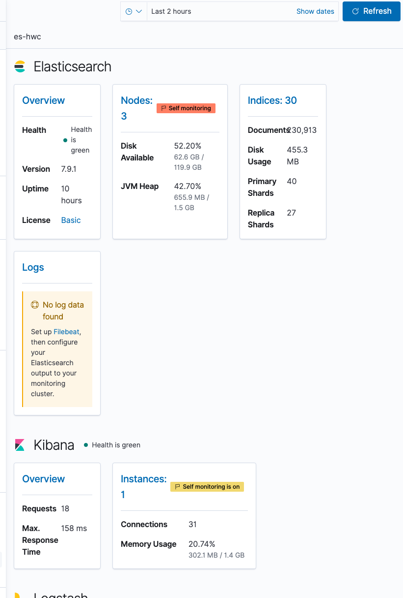

**Overview**

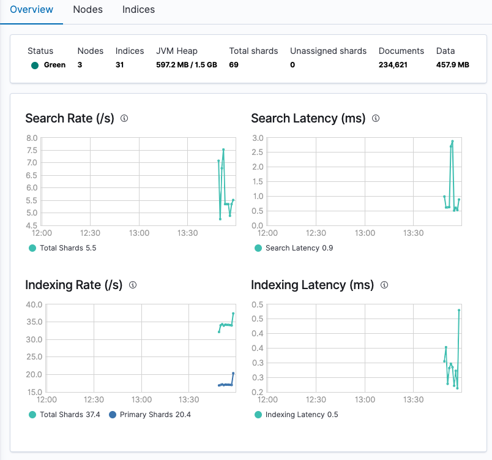

**Nodes**

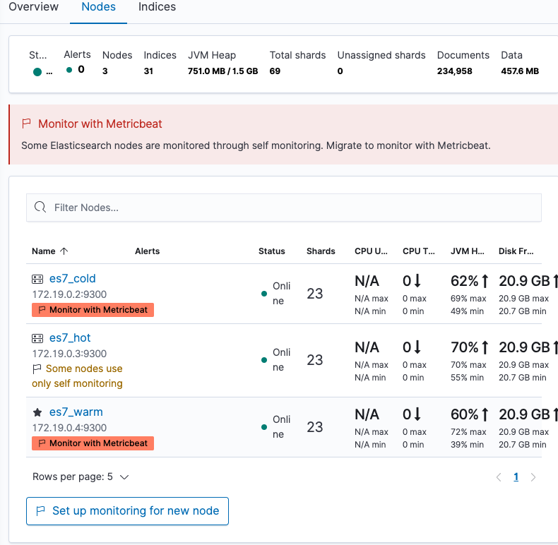

**Docker Metric Dashboard**

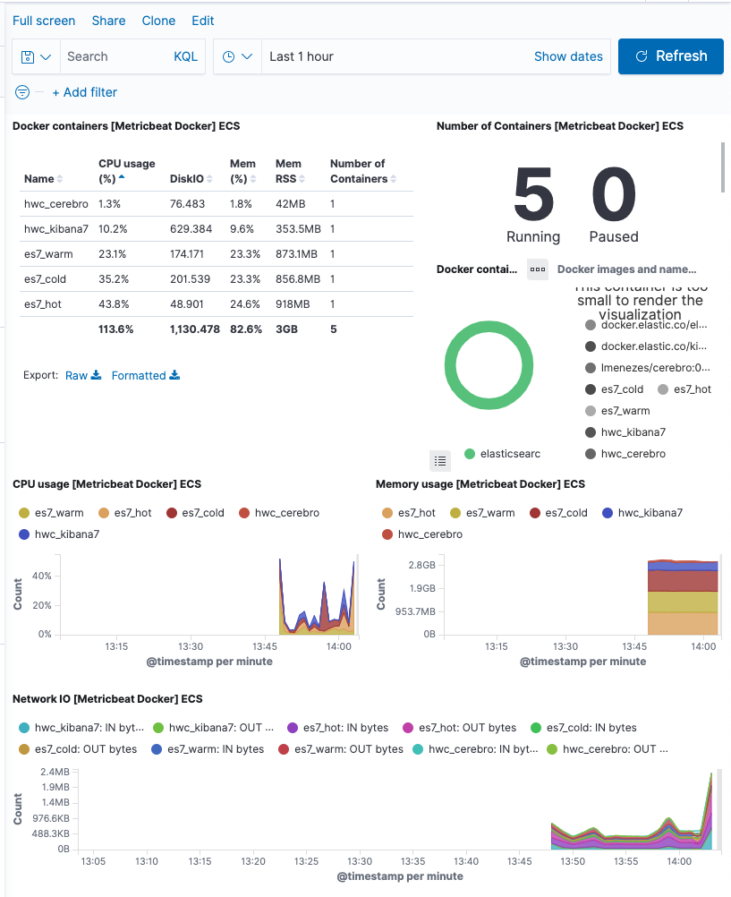

## **3、Packetbeat**

### **3-1 Packetbeat 简介**

* Packetbeat - **实时网络数据分析，监控应用服务器之间的网络流量**
	*  常见抓包工具 - Tcpdump /wireshark
	*  常见抓包配置 - Pcap 基于 libpcap，跨平台 / `Af_packet ` 仅支持 Linux，基于内存映射嗅探，高性 能

* Packetbeat 支持的协议
	* ICMP / DHCP / DNS / HTTP / Cassandra / Mysql / PostgresSQL / Redis / MongoDB / Memcache / TLS

* Network flows:抓取记录网络流量数据，不涉及协议解析

### **3-2 Packetbeat Demo**

* [https://www.elastic.co/guide/en/beats/packetbeat/7.1/packetbeat-getting- started.html](https://www.elastic.co/guide/en/beats/packetbeat/7.1/packetbeat-getting- started.html)
* 安装配置
* 配置 Kibana Dashboard
	* `packetbeat setup --dashboards`
* 运行 Packetbeat
* 查看 Dashboard


```
tar xvzf packetbeat-7.10.1-linux-x86_64.tar.gz
cd packetbeat-7.10.1-linux-x86_64

vim packetbeat.yml

./packetbeat setup --dashboards
Loading dashboards (Kibana must be running and reachable)
Loaded dashboards
```

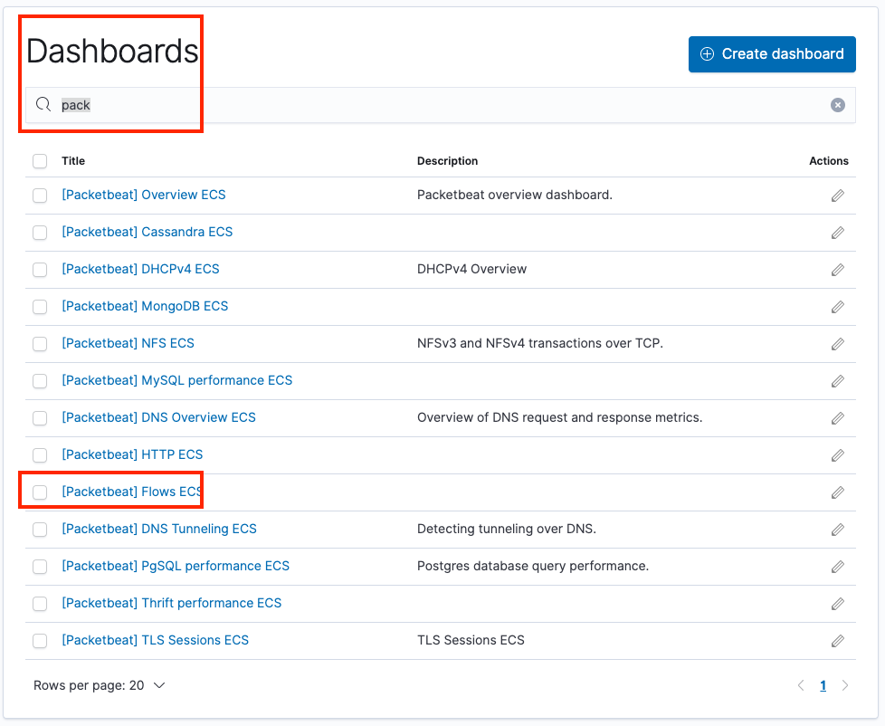

### **3-3 My Packetbeat Experiment**

```
sudo yum install packetbeat
sudo systemctl enable packetbeat

sudo packetbeat setup --dashboards
```


**[Packetbeat] Flows ECS**


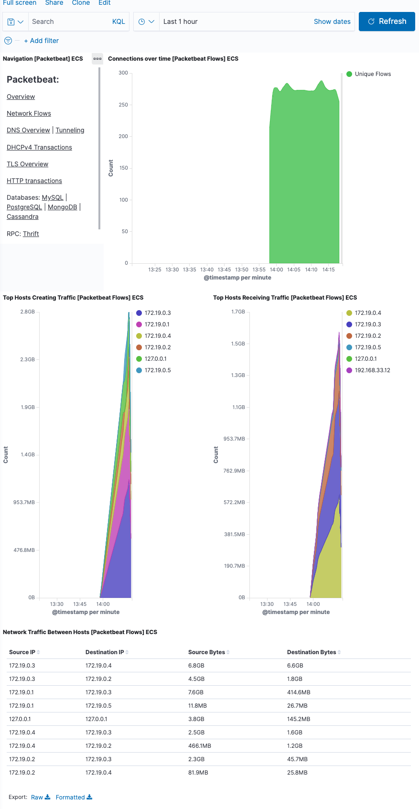