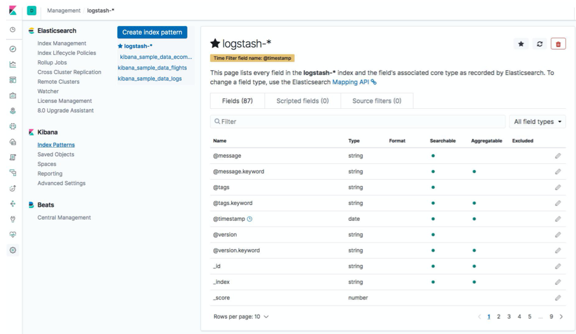
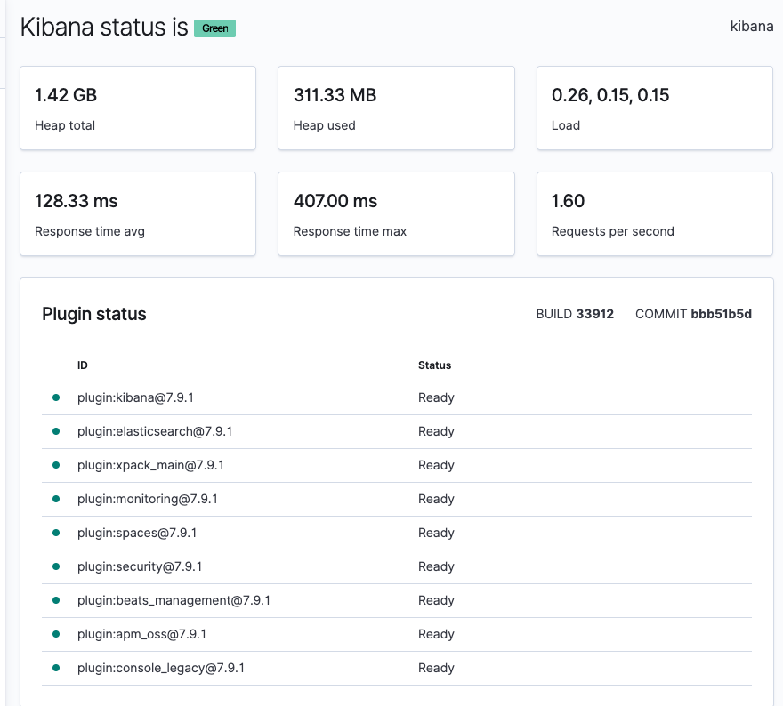
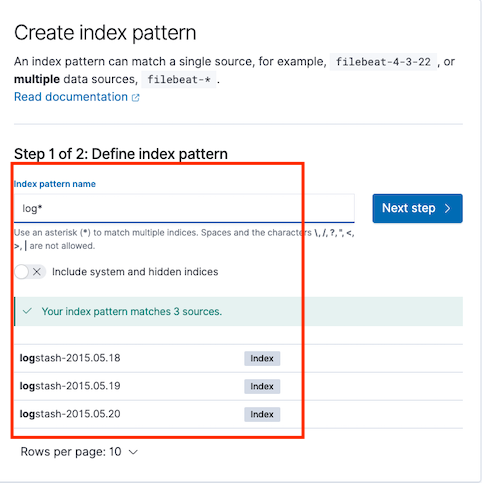
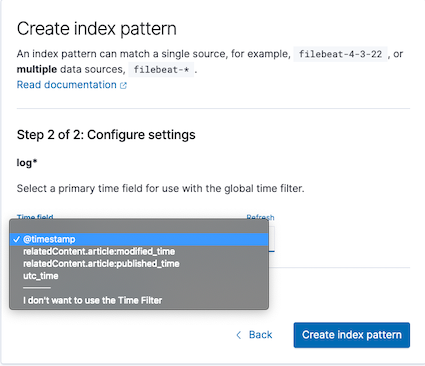
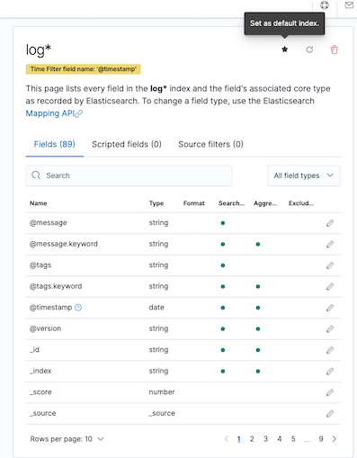
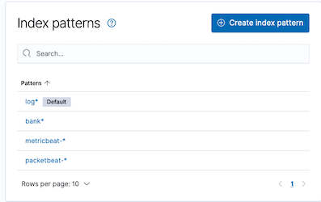
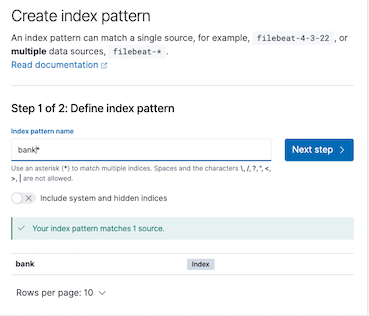
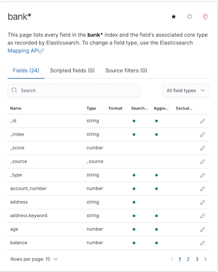

# **第一节 使用 Index Pattern 配置数据**

## **1、Index Pattern**



## **2、Demo**


### **2-1 Management**

* Index Patterns 
* Saved Objects (导出备份)

```
http://192.168.33.12:5601/status
```




```
PUT /logstash-2015.05.18
{
  "mappings": {
    "properties": {
      "geo": {
        "properties": {
          "coordinates": {
            "type": "geo_point"
          }
        }
      }
    }
  }
}


PUT /logstash-2015.05.19
{
  "mappings": {
    "properties": {
      "geo": {
        "properties": {
          "coordinates": {
            "type": "geo_point"
          }
        }
      }
    }
  }
}


PUT /logstash-2015.05.20
{
  "mappings": {
    "properties": {
      "geo": {
        "properties": {
          "coordinates": {
            "type": "geo_point"
          }
        }
      }
    }
  }
}
```

```
wget https://raw.githubusercontent.com/geektime-geekbang/geektime-ELK/master/part-4/13.1-%E4%BD%BF%E7%94%A8IndexPattern%E9%85%8D%E7%BD%AE%E6%95%B0%E6%8D%AE/accounts.json

ls -la

$ ls -lah
total 51M
drwxrwxr-x   2 vagrant vagrant   45 Dec 13 21:07 .
drwx------. 19 vagrant vagrant 4.0K Dec 13 20:55 ..
-rw-rw-r--   1 vagrant vagrant 238K Dec 13 20:55 accounts.json
-rw-rw-r--   1 vagrant vagrant  51M Dec 13 21:07 logs.jsonl
```

```
curl -H 'Content-Type: application/x-ndjson' -XPOST 'localhost:9200/bank/account/_bulk?pretty' --data-binary @accounts.json

curl -H 'Content-Type: application/x-ndjson' -XPOST 'localhost:9200/_bulk?pretty' --data-binary @logs.jsonl
```

```

$ curl -H 'Content-Type: application/x-ndjson' -XPOST 'localhost:9200/_bulk?pretty' --data-binary @logs.jsonl
{
  "error" : {
    "root_cause" : [
      {
        "type" : "es_rejected_execution_exception",
        "reason" : "rejected execution of coordinating operation [coordinating_and_primary_bytes=0, replica_bytes=0, all_bytes=0, coordinating_operation_bytes=54215758, max_coordinating_and_primary_bytes=53687091]"
      }
    ],
    "type" : "es_rejected_execution_exception",
    "reason" : "rejected execution of coordinating operation [coordinating_and_primary_bytes=0, replica_bytes=0, all_bytes=0, coordinating_operation_bytes=54215758, max_coordinating_and_primary_bytes=53687091]"
  },
  "status" : 429
}
```

### **2-2 Created Index Pattern (Save As default Pattern)**

* Fields:Type，Searchable/Aggregation / Format(Number / Image)
* Script Fields

```
http://192.168.33.12:9200/_cat/indices?v
...
green  open bank jWdzaovdQ92o74GE8wu90w 1 1  1000  0 811.9kb 429.6kb
green  open logstash-2015.05.18                 jxaEDe-IRDi7TrNOnTy58g 1 1  2000  0  17.3mb   8.8mb
green  open logstash-2015.05.19                 iJ9DNC14QwukRkCuIWTCoA 1 1  1500  0  12.9mb   6.2mb
green  open logstash-2015.05.20                 i29NGn-4Q1ihdQ-BOr-4fA 1 1  1500  0  13.1mb   6.7mb

```

### **2-3 Create `log*` index**




**Timefield => @timestamp**




**fields**





### **2-4 Create `bank` index**





## **3、Q&A**

A: Index Pattern 是什么？和 Index Template 有什么区别和联系？

* index pattern是在kibana中使用时只需要的一个概念。
* template则是通过一系列规则创建索引的mapping
