# **第二节 Kibana 使用的技巧**

## **1、使用Kibana Discover探索数据**

### **1-1 设置时间过滤器**

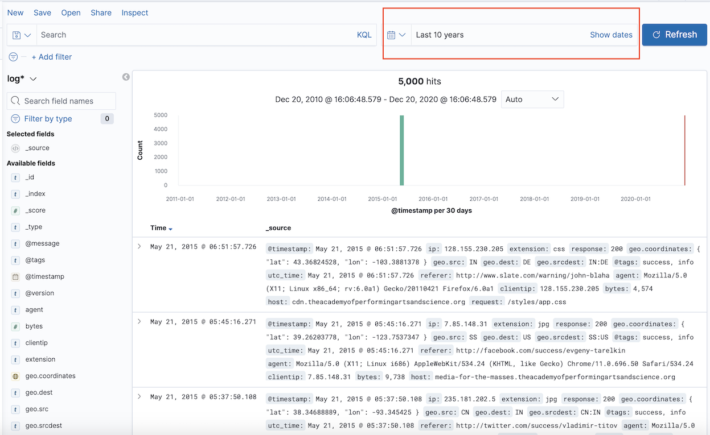

### **1-2 写入条件进行过滤**

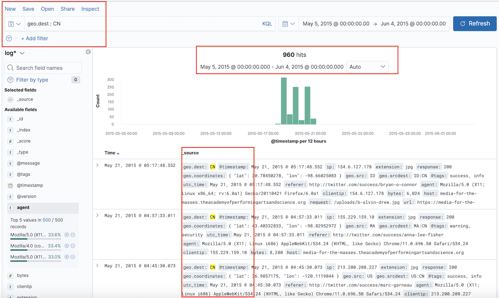

* `geo.dest : CN`

### **1-3 根据字段过滤**

**Add filter**

* @timestamp
* bytes
* memory

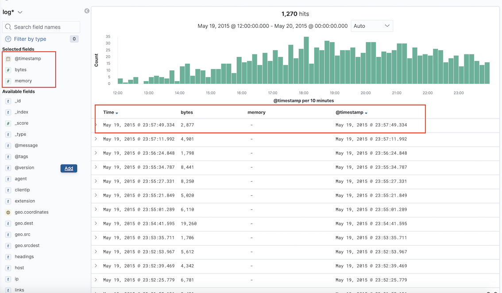

### **1-4 查看字段数据统计**

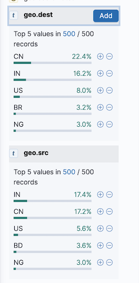

### **1-5 文档上下文**

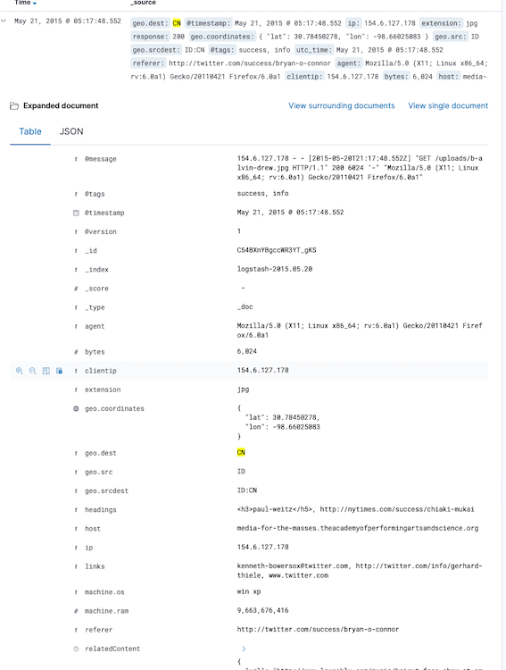


## **2、基本可视化组件介绍**

### **2-1 账户存款 Pie Chart (Inspector)**

**1、Check back index data** 

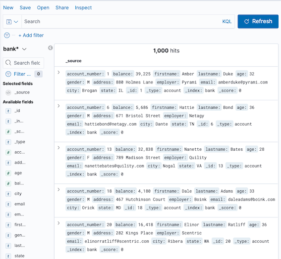

**2、Create `Pie Chart` New Visualization** 


**3、Balance Aggregation**

* Metrics: **Count**
* **Buckets: Split slices**
	*  Aggregation: **Histogram**
	*  Field: **balance**
	*  Minimum Interval: **5000**

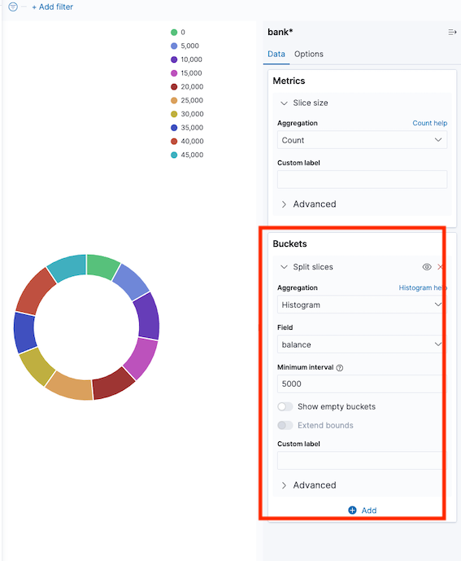


**4、Add sub Aggregation: gender**

Sub Aggregation:

* Term (gender is type term in es)
* Field: **gender.keyword**
* **Size: 5**

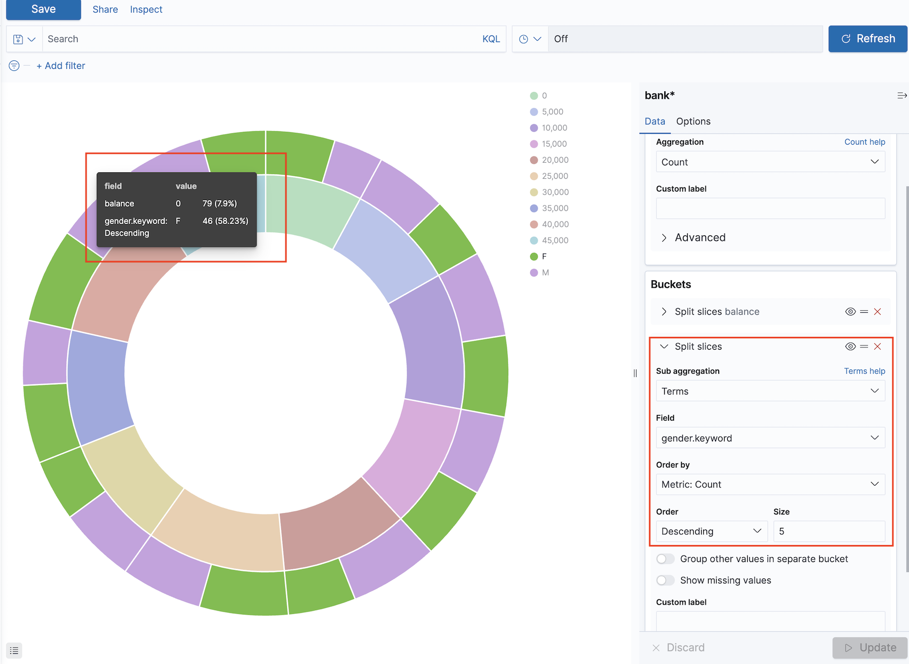


**5、Add another sub Aggregation: age**

Sub Aggregation:

* Term (age is type term in es)
* Field: **age**
* **Size: 3**

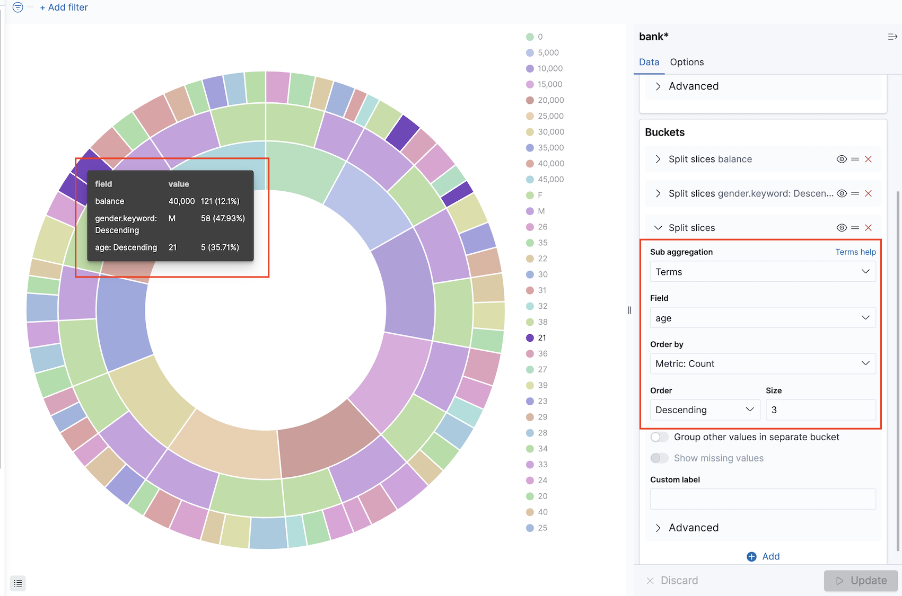

**6、Adjust buckets order**

**balance -> age -> gender**

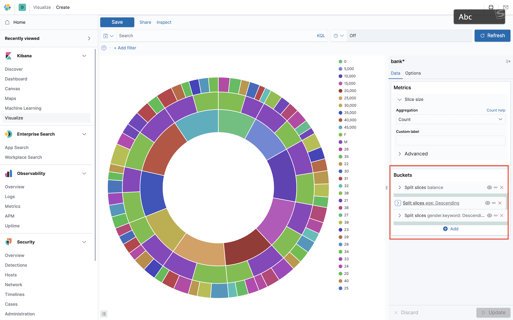

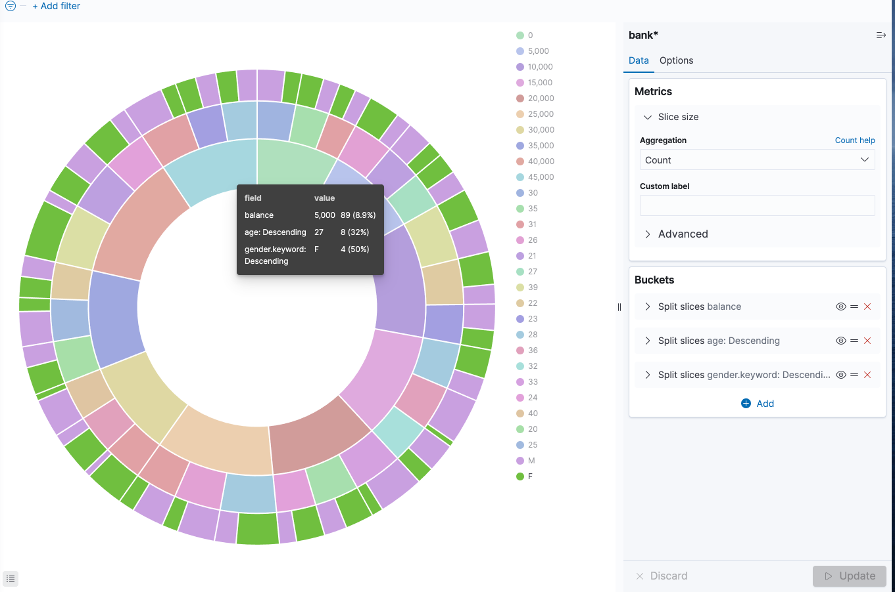

**7、Inpect Visualization**

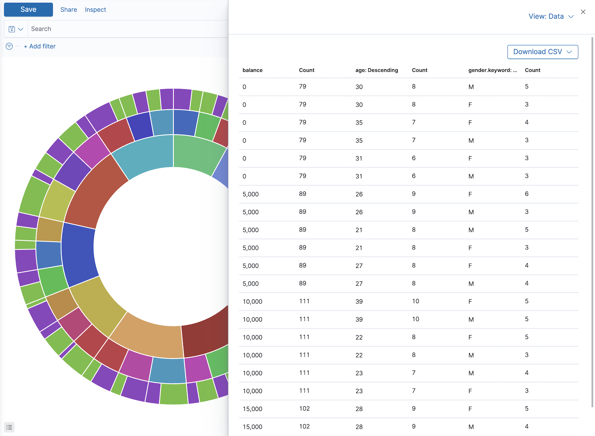

**8、Inpect request**

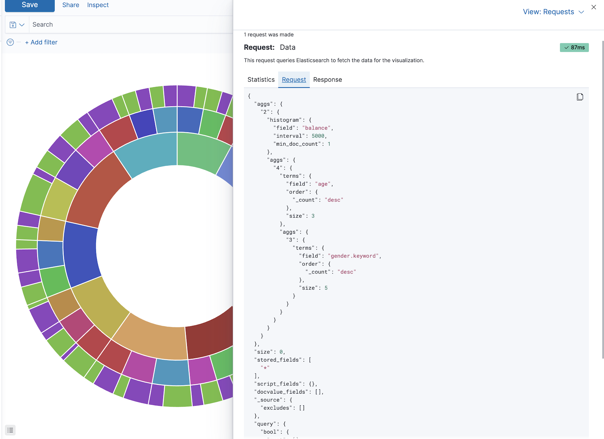

```
{
  "aggs": {
    "2": {
      "histogram": {
        "field": "balance",
        "interval": 5000,
        "min_doc_count": 1
      },
      "aggs": {
        "4": {
          "terms": {
            "field": "age",
            "order": {
              "_count": "desc"
            },
            "size": 3
          },
          "aggs": {
            "3": {
              "terms": {
                "field": "gender.keyword",
                "order": {
                  "_count": "desc"
                },
                "size": 5
              }
            }
          }
        }
      }
    }
  },
  "size": 0,
  "stored_fields": [
    "*"
  ],
  "script_fields": {},
  "docvalue_fields": [],
  "_source": {
    "excludes": []
  },
  "query": {
    "bool": {
      "must": [],
      "filter": [
        {
          "match_all": {}
        }
      ],
      "should": [],
      "must_not": []
    }
  }
}
```

**9、Save Visualization**

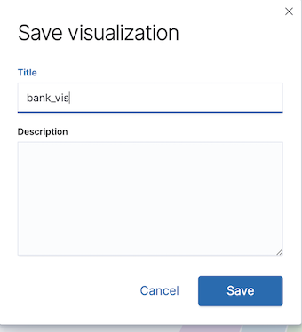

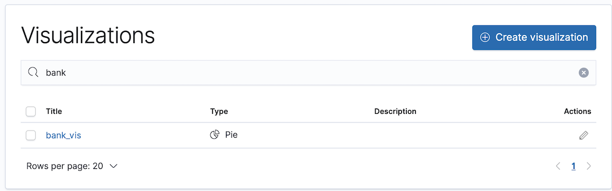

### **2-2 日志相关**

* **Area Chart** (X 轴 Y 轴， 顺序，etc)
* Bar Chart

**1、Create Area Chart for logstash**

* Y Axis Aggregation: **Date Histogram**
* **Minimum Inrterval: Auto**

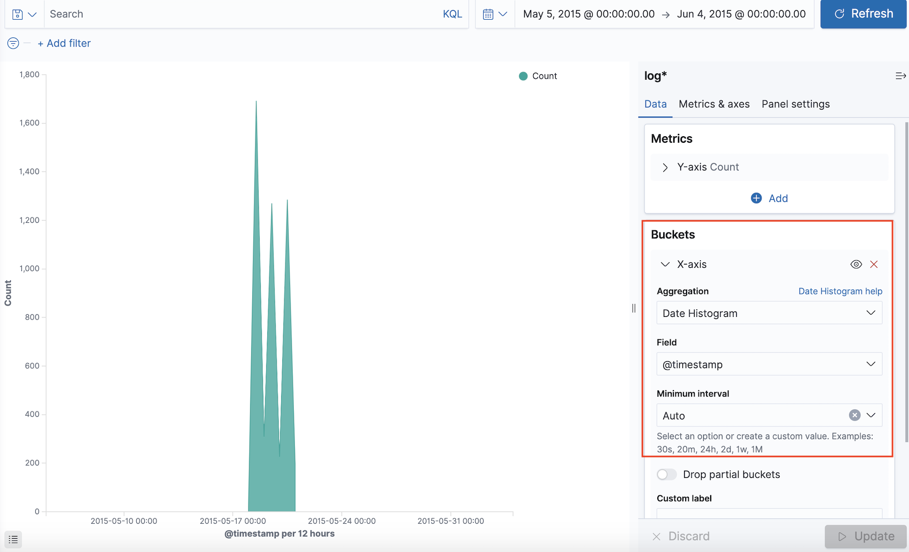

**2、Split series**

* terms
* geo.src.keywords
* 5

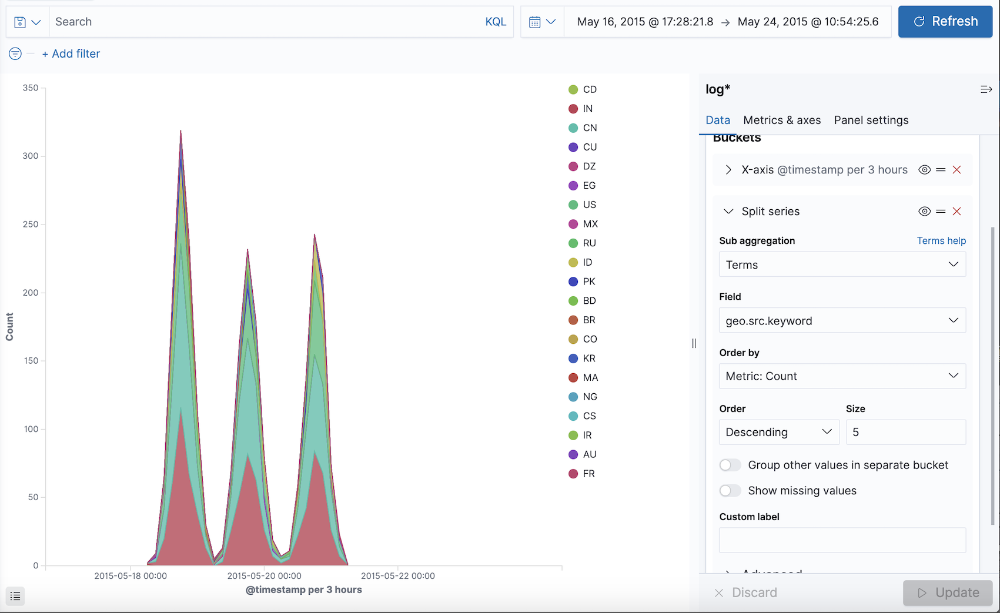

```
{
  "aggs": {
    "2": {
      "date_histogram": {
        "field": "@timestamp",
        "fixed_interval": "3h",
        "time_zone": "Asia/Shanghai",
        "min_doc_count": 1
      },
      "aggs": {
        "3": {
          "terms": {
            "field": "geo.src.keyword",
            "order": {
              "_count": "desc"
            },
            "size": 5
          }
        }
      }
    }
  },
  "size": 0,
  "stored_fields": [
    "*"
  ],
  "script_fields": {},
  "docvalue_fields": [
    {
      "field": "@timestamp",
      "format": "date_time"
    },
    {
      "field": "relatedContent.article:modified_time",
      "format": "date_time"
    },
    {
      "field": "relatedContent.article:published_time",
      "format": "date_time"
    },
    {
      "field": "utc_time",
      "format": "date_time"
    }
  ],
  "_source": {
    "excludes": []
  },
  "query": {
    "bool": {
      "must": [],
      "filter": [
        {
          "match_all": {}
        },
        {
          "range": {
            "@timestamp": {
              "gte": "2015-05-16T09:28:21.808Z",
              "lte": "2015-05-24T02:54:25.665Z",
              "format": "strict_date_optional_time"
            }
          }
        }
      ],
      "should": [],
      "must_not": []
    }
  }
}
```

**3、Adjust order： Split series -> @timestamp**

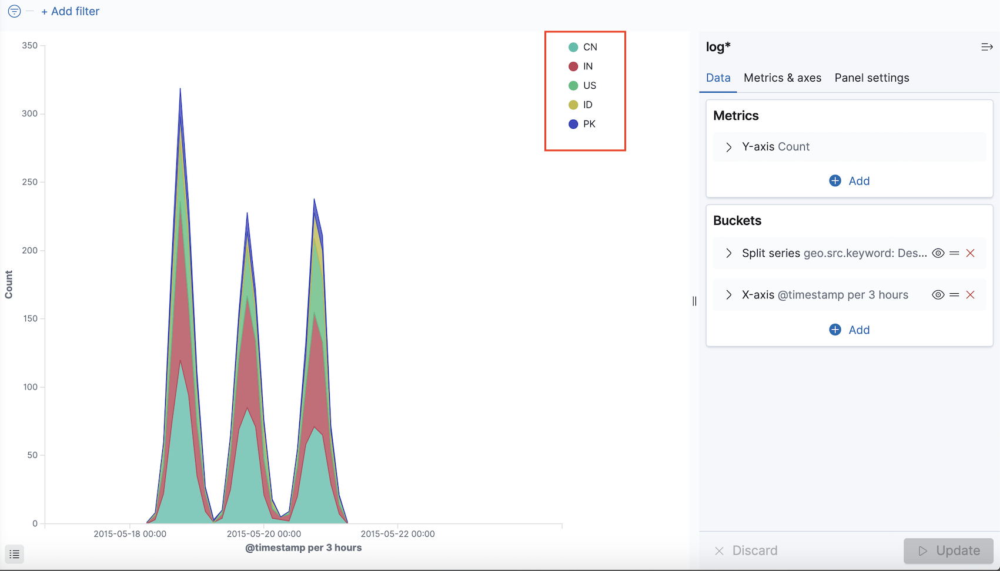

**4、Split chart**

* terms
* geo.src.keywords
* 5

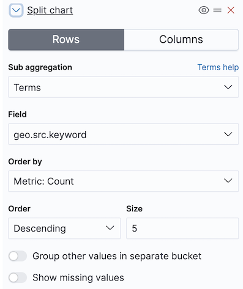

* Disable: Split series
* **Adjust Order:  Split chart -> @timestamp**

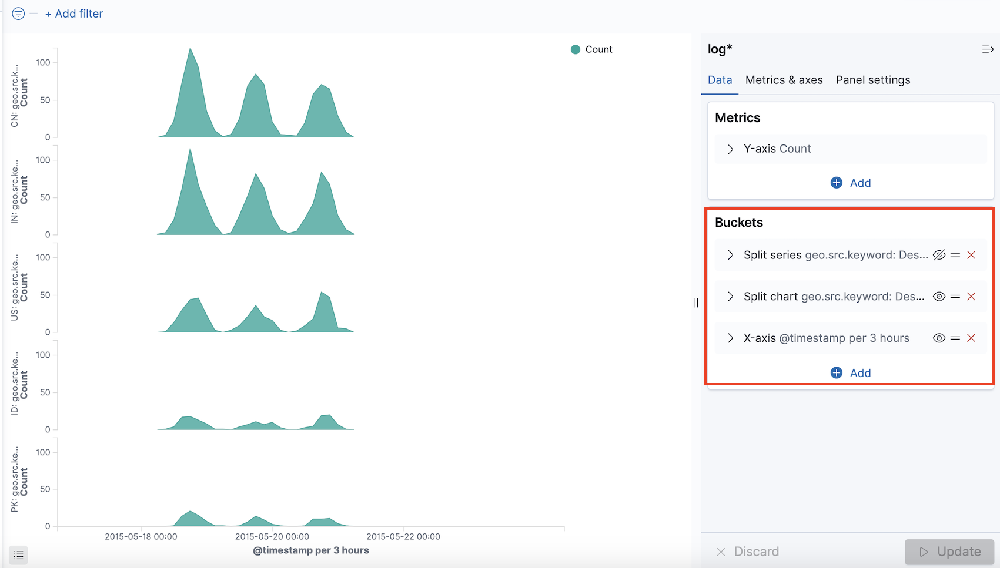

**5、Change chart type**

**Change Area -> line**

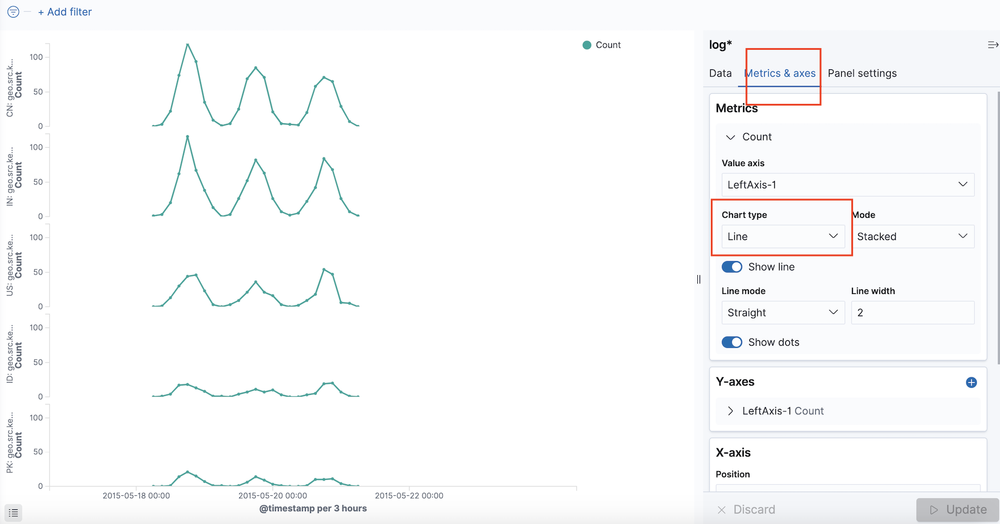

## **3、构建Dashboard**

### **3-1 创建仪表盘**

**Add `back_vis` as dashboard**

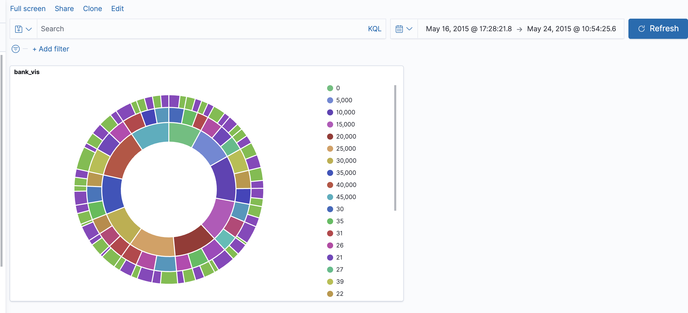

### **3-2 Check Provisioned Web Traffic Dashboard**

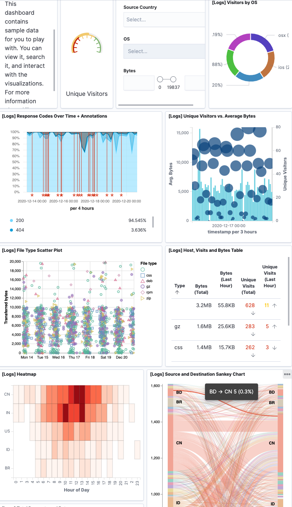

