# **第一节 用Monitoring和Alerting监控Elasticsearch集群**

## **1、X-Pack Monitoring**

* X-Pack 提供了免费集群监控的功能
*  使用 Elasticsearch 监控 Elasticsearch
	*   `Xpack.monitoring.collection.interval` 默认设置 10 秒
* 在生产环境中，**建议搭建 dedicated 集群用于 ES 集群的监控**。有以下几个好处
	* 减少负载和数据
	* 当被监控集群出现问题，还能看到监控相关的数据

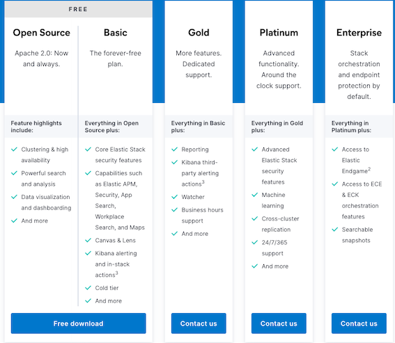

[https://www.elastic.co/subscriptions](https://www.elastic.co/subscriptions)

## **2、配置 Monitoring**

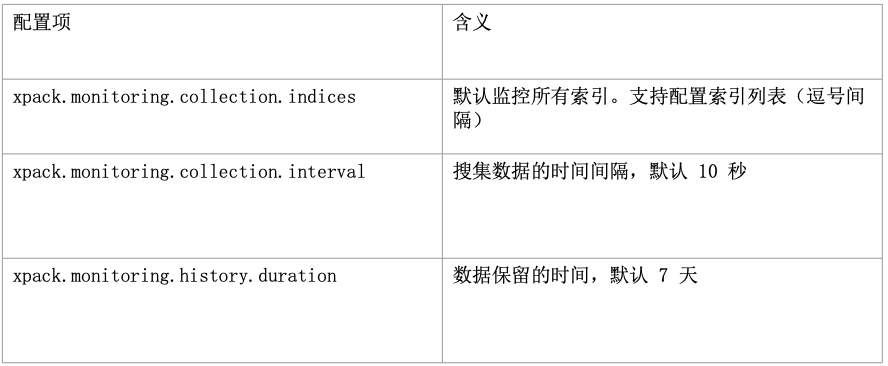

[https://www.elastic.co/guide/en/x-pack/current/xpack-settings.html](https://www.elastic.co/guide/en/x-pack/current/xpack-settings.html)

### **2-1 Enable `elasticsearch-xpack`**

```
metricbeat modules enable elasticsearch-xpack
Enabled elasticsearch-xpack
```

### **2-2 Management Monitoring -> Overview**

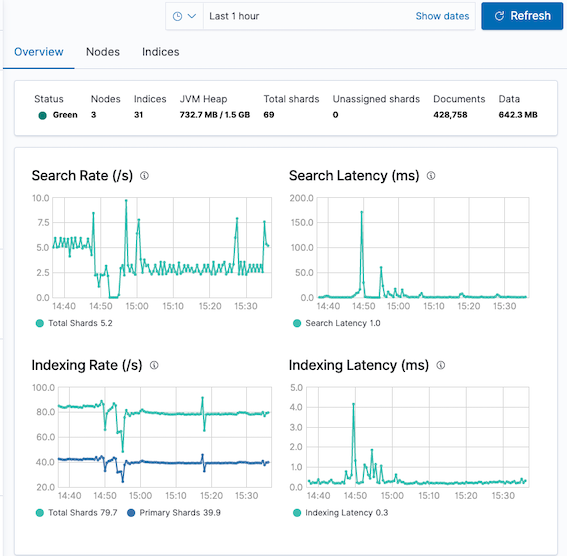

### **2-2 Management Monitoring -> Nodes**

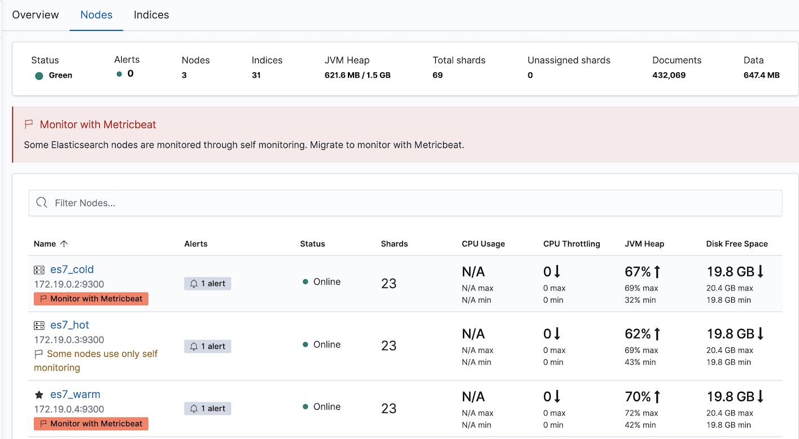

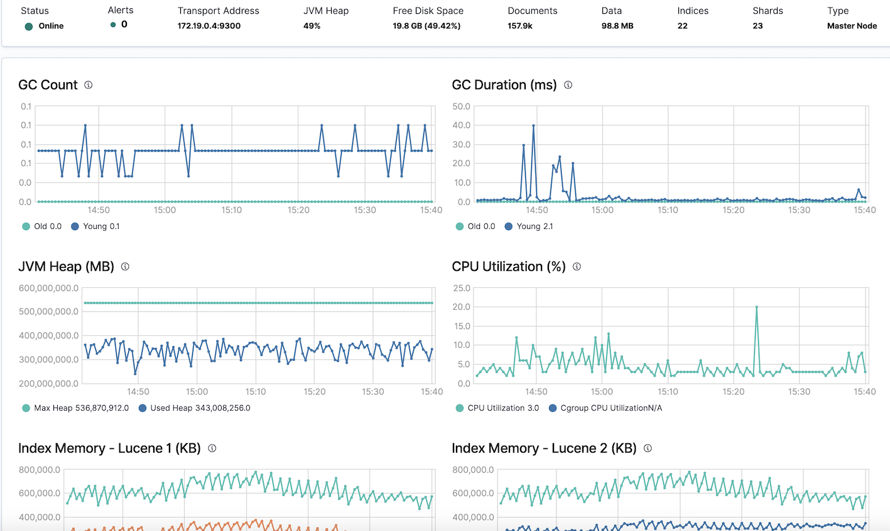


### **2-3 Management Monitoring -> Indices**

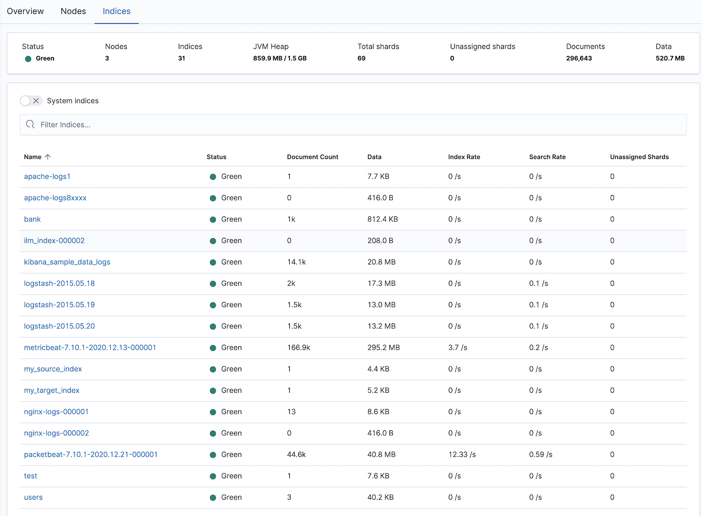

## **3、Alerts and Actions**

### **3-1 Enable Alerts and Actions**

**Stack Management -> Alerts and Actions**

```
$ docker ps | grep kibana
c874705b1ef6   docker.elastic.co/kibana/kibana:7.9.1                 "/usr/local/bin/dumb…"   3 weeks ago   Up 7 days   0.0.0.0:5601->5601/tcp             hwc_kibana7

docker exec -it c874705b1ef6 bash 
cd config/
vi kibana.yml


xpack.encryptedSavedObjects.encryptionKey: "EePXCifCaykPORwjqKGbINHCPFYnNXZT"

docker restart c874705b1ef6
```

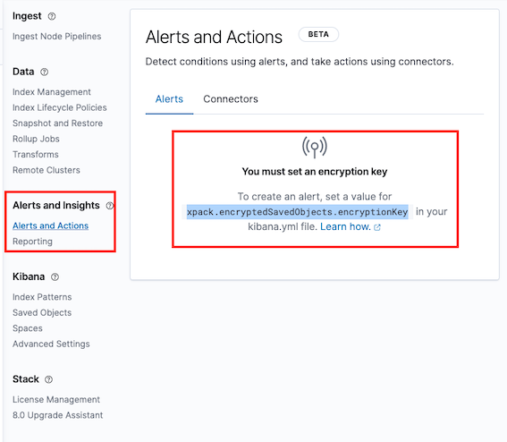

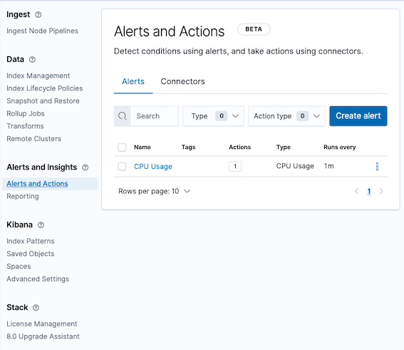

### **3-2 Create Alerts**

* Name: **Mytestalert**
* Index threshold: 
	* index: `.monitoring-es-7-...`
	* conditon
* Actions: 
	* Log

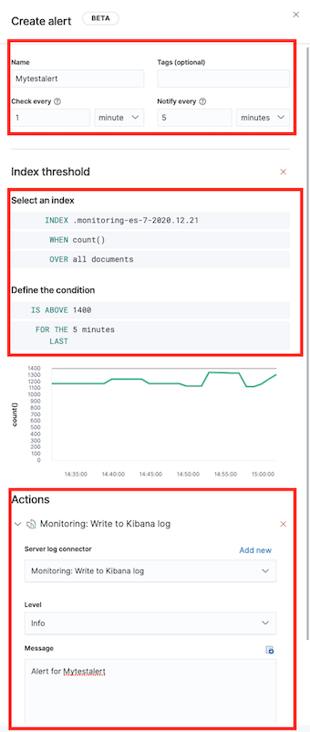

### **3-3 Default CPU Alerts**

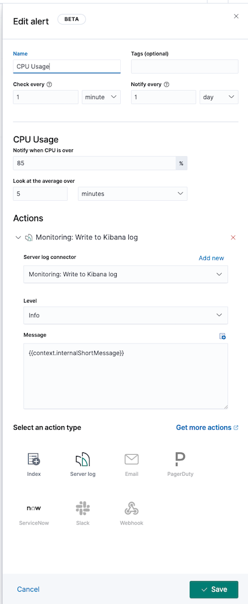

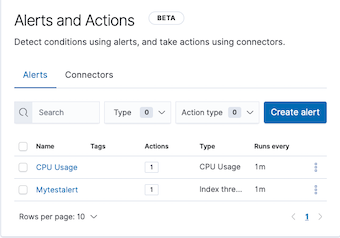