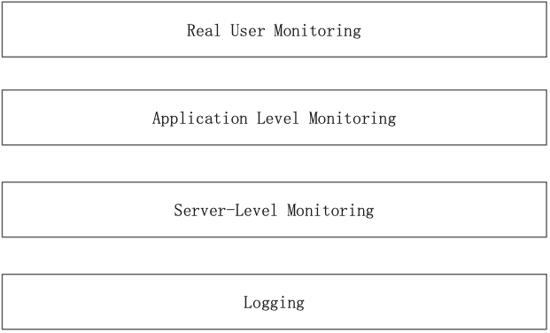
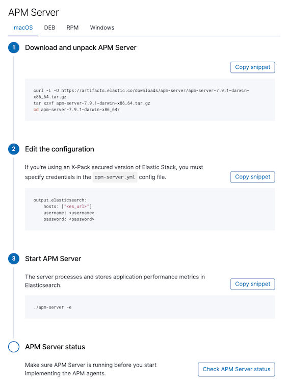
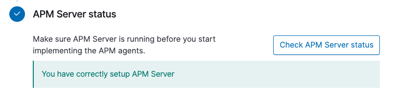
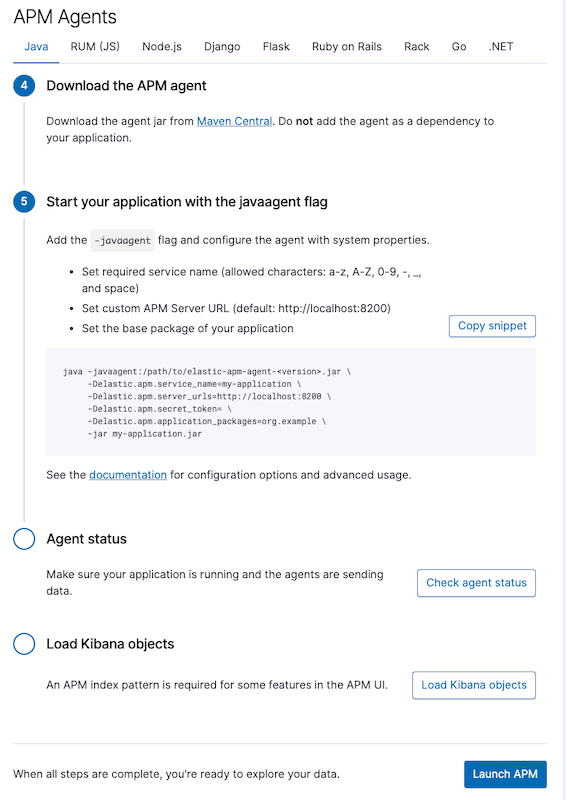
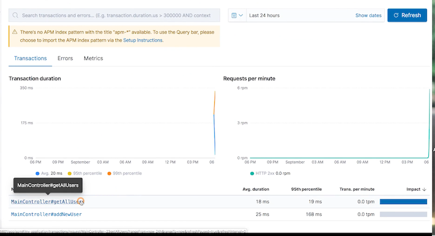
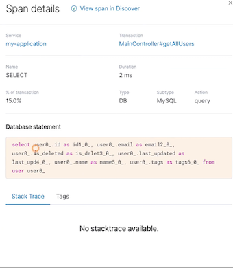

# **第二节 用 APM 进行程序性能监控**

## **1、Elastic 全栈监控**




## **2、核心应用指标**

* 请求响应时间
* 未处理的错误及异常 
* 可视化调用关系
* 发现性能瓶颈
* 代码下钻

## **3、APM 安装**

[https://www.elastic.co/apm](https://www.elastic.co/apm)


[https://www.elastic.co/downloads](https://www.elastic.co/downloads)

```
wget https://artifacts.elastic.co/downloads/apm-server/apm-server-7.9.1-linux-x86_64.tar.gz

tar xvf apm-server-7.9.1-linux-x86_64.tar.gz
```

```
sudo vim /etc/yum.repos.d/elastic.repo

[elastic-7.x]
name=Elastic repository for 7.x packages
baseurl=https://artifacts.elastic.co/packages/7.x/yum
gpgcheck=1
gpgkey=https://artifacts.elastic.co/GPG-KEY-elasticsearch
enabled=1
autorefresh=1
type=rpm-md

sudo yum install apm-server
sudo systemctl start apm-server

$ sudo systemctl status apm-server
● apm-server.service - Elastic APM Server
   Loaded: loaded (/usr/lib/systemd/system/apm-server.service; disabled; vendor preset: disabled)
   Active: active (running) since Mon 2020-12-21 09:41:07 UTC; 2s ago
     Docs: https://www.elastic.co/solutions/apm
 Main PID: 54731 (apm-server)
    Tasks: 6
   Memory: 98.1M
   CGroup: /system.slice/apm-server.service
           └─54731 /usr/share/apm-server/bin/apm-server --environment systemd -c /etc/apm-server/apm-server.yml --path.home /usr/share/apm-server --p...

Dec 21 09:41:08 elasticsearch7 apm-server[54731]: 2020-12-21T09:41:08.630Z        INFO        [esclientleg]        eslegclient/connection.go:...on 7.9.1
Dec 21 09:41:08 elasticsearch7 apm-server[54731]: 2020-12-21T09:41:08.729Z        INFO        [index-management]        idxmgmt/manager.go:84...isabled.
Dec 21 09:41:08 elasticsearch7 apm-server[54731]: 2020-12-21T09:41:08.729Z        INFO        [index-management]        idxmgmt/manager.go:20...sion]}'.
Dec 21 09:41:08 elasticsearch7 apm-server[54731]: 2020-12-21T09:41:08.729Z        INFO        [index-management]        idxmgmt/manager.go:20...ion]}*'.
Dec 21 09:41:08 elasticsearch7 apm-server[54731]: 2020-12-21T09:41:08.860Z        INFO        template/load.go:117        Try loading templat...icsearch
Dec 21 09:41:09 elasticsearch7 apm-server[54731]: 2020-12-21T09:41:09.350Z        INFO        template/load.go:109        template with name ... loaded.
Dec 21 09:41:09 elasticsearch7 apm-server[54731]: 2020-12-21T09:41:09.350Z        INFO        [index-management]        idxmgmt/manager.go:21...emplate.
Dec 21 09:41:09 elasticsearch7 apm-server[54731]: 2020-12-21T09:41:09.366Z        INFO        [index-management.ilm]        ilm/std.go:139   ...te=false
Dec 21 09:41:09 elasticsearch7 apm-server[54731]: 2020-12-21T09:41:09.366Z        INFO        [index-management]        idxmgmt/manager.go:24... loaded.
Dec 21 09:41:09 elasticsearch7 apm-server[54731]: 2020-12-21T09:41:09.382Z        INFO        template/load.go:117        Try loading templat...icsearch
Hint: Some lines were ellipsized, use -l to show in full.
```

## **3、APM 设置**

### **3-1 APM server**



**Check APM server status**



### **3-1 APM Agent**



**Exp: Java**

```
java -javaagent:/path/to/elastic-apm-agent-<version>.jar \
     -Delastic.apm.service_name=my-application \
     -Delastic.apm.server_urls=http://localhost:8200 \
     -Delastic.apm.secret_token= \
     -Delastic.apm.application_packages=org.example \
     -jar my-application.jar
```

## **4、APM 展示**

### **4-1 Transaction**




