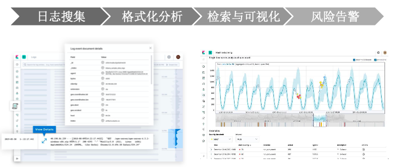
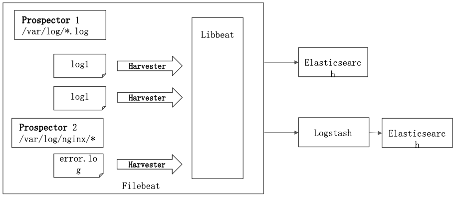
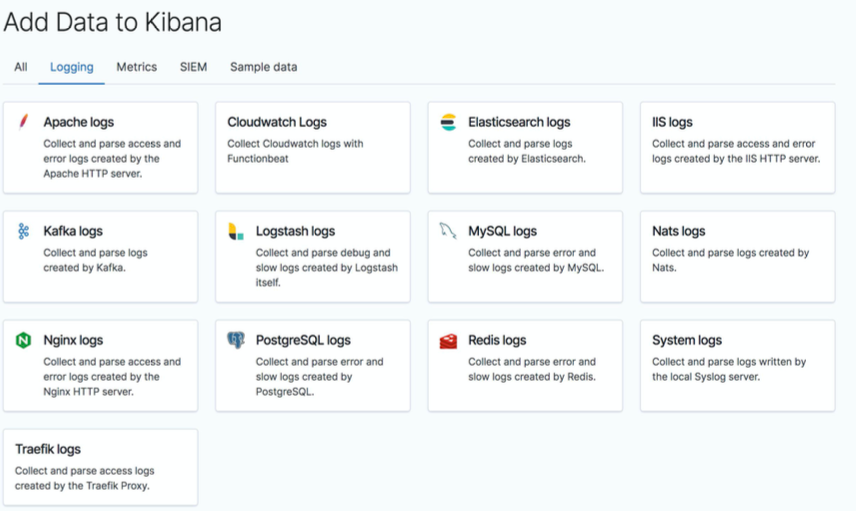
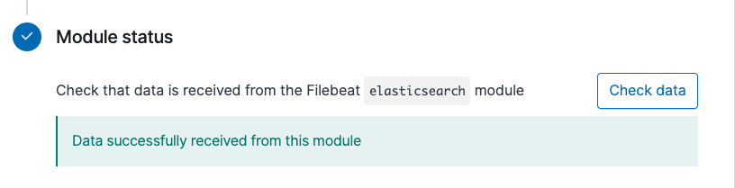
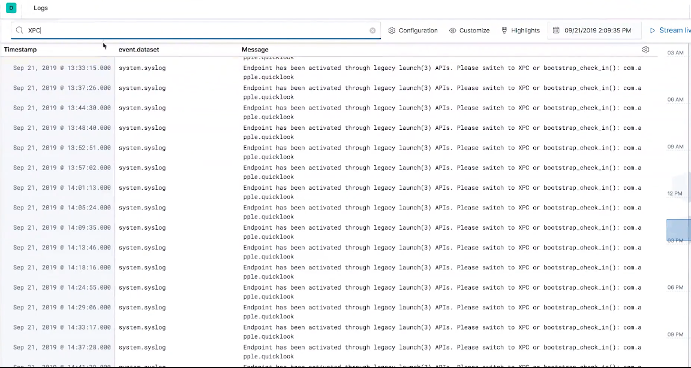

# **第四节 用 Elastic Stack 进行日志管理**

## **1、日志的重要性**

* 为什么重要
	* 运维:医生给病人看病。日志就是病人对自己的陈述
	* 恶意攻击，恶意注册，刷单，恶意密码猜测
* 挑战
	*  关注点很多，任何一个点都有可能引起问题
	*  日志分散在很多机器，出了问题时，才发现日志被删了
	*  很多运维人员是消防员，哪里有问题去哪里


## **2、集中化日志管理**



## **3、Filebeat 简介**

### **3-1 简介**

* A log data shipper for local files
* 读取日志文件，Filebeat 不做数据的解析，加工处理
	* 日志是非结构化数据
	*  需要进行处理后，以结构化的方式保存到 Elasticsearch
* 保证数据至少被读取一次
* 处理多行数据，解析 JSON 格式 ，简单的过滤



## **4、Filebeat 执行流程**

* 定义数据采集: `Prospector` 配置。通过 `filebeat.yml`
* 建立数据模型: `Index Template`
* 建立数据处理流程:	`Ingest Pipeline`
* 存储并提供可视化分析:ES + Kibana Dashboard


## **5、Modules 开箱即用**

### **5-1 大量开箱即用的日志模块**

* 简化使用流程
* 减少开发的投入
* 最佳参考实践

### **5-2 一些命令**

* `./filebeat modules list`
* `./filebeat modules enable nginx`



## **6、Demo**

* `filebeat modules list`
* `filebeat modules enable system `
* Module 和 module.d 目录
* `filebeat export template`
* `filebeat setup --dashboards `
* `./filebeat -e`

### install Option 1

```
sudo rpm --import https://packages.elastic.co/GPG-KEY-elasticsearch
```
```
[elastic-7.x]
name=Elastic repository for 7.x packages
baseurl=https://artifacts.elastic.co/packages/7.x/yum
gpgcheck=1
gpgkey=https://artifacts.elastic.co/GPG-KEY-elasticsearch
enabled=1
autorefresh=1
type=rpm-md
```

```
sudo yum install filebeat

sudo systemctl enable filebeat

sudo systemctl start filebeat

$ sudo systemctl status filebeat
● filebeat.service - Filebeat sends log files to Logstash or directly to Elasticsearch.
   Loaded: loaded (/usr/lib/systemd/system/filebeat.service; enabled; vendor preset: disabled)
   Active: active (running) since Tue 2020-12-22 14:18:27 UTC; 23s ago
     Docs: https://www.elastic.co/products/beats/filebeat
 Main PID: 135013 (filebeat)
    Tasks: 6
   Memory: 83.2M
   CGroup: /system.slice/filebeat.service
           └─135013 /usr/share/filebeat/bin/filebeat --environment systemd -c /etc/filebeat/filebeat.yml --path.home /usr/share/filebeat --path.confi...

Dec 22 14:18:28 elasticsearch7 filebeat[135013]: 2020-12-22T14:18:28.043Z        INFO        instance/beat.go:455        filebeat start running.
Dec 22 14:18:28 elasticsearch7 filebeat[135013]: 2020-12-22T14:18:28.055Z        INFO        [monitoring]        log/log.go:118        Starti...very 30s
Dec 22 14:18:28 elasticsearch7 filebeat[135013]: 2020-12-22T14:18:28.058Z        INFO        memlog/store.go:119        Loading data file of ...ion id=0
Dec 22 14:18:28 elasticsearch7 filebeat[135013]: 2020-12-22T14:18:28.058Z        INFO        memlog/store.go:124        Finished loading tran...ion id=0
Dec 22 14:18:28 elasticsearch7 filebeat[135013]: 2020-12-22T14:18:28.058Z        INFO        [registrar]        registrar/registrar.go:109   ...strar: 0
Dec 22 14:18:28 elasticsearch7 filebeat[135013]: 2020-12-22T14:18:28.058Z        INFO        [crawler]        beater/crawler.go:71        Loa...nputs: 2
Dec 22 14:18:28 elasticsearch7 filebeat[135013]: 2020-12-22T14:18:28.058Z        INFO        [crawler]        beater/crawler.go:108        Lo...nputs: 0
Dec 22 14:18:28 elasticsearch7 filebeat[135013]: 2020-12-22T14:18:28.059Z        INFO        cfgfile/reload.go:164        Config reloader started
Dec 22 14:18:28 elasticsearch7 filebeat[135013]: 2020-12-22T14:18:28.059Z        INFO        cfgfile/reload.go:224        Loading of config f...mpleted.
Dec 22 14:18:30 elasticsearch7 filebeat[135013]: 2020-12-22T14:18:30.971Z        INFO        [add_cloud_metadata]        add_cloud_metadata/a...etected.
Hint: Some lines were ellipsized, use -l to show in full.
```

```
cd /usr/share/filebeat
$ ls -al
total 8400
drwxr-xr-x   5 root root     122 Dec 22 14:17 .
drwxr-xr-x. 80 root root    4096 Dec 22 14:17 ..
drwxr-xr-x   2 root root      42 Dec 22 14:17 bin
-rw-r--r--   1 root root      41 Dec  4 23:31 .build_hash.txt
drwxr-xr-x   3 root root      15 Dec 22 14:17 kibana
-rw-r--r--   1 root root   13675 Dec  4 22:14 LICENSE.txt
drwxr-xr-x  66 root root    4096 Dec 22 14:17 module
-rw-r--r--   1 root root 8566190 Dec  4 22:16 NOTICE.txt
-rw-r--r--   1 root root     814 Dec  4 23:31 README.md
```

```
sudo filebeat modules enable system
sudo filebeat modules enable elasticsearch
sudo filebeat modules enable nginx


$ sudo filebeat modules list
Enabled:
elasticsearch
nginx
system
```

```
cd usr/share/filebeat/module
```

```
sudo filebeat setup –dashboards
```

### install Option 2 (My Operation Way)

```
curl -L -O https://artifacts.elastic.co/downloads/beats/filebeat/filebeat-7.9.1-linux-x86_64.tar.gz


tar xzvf filebeat-7.9.1-linux-x86_64.tar.gz
```

```
./filebeat modules list
./filebeat modules enable system
./filebeat modules enable elasticsearch
./filebeat modules enable nginx

$ ./filebeat setup –dashboards
Overwriting ILM policy is disabled. Set `setup.ilm.overwrite: true` for enabling.

Index setup finished.
Loading dashboards (Kibana must be running and reachable)
Loaded dashboards
Setting up ML using setup --machine-learning is going to be removed in 8.0.0. Please use the ML app instead.
See more: https://www.elastic.co/guide/en/machine-learning/current/index.html
Loaded machine learning job configurations
Loaded Ingest pipelines
```




```
$ cd modules.d
$ ls
activemq.yml.disabled    coredns.yml.disabled      ibmmq.yml.disabled     microsoft.yml.disabled  okta.yml.disabled        squid.yml.disabled
apache.yml.disabled      crowdstrike.yml.disabled  icinga.yml.disabled    misp.yml.disabled       osquery.yml.disabled     suricata.yml.disabled
auditd.yml.disabled      cylance.yml.disabled      iis.yml.disabled       mongodb.yml.disabled    panw.yml.disabled        system.yml
...
```

```
cat system.yml

$ cat system.yml
# Module: system
# Docs: https://www.elastic.co/guide/en/beats/filebeat/7.9/filebeat-module-system.html

- module: system
  # Syslog
  syslog:
    enabled: true

    # Set custom paths for the log files. If left empty,
    # Filebeat will choose the paths depending on your OS.
    #var.paths:

  # Authorization logs
  auth:
    enabled: true

    # Set custom paths for the log files. If left empty,
    # Filebeat will choose the paths depending on your OS.
    #var.paths:
```

```
cd /module/system/auth/ingest
$ cat pipeline.yml
description: Pipeline for parsing system authorisation/secure logs
processors:
- grok:
    field: message
    ignore_missing: true
    pattern_definitions:
      GREEDYMULTILINE: |-
        (.|
        )*
      TIMESTAMP: (?:%{TIMESTAMP_ISO8601}|%{SYSLOGTIMESTAMP})
    patterns:
    - '%{TIMESTAMP:system.auth.timestamp} %{SYSLOGHOST:host.hostname} %{DATA:process.name}(?:\[%{POSINT:process.pid:long}\])?:
      %{DATA:system.auth.ssh.event} %{DATA:system.auth.ssh.method} for (invalid user
      )?%{DATA:user.name} from %{IPORHOST:source.ip} port %{NUMBER:source.port:long}
      ssh2(: %{GREEDYDATA:system.auth.ssh.signature})?'
    - '%{TIMESTAMP:system.auth.timestamp} %{SYSLOGHOST:host.hostname} %{DATA:process.name}(?:\[%{POSINT:process.pid:long}\])?:
      %{DATA:system.auth.ssh.event} user %{DATA:user.name} from %{IPORHOST:source.ip}'
    - '%{TIMESTAMP:system.auth.timestamp} %{SYSLOGHOST:host.hostname} %{DATA:process.name}(?:\[%{POSINT:process.pid:long}\])?:
      Did not receive identification string from %{IPORHOST:system.auth.ssh.dropped_ip}'
    - '%{TIMESTAMP:system.auth.timestamp} %{SYSLOGHOST:host.hostname} %{DATA:process.name}(?:\[%{POSINT:process.pid:long}\])?:
      \s*%{DATA:user.name} :( %{DATA:system.auth.sudo.error} ;)? TTY=%{DATA:system.auth.sudo.tty}
      ; PWD=%{DATA:system.auth.sudo.pwd} ; USER=%{DATA:system.auth.sudo.user} ; COMMAND=%{GREEDYDATA:system.auth.sudo.command}'
    - '%{TIMESTAMP:system.auth.timestamp} %{SYSLOGHOST:host.hostname} %{DATA:process.name}(?:\[%{POSINT:process.pid:long}\])?:
      new group: name=%{DATA:group.name}, GID=%{NUMBER:group.id}'
    - '%{TIMESTAMP:system.auth.timestamp} %{SYSLOGHOST:host.hostname} %{DATA:process.name}(?:\[%{POSINT:process.pid:long}\])?:
      new user: name=%{DATA:user.name}, UID=%{NUMBER:user.id}, GID=%{NUMBER:group.id},
      home=%{DATA:system.auth.useradd.home}, shell=%{DATA:system.auth.useradd.shell}$'
    - '%{TIMESTAMP:system.auth.timestamp} %{SYSLOGHOST:host.hostname}? %{DATA:process.name}(?:\[%{POSINT:process.pid:long}\])?:
      %{GREEDYMULTILINE:system.auth.message}'
- remove:
    field: message
- rename:
    field: system.auth.message
    target_field: message
    ignore_missing: true
- set:
    field: source.ip
    value: '{{system.auth.ssh.dropped_ip}}'
    ignore_empty_value: true
- date:
    if: ctx.event.timezone == null
    field: system.auth.timestamp
    target_field: '@timestamp'
...
```

```
cd /var/log
sudo chown vagrant:vagrant secure*
sudo chown vagrant:vagrant messages*

./filebeat -e
```

