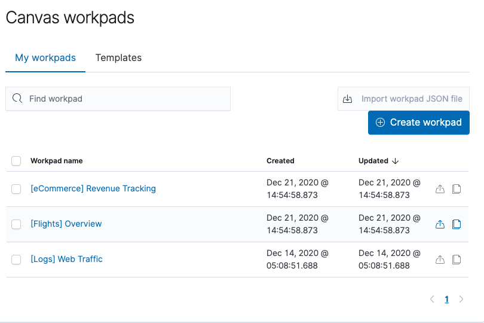

# **第五节 用 Canvas 进行数据的实时展示**

## **1、实时展示数据，并且达到完美像素级要求**

* 用更加酷炫的方式，演绎你的数据	
	* 基于 ES 实现准实时的数据分析
* 更好的想法，更大的屏幕
	* 品牌宣传，会议大屏
* 高度定制化
	* 调色板/CSS/拖放元素

## **2、个性化方式展现你的数据**

* 公司的 Logo
* 符合公司的配色方案以及设计元素 
* Kibana 中免费提供


### **2-1、日志分析**


### **2-2、基础设施监控**


### **2-3、APM**


### **2-4、安全运维**


### **2-5、业务分析**

**[eCommerce] Revenue Tracking**




**[Flights] Overview**


**[Logs] Web Traffic**


## **3、DEMO**

[`elasticcoffee-data.bulk`](../files/elasticcoffee-data.bulk)

```
POST _bulk
{ "index" : { "_index" : "elasticoffee",   "_id" : "1" } }
{"sceneID": "2", "sceneData": "0", "entityID": "zwave.quad2", "quadId": 2, "quadMod": "1", "@timestamp": "2018-02-27T22:26:39Z", "beverageClass": "Hot Beverages", "beverage": "Latte", "beverageSide": "left", "beverageIndex": 5, "quantity": 1}
...
```

```
POST elasticoffee/_search 
{ "size": 0, 
  "aggs": { 
    "by": { 
      "terms": { 
        "field": "beverage.keyword", 
        "size": 10 
        } 
      } 
  } 
}
```

**Output:**

```
{
  "took" : 127,
  "timed_out" : false,
  "_shards" : {
    "total" : 1,
    "successful" : 1,
    "skipped" : 0,
    "failed" : 0
  },
  "hits" : {
    "total" : {
      "value" : 1368,
      "relation" : "eq"
    },
    "max_score" : null,
    "hits" : [ ]
  },
  "aggregations" : {
    "by" : {
      "doc_count_error_upper_bound" : 0,
      "sum_other_doc_count" : 0,
      "buckets" : [
        {
          "key" : "Latte",
          "doc_count" : 322
        },
        {
          "key" : "Other",
          "doc_count" : 253
        },
        {
          "key" : "Cappuccino",
          "doc_count" : 238
        },
        {
          "key" : "Mocha",
          "doc_count" : 176
        },
        {
          "key" : "Espresso",
          "doc_count" : 175
        },
        {
          "key" : "Macchiato",
          "doc_count" : 85
        },
        {
          "key" : "Americano",
          "doc_count" : 61
        },
        {
          "key" : "Coffee",
          "doc_count" : 58
        }
      ]
    }
  }
}
```

**Import workpad JSON file for CANVAS dashboard**

[`canvas-workpad-CafeCanvas.json`](../files/canvas-workpad-CafeCanvas.json)


