# **第一节  电影搜索服务**

## **1、需求分析及架构设计**

### **1-1 需求分析**

* **IMDB:Movie DB**
	* 搜索框，支持输入提示
	* 过滤器过滤结果，支持排序
	* 搜索结果的相关性排序

### **1-2 搜素类应用前端通用布局**

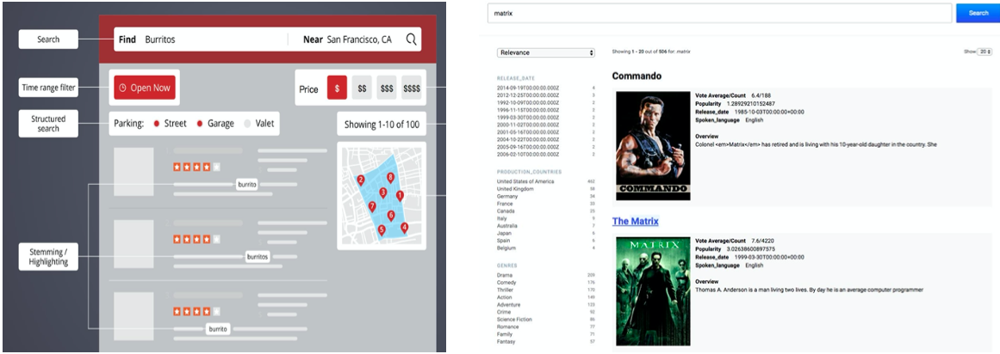

### **1-3 后端通用需求**

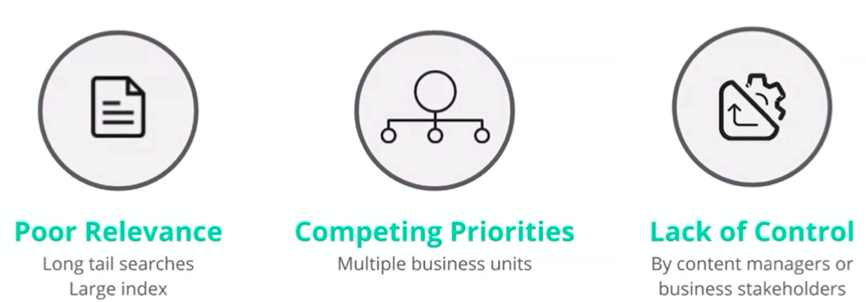


### **1-4 后端 UI**

*  自定义同义词(Matrix = 黑客帝国 = 矩阵革命)
*  获取用户搜索统计数据
*  调整字段的相关性权重

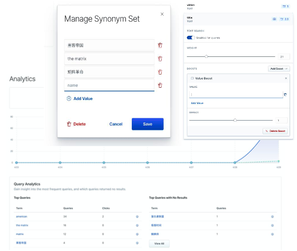

### **1-5 Elastic App Search 介绍**

[https://www.elastic.co/app-search/](https://www.elastic.co/app-search/)


### **1-6 架构**

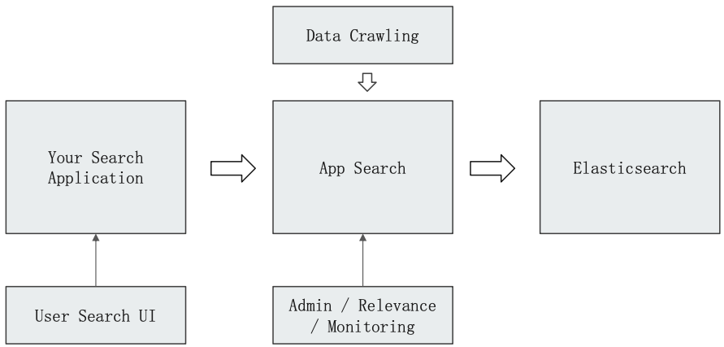

### **1-7 安装与配置 Demo**

**DEMO 中，使用 AppSearch 7.3.1 和 Elasticsearch 7.3.1**

**Elasticsearch 7.3.1 - `docker-compose`**

`docker-compose.yaml`

```
version: '2.2'
services:
  cerebro:
    image: lmenezes/cerebro:0.8.3
    container_name: apps_cerebro
    ports:
      - "9000:9000"
    command:
      - -Dhosts.0.host=http://elasticsearch:9200
    networks:
      - hw_hwc_es7net
  kibana:
    image: docker.elastic.co/kibana/kibana:7.9.1
    container_name: apps_kibana7
    environment:
      #- I18N_LOCALE=zh-CN
      - XPACK_GRAPH_ENABLED=true
      - TIMELION_ENABLED=true
      - XPACK_MONITORING_COLLECTION_ENABLED="true"
    ports:
      - "5601:5601"
    networks:
      - hw_hwc_es7net
  elasticsearch:
    image: docker.elastic.co/elasticsearch/elasticsearch:7.3.1
    container_name: apps_hot
    environment:
      - cluster.name=apps-imdb
      - node.name=apps_hot
      - node.attr.box_type=hot
      - bootstrap.memory_lock=true
      - "ES_JAVA_OPTS=-Xms512m -Xmx512m"
      - discovery.seed_hosts=apps_hot,apps_warm,apps_cold
      - cluster.initial_master_nodes=apps_hot,apps_warm,apps_cold
    ulimits:
      memlock:
        soft: -1
        hard: -1
    volumes:
      - hwc_es7data_hot:/usr/share/elasticsearch/data
    ports:
      - 9200:9200
    networks:
      - hw_hwc_es7net
  elasticsearch2:
    image: docker.elastic.co/elasticsearch/elasticsearch:7.3.1
    container_name: apps_warm
    environment:
      - cluster.name=apps-imdb
      - node.name=apps_warm
      - node.attr.box_type=warm
      - bootstrap.memory_lock=true
      - "ES_JAVA_OPTS=-Xms512m -Xmx512m"
      - discovery.seed_hosts=apps_hot,apps_warm,apps_cold
      - cluster.initial_master_nodes=apps_hot,apps_warm,apps_cold
    ulimits:
      memlock:
        soft: -1
        hard: -1
    volumes:
      - hwc_es7data_warm:/usr/share/elasticsearch/data
    networks:
      - hw_hwc_es7net
  elasticsearch3:
    image: docker.elastic.co/elasticsearch/elasticsearch:7.3.1
    container_name: apps_cold
    environment:
      - cluster.name=apps-imdb
      - node.name=apps_cold
      - node.attr.box_type=cold
      - bootstrap.memory_lock=true
      - "ES_JAVA_OPTS=-Xms512m -Xmx512m"
      - discovery.seed_hosts=apps_hot,apps_warm,apps_cold
      - cluster.initial_master_nodes=apps_hot,apps_warm,apps_cold
    ulimits:
      memlock:
        soft: -1
        hard: -1
    volumes:
      - hwc_es7data_cold:/usr/share/elasticsearch/data
    networks:
      - hw_hwc_es7net


volumes:
  hwc_es7data_hot:
    driver: local
  hwc_es7data_warm:
    driver: local
  hwc_es7data_cold:
    driver: local

networks:
  # hwc_es7net:
  hw_hwc_es7net:
    driver: bridge
```

```
docker-compose up -d 
```


**`AppSearch 7.3.1`**

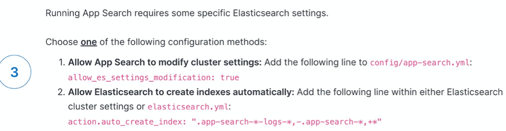

```
wget https://appsearch.elastic.co/downloads/app-search/app-search-7.3.1.tar.gz --no-check-certificate
 
vim config/app-search.yml

...
allow_es_settings_modification: true
...
```

```
sudo yum install java-11-openjdk-devel
sudo yum install java-11-openjdk-devel

$ java --version
openjdk 11.0.9.1 2020-11-04 LTS
OpenJDK Runtime Environment 18.9 (build 11.0.9.1+1-LTS)
OpenJDK 64-Bit Server VM 18.9 (build 11.0.9.1+1-LTS, mixed mode, sharing)
```

```
vim config/enterprise-search.yml

app_search.external_url: http://192.168.33.12:3002
allow_es_settings_modification: true
app_search.listen_host: 192.168.33.12
...
```

### **1-8 启动 App Search 服务**

```
./bin/app-search
```

在浏览器打开： `http://192.168.33.12:3002/`

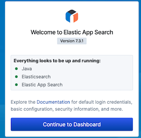

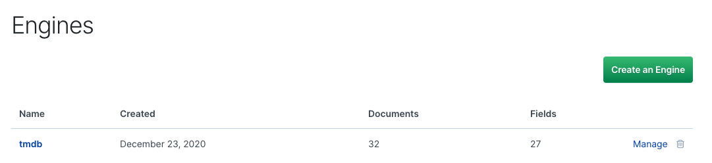

**Check Overview**

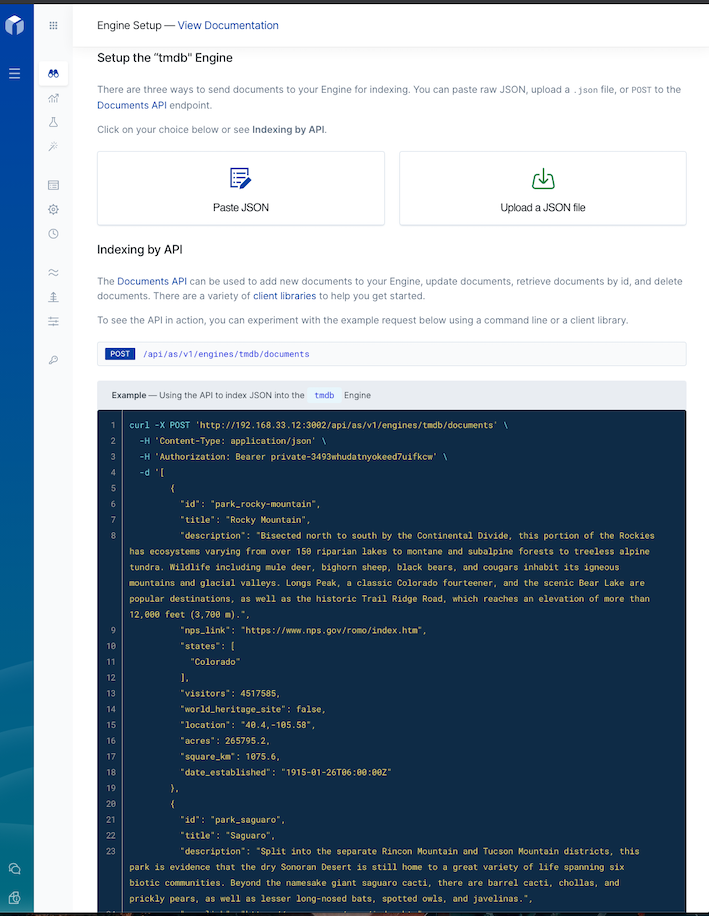

**Check Credentials**

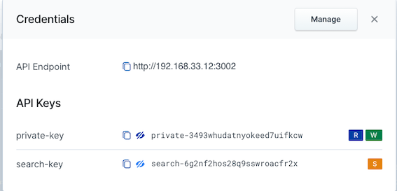

**R+W: `private-3493whudatnyokeed7uifkcw`**

## **2、将电影数据导入 Elasticsearch**

### **2-1 通过API Onboarding 数据**

**TMDB 数据库**

* 创建于 2008 年，电影的 Meta Data 库
	* 46 万本电影 / 12万本电视剧 / 230万张图片 / 每周 20万次编辑

* 提供 API。总共有超过20万开发人员和公司在使用

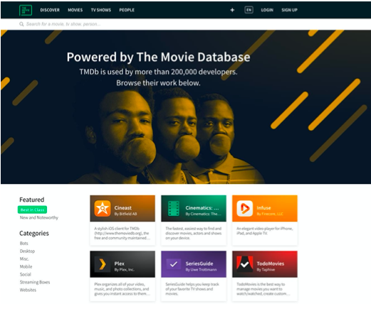

**[tmdb.json (small)](../files/tmdbs.json)**


### **2-2 Ingest data**

[**`ingest_tmdb_to_appserarch.py`**](../files/ingest_tmdb_to_appserarch.py)

```
import requests
import json
import os

APP_NAME= os.getenv('APP_SEARCH_NAME')
APP_PWD = os.getenv('APP_SEARCH_PWD')

def extract():
    f = open('./tmdb.json')
    if f:
         return json.loads(f.read());        
    return {}


def index_all(movieDict={}):

    for id, movie in movieDict.iteritems(): 
        index_doc(movie)
        print(id)


def index_doc(doc):
    content=[]
    content.append(doc)
    resp = requests.post("http://192.168.33.12:3002/api/as/v1/engines/"+APP_NAME+"/documents", 
        headers={"content-type":"application/json","Authorization": "Bearer "+APP_PWD}, 
        data=json.dumps(content))
    print resp


def main():
    movieDict = extract()
    index_all(movieDict=movieDict)
  
if __name__== "__main__":
  main()    
```

```
APP_SEARCH_NAME=tmdb APP_SEARCH_PWD=private-3493whudatnyokeed7uifkcw python ./ingest_tmdb_to_appserarch.py
```

### **2-3 查看 Dashboard**

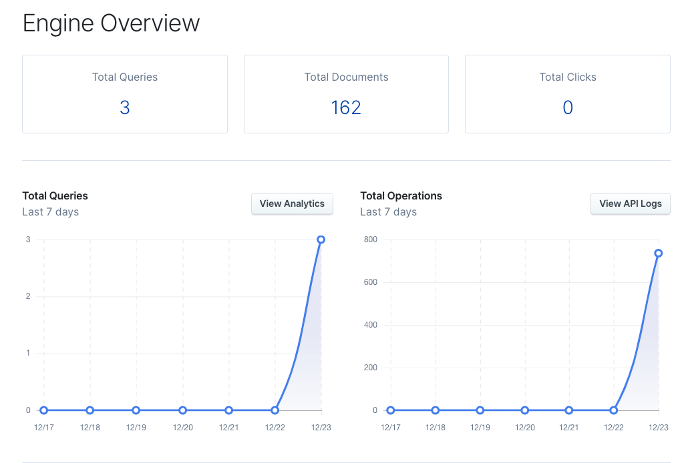

### **2-3 查看 Documents**

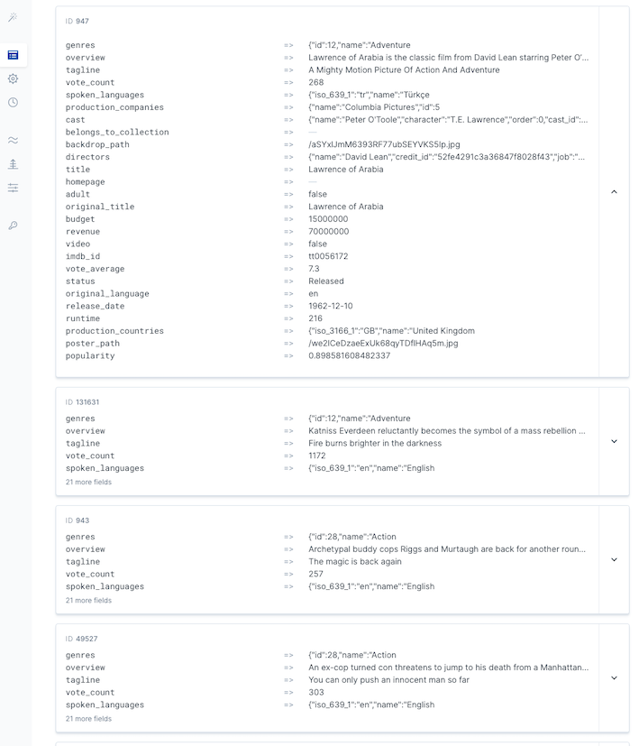

## **3、搭建你的电影搜索服务**

### **3-1 构建 Reference UI**

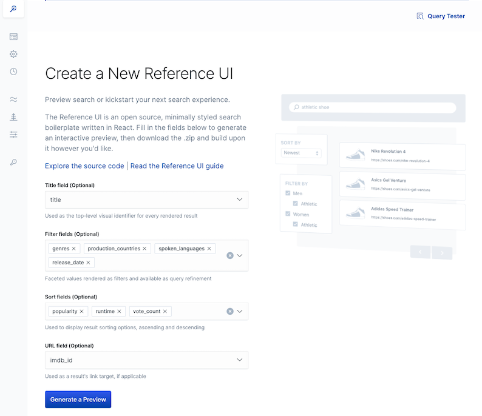

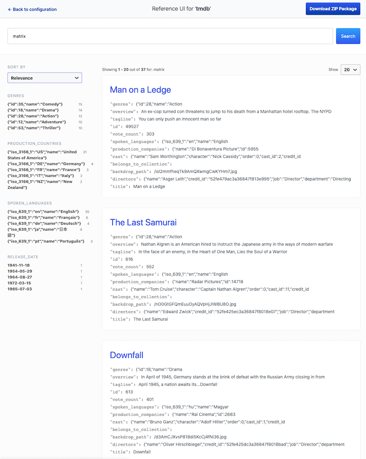

### **3-2 Search UI**

* 功能概览
	* Analytics: 获取用户搜索相关的统计数据
	* UI 的参考实现
* 管理
* [https://github.com/elastic/search-ui](https://github.com/elastic/search-ui)

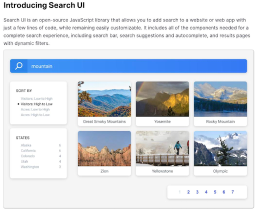


### **3-3 定制前端界面**


### **3-4 其他的前端框架**

* Reactive Search

[https://opensource.appbase.io/reactivesearch](https://opensource.appbase.io/reactivesearch)

* Demo

[https://github.com/appbaseio-apps/airbeds](https://github.com/appbaseio-apps/airbeds)


### **3-5 App Search 后台管理**

[http://localhost:3002](http://localhost:3002)

* **功能概览**
	* Analytics: 获取用户搜索相关的统计数据 
* 管理
	* 文档/Schema/API日志 
* 搜索设定
	* 自定义同意词(Matrix = 黑客帝国 = 矩阵革命) 
	* 调整字段的相关性权重

### **3-6 修改数据 Schema**

* 日期类型:如 Release data
* 数字类型:View Count

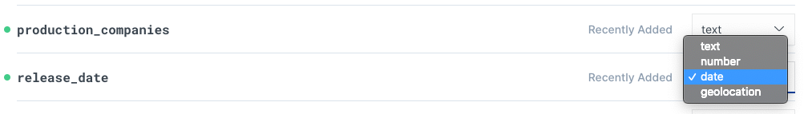

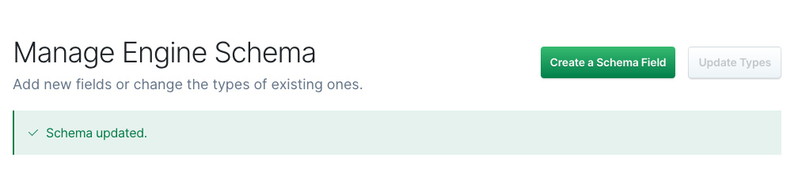

### **3-7 Curator 搜索结果**

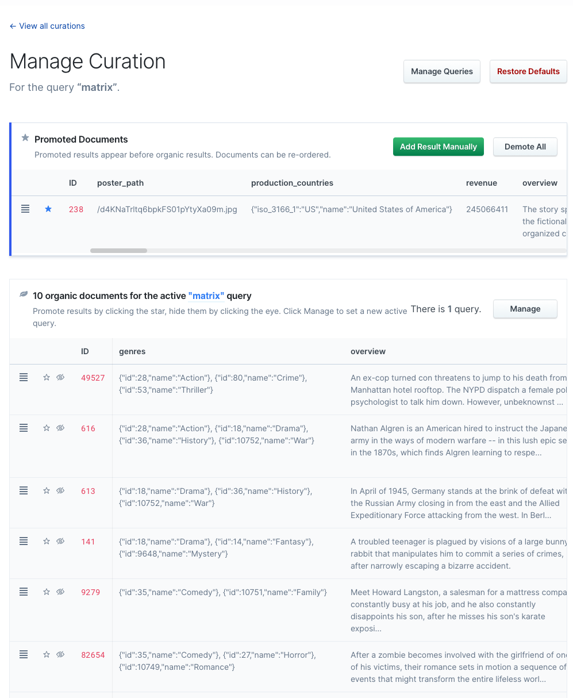