# **第二节 Stackoverflow用户调查问卷分析**

## **1、需求分析及架构设计**

### **1-1 2019 Stackoverflow Survery**

[https://insights.stackoverflow.com/survey/2020](https://insights.stackoverflow.com/survey/2020)

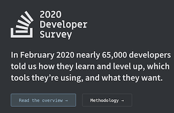

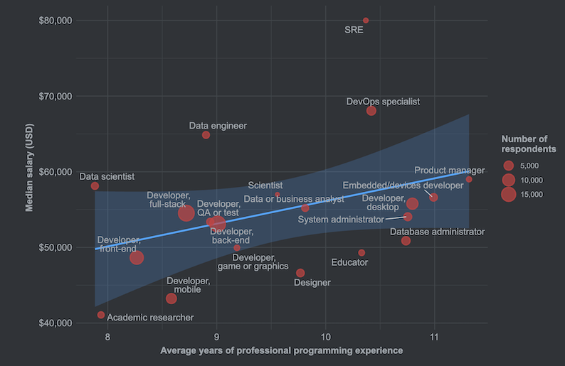

### **1-2 Insights**

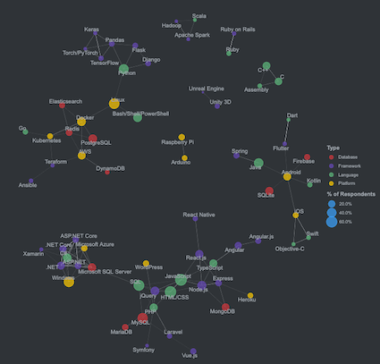

### **1-3 Open Data**

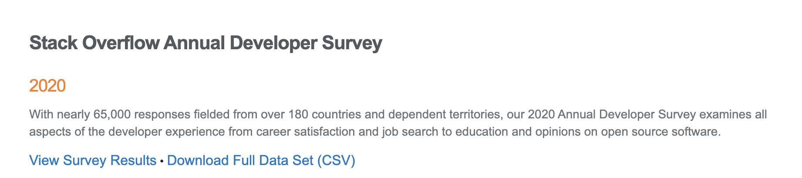

### **1-4 Survy Schema**

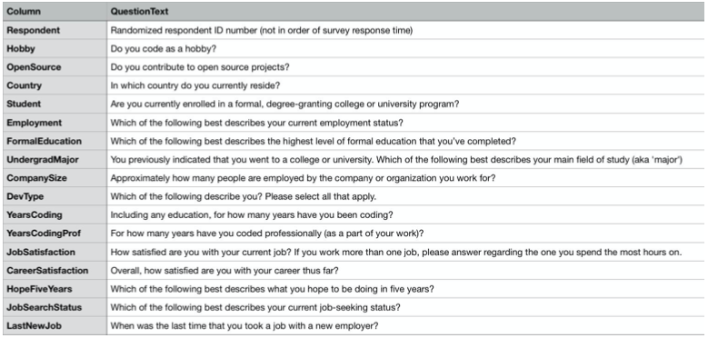

### **1-5 架构设计**

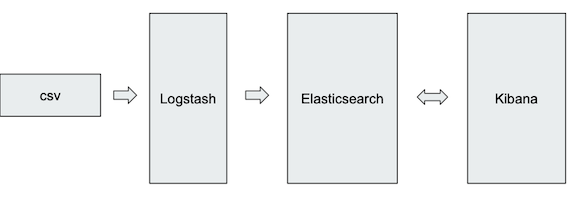

* File Input 
* CSV Filter
* ES Output

___

* Reindex 
* Ingest Pipeline

___

* Discovery
* Visualization 
* Dashboard


## **2、数据 Extract & Enrichment**

### **2-1 Logstash 导入数据**

* Input Plugin 
	* File Input

* Filter Plugin 
	* CSV Filter

* Output Plugin 
	* ES Output

[**`survey_results_public.csv - (2020) small`**](../files/survey_results_public.csv)
	
**`logstash-stackoverflow-survey.conf`**

```
input {
  file {
    path => "/home/vagrant/stack/survey_results_public.csv"
    start_position => "beginning"
    sincedb_path => "/dev/null"
  }
}

filter {
  csv {
        autogenerate_column_names => false
        skip_empty_columns => true

        columns => [
          "Respondent","MainBranch","Hobbyist","OpenSourcer","OpenSource","Employment","Country","Student","EdLevel","UndergradMajor","EduOther","OrgSize","DevType","YearsCode","Age1stCode","YearsCodePro","CareerSat","JobSat","MgrIdiot","MgrMoney","MgrWant","JobSeek","LastHireDate","LastInt","FizzBuzz","JobFactors","ResumeUpdate","CurrencySymbol","CurrencyDesc","CompTotal","CompFreq","ConvertedComp","WorkWeekHrs","WorkPlan","WorkChallenge","WorkRemote","WorkLoc","ImpSyn","CodeRev","CodeRevHrs","UnitTests","PurchaseHow","PurchaseWhat","LanguageWorkedWith","LanguageDesireNextYear","DatabaseWorkedWith","DatabaseDesireNextYear","PlatformWorkedWith","PlatformDesireNextYear","WebFrameWorkedWith","WebFrameDesireNextYear","MiscTechWorkedWith","MiscTechDesireNextYear","DevEnviron","OpSys","Containers","BlockchainOrg","BlockchainIs","BetterLife","ITperson","OffOn","SocialMedia","Extraversion","ScreenName","SOVisit1st","SOVisitFreq","SOVisitTo","SOFindAnswer","SOTimeSaved","SOHowMuchTime","SOAccount","SOPartFreq","SOJobs","EntTeams","SOComm","WelcomeChange","SONewContent","Age","Gender","Trans,Sexuality","Ethnicity","Dependents","SurveyLength","SurveyEase"
        ]

      }
  if ([collector] == "collector") {
    drop {}
  }
  mutate { remove_field => ["message", "@version", "@timestamp", "host"] }
}
output {
  stdout { codec => "dots" }
  elasticsearch {
                hosts => ["http://localhost:9200"]  
    index => "stackoverflow-survey-raw"
                document_type => "_doc"
                }
}
```

```
logstash -f logstash-stackoverflow-survey.conf

[2020-12-24T02:37:12,847][INFO ][logstash.runner          ] Starting Logstash {"logstash.version"=>"7.9.1", "jruby.version"=>"jruby 9.2.13.0 (2.5.7) 2020-08-03 9a89c94bcc OpenJDK 64-Bit Server VM 15.0.1+9 on 15.0.1+9 +indy +jit [linux-x86_64]"}
[2020-12-24T02:37:14,795][WARN ][logstash.config.source.multilocal] Ignoring the 'pipelines.yml' file because modules or command line options are specified
[2020-12-24T02:37:31,855][INFO ][org.reflections.Reflections] Reflections took 128 ms to scan 1 urls, producing 22 keys and 45 values 
[2020-12-24T02:37:36,145][WARN ][logstash.outputs.elasticsearch] You are using a deprecated config setting "document_type" set in elasticsearch. Deprecated settings will continue to work, but are scheduled for removal from logstash in the future. Document types are being deprecated in Elasticsearch 6.0, and removed entirely in 7.0. You should avoid this feature If you have any questions about this, please visit the #logstash channel on freenode irc. {:name=>"document_type", :plugin=><LogStash::Outputs::ElasticSearch index=>"stackoverflow-survey-raw", id=>"788c362caf32ff9f16ab96207729a1340067fafd86f87c552ea2bf1b783e431b", hosts=>[http://localhost:9200], document_type=>"_doc", enable_metric=>true, codec=><LogStash::Codecs::Plain id=>"plain_a90d9c2d-256e-4565-ae1e-e97e2b99dc05", enable_metric=>true, charset=>"UTF-8">, workers=>1, manage_template=>true, template_overwrite=>false, doc_as_upsert=>false, script_type=>"inline", script_lang=>"painless", script_var_name=>"event", scripted_upsert=>false, retry_initial_interval=>2, retry_max_interval=>64, retry_on_conflict=>1, ilm_enabled=>"auto", ilm_pattern=>"{now/d}-000001", ilm_policy=>"logstash-policy", ecs_compatibility=>:disabled, action=>"index", ssl_certificate_verification=>true, sniffing=>false, sniffing_delay=>5, timeout=>60, pool_max=>1000, pool_max_per_route=>100, resurrect_delay=>5, validate_after_inactivity=>10000, http_compression=>false>}
[2020-12-24T02:37:38,461][INFO ][logstash.outputs.elasticsearch][main] Elasticsearch pool URLs updated {:changes=>{:removed=>[], :added=>[http://localhost:9200/]}}
[2020-12-24T02:37:38,956][WARN ][logstash.outputs.elasticsearch][main] Restored connection to ES instance {:url=>"http://localhost:9200/"}
[2020-12-24T02:37:39,272][INFO ][logstash.outputs.elasticsearch][main] ES Output version determined {:es_version=>7}
[2020-12-24T02:37:39,279][WARN ][logstash.outputs.elasticsearch][main] Detected a 6.x and above cluster: the `type` event field won't be used to determine the document _type {:es_version=>7}
[2020-12-24T02:37:39,579][INFO ][logstash.outputs.elasticsearch][main] New Elasticsearch output {:class=>"LogStash::Outputs::ElasticSearch", :hosts=>["http://localhost:9200"]}
[2020-12-24T02:37:39,708][INFO ][logstash.outputs.elasticsearch][main] Using a default mapping template {:es_version=>7, :ecs_compatibility=>:disabled}
[2020-12-24T02:37:39,865][INFO ][logstash.javapipeline    ][main] Starting pipeline {:pipeline_id=>"main", "pipeline.workers"=>1, "pipeline.batch.size"=>125, "pipeline.batch.delay"=>50, "pipeline.max_inflight"=>125, "pipeline.sources"=>["/home/vagrant/stack/logstash-stackoverflow-survey.conf"], :thread=>"#<Thread:0x471284f2 run>"}
[2020-12-24T02:37:40,204][INFO ][logstash.outputs.elasticsearch][main] Attempting to install template {:manage_template=>{"index_patterns"=>"logstash-*", "version"=>60001, "settings"=>{"index.refresh_interval"=>"5s", "number_of_shards"=>1}, "mappings"=>{"dynamic_templates"=>[{"message_field"=>{"path_match"=>"message", "match_mapping_type"=>"string", "mapping"=>{"type"=>"text", "norms"=>false}}}, {"string_fields"=>{"match"=>"*", "match_mapping_type"=>"string", "mapping"=>{"type"=>"text", "norms"=>false, "fields"=>{"keyword"=>{"type"=>"keyword", "ignore_above"=>256}}}}}], "properties"=>{"@timestamp"=>{"type"=>"date"}, "@version"=>{"type"=>"keyword"}, "geoip"=>{"dynamic"=>true, "properties"=>{"ip"=>{"type"=>"ip"}, "location"=>{"type"=>"geo_point"}, "latitude"=>{"type"=>"half_float"}, "longitude"=>{"type"=>"half_float"}}}}}}}
[2020-12-24T02:37:40,659][INFO ][logstash.outputs.elasticsearch][main] Installing elasticsearch template to _template/logstash
[2020-12-24T02:37:42,604][INFO ][logstash.javapipeline    ][main] Pipeline Java execution initialization time {"seconds"=>2.72}
[2020-12-24T02:37:44,490][INFO ][logstash.javapipeline    ][main] Pipeline started {"pipeline.id"=>"main"}
[2020-12-24T02:37:44,796][INFO ][filewatch.observingtail  ][main][1289d8dea60663368244c6988aa9437f732c80f68c97f64cf9a5c7a12e9e31bf] START, creating Discoverer, Watch with file and sincedb collections
[2020-12-24T02:37:45,115][INFO ][logstash.agent           ] Pipelines running {:count=>1, :running_pipelines=>[:main], :non_running_pipelines=>[]}
[2020-12-24T02:37:46,777][INFO ][logstash.agent           ] Successfully started Logstash API endpoint {:port=>9600}
...
```


### **2-2 创建 Index Pattern & Discovery**

```
GET stackoverflow-survey-raw/_mapping
```

***Output***

```
{
  "stackoverflow-survey-raw" : {
    "mappings" : {
      "properties" : {
        "Age1stCode" : {
          "type" : "text",
          "fields" : {
            "keyword" : {
              "type" : "keyword",
              "ignore_above" : 256
            }
          }
        },
        "BetterLife" : {
          "type" : "text",
          "fields" : {
            "keyword" : {
              "type" : "keyword",
              "ignore_above" : 256
            }
          }
        },
        "BlockchainIs" : {
          "type" : "text",
          "fields" : {
            "keyword" : {
              "type" : "keyword",
              "ignore_above" : 256
            }
          }
        },
        "BlockchainOrg" : {
          "type" : "text",
          "fields" : {
            "keyword" : {
              "type" : "keyword",
              "ignore_above" : 256
            }
          }
        },
...
```

### **2-3 使用 Dynamic Template 处理文本类型 Mapping**

```
PUT final-stackoverflow-survey
{
  "mappings": {
    "dynamic_templates": [
      {
        "strings_as_keywords": {
          "match_mapping_type": "string",
          "mapping": {
            "type": "keyword"
          }
        }
      }
    ]
  },
  "settings": {
    "number_of_replicas": 0
  }
}
```

***Output***

```
{
  "acknowledged" : true,
  "shards_acknowledged" : true,
  "index" : "final-stackoverflow-survey"
}
```


**数字相关**

* YearsCode
* WorkWeekHrs
* Age
* Age1stCode 16
* YearsCodePro

### **2-4 创建 Ingest Pipeline**

```
PUT _ingest/pipeline/stackoverflow_pipeline
{
  "description": "Pipeline for stackoverflow survey",
  "processors": [
    {
      "split": {
        "field": "DatabaseDesireNextYear",
        "separator": ";"
      }
    },
    {
      "split": {
        "field": "DatabaseWorkedWith",
        "separator": ";"
      }
    },
    {
      "split": {
        "field": "DevEnviron",
        "separator": ";"
      }
    },
    {
      "split": {
        "field": "LanguageWorkedWith",
        "separator": ";"
      }
    },
    {
      "split": {
        "field": "MiscTechDesireNextYear",
        "separator": ";"
      }
    },
    {
      "split": {
        "field": "PlatformWorkedWith",
        "separator": ";"
      }
    },
    {
      "split": {
        "field": "PlatformDesireNextYear",
        "separator": ";"
      }
    },
    {
      "split": {
        "field": "WebFrameWorkedWith",
        "separator": ";"
      }
    },
    {
      "split": {
        "field": "WebFrameDesireNextYear",
        "separator": ";"
      }
    },
    {
      "split": {
        "field": "Containers",
        "separator": ";"
      }
    },
    {
      "script": {
        "source": """
          try{
	          ctx.YearsCode = Integer.parseInt(ctx.YearsCode);
          	}catch(Exception e){
          		ctx.YearsCode = 0;
          	}
"""
      }
    },
    {
      "script": {
        "source": """
          try{
	          ctx.WorkWeekHrs = Integer.parseInt(ctx.WorkWeekHrs);
          	}catch(Exception e){
          		ctx.WorkWeekHrs = 0;
          	}
"""
      }
    },
    {
      "script": {
        "source": """
          try{
	          ctx.Age = Integer.parseInt(ctx.Age);
          	}catch(Exception e){
          		ctx.Age = 0;
          	}
"""
      }
    },
    {
      "script": {
        "source": """
          try{
	          ctx.Age1stCode = Integer.parseInt(ctx.Age1stCode);
          	}catch(Exception e){
          		ctx.Age1stCode = 0;
          	}
"""
      }
    },
    {
      "script": {
        "source": """
          try{
	          ctx.YearsCodePro = Integer.parseInt(ctx.YearsCodePro);
          	}catch(Exception e){
          		ctx.YearsCodePro = 0;
          	}
"""
      }
    }
  ]
}
```

***Output:***

```
{
  "acknowledged" : true
}
```

### **2-5 Reindex**

```
POST _reindex?wait_for_completion=false
{
  "source": {
    "index": "stackoverflow-survey-raw"
  },
  "dest": {
    "index": "final-stackoverflow-survey",
    "pipeline": "stackoverflow_pipeline"
  }
}
```

**Output**

```
{
  "task" : "vB-aGlnVTQmjFhdCQVpfVQ:42801"
}
```

### **2-6 Index Pattern**

```
GET final-stackoverflow-survey/_mapping
```

```
"Age" : {
          "type" : "long"
        },
"Age1stCode" : {
          "type" : "long"
        },
"WorkWeekHrs" : {
          "type" : "long"
        },
"YearsCode" : {
          "type" : "long"
        },
 "YearsCodePro" : {
          "type" : "long"
        },
```


**`final-stackoverflow-survey`**

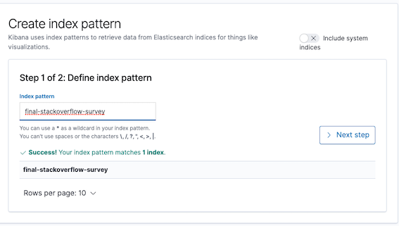

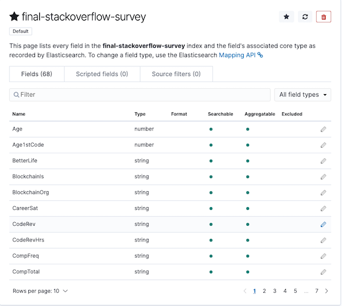


## **3、构建 Insights Dashboard**

### **3-1 Dashboard**

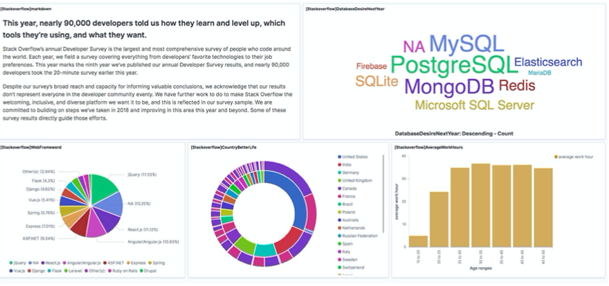

### **3-2 Web Framework Worked with**

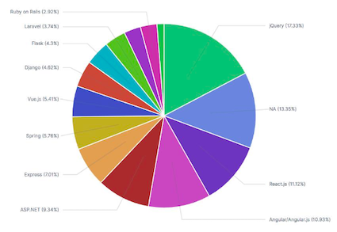

### **3-3 Database Desired Next Year**

**Visualization Markdown: `stackoverflow-DBnextyear-intro`**

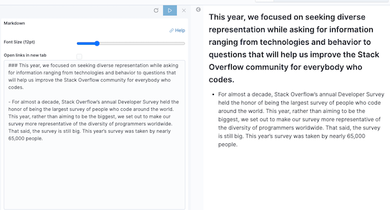

**Visualization Tagdown: `stackoverflow-DBnextyear-tag`**

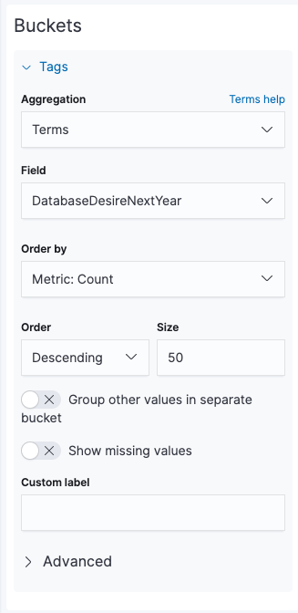

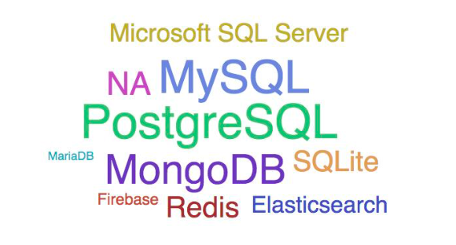

### **3-4 Age & Average Work Hours(per week)**

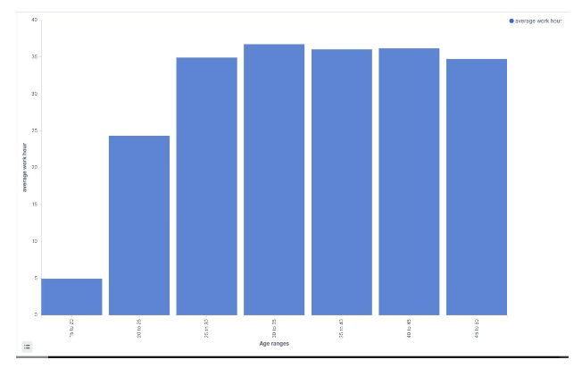

### **3-5 Country(Better Life)**

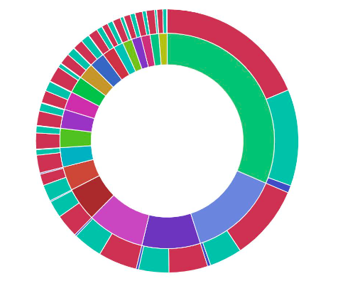
