# **第三节 通过EFK对Artifactory进行日志分析**

**JFrog Artifactory**

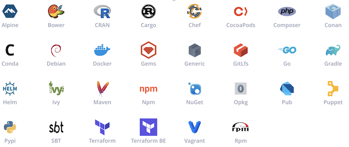

**JFrog Platform**

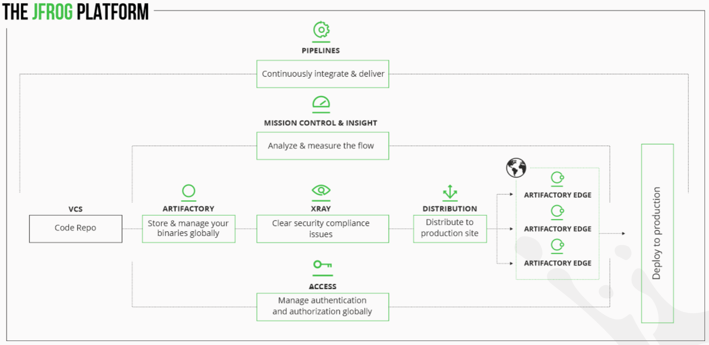

## **Artifactory logging回顾**

### **Artifactory Service**

* Artifactory 应用服务
* Access      认证服务
* Router      平台网关服务
* Frontend    前端服务
* Metadata    制品信息统计

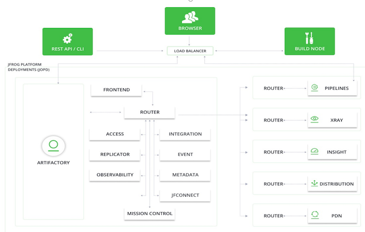

**Artifactory Logging**

Frog Logging Doc: [https://jfrog.com/help/r/jfrog-platform-administration-documentation/logging](https://jfrog.com/help/r/jfrog-platform-administration-documentation/logging)

为什么要统计日志
	
* 	事件记录
*  错误记录
*  状态记录

可以帮我们解决什么问题 

* 问题排查
* 了解状态
* 运维管理
* 实时预警


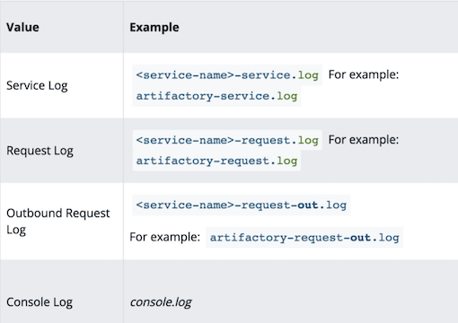

## **EFK介绍以及安**

Elasticsearch
  
- 开源搜索引擎
- 支持分布式

Kibana
  
- Dashboards
- ES可视化平台
  
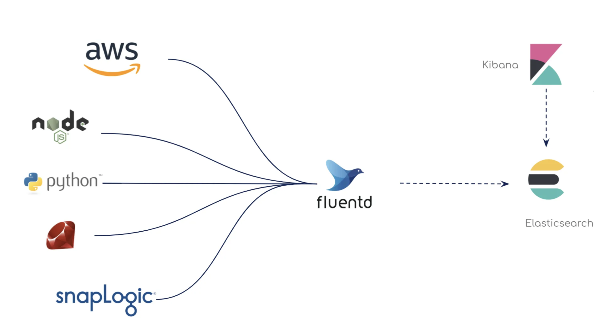


* docker-compose安装
* kibana.yml
* elasticsearch
  
  - elasticsearch.yml
  - elasticsearch/data
  - elasticsearch/plugins
  - elasticsearch/logs

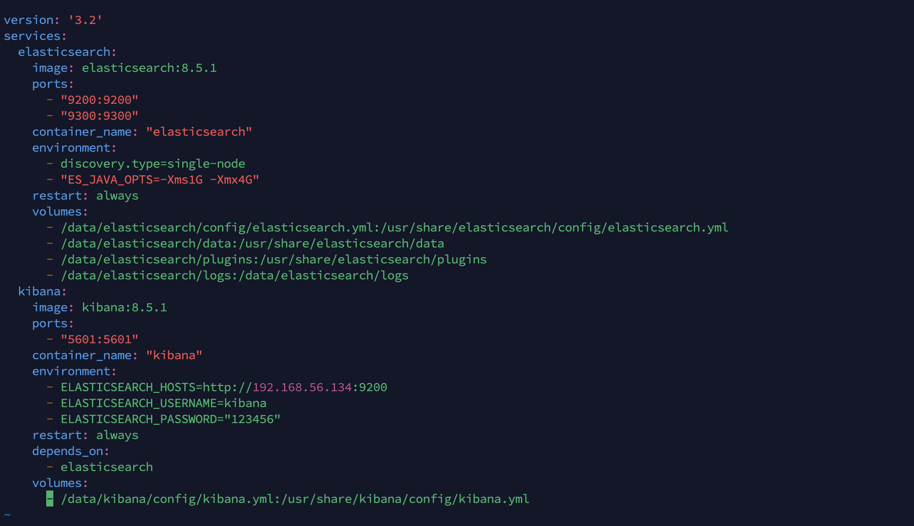

### **Fluentd**

* 开源
* 安装配置简单
* 统一日志处理
  - Elastic + Kibana
  - Splunk
  - Datadog
  - Prometheus + Grafana

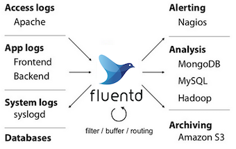

### Fluentd安装

* docker-compose安装
日志处理路径挂载
  - Artifactory logs dir
  - fluent.conf
* 环境变量
  - `JF_JPD`
  - ELSATIC

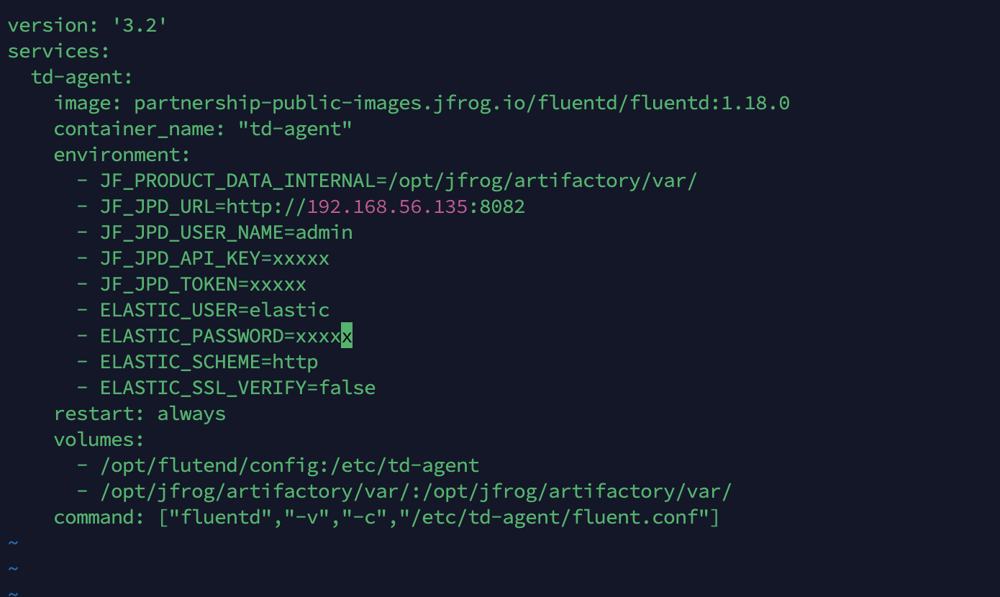

### 1. 环境准备：（CentOS 7）

Docker-ce安装：

```
yum install -y yum-utils device-mapper-persistent-data lvm2 yum-config-manager --add-repo https://download.docker.com/linux/centos/docker-ce.repo 

yum install docker-ce -y 

systemctl start docker && systemctl enable docker 

# docker版本确认 
docker --version
Docker Version 20.10.17
```

docker-compose安装：

```
sudo curl -L "https://github.com/docker/compose/releases/download/1.29.2/docker- compose-$(uname -s)-$(uname -m)" -o /usr/local/bin/docker-compose

# docker-compose版本确认 docker-compose --version
```

### 2. elasticsearch & kibana安装（8.5.1版本）

**所需⽬录创建**

```
# 创建elasticsearch & kibana挂载⽬录 mkdir -p /data/elasticsearch/{config,data,logs,plugins} mkdir -p /data/kibana/config

# 修改权限 
chown 1000:1000 /data/{elasticsearch,kibana}/ -R 
chmod 755 /data/{elasticsearch,kibana}/ -R

# 创建docker-compose.yml⽂件 
mkdir /opt/EFK && cd /opt/EFK
```

*  docker-compose⽂件：（`/opt/EFK/docker-compose.yml`）

```
version: '3.2' 
services: 
	elasticsearch: 
		image: elasticsearch:8.5.1 
		ports: 
			- "9200:9200" 
			- "9300:9300" 
		container_name: "elasticsearch" 
		enviro__nment: 
			- discovery.type=single-node 
			- "ES_JAVA_OPTS=-Xms1G -Xmx4G" 
		restart: always 
		volumes: 
			- /data/elasticsearch/config/elasticsearch.yml:/usr/share/elasticsearch/co 
			- /data/elasticsearch/data:/usr/share/elasticsearch/data 
			- /data/elasticsearch/plugins:/usr/share/elasticsearch/plugins 			- /data/elasticsearch/logs:/data/elasticsearch/logs 
kibana: 
	image: kibana:8.5.1 
	ports: 
		- "5601:5601" 
	container_name: "kibana" 
	environment: 
		- ELASTICSEARCH_HOSTS=http://192.168.56.134:9200 
		- ELASTICSEARCH_USERNAME=kibana 
		- ELASTICSEARCH_PASSWORD="123456" 
	restart: always 
	depends_on: 
		- elasticsearch 
	volumes: - /data/kibana/config/kibana.yml:/usr/share/kibana/config/kibana.yml
```

### 3. 配置⽂件：

`elasticsearch.yml (/data/elasticsearch/config/elasticsearch.yml)`

```
cluster.name: "EFK-cluster" 
network.host: 0.0.0.0 

http.cors.allow-origin: "*" 
http.cors.enabled: true 
http.cors.allow-headers: Authorization,X-Requested-With,Content-Length,Content-T 

xpack.security.enabled: true 
xpack.security.enrollment.enabled: true
```

`kibana.yml (/data/kibana/config/kibana.yml)`

```
server.name: kibana 
server.host: "0.0.0.0" 
elasticsearch.hosts: [ "http://192.168.56.134:9200" ] 

xpack.monitoring.ui.container.elasticsearch.enabled: true 
# 中⽂可选 
i18n.locale: "zh-CN"
```

* elasticsearch & kibana服务启动配置

```
# 需要提前准备好elasticsearch & kibana所需镜像 
docker pull elasticsearch:8.5.1 
docker pull kibana:8.5.1 45 

# docker-compose启动 
cd /opt/EFK 
docker-compose up -d 

# 检查启动状态 
docker-compose ps 

# 通过log检查服务启动状态，查看是否有其他的异常 
docker-compose logs -f --tail 100 elasticsearch 
docker-compose logs -f --tail 100 kibana
```


* 重置elasticsearch & kibana密码

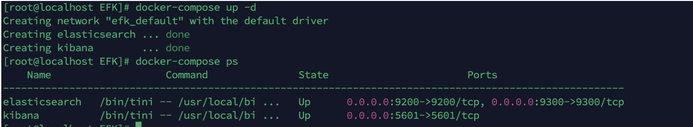

```
# 进⼊到elasticsearch容器中 
docker exec -it elasticsearch bash 

# 重置⽤⼾密码（elasticsearch V8不再允许使⽤elastic⽤⼾进⾏配置） 
# 重置elastic⽤⼾密码 
bin/elasticsearch-reset-password --username elastic -i 

# 重置kibana⽤⼾密码 
bin/elasticsearch-reset-password --username kibana -i 12345678
```

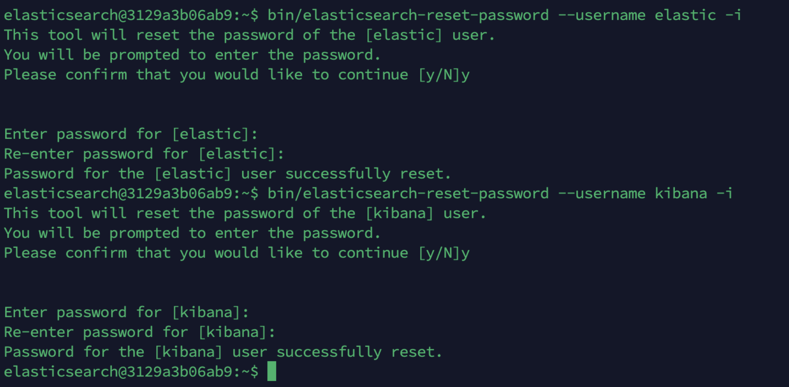

* 重启服务

```
# docker-compose重启 
docker-compose down

docker-compose up -d

# 检查启动状态 
docker-compose ps
```

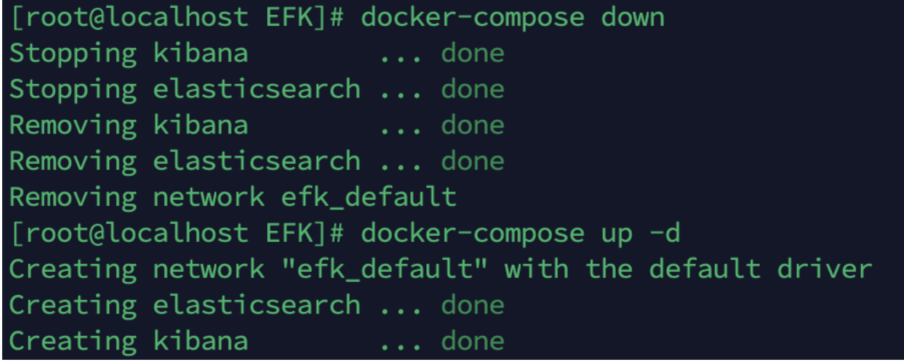

### 4. 服务验证

```
# 验证elasticsearch启动状态 
curl localhost:9200 -u elastic

# 访问elasticsearch & kibana前端，使⽤elastic⽤⼾登录
http://192.168.56.134:5601
```

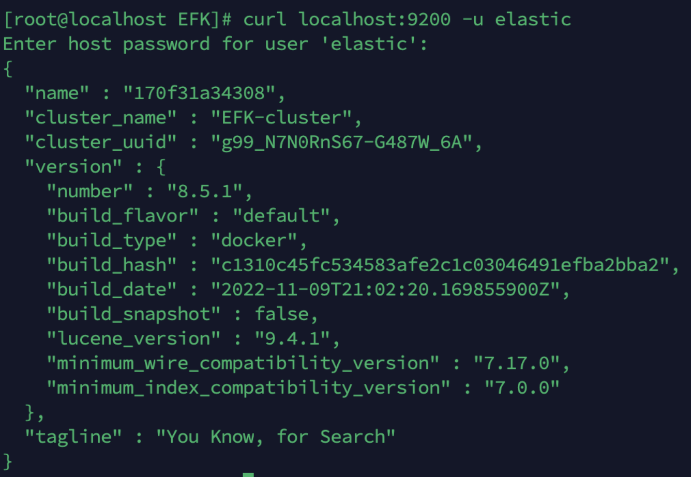


## Flutend安装配置

1. 环境准备：（CentOS 7） 

Flutend作为⽇志收集客⼾端，需要安装在Artifactory节点上

* Docker-ce安装：

```
yum install -y yum-utils device-mapper-persistent-data lvm2 
yum-config-manager --add-repo https://download.docker.com/linux/centos/docker-ce.repo 
yum install docker-ce -y 

systemctl start docker && systemctl enable docker 

# docker版本确认 
docker --version
```

docker-compose安装：

```
sudo curl -L "https://github.com/docker/compose/releases/download/1.29.2/docker- compose-$(uname -s)-$(uname -m)" -o /usr/local/bin/docker-compose

# docker-compose版本确认
docker-compose --version
```
 
 * Artifactory中需要开启metrics，开启后重启Artifactory⽣效：

```
 # Artifactory $JFROG_HOME/artifactory/var/etc/system.yaml 新增如下参数
 
 shared:
	metrics: 
		enabled: true 

artifactory: 
	metrics: 
		enabled: true 

mc: 
	enabled: true
```

### 2. flutend安装（docker-compose）

* 所需⽬录创建
 
```
# 创建项⽬⽬录 
mkdir /opt/flutend/config -p 

# 权限修改
hown 1000:1000 /opt/flutend -R 
chmod 755 /opt/flutend -R
```

* `docker-compose`⽂件：（`/opt/flutend/docker-compose.yml`），将⽣成的`API Key`和`Access token`填写到yml⽂件中

```
version: '3.2' 
services: 
	td-agent: 
		image: partnership-public-images.jfrog.io/fluentd/fluentd:1.18.0 
		container_name: "td-agent" 
		environment: 
			- JF_PRODUCT_DATA_INTERNAL=/opt/jfrog/artifactory/var/ 
			- JF_JPD_URL=http://192.168.56.135:8082 
			- JF_JPD_USER_NAME=admin 
			- JF_JPD_API_KEY=xxx 
			- JF_JPD_TOKEN=xxx 
			- ELASTIC_USER=elastic 
			- ELASTIC_PASSWORD=xxx 
			- ELASTIC_SCHEME=http 
			- ELASTIC_SSL_VERIFY=false 
		restart: always 
		volumes: 
			- /opt/flutend/config:/etc/td-agent 
			- /opt/jfrog/artifactory/var/:/opt/jfrog/artifactory/var/ 
		command: ["fluentd","-v","-c","/etc/td-agent/fluent.conf"]
```

* fluent.conf配置⽂件(`/opt/fluentd/config/fluent.conf`)

```
<source> 
	@type tail
	@id access_service_tail
	path "#{ENV['JF_PRODUCT_DATA_INTERNAL']}/log/access-service.log"
	pos_file "#{ENV['JF_PRODUCT_DATA_INTERNAL']}/log/access-service.log.pos"
	tag jfrog.rt.access.service
	<parse> 
		@type none 
	</parse>
</source>

<source>
	@type tail
	@id artifactory_service_tail
	path "#{ENV['JF_PRODUCT_DATA_INTERNAL']}/log/artifactory-service.log"
  pos_file "#{ENV['JF_PRODUCT_DATA_INTERNAL']}/log/artifactory-service.log.pos"
  tag jfrog.rt.artifactory.service
  <parse> 
  	@type none 
  </parse> 
 </source> 
 <source>
 	@type tail
 	@id frontend_service_tail
 	path "#{ENV['JF_PRODUCT_DATA_INTERNAL']}/log/frontend-service.log"
 	pos_file "#{ENV['JF_PRODUCT_DATA_INTERNAL']}/log/frontend-service.log.pos"
 	tag jfrog.rt.frontend.service
 	<parse>
 		@type none
 	</parse>
 </source>
 	@type tail 
	@id metadata_service_tail 
	path "#{ENV['JF_PRODUCT_DATA_INTERNAL']}/log/metadata-service.log" 
	pos_file "#{ENV['JF_PRODUCT_DATA_INTERNAL']}/log/metadata-service.log.pos" 
	tag jfrog.rt.metadata.service 
	<parse> 
		@type none 
	</parse> 
</source> 
<source> 
	@type tail 
	@id router_service_tail 
	path "#{ENV['JF_PRODUCT_DATA_INTERNAL']}/log/router-service.log" 
	pos_file "#{ENV['JF_PRODUCT_DATA_INTERNAL']}/log/router-service.log.pos" 
	tag jfrog.rt.router.service 
	<parse> 
		@type none 
	</parse>
</source> 
# Strip out color codes then field extract the service fields 
<filter jfrog.rt.**.service> 
	@type record_transformer 
	enable_ruby true 
	<record> 
		message ${record["message"].gsub(/\e\[([;\d]+)?m/, '')} 
	</record> 
</filter> 
<filter jfrog.rt.**.service> 
	@type parser 
	key_name message 
	<parse> 
		@type multiline 
		format_firstline /\d{4}-\d{1,2}-\d{1,2}/ 
		format1 /^(?<timestamp>[^ ]*) \[(?<service_type>[^\]]*)\] \[(?<log_level>[ 
	</parse> 
</filter> 
# End Service Fields Extraction
<source> 
	@type tail 
	@id router_traefik_tail 
	path "#{ENV['JF_PRODUCT_DATA_INTERNAL']}/log/router-traefik.log" 
	pos_file "#{ENV['JF_PRODUCT_DATA_INTERNAL']}/log/router-traefik.log.pos" 
	tag jfrog.rt.router.traefik 
	<parse> 
		@type multiline 
		format_firstline /\d{4}-\d{1,2}-\d{1,2}/ 
		format1 /^(?<timestamp>[^ ]*) \[(?<service_type>[^\]]*)\] \[(?<log_level>[ 
	</parse> 
</source>

<source> 
	@type tail
	@id access_request_tail 
	path "#{ENV['JF_PRODUCT_DATA_INTERNAL']}/log/access-request.log" 
	pos_file "#{ENV['JF_PRODUCT_DATA_INTERNAL']}/log/access-request.log.pos" 
	tag jfrog.rt.access.request 
		<parse> 
			@type regexp 
			expression ^(?<timestamp>[^ ]*)\|(?<trace_id>[^\|]*)\|(?<remote_address>[^\| 
		</parse> 
</source> 
<source> 
	@type tail
			@id artifactory_request_tail 
		path "#{ENV['JF_PRODUCT_DATA_INTERNAL']}/log/artifactory-request.log" 
		pos_file "#{ENV['JF_PRODUCT_DATA_INTERNAL']}/log/artifactory-request.log.pos" 
		tag jfrog.rt.artifactory.request 
		<parse> 
			@type regexp 
			expression ^(?<timestamp>[^ ]*)\|(?<trace_id>[^\|]*)\|(?<remote_address>[^\|
		</parse> 
	</source> 
	<filter jfrog.rt.artifactory.request> 
		@type record_transformer 
		enable_ruby true 
		<record> 
			repo ${record["request_url"].include?("/api/docker") && !record["request_url 
			image ${record["request_url"].include?("/api/docker") && !record["request_ur 
		</record> 
	</filter> 
	<source> 
		@type tail 
		@id frontend_request_tail 
		path "#{ENV['JF_PRODUCT_DATA_INTERNAL']}/log/frontend-request.log" 
		pos_file "#{ENV['JF_PRODUCT_DATA_INTERNAL']}/log/frontend-request.log.pos" 1
		tag jfrog.rt.frontend.request 
		<parse> 
			@type regexp 
			expression ^(?<timestamp>[^ ]*)\|(?<trace_id>[^\|]*)\|(?<remote_address>[^\| 
		</parse> 
	</source> 
	<source> 
		@type tail 
		@id metadata_request_tail 
		path "#{ENV['JF_PRODUCT_DATA_INTERNAL']}/log/metadata-request.log" 
		pos_file "#{ENV['JF_PRODUCT_DATA_INTERNAL']}/log/metadata-request.log.pos" 
		tag jfrog.rt.metadata.request 
		<parse> 
			@type regexp 
			expression ^(?<timestamp>[^ ]*)\|(?<trace_id>[^\|]*)\|(?<remote_address>[^\| 
		</parse> 
	</source> 
	<source> 
		@type tail 
		@id router_request_tail 
		path "#{ENV['JF_PRODUCT_DATA_INTERNAL']}/log/router-request.log" 
		pos_file "#{ENV['JF_PRODUCT_DATA_INTERNAL']}/log/router-request.log.pos" 
		tag jfrog.rt.router.request 
		<parse> 
			@type json
			</parse> 
</source> 
<source> 
	@type tail 
	@id artifactory_access_tail 
	path "#{ENV['JF_PRODUCT_DATA_INTERNAL']}/log/artifactory-access.log" 
	pos_file "#{ENV['JF_PRODUCT_DATA_INTERNAL']}/log/artifactory-access.log.pos" 
	tag jfrog.rt.artifactory.access 
	<parse> 
		@type regexp 
		expression /^(?<timestamp>[^ ]*) \[(?<trace_id>[^\]]*)\] \[(?<action_respons 
	</parse> 
</source> 
<source> 
	@type tail 
	@id access_security_audit_tail 
	path "#{ENV['JF_PRODUCT_DATA_INTERNAL']}/log/access-security-audit.log" 
	pos_file "#{ENV['JF_PRODUCT_DATA_INTERNAL']}/log/access-security-audit.log.pos 
	tag jfrog.rt.access.audit 
	<parse> 
		@type regexp 
		expression /^(?<timestamp>[^ ]*)\|(?<token_id>[^ ]*)\|(?<user_ip>[^ ]*)\|(?<  
	</parse> 
	</source> 
	<filter jfrog.**> 
		@type record_transformer 
		<record> 
			hostname "#{Socket.gethostname}" 
			log_source ${tag} 
		</record> 
	</filter> 
<source> 
	@type exec 
	tag jfrog.callhome 
	command "curl --request GET 'http://localhost:8081/artifactory/api/system/vers run_interval 1d 
	<parse> 
		@type json 
	</parse> 
</source> 
<filter jfrog.callhome> 
	@type record_transformer 
	renew_record true 
	keep_keys 'productId,features' 
	enable_ruby true 
	<record> 
		productId 'jfrogLogAnalyticsElastic/0.9.0'
				features ${return([{"featureId" => "ArtifactoryVersion/" + record["version"] 
	</record> 
</filter> 
<match jfrog.callhome> 
	@type http 
	endpoint http://localhost:8081/artifactory/api/system/usage 
	open_timeout 5 
	content_type application/json 
	headers {"Authorization":"Bearer <TOKEN>"} 
	<format> 
		@type json 
		</format> 
		<buffer> 
			flush_interval 5s
		</buffer> 
		</match> 
		<filter jfrog.rt.artifactory.request> 
			@type record_transformer 
			enable_ruby true 
			<record> 
				repo ${record["request_url"].include?("/api/docker") && !record["request_url
				image ${record["request_url"].include?("/api/docker") && !record["request_ur
			</record> 
		</filter> 
	<filter jfrog.rt.artifactory.request> 
		@type record_transformer 
		enable_ruby true 
		<record> 
			response_content_length_2 ${record["response_content_length"].to_f} 
			request_content_length_2 ${record["request_content_length"].to_f} 
		</record> 
	</filter> 

###JFROG METRICS Plugin 
<source> 
	@type jfrog_metrics 
	@id metrics_http_jfrt 
	tag jfrog.metrics.artifactory 
	interval 5s 
	metric_prefix 'jfrog.artifactory' 
	jpd_url http://192.168.56.135:8082 
	username admin 
	apikey AKCp8ohUb3ShLFuU9ydRa9rLE6LbZCn3xYs7txHH78L8jGG7boL5xqsECTZssbTSz6tbTNi 
	token eyJ2ZXIiOiIyIiwidHlwIjoiSldUIiwiYWxnIjoiUlMyNTYiLCJraWQiOiJ0YmhLQWVNVFh6 target_platform "ELASTIC" 
</source> 

########################
# ELASTIC OUTPUT METRICS
########################
<match jfrog.metrics.**>
	@type elasticsearch
	@id elasticsearch_metrics
	host 192.168.56.134
	port 9200
	user elastic
	password 123456
	# scheme "http"
	# ssl_verify "false
	index_name unified-metrics-artifactory
	include_tag_key true
	type_name fluentd
	logstash_format false
	include_timestamp true
	</match>
#END ELASTIC OUTPUT

# <match jfrog.metrics.**>
# @type stdout
# </match>

########################
# ELASTIC OUTPUT LOGS
########################
<match jfrog.**>
	@type elasticsearch
	@id elasticsearch_logs
	host 192.168.56.134
	port 9200
	user elastic
	password 123456
	# scheme "#{ENV['ELASTIC_SCHEME']}"
	# ssl_verify "#{ENV['ELASTIC_SSL_VERIFY']}"
	index_name unified-artifactory
	include_tag_key true
	type_name fluentd
	logstash_format false
</match>

#END ELASTIC OUTPUT

# <match jfrog.**>
# @type stdout
# </match>
```

Flutend 服务启动

```
# 需要提前准备好Flutend所需镜像 
docker pull partnership-public-images.jfrog.io/fluentd/fluentd:1.18.0 34 

# docker-compose启动 
cd /opt/flutend 
docker-compose up -d 

# 检查启动状态 
docker-compose ps 

# 通过log检查服务启动状态，查看是否有其他的异常 
docker-compose logs -f --tail 100
```

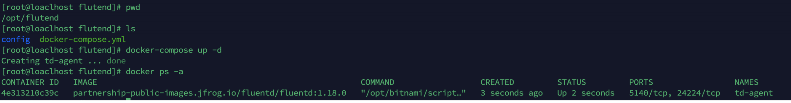


## 三、EFK配置调

### 1. elasticsearch索引 

登录elasticsearch后点击Management，当fluentd向ES成功发送数据后，可以在Index Management看到`unified-artifactory`和 `unified-metrics-artifactory`两个Index

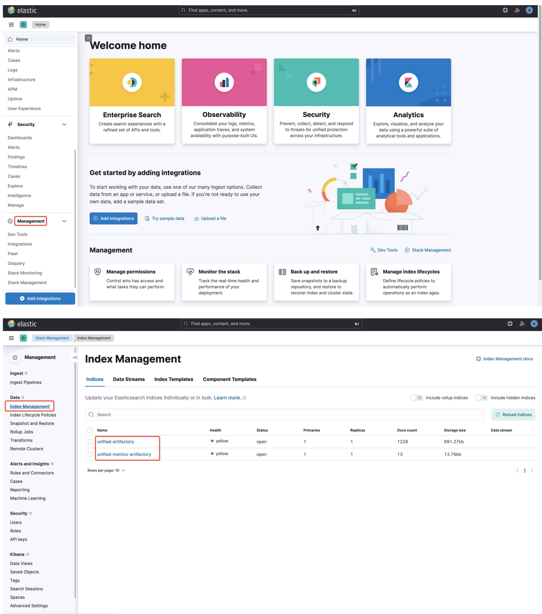


### 2. 导⼊模版 

导⼊JFrog Github项⽬中提送的NSJSON⽂件，点击Save Object，点击Import导⼊ [kibana_dashboard_v1.ndjson](https://github.com/jfrog/log-analytics-elastic/blob/master/kibana/kibana_dashboard_v1.ndjson)

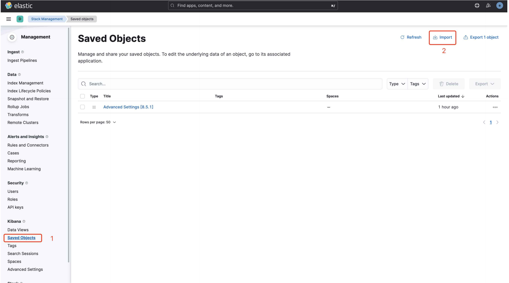
 
### 3. Dashboard调试

点击Discover可以看到unified-artifactory和unified-metrics-artifactory下的数据

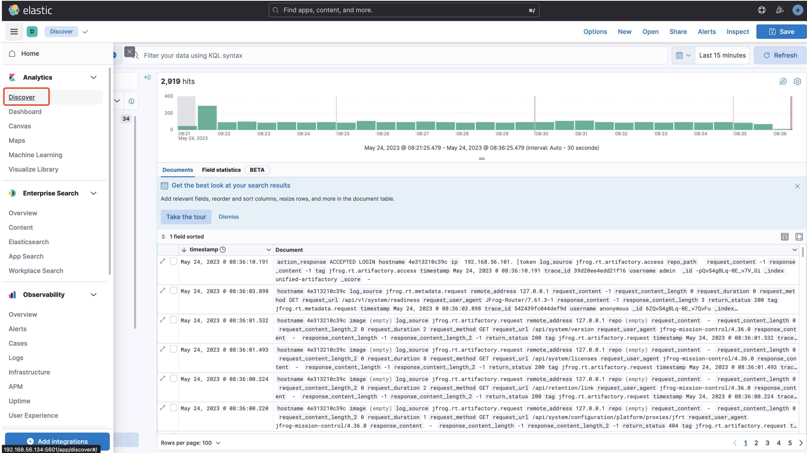

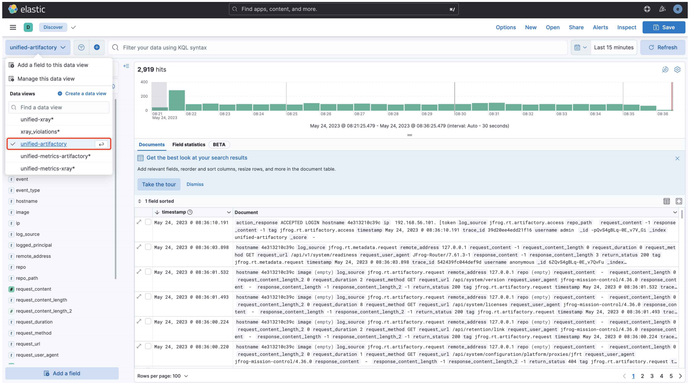

点击Dashboard可以看到导⼊的Artifactory相关的模版

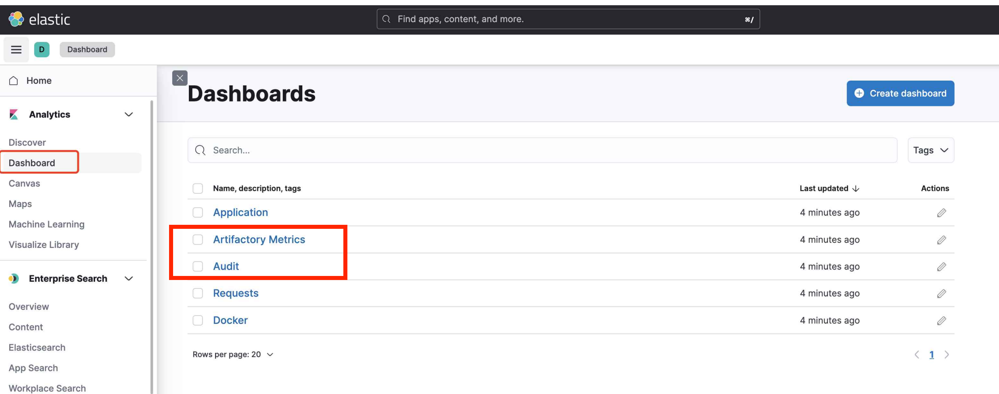


## EFK自定义可视化图表监控

EFK集成自定义可视化图表

remote仓库平均请求时长
 
 - artifactory-request-out.log
 - fluent.conf添加source

ES中添加图表
 
 - remote avg request

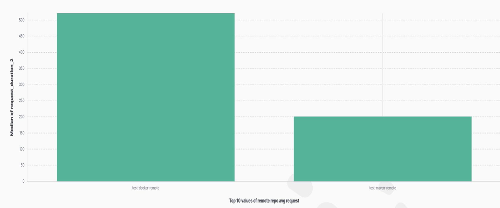

### **EFK集成自定义可视化图表**

**source**
  
 - 指定`request-out log`
 - 过滤字段

**转换`request_duration`**
  
 - 添加fileter

 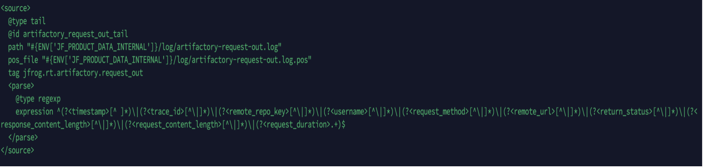

 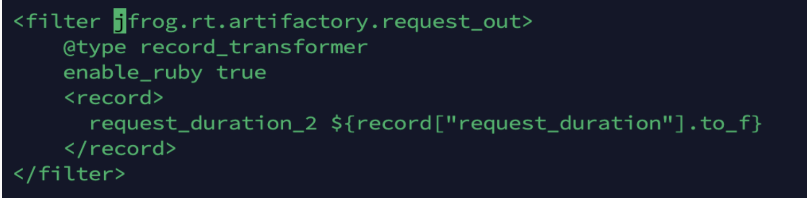
