# **第一节 Elastic 认证考试**

## **1、Elastic 认证介绍**

### **1-1 Elastic Certified Engineer**

* Elastic Certified 2018 年 6 月 29 日推出
* OPS Analyst:Coming soon......
* 当前考试使用的 ES 版本为 7.2
	* 2019 年 8月6日从 6.5 升级到版本 7.2
* 考试形式:3个小时，12道实战题。目前只支持全英文形式
	* **综合性的 Hands-on Tasks**
	
[https://www.elastic.co/training/certification](https://www.elastic.co/training/certification)

* Elastic Certified Engineer
* Elastic Certified Analyst
* Elastic Certified Observability Engineer

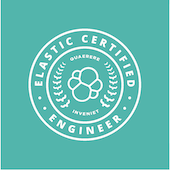 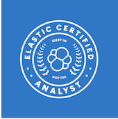 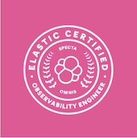

* Elastic Certified Engineer: 7.2
* Elastic Certified Analyst: 7.6
* Elastic Certified Observability Engineer: coming soon!

### **1-2 考试覆盖内容**

 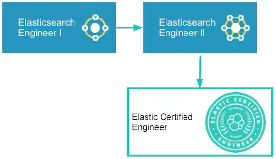
 
### **1-3 注册**

* 注册报名:

 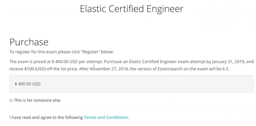
 
	* [https://training.elastic.co/exam/elastic-certified-engineer]()
* 预约后，网上在线考试

### **1-4 预约网上考试时间**

* 注册 email
* 选择时区
* 预约考试时间
* 提前 48 小时，取消考试

 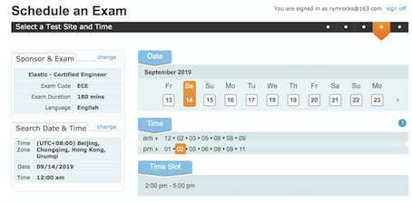
 
### **1-5 考试过程**

**远程考试**
 
* 提前 20 分钟，环境准备与检查
* 共享桌面与摄像头，会有专人远程查看
* 考试前需要核对 ID 证件
* 不准有嘴部动作:说话，吃东西，喝水 / **不允许有其他的程序在后台运行**
*  密闭房间内，考试期间不能有其他人进入，需要保持桌面干净整齐，没有其他物品

### **1-6 考试环境**

 * 浏览器接入虚拟机，所有操作都在虚拟机内执行;虚拟机内可以使用浏览器连接 ES 官方文档
 * 只需一些基本的 Linux 命令
 	* 使用终端 SSH 连接到考试用的主机 / Vim 编辑文件
 * 本机部署了多个 ES 集群，均有安装 Kibana
 	* 可以使用 Dev Tool
 	* 安全管理功能
 	*  可视化组件的功能**被禁用了**

### **1-7 考试环境**

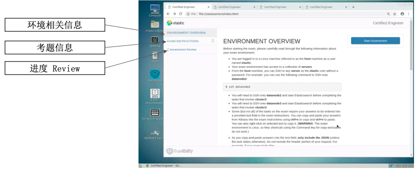

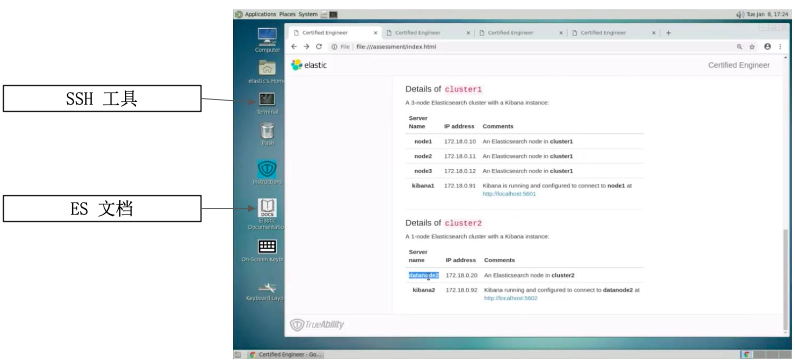
 
### **1-8 考试题型**

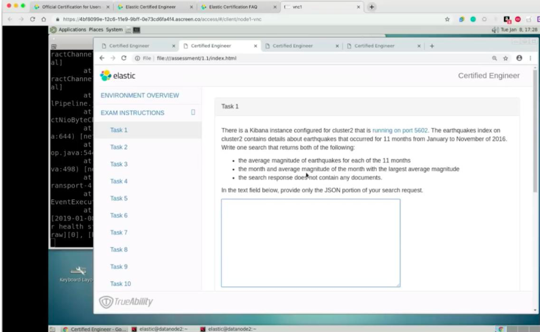

### **1-9 认证的时效性**

* 认证两年内有效
* 会持续推出新的认证
	* Ops Analysis
	* Logging Specialist
	* Search Specialist
	* Security Analysis

## **2、考点梳理**

### **2-1 考题形式**

**集群配置**

* 配置 3 个节点的集群，指定节点的名字。按照需求，为每一个节点指定名字;并且为节点指定特定的角色; 为节点设定不同的属性
* 设置 Hot & Warm Architecture / 修改 JVM Heap 配置 / 设置安全保护

**搜索与聚合**

* 索引中包含了一年的销售数据:
* 找出的销售额最高的月份的总销售额是多少
* Match / Match Phrase / Highlight / Sorting / 分页

### **2-2 考试题型**

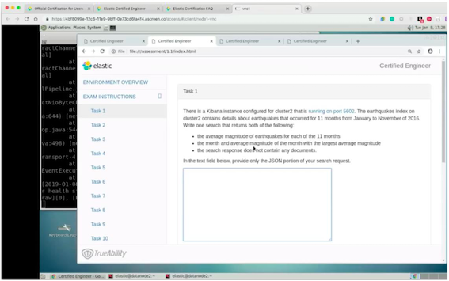

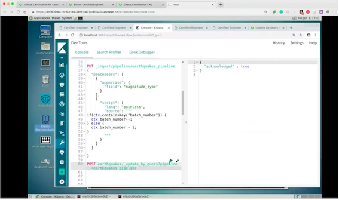

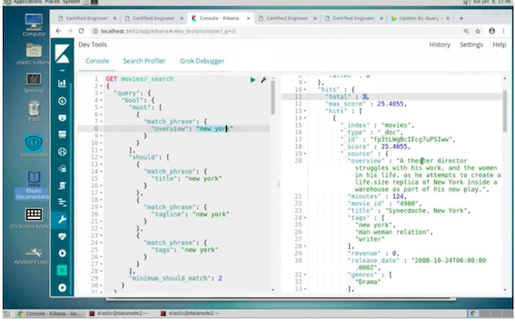

### **2-3 考试建议**

*  仔细阅读考纲，记住每个考点的官方文档位置
*  有时间可以将相关的教程视频进行快速的回顾
*  考试之前，适当的动手做一些实战，需要理解每一个考点，切勿死记硬背

## **3、考纲整理**

### **3-1 安装配置**

**1、根据需求，配置部署集群**

* Setup Elasticsearch
	* Installing Elasticsearch
	* Configuring Elasticsearch

* Module 
	* Node
	* Discovery and cluster formation 

**2、配置集群的节点**

* Modules： Node

**3、为集群设置安全保护**

* **Set up Elasticsearch: `Configuration > Security settings`**
* 集群身份认证与用户鉴权
* 集群内部安全通信
* 集群与外部间的安全通信

**4、基于 X-Pack，为集群配置 RBAC**

### **3-2 索引数据**

**1、根据需求，定义一个索引**

* REST APIs
* Index APIs > Create Index 
* 显示 Mapping 设置和常见字段类型

**2、执行索引的Index，CRUD**

* 文档的基本CRUD与批量操作

**3、定义与使用 Index Alias**

* Index APIs：
	* Add Index  Alias / Delete Index Alias / Get Index Alias / Index Alias exists / Update Index Alias
	* 使用 Search Template 和 Index Alias 查询

**4、定义与使用 Index Teamplate**

* Index APIs
	* Put index template / delete index template / get template index / index template exists
*  Index Template 和 Dynamic Template

**5、定义与使用 Dynamic Template**

* Mapping
	* Dynamic Mapping > Dynamic Templates
* Index Template 和 Dynamic Template

**6、使用 Reindex API & Update By Query 重新索引文档**

* Update By Query & Reindex API

**7、定义 Ingest Pipeline（包括使用 Painless 脚本）**

* Ingest Node 
	* Pipeline Definition / Ingest APIs

* Ingest Pipeline &  Painless Script

### **3-3 查询**

**1、使用 terms 或 phrase 查询一个或多个字段**

* Query DSL

**2、使用 Bool query**

**3、高亮查询结果**

**4、对查询结果排序**

* Search APIs： Request body search： sort

**5、对查询结果分页**

**6、使用 Scroll API**

* Search APIs： Request body search： **Scroll API**

**7、使用模糊查询**

**8、使用 Search Template**

**9、跨集群搜索**

* Search across clusters
*  配置跨集群搜索

### **3-4 聚合**

**1、metric & Bucket Aggregation**

* Aggregations
	* Bucket Aggregations
		* Metric Aggregations
		* Bucket& Metrix 聚合分析及嵌套聚合

**2、sub-aggregation**

* Aggregations（查看 Structuring Aggregations）
* Bucket & Metric 聚合分析及嵌套聚合

**3、pipeline aggregation**

* Pipeline Aggregations
*  Pipeline 聚合分析
 
### **3-5 映射与分词**

**1、按需定义索引 mapping**

* REST APIs： Index APIs > Put Mapping

**2、按需自定义 analyzer**

* Mapping： Mapping parameters： fields

**3、为字段定义多字段类型（不同的字段使用不同的 type 和 analyzer）**

**4、定义和查询 nested 文档**

**5、定义及查询 parent/child 文档** 

* Mapping： Join

### **3-6 集群管理**

**1、按需将索引的分片分配到特定的节点**

**2、为索引配置 Shard allocation awareness & Force awareness**

**3、诊断分片的问题，恢复集群的health 状态**

**4、Backup & Restore 集群或者特定的索引**

* Administering Elasticsearch > Back up a cluster
* Modules > Snapshot and Restore

**5、配置一个 hot & warm 架构的集群**

**6、配置跨集群搜索**

* Cross-cluster search
* 配置跨集群搜索

## **4、模拟测试**

### **4-1 安装配置**

**1、部署 3 节点的集群，需要同时满足以下要求**

* cluster.name
* 将每个节点的名字设为和机器名一样，分别为 node1，node2，node3
	* node.name
* node1 配置成`dedicated master-eligable`节点
* node2和node3配置成 ingest 和 data node
	* 记得要将 node.ml 设置成 false
* 设置 jvm 为1g
	* 设置 jvm.options
	
**2、配置 3节点的集群，加上一个 Kibana 的实例，设定以下安全防护**

* 为集群配置 basic authentication
* 将 Kibana 连接到 Elasticsearch
* 创建一个名为 es 的用户
* 创建一个名为 orders 的索引
* es 用户只能读取和写入 orders 的索引，不能删除及修改 orders

**3、配置 3节点的集群，同时满足以下要求**

* 确保索引 A 的分片全部落在在节点1
* 索引 B 分片全部落在 节点 2和3
* 不允许删除数据的情况下，保证集群状态为 Green

### **4-2 索引数据**

**1、为一个索引，按要求设置以下 dynamic Mapping**

* 一切 text 类型的字段，类型全部映射成 keyword
* 一切以 `int_` 开头命名的字段，类型都设置成 integer

**2、设置一个Index Template，符合以下的要求**

* 为 log 和log- 开头的索引。创建 3 个主分片，1 个副本分片
* 同时为索引创建一个相应的 alias
* 使用 bulk API，写入多条电影数据

**3、为 movies index 设定一个 Index Alias，默认查询只返回评分大于3的电影**

**4、给一个索引 A，要求创建索引 B，通过 Reindex API，将索引 A 中的文档写入索引 B，同时满足以下要求**

* 增加一个整形字段，将索引 A中的一个字段的字符串长度，计算后写入
* 将 A 文档中的字符串以`“;”`分隔后，写入索引B中的数组字段中

**5、定义一个 Pipeline，并且将 eathquakes 索引的文档进行更新**

* pipeline的 ID 为 `eathquakes_pipeline`
* 将 `magnitude_type` 的字段值改为大写
* 如果文档不包含 `“batch_number”`, 增加这个字段，将数值设置为 1
* 如果已经包含 `batch_number`, 字段值`+1`

**6、为索引中的文档增加一个新的字段，字段值为现有字段1+现有字段2+现有字段3**

### **4-3 查询**

**1、写一个查询，要求某个关键字在文档的 4 个字段中至少包含两个以上**

* bool 查询，should / `minimum_should_match`

**2、按照要求写一个 search template**

* 写入 search template
* 根据 search template 写出相应的 query

**3、对一个文档的多个字段进行查询，要求最终的算分是几个字段上算分的总和，同时要求对特定字段设置 boosting 值**

**4、针对一个索引进行查询，当索引的文档中存在对象数组时，会搜索到了不期望的数据。需要重新定义 mapping，并提供改写后**

* Nested Object

### **4-4 聚合**

**1、earthquakes索引中包含了过去11个月的地震信息，请通过一句查询，获取以下信息**

* 过去11个月，每个月的平均 地震等级（magiitude）
* 过去11个月里，平均地震等级最高的一个月及其平均地震等级
* 搜索不能返回任何文档

**2、Query Fileter Bucket Filter**

**3、Pipeline Aggregation -> Bucket Filter**

### **4-5 映射与分词**

* 一篇文档，字段内容包括了 “hello & world”，索引后，要求使用 `match_phrase query`, 查询 hello & world 或者 hello and world 都能匹配

* reindex 索引，同时确保给定的两个查询，都能搜索到相关的文档，并且文档的算分是一样的
	* match 查询，分别查 “smith's” ，“smiths”
	* 在不改变字段的属性，将数据索引到新的索引上
	* 确保两个查询有一致的搜索结果和算分 

### **4-6 集群管理**

* 安装并配置 一个 hot & warm 架构的集群
	* 三个节点， node 1 为 hot ， node2 为 warm，node 3 为cold
	* 三个节点均为 master-eligable 节点
	* 新创建的索引，数据写入 hot 节点
	* 通过一条命令，将数据从 hot 节点移动到 warm 节点

* 为两个集群配置跨集群搜索
	* 两个集群都有 movies 的索引
	* 创建跨集群搜索
	* 创建一条查询，能够同时查到两个集群上的 movies 数据
* 解决集群变红或者变黄的问题
	* 技能1：通过 explain API 查看
	* 技能2：shard filtering API，查看 include
	* 技能3： 更新一下 routing，确认 replica 可以分配（include 更加多的 rack）
* 解决方案：
	* 为集群配置延迟分配和一个节点上最多几个分片的配置
	* 设置 Replica 为 0
	* 删除 dangling index
	* 使用了错误的 routing node attribute
* 备份一个集群中指定的几个索引
 
