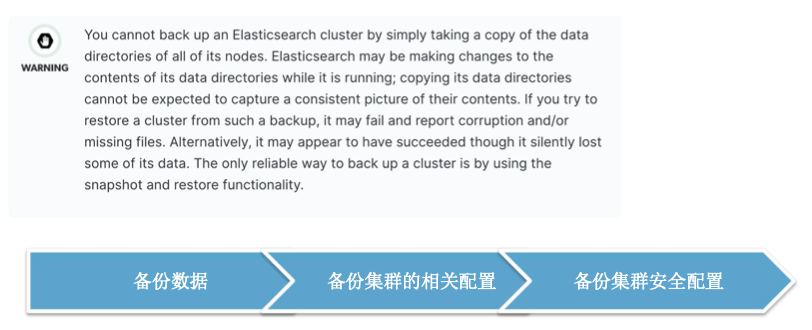
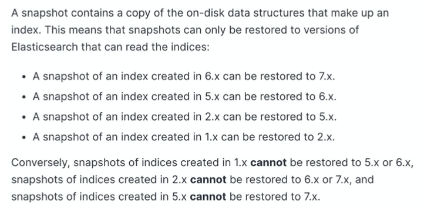

# **第二节 集群 Backup & Restore**

## **1、集群的备份与恢复**


 
## **2、注册 Repository**

**Elasticsearch.yml 加入相关的配置**

```
path.repo: ["/home/vagrant/bak"]
```

```
PUT /_snapshot/my_fs_backup
{
    "type": "fs",
    "settings": {
        "location": "/home/vagrant/bak",
        "compress": true
    }
}
```

还支持 Amazon S3, HDFS, Google Cloud Storage 等存储方式

## **3、快照的版本兼容**

 
 
## **4、Backup & Restore Demo**

### **4-1 修改注册 Repository 配置**

```
cd /etc/elasticsearch
vim elasticsearch.yml

path.repo: ["/home/vagrant/bak"]
```

### **4-2 启动Elasticsearch & kibana**

```
elasticsearch -E node.name=node0 -E cluster.name=jx -E path.data=node0_data -d
elasticsearch -E node.name=node1 -E cluster.name=jx -E path.data=node1_data -d
elasticsearch -E node.name=node2 -E cluster.name=jx -E path.data=node2_data -d
```
```
nohup kibana 
```

### **4-3 创建一个 repositoty**

```
# 创建一个 repositoty
PUT /_snapshot/my_fs_backup
{
    "type": "fs",
    "settings": {
        "location": "/home/vagrant/bak",
        "compress": true
    }
}
```


### **4-4 创建一个snapshot**

```
# 创建一个snapshot
PUT /_snapshot/my_fs_backup/snapshot_1?wait_for_completion=true
```

***Output:***

```
{
  "snapshot" : {
    "snapshot" : "snapshot_1",
    "uuid" : "Tz7tdndGR6i9BPXlRg3L1w",
    "version_id" : 7100199,
    "version" : "7.10.1",
    "indices" : [
      "my_index",
      "kibana_sample_data_ecommerce",
      ".async-search",
      "kibana_sample_data_flights",
      ".kibana_1",
      ".kibana-event-log-7.9.1-000002",
      ".apm-agent-configuration",
      ".kibana-event-log-7.9.1-000001",
      "kibana_sample_data_logs",
      "ilm-history-2-000001",
      "ilm-history-2-000002",
      "log-2020.11.24",
      ".apm-custom-link",
      "log-2020.11.23",
      ".kibana_task_manager_1",
      "my_index1"
    ],
    "data_streams" : [ ],
    "include_global_state" : true,
    "state" : "SUCCESS",
    "start_time" : "2020-12-26T16:55:36.839Z",
    "start_time_in_millis" : 1609001736839,
    "end_time" : "2020-12-26T16:55:39.866Z",
    "end_time_in_millis" : 1609001739866,
    "duration_in_millis" : 3027,
    "failures" : [ ],
    "shards" : {
      "total" : 17,
      "failed" : 0,
      "successful" : 17
    }
  }
}
```

### **4-5 指定索引创建快照**

```
# 指定索引创建快照
PUT /_snapshot/my_fs_backup/snapshot_2?wait_for_completion=true
{
  "indices": "my_index",
  "ignore_unavailable": true,
  "include_global_state": false,
  "metadata": {
    "taken_by": "jacob",
    "taken_because": "backup before upgrading"
  }
}
```

***Output:***

```
"snapshot" : {
    "snapshot" : "snapshot_2",
    "uuid" : "HtIH5dRHR0OxzBaMvi444w",
    "version_id" : 7100199,
    "version" : "7.10.1",
    "indices" : [
      "my_index"
    ],
    "data_streams" : [ ],
    "include_global_state" : false,
    "metadata" : {
      "taken_by" : "jacob",
      "taken_because" : "backup before upgrading"
    },
    "state" : "SUCCESS",
    "start_time" : "2020-12-26T17:05:17.350Z",
    "start_time_in_millis" : 1609002317350,
    "end_time" : "2020-12-26T17:05:17.551Z",
    "end_time_in_millis" : 1609002317551,
    "duration_in_millis" : 201,
    "failures" : [ ],
    "shards" : {
      "total" : 1,
      "failed" : 0,
      "successful" : 1
    }
  }
}
```

### **4-6 查看所有的快照**

```
# 查看所有的快照
GET /_snapshot/my_fs_backup/_all
```

***Output:***

```
{
  "snapshots" : [
    {
      "snapshot" : "snapshot_1",
      "uuid" : "Tz7tdndGR6i9BPXlRg3L1w",
      "version_id" : 7100199,
      "version" : "7.10.1",
      "indices" : [
        "my_index",
        "kibana_sample_data_ecommerce",
      	....
        "my_index1"
      ],
      "data_streams" : [ ],
      "include_global_state" : true,
      "state" : "SUCCESS",
      "start_time" : "2020-12-26T16:55:36.839Z",
      "start_time_in_millis" : 1609001736839,
      "end_time" : "2020-12-26T16:55:39.866Z",
      "end_time_in_millis" : 1609001739866,
      "duration_in_millis" : 3027,
      "failures" : [ ],
      "shards" : {
        "total" : 17,
        "failed" : 0,
        "successful" : 17
      }
    },
    {
      "snapshot" : "snapshot_2",
      "uuid" : "HtIH5dRHR0OxzBaMvi444w",
      "version_id" : 7100199,
      "version" : "7.10.1",
      "indices" : [
        "my_index"
      ],
      "data_streams" : [ ],
      "include_global_state" : false,
      "metadata" : {
        "taken_by" : "jacob",
        "taken_because" : "backup before upgrading"
      },
      "state" : "SUCCESS",
      "start_time" : "2020-12-26T17:05:17.350Z",
      "start_time_in_millis" : 1609002317350,
      "end_time" : "2020-12-26T17:05:17.551Z",
      "end_time_in_millis" : 1609002317551,
      "duration_in_millis" : 201,
      "failures" : [ ],
      "shards" : {
        "total" : 1,
        "failed" : 0,
        "successful" : 1
      }
    }
  ]
}
```

### **4-7 删除快照**

```
DELETE /_snapshot/my_fs_backup/snapshot_2
```
```
POST /_snapshot/my_fs_backup/snapshot_1/_restore
{
  
}
```

***Output:***

**because an open index with same name already exists in the cluster.**

```
{
  "error" : {
    "root_cause" : [
      {
        "type" : "snapshot_restore_exception",
        "reason" : "[my_fs_backup:snapshot_1/Tz7tdndGR6i9BPXlRg3L1w] cannot restore index [.kibana-event-log-7.9.1-000002] because an open index with same name already exists in the cluster. Either close or delete the existing index or restore the index under a different name by providing a rename pattern and replacement name"
      }
    ],
    "type" : "snapshot_restore_exception",
    "reason" : "[my_fs_backup:snapshot_1/Tz7tdndGR6i9BPXlRg3L1w] cannot restore index [.kibana-event-log-7.9.1-000002] because an open index with same name already exists in the cluster. Either close or delete the existing index or restore the index under a different name by providing a rename pattern and replacement name"
  },
  "status" : 500
}
```

### **4-8 回复快照**

```
DELETE my_index

POST /_snapshot/my_fs_backup/snapshot_1/_restore
{
  "indices": "my_index",
  "index_settings": {
    "index.number_of_replicas": 5
  },
  "ignore_index_settings": [
    "index.refresh_interval"
  ]
}
```

***Output:***

```
{
  "accepted" : true
}
```

```
DELETE /_snapshot/my_fs_backup/snapshot_1
```

### **4-9 查看快照文件**

```
cd /home/vagrant/bak

$ ls
index-2  index.latest  indices  meta-Tz7tdndGR6i9BPXlRg3L1w.dat  snap-Tz7tdndGR6i9BPXlRg3L1w.dat
```