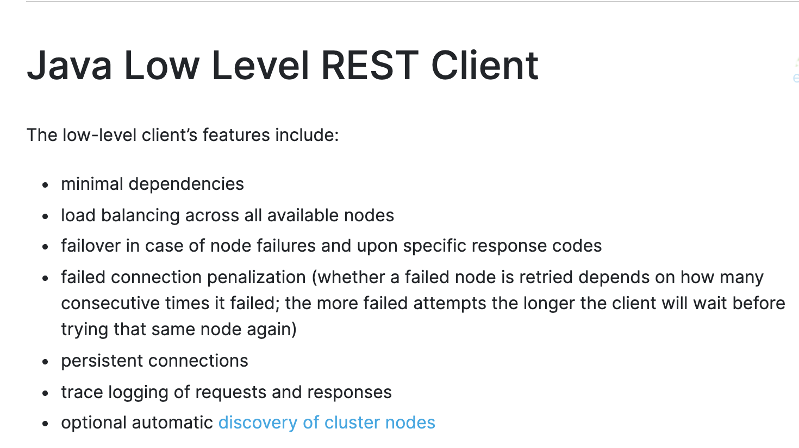
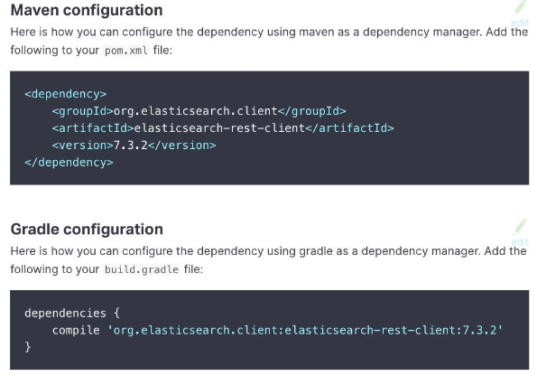
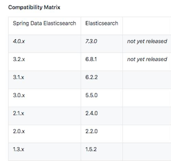

# **第三节 基于 Java 和 Elasticsearch 开发应用**

## **1、Java Low Level Client**

[https://www.elastic.co/guide/en/elasticsearch/client/java-rest/master/java-rest-low.html](https://www.elastic.co/guide/en/elasticsearch/client/java-rest/master/java-rest-low.html)

[https://snapshots.elastic.co/javadoc/org/elasticsearch/client/elasticsearch-rest-client/8.0.0-SNAPSHOT/org/elasticsearch/client/package-summary.html](https://snapshots.elastic.co/javadoc/org/elasticsearch/client/elasticsearch-rest-client/8.0.0-SNAPSHOT/org/elasticsearch/client/package-summary.html)

## **2、Maven & Gradle Configuration**

## **3、Java High Level Client**

* 从6.0开始提供
* 基于 Low Level REST Client 构建
	* 暴露 API，Query DSL 相关的方法，返回对应的 Response 对象
* 支持同步和异步调用
	* Synchronous methods 返回 Response 对象
	*  Async 前缀的方法，是异步调用，需要在参数中提供 listener

## **4、Elasticsearch Spring Data**

* [https://github.com/spring-projects/spring-data-elasticsearch](https://github.com/spring-projects/spring-data-elasticsearch)
*  Java Based @Configuration for ES client
*  自动实现 Repository 接口，实现基本 CRUD

