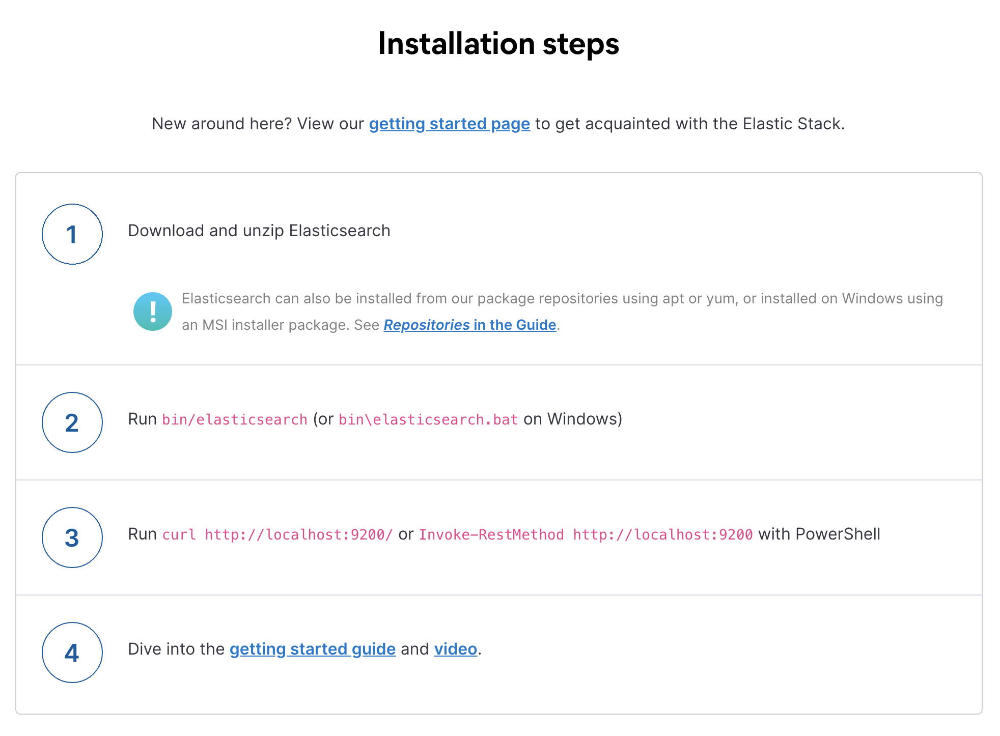
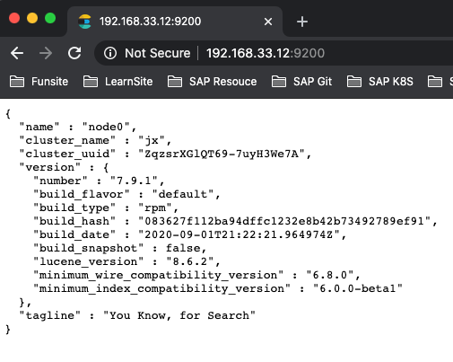
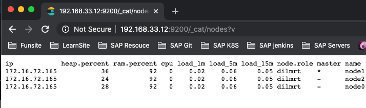

# **第一节 Elasticsearch的安装与简单配置**

## **1、本节知识点** 

* 下载并运行Elasticsearch 
* Elasticsearch目录结构 
* Elasticsearch的基本配置参数 
* 学习如何安装及查看Elasticsearch插件 
* 学习在本机运行多个Elasticsearch实例，方便了解分布式系统的工作机制 


### 本地部署 & 水平扩展


* 开发环境部署 
* 一个节点承担多种角色 
* 单机部署多个节, 便于学习了解分布式集群的工作机制 

## **2、安装指导**

### 2-1 安装Java 

* 运行Elasticsearch，需安装并配置JDK 
	* 设置`$JAVA_HOME` 
* 各个版本对Java的依赖 
	* Elasticsearch 5需要Java 8以上的版本 
	* Elasticsearch从6.5开始支持Java 11 
	* https://www.elastic.co/support/matrix
	* **7.0开始，内置了Java环境** 

### 2-2 获取 ElasticSearch 安装包

* 下载二进制文件 https://www.elastic.co/downloads/elasticsearch 
* 支持Docker本地运行 
* Helm chart for kubernetes 
* Puppet Module 

### 2-3 安装并运行ElasticSearch



## 3、Vagrant-Centos7 虚拟机安装 ES7 指南

### 3-1 Vagrantfile-Centos7

* ip: `"192.168.33.12"`
* memory:`"2048"`

```
Vagrant.configure("2") do |config|
  # config.vm.box = "ETM"
  config.vm.box = "centos/7"
  config.vm.hostname = "elasticsearch7"
  # config.vm.customize ["modifyvm", :id, "--memory", 2048]
  
  config.vm.network :private_network, ip: "192.168.33.12"
  # config.vm.network :forwarded_port, guest: 22, host: 2227, id: "ssh"

  config.vm.provider "vmware_desktop" do |vb| 
    # Customize the amount of memory on the VM:
    vb.memory = "2048"
  end
end
```

### 3-2 Centos7 安装 ES7 通过 yum

https://www.elastic.co/guide/en/elasticsearch/reference/7.9/rpm.html#rpm-repos

```
$ sudo vim  /etc/yum.repos.d/elasticsearch.repo
```
```
[elasticsearch]
name=Elasticsearch repository for 7.x packages
baseurl=https://artifacts.elastic.co/packages/7.x/yum
gpgcheck=1
gpgkey=https://artifacts.elastic.co/GPG-KEY-elasticsearch
enabled=0
autorefresh=1
type=rpm-md
```
```
$ sudo yum install --enablerepo=elasticsearch elasticsearch 
$ yum info elasticsearch
Failed to set locale, defaulting to C
Loaded plugins: fastestmirror
Determining fastest mirrors
 * base: mirrors.bfsu.edu.cn
 * extras: mirrors.bfsu.edu.cn
 * updates: mirrors.163.com
Installed Packages
Name        : elasticsearch
Arch        : x86_64
Version     : 7.9.1
Release     : 1
Size        : 508 M
Repo        : installed
From repo   : elasticsearch
Summary     : Distributed RESTful search engine built for the cloud
URL         : https://www.elastic.co/
License     : Elastic License
Description : Reference documentation can be found at
            :   https://www.elastic.co/guide/en/elasticsearch/reference/current/index.html
            :   and the 'Elasticsearch: The Definitive Guide' book can be found at
            :   https://www.elastic.co/guide/en/elasticsearch/guide/current/index.html
```

```
$ cd /usr/share/elasticsearch/bin
$ ls
elasticsearch           elasticsearch-env            elasticsearch-plugin           elasticsearch-sql-cli-7.9.1.jar  x-pack-security-env
elasticsearch-certgen   elasticsearch-env-from-file  elasticsearch-saml-metadata    elasticsearch-syskeygen          x-pack-watcher-env
elasticsearch-certutil  elasticsearch-keystore       elasticsearch-setup-passwords  elasticsearch-users
elasticsearch-cli       elasticsearch-migrate        elasticsearch-shard            systemd-entrypoint
elasticsearch-croneval  elasticsearch-node           elasticsearch-sql-cli          x-pack-env
```

```
$ sudo vim /etc/profile.d/es.sh

ES_HOME=/usr/share/elasticsearch
PATH=$ES_HOME/bin:$PATH
export PATH ES_HOME
export CLASSPATH=.

$ source /etc/profile.d/es.sh
```

**修改启动所需的文件夹的用户**

```
$ sudo chown -R vagrant:vagrant /usr/share/elasticsearch
$ sudo chown -R vagrant:elasticsearch /etc/sysconfig/elasticsearch
$ sudo chown -R vagrant:elasticsearch /etc/elasticsearch
$ sudo chown -R vagrant:elasticsearch /var/log/elasticsearch
```


```
$ elasticsearch --help
Starts Elasticsearch

Option                Description                                               
------                -----------                                               
-E <KeyValuePair>     Configure a setting                                       
-V, --version         Prints Elasticsearch version information and exits        
-d, --daemonize       Starts Elasticsearch in the background                    
-h, --help            Show help                                                 
-p, --pidfile <Path>  Creates a pid file in the specified path on start         
-q, --quiet           Turns off standard output/error streams logging in console
-s, --silent          Show minimal output                                       
-v, --verbose         Show verbose output
```


```
$ elasticsearch -V
Version: 7.9.1, Build: default/rpm/083627f112ba94dffc1232e8b42b73492789ef91/2020-09-01T21:22:21.964974Z, JVM: 14.0.1
```

### 3-3 Elasticsearch 的文件目录结构


**config：**

```
$ cd /etc/elasticsearch/
$ ls
elasticsearch.keystore  jvm.options      jvm.options.d      role_mapping.yml  users
elasticsearch.yml       jvm.options.bak  log4j2.properties  roles.yml         users_roles

$ less elasticsearch.yml
...
# ----------------------------------- Paths ------------------------------------
#
# Path to directory where to store the data (separate multiple locations by comma):
#
path.data: /var/lib/elasticsearch
#
# Path to log files:
#
path.logs: /var/log/elasticsearch
...
```


**data：**

```
$ cd /var/lib/elasticsearch

$ tree .
.
└── nodes
    └── 0
        ├── node.lock
        └── _state
            ├── manifest-0.st
            ├── node-0.st
            ├── segments_13
            ├── write.lock
            ├── _z.cfe
            ├── _z.cfs
            └── _z.si

3 directories, 8 files
```

**log：**

```
$ cd /var/log/elasticsearch
$ ls -l
total 10996
-rw-r--r--. 1 vagrant elasticsearch       0 Sep 17 07:13 elasticsearch_audit.json
-rw-r--r--. 1 vagrant elasticsearch       0 Sep 17 07:13 elasticsearch_deprecation.json
-rw-r--r--. 1 vagrant elasticsearch       0 Sep 17 07:13 elasticsearch_deprecation.log
-rw-r--r--. 1 vagrant elasticsearch       0 Sep 17 07:13 elasticsearch_index_indexing_slowlog.json
-rw-r--r--. 1 vagrant elasticsearch       0 Sep 17 07:13 elasticsearch_index_indexing_slowlog.log
-rw-r--r--. 1 vagrant elasticsearch       0 Sep 17 07:13 elasticsearch_index_search_slowlog.json
-rw-r--r--. 1 vagrant elasticsearch       0 Sep 17 07:13 elasticsearch_index_search_slowlog.log
-rw-r--r--. 1 vagrant elasticsearch   33849 Sep 17 14:43 elasticsearch.log
-rw-r--r--. 1 vagrant elasticsearch   48716 Sep 17 14:43 elasticsearch_server.json
...
```


### 3-3 JVM配置 

* 修改JVM - `config/jvm.options `
	* 7.1下载的默认设置是1GB 
* 配置的建议 
	* Xmx和Xms设置成一样 
	* Xmx不要超过机器内存的50% 
	* 不要超过30GB 

* 我们这边改成了512m

```
$ cd /etc/elasticsearch/
$ sudo vim jvm.options

# Xmx和Xms设置成一样
...
# Xms represents the initial size of total heap space
# Xmx represents the maximum size of total heap space

-Xms512m
-Xmx512m
...
```

### 3-4 运行单个Elasticsearch实例

```
 elasticsearch -E node.name=node0 -E cluster.name=jx -E path.data=node0_data 
```

* 下载解压Elasticsearch后执行 `bin/elasticsearch`，通过`-E`设定合适的参数 
* 访问`http://Iocalhost:9200` check cluster health state 
* 通过`_cat/nodes`查看节点 




### 3-5 安装与查看插件

ELasticsearch提供插件的机制对系统进行扩展 

* Discovery Plugin 
* Analysis Plugin 
* Security Plugin 
* Management Plugin 
* Ingest Plugin 
* Mapper Plugin 
* Backup Plugin 

```

$ elasticsearch-plugin -h
A tool for managing installed elasticsearch plugins

Commands
--------
list - Lists installed elasticsearch plugins
install - Install a plugin
remove - removes a plugin from Elasticsearch

Non-option arguments:
command              

Option             Description        
------             -----------        
-E <KeyValuePair>  Configure a setting
-h, --help         Show help          
-s, --silent       Show minimal output
-v, --verbose      Show verbose output


elasticsearch-plugin install analysis-icu


$ elasticsearch-plugin install analysis-icu
-> Installing analysis-icu
-> Downloading analysis-icu from elastic
[=================================================] 100%   
-> Installed analysis-icu

$ elasticsearch-plugin list
analysis-icu
```
https://www.elastic.co/guide/en/elasticsearch/plugins/current/intro.html

### 3-6 如何在开发机上运行多个Elasticsearch实例 

```
$ elasticsearch -E node.name=node0 -E cluster.name=jx -E path.data=node0_data -d
$ elasticsearch -E node.name=node1 -E cluster.name=jx -E path.data=node1_data -d
$ elasticsearch -E node.name=node2 -E cluster.name=jx -E path.data=node2_data -d
```
```
$ curl 127.0.0.1:9200/_cat/nodes?v
ip            heap.percent ram.percent cpu load_1m load_5m load_15m node.role master name
172.16.72.165           20          93   1    0.04    0.07     0.05 dilmrt    *      node1
172.16.72.165           14          92   1    0.04    0.07     0.05 dilmrt    -      node2
172.16.72.165           17          92   1    0.04    0.07     0.05 dilmrt    -      node0
```




* 删除进程

```
ps aux | grep elasticsearch

kill pid
```

```
$ ps -aux|grep elasticsearch | grep -v grep | awk '{print $2}'
2499
2518
2681
2700
2880
2910
```

**Demo**

* 本地安装单实例集群 
* 多节点集群 
* `http://localhost:9200/_cat/nodes?v`
* `http://localhost:9200/`


## **4、启动Elasticsearch 实例时遇到的问题**

### 4-1  Xmx和Xms设置成一样

```
$ cd /etc/elasticsearch/
$ sudo vim jvm.options

# Xmx和Xms设置成一样
...
# Xms represents the initial size of total heap space
# Xmx represents the maximum size of total heap space

-Xms512m
-Xmx512m
...
```

### 4-2  File descriptors ERROR

```
$ ERROR: [2] bootstrap checks failed
[1]: max file descriptors [4096] for elasticsearch process is too low, increase to at least [65535]
[2]: the default discovery settings are unsuitable for production use; at least one of [discovery.seed_hosts, discovery.seed_providers, cluster.initial_master_nodes] must be configured
ERROR: Elasticsearch did not exit normally - check the logs at /var/log/elasticsearch/jx.log
```

问题翻译过来就是：elasticsearch用户拥有的可创建文件描述的权限太低，至少需要65535；

[解决：max file descriptors [65535] for elasticsearch process is too low](https://blog.csdn.net/jiahao1186/article/details/90235771)

使用 `ulimit -Hn` 查看当前值，果然是4096，

解决办法：

切换到root用户修改

```
sudo vim /etc/security/limits.conf

vagrant soft nofile 65535
vagrant hard nofile 65535
```

exit -> 重新登录

```
$ ulimit -Hn
65535
```

### 4-3 [discovery.seed_hosts ..] must be configured

[Problems with access to Elasticsearch form outside machine](https://discuss.elastic.co/t/problems-with-access-to-elasticsearch-form-outside-machine/172450/3)


```
sudo vim /etc/elasticsearch/elasticsearch.yml
```


```
# --------------------------------- Discovery ----------------------------------
#
# Pass an initial list of hosts to perform discovery when this node is started:
# The default list of hosts is ["127.0.0.1", "[::1]"]
#
#discovery.seed_hosts: ["host1", "host2"]
discovery.seed_hosts: ["127.0.0.1", "[::1]","192.168.33.12"]
```

* 192.168.33.12: vm ip addr on vagrant


### 4-4 启动后`curl`本机9200没有问题，远程无法打开

```
sudo vim /etc/elasticsearch/elasticsearch.yml
```

```
# ---------------------------------- Network -----------------------------------
#
# Set the bind address to a specific IP (IPv4 or IPv6):
#
network.host: 0.0.0.0
```
