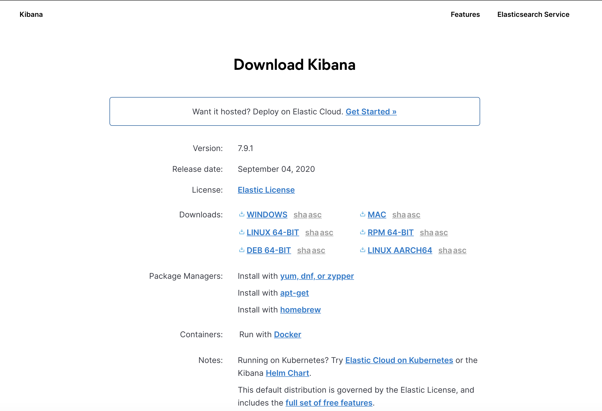
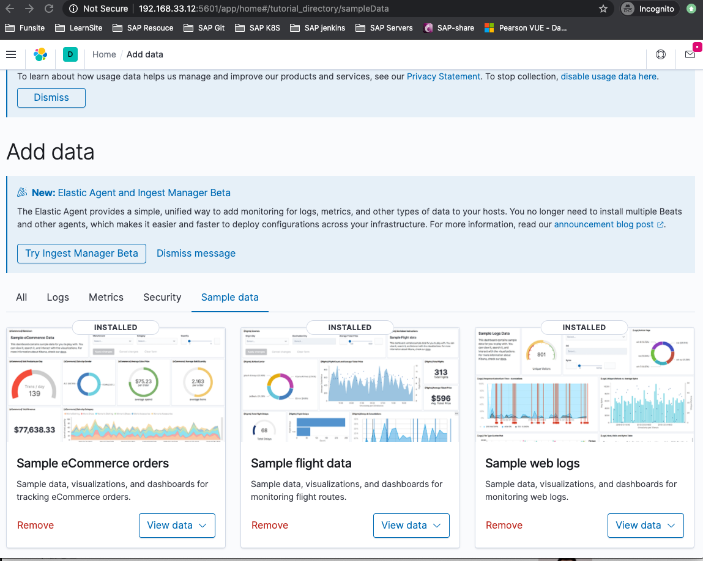
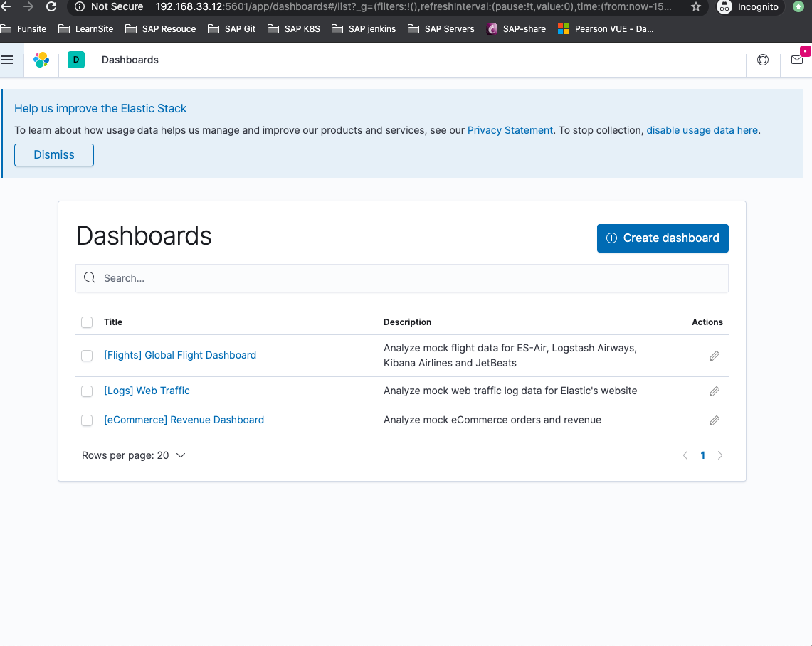
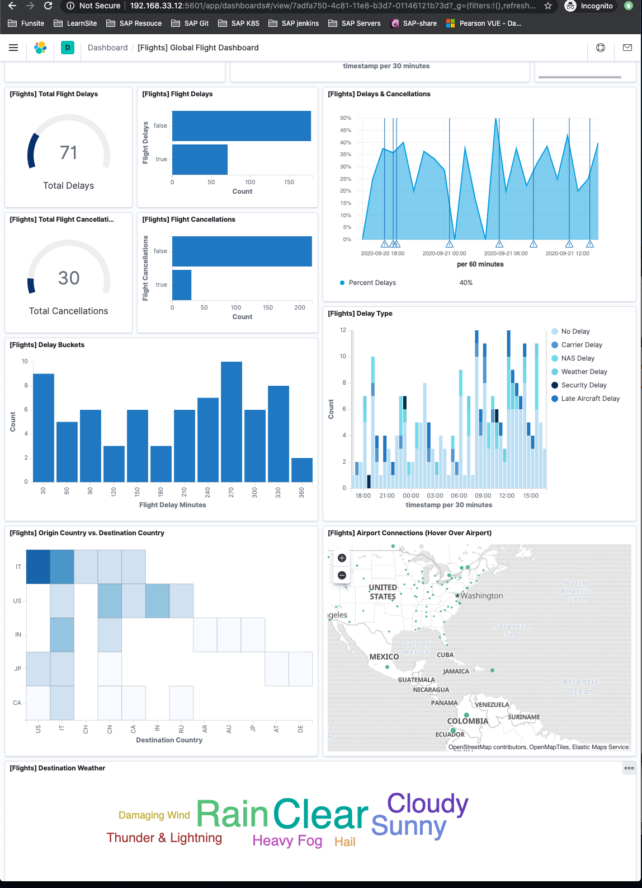
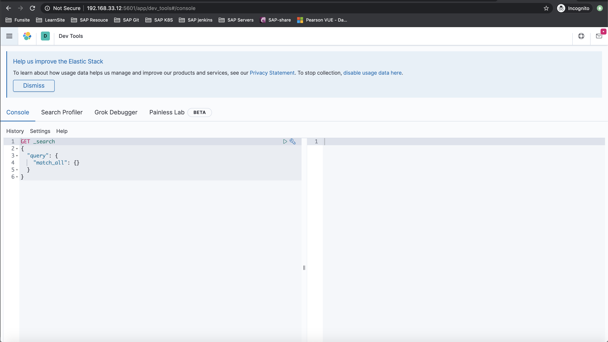
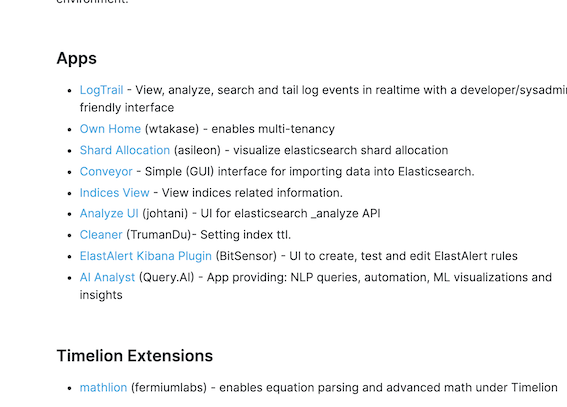

# **第二节 Kibana的安装与界面快速预览**


## **1、获取Kibana 安装包**

* 下载二进制文件：[ https://www.elastic.co/downloads/kibana]( https://www.elastic.co/downloads/kibana)  
* Docker 本地运行
* Helm Chart for Kubernetes
* Puppet Module



```
mdkir install && cd install
wget https://artifacts.elastic.co/downloads/kibana/kibana-7.9.1-linux-x86_64.tar.gz
tar -xvf kibana-7.9.1-linux-x86_64.tar.gz

sudo mkdir /usr/share/kibana
sudo chown -R vagrant:vagrant kibana
cp -R kibana-7.9.1-linux-x86_64/* /usr/share/kibana/
```

### 1-1 运行kibana

```
$ sudo vim /etc/profile.d/kb.sh

KB_HOME=/usr/share/kibana
PATH=$KB_HOME/bin:$PATH
export PATH KB_HOME
export CLASSPATH=.

$ source /etc/profile.d/kb.sh
```

```
$ kibana -h

  Usage: bin/kibana [command=serve] [options]
  
  Kibana is an open source (Apache Licensed), browser based analytics and search dashboard for Elasticsearch.
  
  Commands:
    serve  [options]  Run the kibana server
    help  <command>   Get the help for a specific command
  
  "serve" Options:
  
    -e, --elasticsearch <uri1,uri2>  Elasticsearch instances
    -c, --config <path>              Path to the config file, use multiple --config args to include multiple config files (default: ["/usr/share/kibana/config/kibana.yml"])
    -p, --port <port>                The port to bind to
    -q, --quiet                      Prevent all logging except errors
    -Q, --silent                     Prevent all logging
    --verbose                        Turns on verbose logging
    -H, --host <host>                The host to bind to
    -l, --log-file <path>            The file to log to
    --plugin-dir <path>              A path to scan for plugins, this can be specified multiple times to specify multiple directories (default: ["/usr/share/kibana/plugins","/usr/share/kibana/src/legacy/core_plugins"])
    --plugin-path <path>             A path to a plugin which should be included by the server, this can be specified multiple times to specify multiple paths (default: [])
    --plugins <path>                 an alias for --plugin-dir
    --optimize                       Run the legacy plugin optimizer and then stop the server
    -h, --help                       output usage information
```

```
sudo vim /usr/share/kibana/config/kibana.yml

...

#server.host: "localhost"
server.host: "0.0.0.0"
...
```

```
kibana
```


**后台运行 kibana**

```
nohup kibana &
```


```
http://192.168.33.12:5601/
```

```
$ ps -aux|grep kibana | grep -v grep | awk '{print $2}' # 查看es
4034
```

```
$ lsof -i:5601
COMMAND  PID    USER   FD   TYPE DEVICE SIZE/OFF NODE NAME
node    4034 vagrant   18u  IPv4  50509      0t0  TCP *:esmagent (LISTEN)
```


## **2、导入Sample 数据**





### 2-1 查看dashboard



### 2-2 Kibana Console

* Dev Tool 
* Search Profiler 
* Help + 一些快捷键
	* cmd+ / (查看API帮助文档）
	* cmd+option+1
	* cmd+option+0 
	* cmd+option+shift+0

 
 
## **3、kibana Plugins**

https://www.elastic.co/guide/en/kibana/current/known-plugins.html

 
 
```
kibana-plugin install /usr/plugin_location 
kibana-plugin list 
kibana remove 
```

**Demo**

* 运行Kibana 
* 尝试导入Sample数据，查看图形化工具＋Dashboard 
* Kibana Console开发利器 	
	* 快捷键／Elasticsearch REST API/Search Profiler/Grok/Debugger 

	
https://blog.csdn.net/Bobdragery/article/details/106842984

