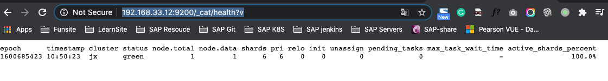
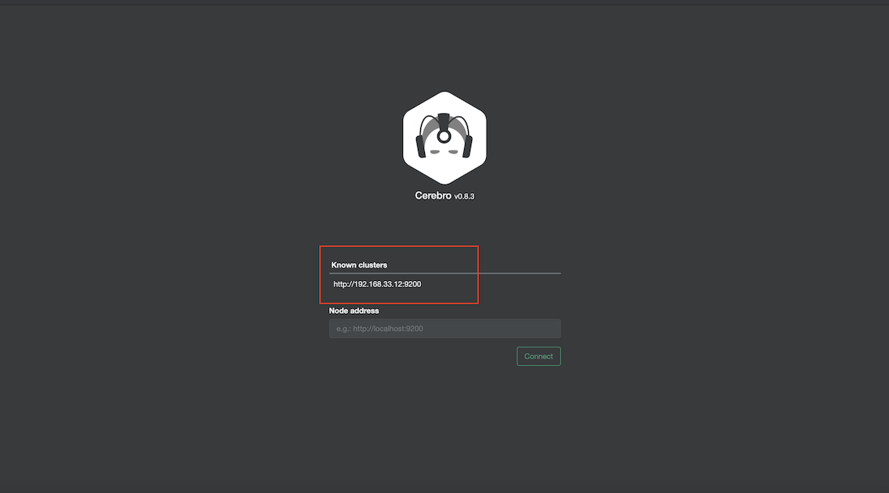
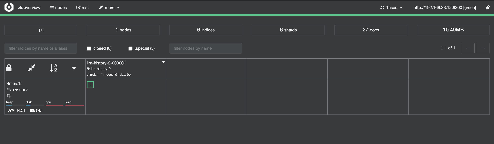
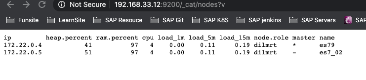
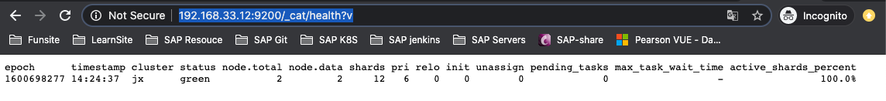
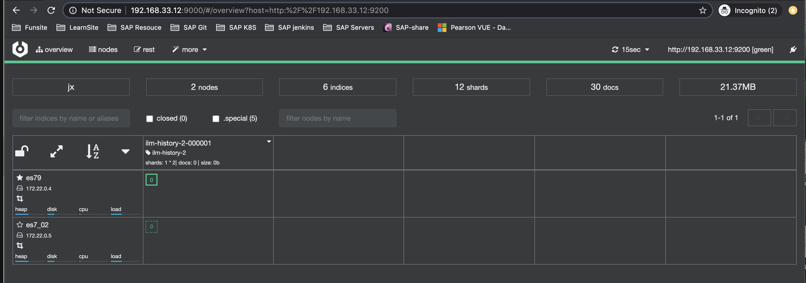
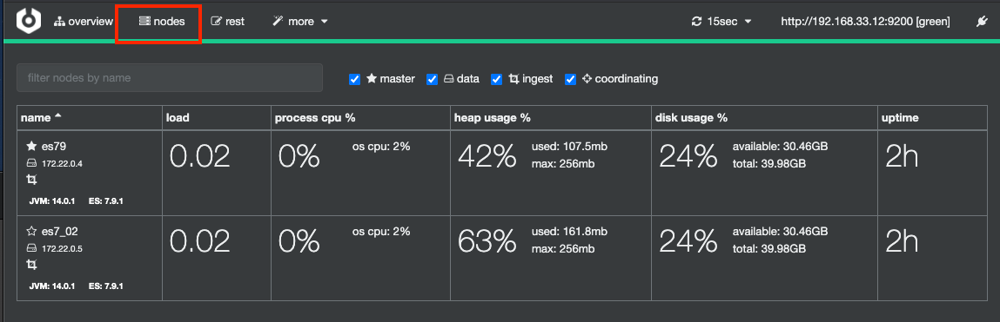

# **第三节 在Docker容器中运行Elasticsearch Kibana和Cerebro**

## **1、Elastic Stack 与 Docker容器**

* Elastic官方提供Docker Image 
* 如需安装定制的插件，可以写Dockerfile，将官方Image设为BaseImage 
* 2018年12月加入CNCF，提供helm 
	* https://github.com/helm/charts/tree/master/stable/elastic-stack 
* 2019年5月7.1版本发布时 
	* 同时发布ECK免费提供Elastic Operator on Kubernetes 


## **2、学习在本机Docker环境中运行ELK Stack(Centos 7)**

* [https://docs.docker.com/engine/install/centos/](https://docs.docker.com/engine/install/centos/)
* [https://docs.docker.com/engine/install/linux-postinstall/](https://docs.docker.com/engine/install/linux-postinstall/)
* [https://docs.docker.com/compose/install/](https://docs.docker.com/compose/install/)

```
$ docker version
Client: Docker Engine - Community
 Version:           19.03.13
 API version:       1.40
 Go version:        go1.13.15
 Git commit:        4484c46d9d
 Built:             Wed Sep 16 17:03:45 2020
 OS/Arch:           linux/amd64
 Experimental:      false
 ...
```

```
$ docker-compose --version
docker-compose version 1.27.3, build 4092ae5d
```

## 3、Demo[Docker ECK + Cerebro]

* 运行`Docker-compose`，本地构建更高效的开发坏境更直观地了解Easticsesrch分布式特胜 
* 集成Cerebro,方便查看集群状态 


### 3-1 单 ElasticSearch Node + Kibana + Cerebro

**docker-compose.yml**

```
version: '2.2'
services:
  cerebro:
    image: lmenezes/cerebro:0.8.3
    container_name: cerebro
    ports:
      - "9000:9000"
    command:
      - -Dhosts.0.host=http://192.168.33.12:9200
    networks:
      - es79net
  kibana:
    image: docker.elastic.co/kibana/kibana:7.9.1
    container_name: kibana79
    environment:
      - I18N_LOCALE=zh-CN
      - XPACK_GRAPH_ENABLED=true
      - TIMELION_ENABLED=true
      - XPACK_MONITORING_COLLECTION_ENABLED="true"
    ports:
      - "5601:5601"
    networks:
      - es79net
  elasticsearch:
    image: docker.elastic.co/elasticsearch/elasticsearch:7.9.1
    container_name: es79
    environment:
      - cluster.name=jx
      - node.name=es79
      - bootstrap.memory_lock=true
      - "ES_JAVA_OPTS=-Xms512m -Xmx512m"
      - discovery.seed_hosts=es79
      - cluster.initial_master_nodes=es79
    ulimits:
      memlock:
        soft: -1
        hard: -1
    volumes:
      - es79data1:/usr/share/elasticsearch/data
    ports:
      - 9200:9200
    networks:
      - es79net


volumes:
  es79data1:
    driver: local

networks:
  es79net:
    driver: bridge
```

* cerebro : `-Dhosts.0.host=http://192.168.33.12:9200`
* elasticsearch: `cluster.name=jx`


```
$ docker-compose up -d
Creating network "docker_es79net" with driver "bridge"
Creating es79   ... done
Creating kibana79 ... done
Creating cerebro  ... done
```


```
#启动
docker-compose up

#停止容器
docker-compose down

#停止容器并且移除数据
docker-compose down -v

#一些docker 命令
docker ps
docker stop Name/ContainerId
docker start Name/ContainerId

#删除单个容器
$docker rm Name/ID
-f, –force=false; -l, –link=false Remove the specified link and not the underlying container; -v, –volumes=false Remove the volumes associated to the container

#删除所有容器
$docker rm `docker ps -a -q`  
停止、启动、杀死、重启一个容器
$docker stop Name/ID  
$docker start Name/ID  
$docker kill Name/ID  
$docker restart name/ID
```

http://192.168.33.12:9200/_cat/health?v



http://192.168.33.12:9000






### 3-2 Multiple ElasticSearch Nodes 

**docker-compose.yml**

```
version: '2.2'
services:
  cerebro:
    image: lmenezes/cerebro:0.8.3
    container_name: cerebro
    ports:
      - "9000:9000"
    command:
      - -Dhosts.0.host=http://192.168.33.12:9200
    networks:
      - es79net
  kibana:
    image: docker.elastic.co/kibana/kibana:7.9.1
    container_name: kibana79
    environment:
      - I18N_LOCALE=zh-CN
      - XPACK_GRAPH_ENABLED=true
      - TIMELION_ENABLED=true
      - XPACK_MONITORING_COLLECTION_ENABLED="true"
    ports:
      - "5601:5601"
    networks:
      - es79net
  elasticsearch:
    image: docker.elastic.co/elasticsearch/elasticsearch:7.9.1
    container_name: es7_01
    environment:
      - cluster.name=jx
      - node.name=es7_01
      - bootstrap.memory_lock=true
      - "ES_JAVA_OPTS=-Xms256m -Xmx256m"
      - discovery.seed_hosts=es7_01,es7_02
      - cluster.initial_master_nodes=es7_01,es7_02
    ulimits:
      memlock:
        soft: -1
        hard: -1
    volumes:
      - es79data1:/usr/share/elasticsearch/data
    ports:
      - 9200:9200
    networks:
      - es79net
  elasticsearch2:
    image: docker.elastic.co/elasticsearch/elasticsearch:7.9.1
    container_name: es7_02
    environment:
      - cluster.name=jx
      - node.name=es7_02
      - bootstrap.memory_lock=true
      - "ES_JAVA_OPTS=-Xms256m -Xmx256m"
      - discovery.seed_hosts=es7_01,es7_02
      - cluster.initial_master_nodes=es7_01,es7_02
    ulimits:
      memlock:
        soft: -1
        hard: -1
    volumes:
      - es79data2:/usr/share/elasticsearch/data
    networks:
      - es79net


volumes:
  es79data1:
    driver: local
  es79data2:
    driver: local

networks:
  es79net:
    driver: bridge
```

```
$ docker-compose up -d
Creating network "docker_es79net" with driver "bridge"
Creating es7_01   ... done
Creating es7_02   ... done
Creating kibana79 ... done
Creating cerebro  ... done
```

http://192.168.33.12:9200/_cat/nodes?v



http://192.168.33.12:9200/_cat/health?v







