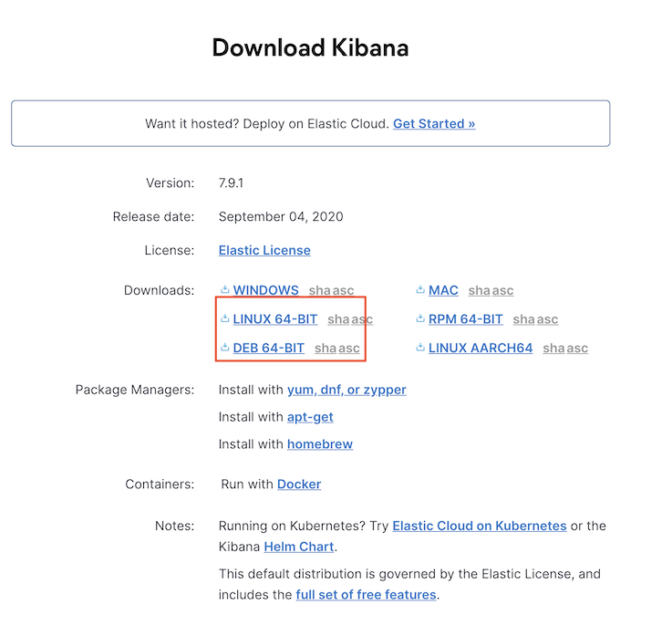
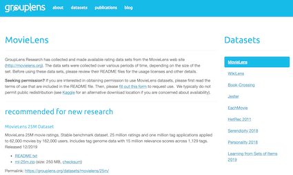
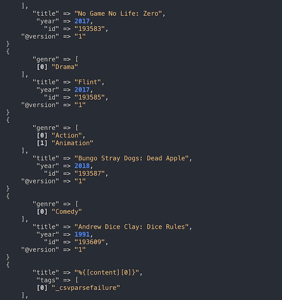
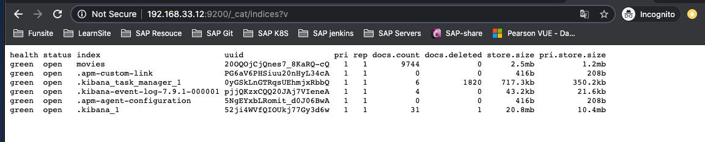
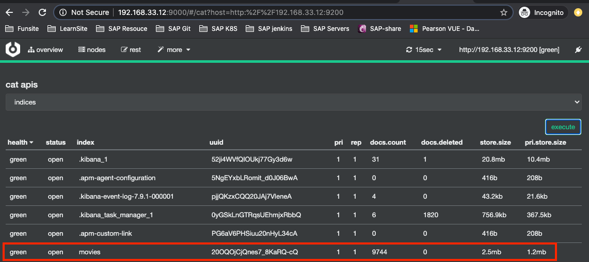

# **第四节 Logstash安装与导入数据**

## 1、获取Logstash安装包

* 二进制文件运行
* Docker本地运行

https://www.elastic.co/downloads/kibana



```
$ wget https://artifacts.elastic.co/downloads/logstash/logstash-7.9.1.tar.gz
$ tar -xvf logstash-7.9.1.tar.gz


$ sudo mkdir /usr/share/logstash
$ sudo chown -R vagrant:vagrant /usr/share/logstash
$ cp -R logstash-7.9.1/* /usr/share/logstash
```

```
sudo vim /etc/profile.d/logstash.sh
LS_HOME=/usr/share/logstash
PATH=$LS_HOME/bin:$PATH
export JAVA_HOME=/usr/share/elasticsearch/jdk
export PATH LS_HOME
export CLASSPATH=.
```

* `export JAVA_HOME=/usr/share/elasticsearch/jdk` Logstash 需要启动 JVM，所以需导出`JAVA_HOME`

```
source /etc/profile.d/logstash.sh
```


```
$ logstash -h
OpenJDK 64-Bit Server VM warning: Ignoring option UseConcMarkSweepGC; support was removed in 14.0
OpenJDK 64-Bit Server VM warning: Ignoring option CMSInitiatingOccupancyFraction; support was removed in 14.0
OpenJDK 64-Bit Server VM warning: Ignoring option UseCMSInitiatingOccupancyOnly; support was removed in 14.0
Usage:
    bin/logstash [OPTIONS]

Options:
    -n, --node.name NAME          Specify the name of this logstash instance, if no value is given
                                  it will default to the current hostname.
                                   (default: "elasticsearch7")
    -f, --path.config CONFIG_PATH Load the logstash config from a specific file
                                  or directory.  If a directory is given, all
                                  files in that directory will be concatenated
                                  in lexicographical order and then parsed as a
                                  single config file. You can also specify
                                  wildcards (globs) and any matched files will
...
```

## 2、Movielens 测试数据 Demo

* 下载`MovieLen`数据 
* 用`Logstash`导入`Elasticsearch`


### 2-1 Movielens 测试数据集

下载最 MovieLens 最小测试数据集： https://grouplens.org/datasets/movielens/



[movies.csv](../files/chap2/movies.csv)

### 2-2 根据`logstash.conf`运行并导入测试数据

[logstash.conf](../files/chap2/logstash.conf)

```
input {
  file {
    path => "/home/vagrant/logstash/movielens/ml-latest-small/movies.csv"
    start_position => "beginning"
    sincedb_path => "/dev/null"
  }
}
filter {
  csv {
    separator => ","
    columns => ["id","content","genre"]
  }

  mutate {
    split => { "genre" => "|" }
    remove_field => ["path", "host","@timestamp","message"]
  }

  mutate {

    split => ["content", "("]
    add_field => { "title" => "%{[content][0]}"}
    add_field => { "year" => "%{[content][1]}"}
  }

  mutate {
    convert => {
      "year" => "integer"
    }
    strip => ["title"]
    remove_field => ["path", "host","@timestamp","message","content"]
  }

}
output {
   elasticsearch {
     hosts => "http://localhost:9200"
     index => "movies"
     document_id => "%{id}"
   }
  stdout {}
```

*   `path => "/home/vagrant/logstash/movielens/ml-latest-small/movies.csv"`


```
$ tree .
.
├── logstash.conf
└── ml-latest-small
    └── movies.csv

1 directory, 2 files
```


```
$  logstash -f /home/vagrant/logstash/movielens/logstash.conf
```



### 2-3 查看 logstash 的数据是否导入 ES

```
http://192.168.33.12:9200/_cat/indices?v
```




**cerebro**: CAT APIs

