# **第一节、ElasticSearch 基本概念**

## 1、**索引、文档和REST API**

### 1-1 Elasticsearch基本概念 

* **Index 索引**
	* Type类型 
	* Document文档 
* **Node 节点**
	* Shard分片 

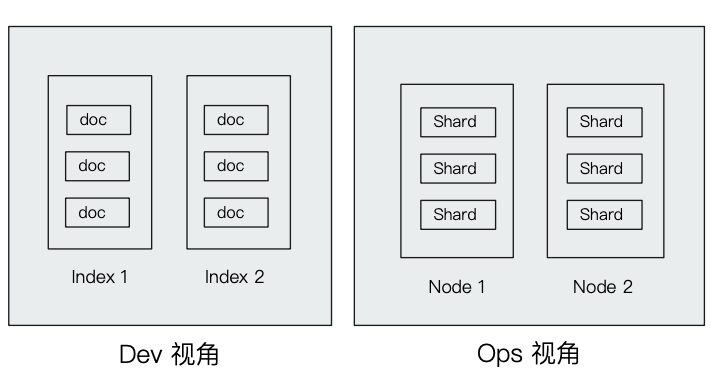


### 1-2 文档（Document) 

* Elasticsearch是面向文档的，文档是所有可搜索数据的最小单位 。
	* 日志文件中的日志项 。
	* 一部电影的具体信息／一张唱片的详细信息 。
	* MP3播放器里的一首歌／一篇PDF文档中的具体内容 

* **文档会被序列化成JSON格式，保存在Elasticsearch中** 
	* JSON对象由字段组成，
	* 每个字段都有对应的字段类型（字符串／数值／布尔／日期／二进制／范围类型） 
* **每个文档都有一个Unique ID** 
	* 你可以自己指定ID
	* 或者通过Elasticsearch自动生成 


### 1-3 JSON文档 

* 一篇文档包含了一系列的字段。类似数据库表中一条记录 
* JSON文档，格式灵活，不需要预先定义格式 
	* 字段的类型可以指定或者通过Elasticsearch自动推算 
	* **支持数组／支持嵌套**

```
movieId,title,genres
1,Toy Story (1995),Adventure|Animation|Children|Comedy|Fantasy
```

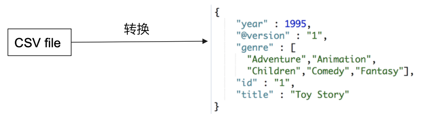

### 1-4 文档的元数据 

**元数据，用于标注文档的相关信息** 

* `_index` —— 文档所属的索引名 
* `_type` —— 文档所属的类型名 
* `_Id` ——  文档唯一`Id` 
* `_source`:文档的原始`JSON`数据 
* `_all`：整合所有字段内容到该字段，6.0已被废除 
* `_version`：文档的版本信息 
* `_score`：相关性打分 
* `_seq_no` : 文档版本号，作用同`_version`（相当于学生编号，每个班级的班主任为学生分配编号，效率要比学校教务处分配来的更加高效，管理起来更方便）
* `_primary_term`：文档所在位置（相当于班级）

[ElasticSearch 根据`_seq_no`并发控制](https://blog.csdn.net/z457181562/article/details/93486182)


```
GET movies/_doc/1
```

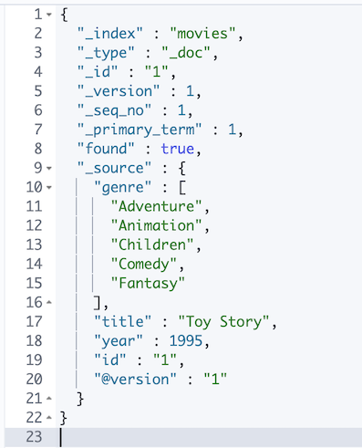

### 1-5 索引

Index一索引是文档的容器，是一类文档的结合 

* **Index体现了逻辑空间的概念**：每个索引都有自己的Mapping定义，用于定义包含的文档的字段名和字段类型 
* **Shard体现了物理空间的概念**：索引中的数据分散在Shard上 

索引的Mapping与Settings

* **Mapping定义文档字段的类型** 
* **Setting定义不同的数据分布** 

```
GET movies/_settings
```

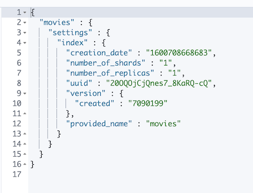

```
GET movies/_mapping
```

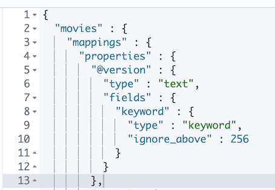

 
**索引的不同语义**

* 名词：一个Elasticsearch集群中，可以创建很多个不同的索引 
* 动词：保存一个文档到Elasticsearch的过程也叫索引（indexing） 
	* ES中，创建一个倒排索引的过程 
* 名词：一个B树索引，一个倒排索引 

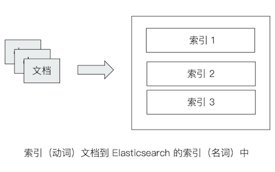


### 1-5 Type

* 在7.0之前，一个Index可以设置多个 Types 
* 6.0开始，Types已经被Deprecated。 7.0开始， 一个索引只能创建一个**Type ——`"_doc" `**

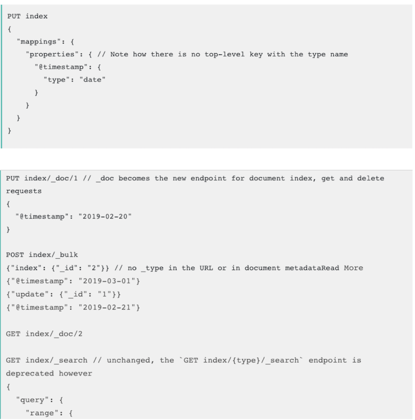

### 1-6 抽象与类比

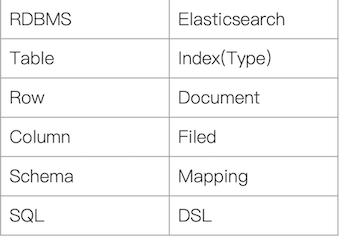

* 在7.0之前，一个Index可以设置多个 Types 
* 6.0开始，Types已经被Deprecated。 7.0开始， 一个索引只能创建一个**Type ——`"_doc" `**
* 传统关系型数据库和Elasticsearch的区别 
	* Elasticsearch - Schemaless／相关性／高性能全文检索 
	* RDMS一事务性／Join 

### 1-7 ES Rest API

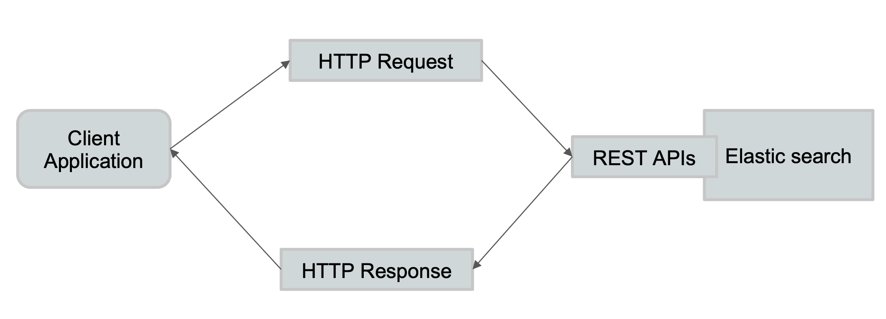

**一些基本的API**

* Indices 
	* 创建index 
		* `PUT Movies` 
* 查看所有Index 
	* `_cat/indices` 

```
http://192.168.33.12:9200/_cat/indices?v

health status index                          uuid                   pri rep docs.count docs.deleted store.size pri.store.size
green  open   movies                         20OQOjCjQnes7_8KaRQ-cQ   1   1       9744            0      2.5mb          1.2mb
green  open   .apm-custom-link               PG6aV6PHSiuu20nHyL34cA   1   1          0            0       416b           208b
green  open   kibana_sample_data_ecommerce   ePmp_2DuRM2mG5DjzjVjAA   1   1       4675            0      8.6mb          4.2mb
green  open   .kibana_task_manager_1         0yGSkLnGTRqsUEhmjxRbbQ   1   1          6         2472    885.3kb        447.3kb
green  open   .kibana-event-log-7.9.1-000001 pjjQKzxCQQ20JAj7VIeneA   1   1          4            0     43.2kb         21.6kb
green  open   .apm-agent-configuration       5NgEYxbLRomit_d0J06BwA   1   1          0            0       416b           208b
green  open   kibana_sample_data_logs        bvpwbU64RhiOcuhkYBKahA   1   1      14074            0     18.4mb          9.2mb
green  open   .kibana_1                      52ji4WVfQIOUkj77Gy3d6w   1   1        333            0     22.9mb         11.4mb
green  open   kibana_sample_data_flights     23Vm4RG8Rlu8uikrNJkzlg   1   1      13059            0     11.8mb          5.9mb
```

### 1-8 Demo

* 查看一些与index的相关API 
* 进入Kinbana Index Management界面，探索Index相关的信息 

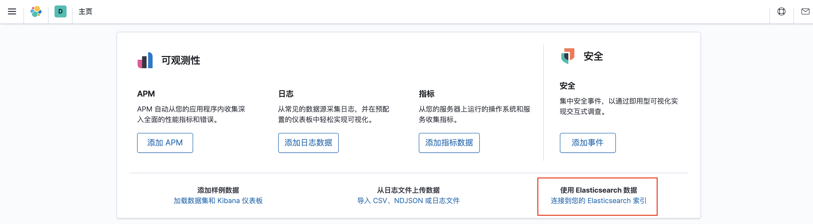

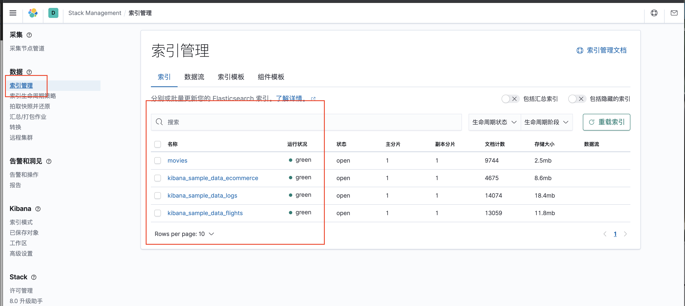

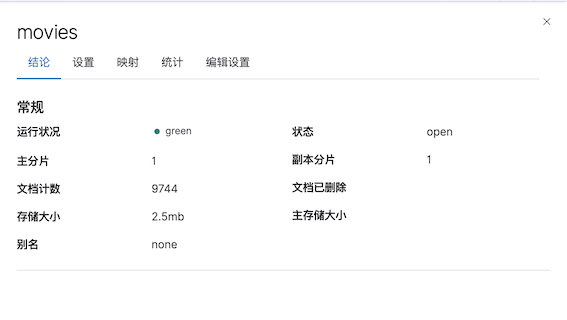

**Setting**

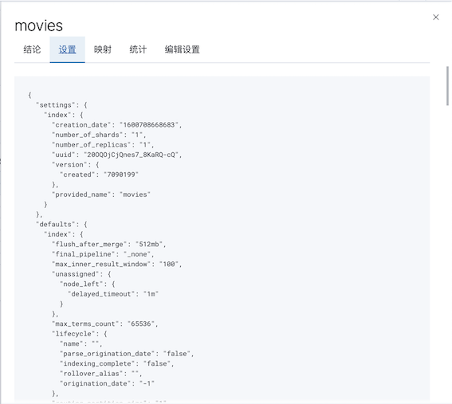

**Mapping**

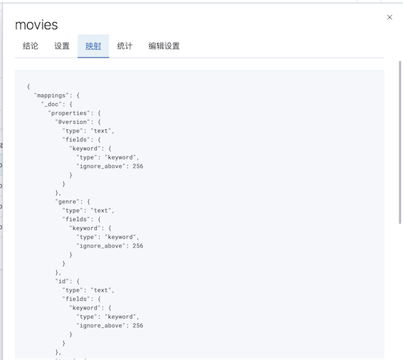


* **为什么不再支持单个Index下，多个Typs** https://www.elastic.co/cn/blog/moving-from-types-to-typeless-apis-in-elasticsearch-7-0
* **CAT Index API** https://www.elastic.co/guide/en/elasticsearch/reference/7.1/cat-indices.html

```
#查看索引相关信息
GET kibana_sample_data_ecommerce

#查看索引的文档总数
GET kibana_sample_data_ecommerce/_count

#查看前10条文档，了解文档格式
POST kibana_sample_data_ecommerce/_search
{
}

#_cat indices API
#查看indices
GET /_cat/indices/kibana*?v&s=index

#查看状态为绿的索引
GET /_cat/indices?v&health=green

#按照文档个数排序
GET /_cat/indices?v&s=docs.count:desc

#查看具体的字段
GET /_cat/indices/kibana*?pri&v&h=health,index,pri,rep,docs.count,mt

#How much memory is used per index?
GET /_cat/indices?v&h=i,tm&s=tm:desc
```


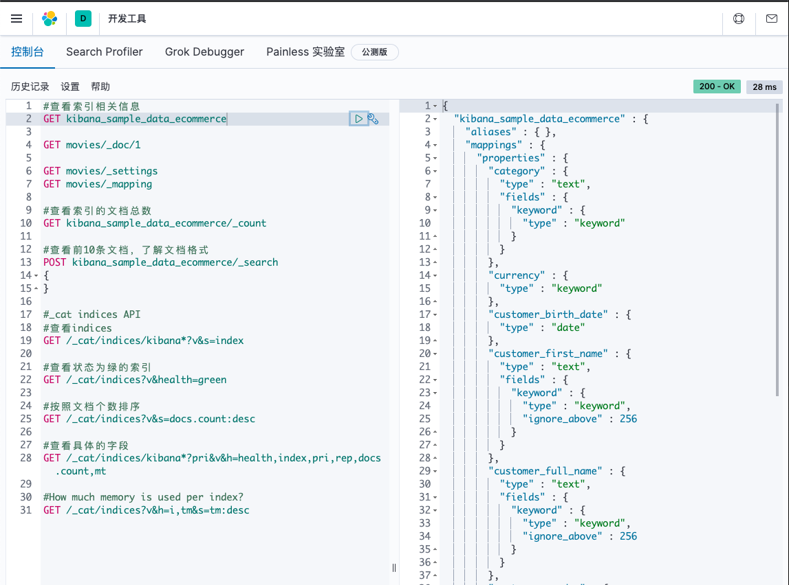


## 2、**集群／节点／分片／副本** 

### 2-1 分布式系统的可用性与扩展性 

**高可用性**

* 服务可用性一允许有节点停止服务 
* 数据可用性一部分节点丢失不会丢失数据 

**可扩展性**

* 请求量提升／数据的不断增长（将数据分布到所有节点上) 


### 2-2 分布式特性 

* **Elasticsearch的分布式架构的好处** 
	* 存储的水平扩容 
	* 提高系统的可用性部分节点停止服务整个集群的服务不受影响 

* Elasticsearch的分布式架构 

	* 不同的集群通过不同的名字来区分默认名字"elasticsearch" 
	* 通过配置文件修改或者在命令行中`-E cluster.neme=jx`进行设定 
	* 一个集群可以有一个或者多个节点 


### 2-3 节点 

* 节点是一个Elasticsearch的实例 
	* 本质上就是一个JAVA进程 
	* 一台机器上可以运行多个进程，**但是生产环境一般建议一台机器上只运行一个Elasticsearch实例** 
* 每一个节点都有名字，每一个节点在启动之后通过配置文件配置成者启动时候`-E node.name=node1`指定 
* 会分配一个`UID`保存在data目录下 

### 2-4 Master-eligible nodes和Master Node 

* 每个节点启动后默认就是一个Master eligible节点
	* 可以设置`node.master=false`禁止 
* **`Master-eligible`节点可以参加选主流程成为`Master`节点** 
* **当第一个节点启动时候它会将自己选举成Master节点** 
* 每个节点上都保存了集群的状态只有Master节点才能修改集群的状态信息 。
	* 集群状态(Cluster State)维护了一个集群中必要的信息 
		* 所有的节点信息 
		* 所有的索引和其相关的Mapping与Setting信息 
		* **分片的路由信息** 
* 任意节点都能修改信息会导致数据的不一致性 

### 2-5 Data Node&Coordinating Node 

* **Data Node**

	* 可以保存数据的节点叫做`Data Node`。负责保存分片数据。在数据扩展上起到了至关重要的作用 


* **Coordinating Node**

	* 负责接受`Client`的请求将请求分发到合适的节点最终把结果汇集到一起 
	* 每个节点默认都起到了`Coordinating Node`的职责 

### 2-6 其他的节点类型 

* **Hot & Warm Node** 
	* 不同硬件配置的`Data Node`用来实现`Hot & Warm`架构降低集群部署的成本 
* **Machine Learning Node** 
	* 负责跑机器学习的Job用来做异常检测 
* **Tribe Node** 
	* (5.3开始使用Cross Cluster Search) Tribe Node连接到不同的Elasticsearoh集群, 并且支持将这些集群当成一个单独的集群处理 


### 2-7 配置节点类型 

* 开发环境中一个节点可以承担多种角色
* 生产环境中，应该设置单一的角色的节点(dedicated node) 

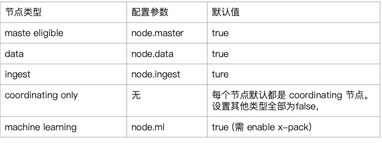

### 2-8 分片（Primary Shard&Replica Shard) 

* **主分片，用以解决数据水平扩展的问题。**通过主分片，可以将数据分布到集群内的所有节点之上 
	* **一个分片是一个运行的Lucene的实例** 
	* **主分片数在索引创建时指定，后续不允许，修改除非Reindex** 

* 副本用以解决数据高可用的问题分片。**是主分片的拷贝** 
	* **副本分片数，可以动态题调整** 
	* **增加副本数，还可以在一定程度上提高服务的可用性（读取的吞吐）** 


### 2-9 分片（Primary Shard&Replica Shard) 

* 一个三节点的集群中，blogs索引的分片分布情况 
	* 思考：增加一个节点或改大主分片数对系统的影响？ 


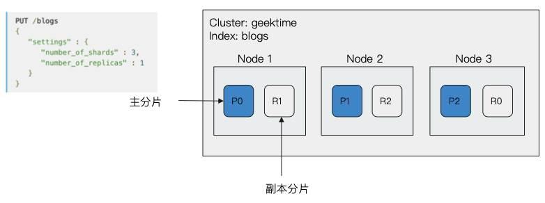


### 2-10 分片的设定 

* 对于生产环境中分片的设定需要提前做好容量规划 
	* **分片数设置过小** 
		* **导致后续无法增加节点实现水平扩展** 
		* **单个分片的数据量太大导致数据重新分配耗时** 
	* 分片数设置过大7.0开始默认主分片设置成，解决了`over-sharding`的问题 
		* 影响搜索结果的相关性打分影响统计结果的准确性 
		* 单个节点上过多的分片会导致资源浪费同时也会影响件能 


### 2-11 分片的设定 


* Green——主分片与副本都正常分配 
* Yellow——主分片全部正常分配有副本分片未能正常分配 
* Red——有主分片未能分配 
	* **例如当服务器的磁盘容量超过55％时,去创建了一个新的索引** 

```
GET _cluster/health

{
  "cluster_name" : "jx",
  "status" : "green",
  "timed_out" : false,
  "number_of_nodes" : 2,
  "number_of_data_nodes" : 2,
  "active_primary_shards" : 10,
  "active_shards" : 20,
  "relocating_shards" : 0,
  "initializing_shards" : 0,
  "unassigned_shards" : 0,
  "delayed_unassigned_shards" : 0,
  "number_of_pending_tasks" : 0,
  "number_of_in_flight_fetch" : 0,
  "task_max_waiting_in_queue_millis" : 0,
  "active_shards_percent_as_number" : 100.0
}
```


### 2-12 DEMO

* CAT API
	* http://localhost:9200/_cat/nodes 
	* 查看索引和分片 

```
GET _cat/nodes
172.22.0.4 64 96 3 0.08 0.11 0.15 dilmrt * es79
172.22.0.5 66 96 3 0.08 0.11 0.15 dilmrt - es7_02

```

* 设置分片数 
* Kibana + Cerebro界面介绍 

```
GET _cluster/health

GET _cat/nodes?v
GET /_nodes/es79,es7_02
GET /_cat/nodes?v
GET /_cat/nodes?v&h=id,ip,port,v,m

GET _cluster/health
GET _cluster/health?level=shards
GET /_cluster/health/kibana_sample_data_ecommerce,kibana_sample_data_flights
GET /_cluster/health/kibana_sample_data_flights?level=shards

#### cluster state The cluster state API allows access to metadata representing the state of the whole cluster. This includes information such as
GET /_cluster/state

#cluster get settings
GET /_cluster/settings
GET /_cluster/settings?include_defaults=true

GET _cat/shards
GET _cat/shards?h=index,shard,prirep,state,unassigned.reason
```

```
GET _cat/nodes?v

ip         heap.percent ram.percent cpu load_1m load_5m load_15m node.role master name
172.22.0.4           52          96   5    1.11    0.47     0.31 dilmrt    *      es79
172.22.0.5           46          96   5    1.11    0.47     0.31 dilmrt    -      es7_02
```


```
GET /_nodes/es79,es7_02

{
  "_nodes" : {
    "total" : 2,
    "successful" : 2,
    "failed" : 0
  },
  "cluster_name" : "jx",
  "nodes" : {
    "lTFD6qBCQ460xdW8XFgaIg" : {
      "name" : "es7_02",
      "transport_address" : "172.22.0.5:9300",
      "host" : "172.22.0.5",
      "ip" : "172.22.0.5",
      "version" : "7.9.1",
      "build_flavor" : "default",
      "build_type" : "docker",
      "build_hash" : "083627f112ba94dffc1232e8b42b73492789ef91",
      "total_indexing_buffer" : 50331648,
      "roles" : [
        "data",
        "ingest",
        "master",
        "ml",
        "remote_cluster_client",
        "transform"
      ],
      ...
```

```
GET /_cat/nodes?v&h=id,ip,port,v,m

id   ip         port v     m
L7jf 172.22.0.4 9300 7.9.1 *
lTFD 172.22.0.5 9300 7.9.1 -
```


```
GET _cluster/health?level=shards

{
  "cluster_name" : "jx",
  "status" : "green",
  "timed_out" : false,
  "number_of_nodes" : 2,
  "number_of_data_nodes" : 2,
  "active_primary_shards" : 10,
  "active_shards" : 20,
  "relocating_shards" : 0,
  "initializing_shards" : 0,
  "unassigned_shards" : 0,
  "delayed_unassigned_shards" : 0,
  "number_of_pending_tasks" : 0,
  "number_of_in_flight_fetch" : 0,
  "task_max_waiting_in_queue_millis" : 0,
  "active_shards_percent_as_number" : 100.0,
  "indices" : {
    "movies" : {
      "status" : "green",
      "number_of_shards" : 1,
      "number_of_replicas" : 1,
      "active_primary_shards" : 1,
      "active_shards" : 2,
      "relocating_shards" : 0,
      "initializing_shards" : 0,
      "unassigned_shards" : 0,
      "shards" : {
        "0" : {
          "status" : "green",
          "primary_active" : true,
          "active_shards" : 2,
          "relocating_shards" : 0,
          "initializing_shards" : 0,
          "unassigned_shards" : 0
        }
      }
    },
...
```

```
GET /_cluster/health/kibana_sample_data_ecommerce,kibana_sample_data_flights

{
  "cluster_name" : "jx",
  "status" : "green",
  "timed_out" : false,
  "number_of_nodes" : 2,
  "number_of_data_nodes" : 2,
  "active_primary_shards" : 2,
  "active_shards" : 4,
  "relocating_shards" : 0,
  "initializing_shards" : 0,
  "unassigned_shards" : 0,
  "delayed_unassigned_shards" : 0,
  "number_of_pending_tasks" : 0,
  "number_of_in_flight_fetch" : 0,
  "task_max_waiting_in_queue_millis" : 0,
  "active_shards_percent_as_number" : 100.0
}
```

```
GET /_cluster/health/kibana_sample_data_flights?level=shards

{
  "cluster_name" : "jx",
  "status" : "green",
  "timed_out" : false,
  "number_of_nodes" : 2,
  "number_of_data_nodes" : 2,
  "active_primary_shards" : 1,
  "active_shards" : 2,
  "relocating_shards" : 0,
  "initializing_shards" : 0,
  "unassigned_shards" : 0,
  "delayed_unassigned_shards" : 0,
  "number_of_pending_tasks" : 0,
  "number_of_in_flight_fetch" : 0,
  "task_max_waiting_in_queue_millis" : 0,
  "active_shards_percent_as_number" : 100.0,
  "indices" : {
    "kibana_sample_data_flights" : {
      "status" : "green",
      "number_of_shards" : 1,
      "number_of_replicas" : 1,
      "active_primary_shards" : 1,
      "active_shards" : 2,
      "relocating_shards" : 0,
      "initializing_shards" : 0,
      "unassigned_shards" : 0,
      "shards" : {
        "0" : {
          "status" : "green",
          "primary_active" : true,
          "active_shards" : 2,
          "relocating_shards" : 0,
          "initializing_shards" : 0,
          "unassigned_shards" : 0
        }
      }
    }
  }
}
```


```
## cluster state The cluster state API allows access to metadata representing the state of the whole cluster. This includes information such as


GET /_cluster/state

{
  "cluster_name" : "jx",
  "cluster_uuid" : "r-I8BtMKRTyZOuYqnnm5VQ",
  "version" : 160,
  "state_uuid" : "8oYBvskARIy0NVpgfd4tsA",
  "master_node" : "L7jf3HA8TqOEtNY8BrU82A",
  "blocks" : { },
  "nodes" : {
    "L7jf3HA8TqOEtNY8BrU82A" : {
      "name" : "es79",
      "ephemeral_id" : "N2k4LdbnRwCUbI1i8c1Rpw",
      "transport_address" : "172.22.0.4:9300",
      "attributes" : {
        "ml.machine_memory" : "1927524352",
        "xpack.installed" : "true",
        "transform.node" : "true",
        "ml.max_open_jobs" : "20"
      }
    },
...
```

```
# cluster get settings

GET /_cluster/settings

{
  "persistent" : { },
  "transient" : { }
}


GET /_cluster/settings?include_defaults=true

{
  "persistent" : { },
  "transient" : { },
  "defaults" : {
    "cluster" : {
      "max_voting_config_exclusions" : "10",
      "auto_shrink_voting_configuration" : "true",
      "election" : {
        "duration" : "500ms",
        "initial_timeout" : "100ms",
        "max_timeout" : "10s",
        "back_off_time" : "100ms",
        "strategy" : "supports_voting_only"
      },
      "no_master_block" : "write",
      "persistent_tasks" : {
        "allocation" : {
          "enable" : "all",
          "recheck_interval" : "30s"
        }
      },
...
```

```
GET _cat/shards

.kibana_1                      0 p STARTED   348  11.4mb 172.22.0.5 es7_02
.kibana_1                      0 r STARTED   348    13mb 172.22.0.4 es79
kibana_sample_data_logs        0 p STARTED 14074   9.2mb 172.22.0.5 es7_02
kibana_sample_data_logs        0 r STARTED 14074   9.2mb 172.22.0.4 es79
.apm-custom-link               0 r STARTED     0    208b 172.22.0.5 es7_02
.apm-custom-link               0 p STARTED     0    208b 172.22.0.4 es79
.kibana-event-log-7.9.1-000001 0 r STARTED     4  21.6kb 172.22.0.5 es7_02
.kibana-event-log-7.9.1-000001 0 p STARTED     4  21.6kb 172.22.0.4 es79
ilm-history-2-000001           0 r STARTED               172.22.0.5 es7_02
ilm-history-2-000001           0 p STARTED               172.22.0.4 es79
.kibana_task_manager_1         0 p STARTED     6 565.8kb 172.22.0.5 es7_02
.kibana_task_manager_1         0 r STARTED     6 564.6kb 172.22.0.4 es79
kibana_sample_data_ecommerce   0 p STARTED  4675   4.2mb 172.22.0.5 es7_02
kibana_sample_data_ecommerce   0 r STARTED  4675   4.3mb 172.22.0.4 es79
kibana_sample_data_flights     0 r STARTED 13059   5.9mb 172.22.0.5 es7_02
kibana_sample_data_flights     0 p STARTED 13059   5.9mb 172.22.0.4 es79
movies                         0 p STARTED  9744   1.2mb 172.22.0.5 es7_02
movies                         0 r STARTED  9744   1.2mb 172.22.0.4 es79
.apm-agent-configuration       0 r STARTED     0    208b 172.22.0.5 es7_02
.apm-agent-configuration       0 p STARTED     0    208b 172.22.0.4 es79


GET _cat/shards?h=index,shard,prirep,state,unassigned.reason
.kibana_1                      0 p STARTED 
.kibana_1                      0 r STARTED 
kibana_sample_data_logs        0 p STARTED 
kibana_sample_data_logs        0 r STARTED 
.apm-custom-link               0 r STARTED 
.apm-custom-link               0 p STARTED 
.kibana-event-log-7.9.1-000001 0 r STARTED 
.kibana-event-log-7.9.1-000001 0 p STARTED 
ilm-history-2-000001           0 r STARTED 
ilm-history-2-000001           0 p STARTED 
.kibana_task_manager_1         0 p STARTED 
.kibana_task_manager_1         0 r STARTED 
kibana_sample_data_ecommerce   0 p STARTED 
kibana_sample_data_ecommerce   0 r STARTED 
kibana_sample_data_flights     0 r STARTED 
kibana_sample_data_flights     0 p STARTED 
movies                         0 p STARTED 
movies                         0 r STARTED 
.apm-agent-configuration       0 r STARTED 
.apm-agent-configuration       0 p STARTED 
```


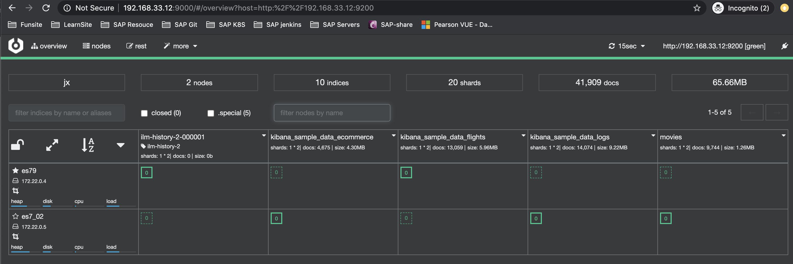

```
$ docker stop es7_02
```

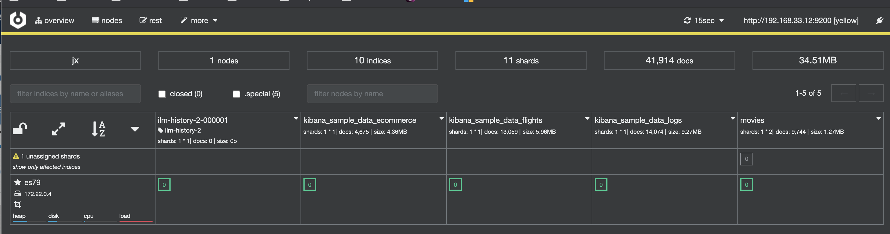

### 2-13 本节回顾 

* 一个节点是运行Elasticsearah的Java进程 
* 一个集群由1到多个节点共同组成每个节点可以承担不同的最色 
* 一份主分片是一个Lucene的实例索引的一部分成全部数据 
* 一个副本分片是一个主分片的拷贝 
* Elasticsearch通过分片可以实现水平扩展和数据可用陛 
* 集群的三种健康状态Shard的不同状态 

### Reference

* CAT Nodes API https://www.elastic.co/guide/en/elasticsearch/reference/7.1/cat-nodes.html
* Cluster API https://www.elastic.co/guide/en/elasticsearch/reference/7.1/cluster.html
* CAT Shards API https://www.elastic.co/guide/en/elasticsearch/reference/7.1/cat-shards.html