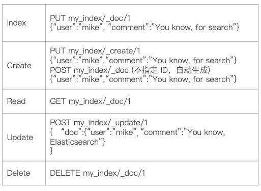
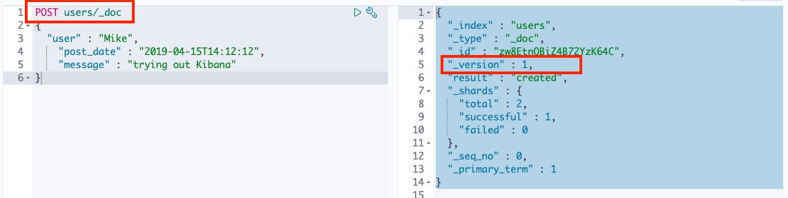
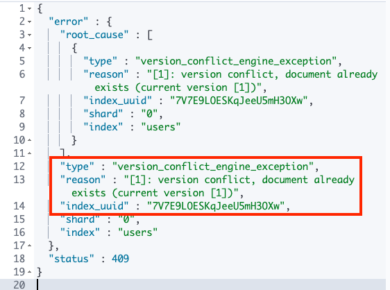
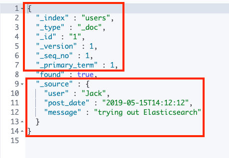
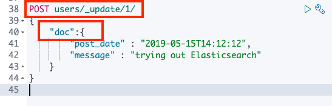
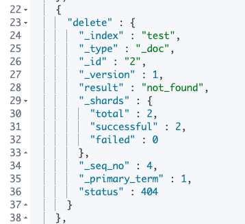
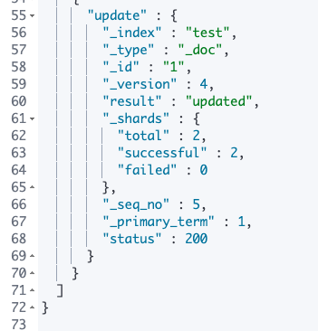
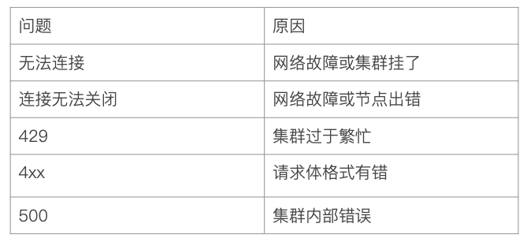

# **第二节 文档的基本CRUD与批量操作 & 读取＆Bulk API**


## 1、**文档的CRUD**


* `Type`名约定都用`_doc` 
* **`Create`一如果ID已经存在会失败** 
* **Index - 如果旧不存在创建新的文档**。**否则先删除现有的文档** 再创建新的文档版本会增加 
* **Update - 文档必须已经存在更新只会对相应字段做增量修改**




### 1-1 Create 一个文档

* 支持自动生成文档`Id`和指定文档`Id`两种方式 
* 通过调用`"post/users/_doc"`
	* 系统会自动生成`document Id` 
* **使用HTTP `PUT user/_create/1`创建时URI中显示指定`_create`, 此时如果该id的文档已经存在,操作失败** 

```
############Create Document############

POST users/_doc
{
	"user" : "Mike",
    "post_date" : "2019-04-15T14:12:12",
    "message" : "trying out Kibana"
}


# Output
{
  "_index" : "users",
  "_type" : "_doc",
  "_id" : "zw8EtnQBiZ4B72YzK64C",
  "_version" : 1,
  "result" : "created",
  "_shards" : {
    "total" : 2,
    "successful" : 1,
    "failed" : 0
  },
  "_seq_no" : 0,
  "_primary_term" : 1
}
```




```
# create document. 指定Id。如果id已经存在，报错

PUT users/_doc/1?op_type=create
{
    "user" : "Jack",
    "post_date" : "2019-05-15T14:12:12",
    "message" : "trying out Elasticsearch"
}
# sucess 

# create document. 指定 ID 如果已经存在，就报错
PUT users/_create/1
{
     "user" : "Jack",
    "post_date" : "2019-05-15T14:12:12",
    "message" : "trying out Elasticsearch"
}


# output
{
  "error" : {
    "root_cause" : [
      {
        "type" : "version_conflict_engine_exception",
        "reason" : "[1]: version conflict, document already exists (current version [1])",
        "index_uuid" : "7V7E9LOESKqJeeU5mH3OXw",
        "shard" : "0",
        "index" : "users"
      }
    ],
    "type" : "version_conflict_engine_exception",
    "reason" : "[1]: version conflict, document already exists (current version [1])",
    "index_uuid" : "7V7E9LOESKqJeeU5mH3OXw",
    "shard" : "0",
    "index" : "users"
  },
  "status" : 409
}
```




### 1-2 Get 一个文档

* 找到文档返回 HTTP 200 
	* 文档元信息 
	* `_index / _type /`
	* 版本信息, 同一个Id的文档,  即使被删除，`Version`号也会不断增加 
	* `_source` 中默认包含了文档的所有原始信息 
* 找不到文档, 返回`HTTP 404`

```
### Get Document by ID

GET users/_doc/1

### Output
{
  "_index" : "users",
  "_type" : "_doc",
  "_id" : "1",
  "_version" : 1,
  "_seq_no" : 1,
  "_primary_term" : 1,
  "found" : true,
  "_source" : {
    "user" : "Jack",
    "post_date" : "2019-05-15T14:12:12",
    "message" : "trying out Elasticsearch"
  }
}
```




### 1-3 Index文档 

* `Index`和`Create`不一样的地方如果文档不存在就索引新的文档。
* **否则现有文档会被删除新的文档被索引版本信息+1**

```
#Update 指定 ID  (先删除，在写入)
PUT users/_doc/1
{
	"user" : "Mike"

}


# output
{
  "_index" : "users",
  "_type" : "_doc",
  "_id" : "1",
  "_version" : 2,
  "result" : "updated",
  "_shards" : {
    "total" : 2,
    "successful" : 2,
    "failed" : 0
  },
  "_seq_no" : 1,
  "_primary_term" : 1
}
```

**`"_version" : 2`**

```
GET users/_doc/1

{
  "_index" : "users",
  "_type" : "_doc",
  "_id" : "1",
  "_version" : 2,
  "_seq_no" : 1,
  "_primary_term" : 1,
  "found" : true,
  "_source" : {
    "user" : "Mike"
  }
}
```

* **`"_version" : 2`**
* **`"_primary_term" : 1`**

### 1-4 Update 文档

* Updete方法不会删除原来的文档而是实现真正的数据更新 
* `Post`方法/ `Payload`需要包含在`"doc"`中 

```
POST users/_update/1/
{
    "doc":{
        "post_date" : "2019-05-15T14:12:12",
        "message" : "trying out Elasticsearch"
    }
}
```

* output

```
{
  "_index" : "users",
  "_type" : "_doc",
  "_id" : "1",
  "_version" : 5,
  "result" : "noop",
  "_shards" : {
    "total" : 0,
    "successful" : 0,
    "failed" : 0
  },
  "_seq_no" : 7,
  "_primary_term" : 1
}
```




### 1-5 删除文档

```
### Delete by Id
# 删除文档
DELETE users/_doc/1
```

* Output

```
{
  "_index" : "users",
  "_type" : "_doc",
  "_id" : "1",
  "_version" : 6,
  "result" : "deleted",
  "_shards" : {
    "total" : 2,
    "successful" : 2,
    "failed" : 0
  },
  "_seq_no" : 8,
  "_primary_term" : 1
}
```

```
GET users/_doc/1

# 404 
{
  "_index" : "users",
  "_type" : "_doc",
  "_id" : "1",
  "found" : false
}
```


## 2、**Bulk API**

* 支持在一次API调用中对不同的索引进行操作 
* 支持四种类型操作 
	* Index 
	* Create
	* Updete 
	* Delete 
* 可以再URI中指定Index也可以在请求的Payload中进行 
* **操作中单条操作失败，并不会影响其他操作**
* **返回结果包括了没一条操作执行的结果** 

### 2-1 Bulk 操作

```
#执行两次，查看每次的结果

#执行第1次
POST _bulk
{ "index" : { "_index" : "test", "_id" : "1" } }
{ "field1" : "value1" }
{ "delete" : { "_index" : "test", "_id" : "2" } }
{ "create" : { "_index" : "test2", "_id" : "3" } }
{ "field1" : "value3" }
{ "update" : {"_id" : "1", "_index" : "test"} }
{ "doc" : {"field2" : "value2"} }
```

* Output

```
{
  "took" : 2659,
  "errors" : false,
  "items" : [
    {
      "index" : {
        "_index" : "test",
        "_type" : "_doc",
        "_id" : "1",
        "_version" : 1,
        "result" : "created",
        "_shards" : {
          "total" : 2,
          "successful" : 2,
          "failed" : 0
        },
        "_seq_no" : 0,
        "_primary_term" : 1,
        "status" : 201
      }
    },
    {
      "delete" : {
        "_index" : "test",
        "_type" : "_doc",
        "_id" : "2",
        "_version" : 1,
        "result" : "not_found",
        "_shards" : {
          "total" : 2,
          "successful" : 2,
          "failed" : 0
        },
        "_seq_no" : 1,
        "_primary_term" : 1,
        "status" : 404
      }
    },
    {
      "create" : {
        "_index" : "test2",
        "_type" : "_doc",
        "_id" : "3",
        "_version" : 1,
        "result" : "created",
        "_shards" : {
          "total" : 2,
          "successful" : 2,
          "failed" : 0
        },
        "_seq_no" : 0,
        "_primary_term" : 1,
        "status" : 201
      }
    },
    {
      "update" : {
        "_index" : "test",
        "_type" : "_doc",
        "_id" : "1",
        "_version" : 2,
        "result" : "updated",
        "_shards" : {
          "total" : 2,
          "successful" : 2,
          "failed" : 0
        },
        "_seq_no" : 2,
        "_primary_term" : 1,
        "status" : 200
      }
    }
```

* `{ "delete" : { "_index" : "test", "_id" : "2" } }` =>  `"result" : "not_found",`



```
#执行第2次
POST _bulk
{ "index" : { "_index" : "test", "_id" : "1" } }
{ "field1" : "value1" }
{ "delete" : { "_index" : "test", "_id" : "2" } }
{ "create" : { "_index" : "test2", "_id" : "3" } }
{ "field1" : "value3" }
{ "update" : {"_id" : "1", "_index" : "test"} }
{ "doc" : {"field2" : "value2"} }
```

```
{
  "took" : 22,
  "errors" : true,
  "items" : [
    {
      "index" : {
        "_index" : "test",
        "_type" : "_doc",
        "_id" : "1",
        "_version" : 3,
        "result" : "updated",
        "_shards" : {
          "total" : 2,
          "successful" : 2,
          "failed" : 0
        },
        "_seq_no" : 3,
        "_primary_term" : 1,
        "status" : 200
      }
    },
    {
      "delete" : {
        "_index" : "test",
        "_type" : "_doc",
        "_id" : "2",
        "_version" : 1,
        "result" : "not_found",
        "_shards" : {
          "total" : 2,
          "successful" : 2,
          "failed" : 0
        },
        "_seq_no" : 4,
        "_primary_term" : 1,
        "status" : 404
      }
    },
    {
      "create" : {
        "_index" : "test2",
        "_type" : "_doc",
        "_id" : "3",
        "status" : 409,
        "error" : {
          "type" : "version_conflict_engine_exception",
          "reason" : "[3]: version conflict, document already exists (current version [1])",
          "index_uuid" : "M_XnRwHERy6F4N26wR2VQQ",
          "shard" : "0",
          "index" : "test2"
        }
      }
    },
    {
      "update" : {
        "_index" : "test",
        "_type" : "_doc",
        "_id" : "1",
        "_version" : 4,
        "result" : "updated",
        "_shards" : {
          "total" : 2,
          "successful" : 2,
          "failed" : 0
        },
        "_seq_no" : 5,
        "_primary_term" : 1,
        "status" : 200
      }
    }
  ]
}
```

* `{ "create" : { "_index" : "test2", "_id" : "3" } }` => `  "reason" : "[3]: version conflict, document already exists (current version [1])",`



### 2-1 批量读取一mget 

* **批量操作可以减少网络连接所产生的开销** 
* 提高性能 

```
### mget 操作
GET /_mget
{
    "docs" : [
        {
            "_index" : "test",
            "_id" : "1"
        },
        {
            "_index" : "test",
            "_id" : "2"
        }
    ]
}
```

* Output

```
{
  "docs" : [
    {
      "_index" : "test",
      "_type" : "_doc",
      "_id" : "1",
      "_version" : 4,
      "_seq_no" : 5,
      "_primary_term" : 1,
      "found" : true,
      "_source" : {
        "field1" : "value1",
        "field2" : "value2"
      }
    },
    {
      "_index" : "test",
      "_type" : "_doc",
      "_id" : "2",
      "found" : false
    }
  ]
}
```

* URI中指定index

```

GET /test/_mget
{
    "docs" : [
        {

            "_id" : "1"
        },
        {

            "_id" : "2"
        }
    ]
}
```

**Output**

```
{
  "docs" : [
    {
      "_index" : "test",
      "_type" : "_doc",
      "_id" : "1",
      "_version" : 4,
      "_seq_no" : 5,
      "_primary_term" : 1,
      "found" : true,
      "_source" : {
        "field1" : "value1",
        "field2" : "value2"
      }
    },
    {
      "_index" : "test",
      "_type" : "_doc",
      "_id" : "2",
      "found" : false
    }
  ]
}
```


### 2-2 批量查询一msearch 


```
GET /_mget
{
    "docs" : [
        {
            "_index" : "test",
            "_id" : "1",
            "_source" : false
        },
        {
            "_index" : "test",
            "_id" : "2",
            "_source" : ["field3", "field4"]
        },
        {
            "_index" : "test",
            "_id" : "3",
            "_source" : {
                "include": ["user"],
                "exclude": ["user.location"]
            }
        }
    ]
}
```

**Output**

```
{
  "docs" : [
    {
      "_index" : "test",
      "_type" : "_doc",
      "_id" : "1",
      "_version" : 4,
      "_seq_no" : 5,
      "_primary_term" : 1,
      "found" : true
    },
    {
      "_index" : "test",
      "_type" : "_doc",
      "_id" : "2",
      "found" : false
    },
    {
      "_index" : "test",
      "_type" : "_doc",
      "_id" : "3",
      "found" : false
    }
  ]
}
```

* URI中指定index

```
GET /test/_mget
{
    "docs" : [
        {

            "_id" : "1"
        },
        {

            "_id" : "2"
        }
    ]
}
```

**Output**

```
{
  "docs" : [
    {
      "_index" : "test",
      "_type" : "_doc",
      "_id" : "1",
      "_version" : 4,
      "_seq_no" : 5,
      "_primary_term" : 1,
      "found" : true,
      "_source" : {
        "field1" : "value1",
        "field2" : "value2"
      }
    },
    {
      "_index" : "test",
      "_type" : "_doc",
      "_id" : "2",
      "found" : false
    }
  ]
}
```


### 2-3 msearch 操作

```
POST kibana_sample_data_ecommerce/_msearch
{}
{"query" : {"match_all" : {}},"size":1}
{"index" : "kibana_sample_data_flights"}
{"query" : {"match_all" : {}},"size":2}
```

Output

```
{
  "took" : 98,
  "responses" : [
    {
      "took" : 20,
      "timed_out" : false,
      "_shards" : {
        "total" : 1,
        "successful" : 1,
        "skipped" : 0,
        "failed" : 0
      },
      "hits" : {
        "total" : {
          "value" : 4675,
          "relation" : "eq"
        },
        "max_score" : 1.0,
        "hits" : [
          {
            "_index" : "kibana_sample_data_ecommerce",
            "_type" : "_doc",
            "_id" : "kw_fsnQBiZ4B72YzxCce",
            "_score" : 1.0,
            "_source" : {
              "category" : [
                "Men's Clothing"
              ],
              ...
```

### 2-3 常见错误返回 



### 2-4 本节回顾

* 基本的文档CRUD操作 
* 每个文档都有一个版本号可用干并发控制避免冲突 
* `_mget`和`bulk API`可以减少建立网络连接所产生的开销 
* `bulk API`每行需要指定`index`信息也可以在`URI`中指定。7开始不需要指定`Type`
* 单次批量操作数据量不宜过大以免引发性能问题 

         