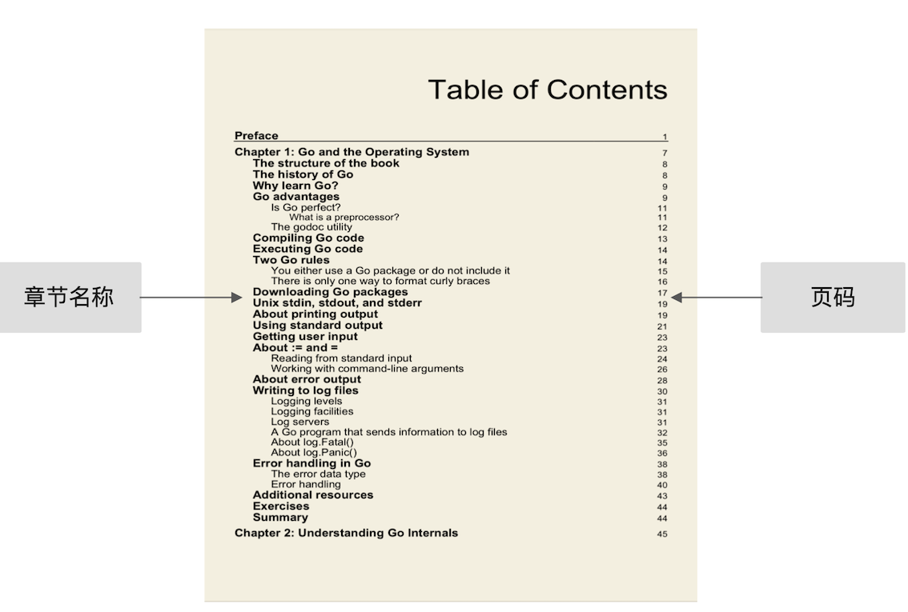
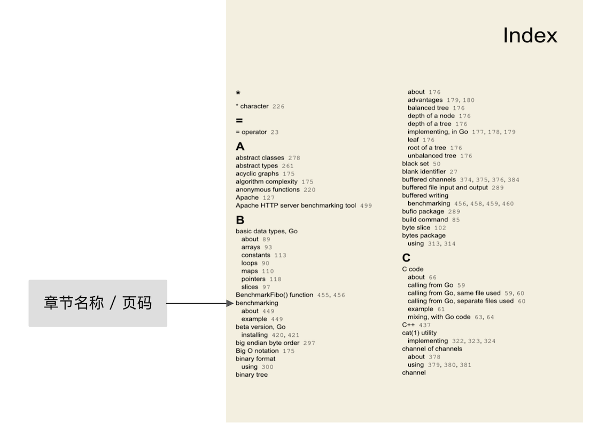
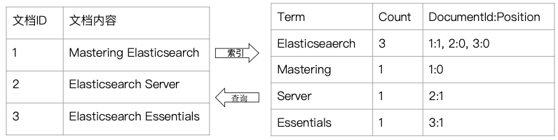
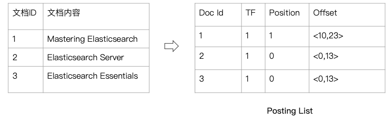

# **第三节 倒排索引**

## **1、倒排索引入门**


### 1-1 正排与倒排索引 

* **目录 - 正排**



快速查找“benchmarking”所在的页面 


* **索引页 - 倒排**



### 1-2 图书和搜索引擎的类比 

* **图书** 
	* 正排索引一目录页 
	* 倒排索引一索引页 
* **搜索引擎**
	* 正排索引一文档Id到文档内容和单词的关联 
	* 倒排索引一单词到文档Id的关系 

### 1-3 正排索引和倒排索引 




### 1-4 倒排索引的核心组成 

**倒排索引包含两个部分** 

* 单词词典(Term Dictionay）记录所有文档的单词，记录单词到倒排列表的关联关系
	* 单词词典般比较大，可以遇过B＋树或哈希拉链法实现 ， 以满足高性能的插入与查询
* 倒排列表(Posting List) - 记录了单词对应的文档结合, 由倒排索引项组成  
	* 倒排索引项(Posting)
		* 文档ID 
		* **词频TF - 该单词在文档中出现的次数，用于相关胜评分** 
		* 位置（Position) - 单词在文档中分词的位置。用于语句搜索(phrase query) 
		* 偏移 (Offset) - 记录单词的开始结束位置实现高亮显示 




### 1-5 Elasticsearch的倒排索引 

* Elasticserach的JSON文档中的每个字段, 都有自己的倒排索引 
	* 可以指定对某些字段不做索引 
		* 优点： 节省存储空间
		* 缺点：字段无法搜索

		
```
POST _analyze
{
  "analyzer": "standard",
  "text": "Mastering Elasticsearch"
}

POST _analyze
{
  "analyzer": "standard",
  "text": "Elasticsearch Server"
}

POST _analyze
{
  "analyzer": "standard",
  "text": "Elasticsearch Essentials"
}
```
