# **第四节 使用分析器进行分词**


### 1、Analysis与Analyzer 

* `Analysis` - 文本分析是把全文本转换一系列单词（`term / token`) 的过程，**也叫分词** 
* `Analysis`是通过`Analyzer`来实现的 
	* 可使用`Elasticsearch`内置的分析器／或者按需定制化分析器 
* 除了在数据写入时转换词条，匹配`Query`语句时候也需要用相同的分析器对查询语句进行分析 

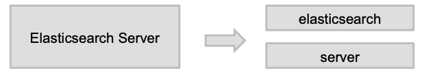

### 2、Analyzer的组成 

分词器是专门处理分词的组件，Analyzer由三部分组成 

* `Character Filters`（针对原始文本处理例如去除html) 
* `Tokenizer` (按照规则切分为单词）
* `Token Filter`（将切分的的单词进行加工，小写，删除stopwords,增加同义词） 

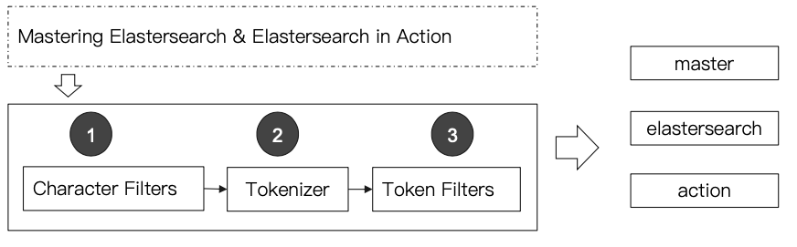

### 3、Elasticsearch的内置分词器 

* Standard Analyzer默认分词器按词切分小写处理 
* Simple Analyzer一按照非字母切分（符号被过滤）小写处理 
* Stop Analyzer一小写处理停用词过滤(the, a, is） 
* Whitespace Analyzer按照空格切分不转小写 
* Keyword Analyzer 不分词直接将输入当作输出 
* Pattern Analyzer正则表达式默认`\W+`（非字符分隔） 
* Language提供了30多种常见语言的分词器 
* Customer Analyzer自定义分词器 


### 4、使用`_analyzer API`

* 直接指定Analyzer进行测试 
* 指定索引的字段进行测试 
* 自定义分词起进行测试 

```
GET _analyze
{
  "analyzer": "standard",
  "text": "2 running Quick brown-foxes leap over lazy dogs in the summer evening."
}
```

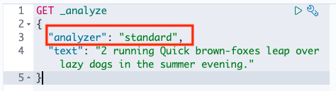


```
{
  "tokens" : [
    {
      "token" : "2",
      "start_offset" : 0,
      "end_offset" : 1,
      "type" : "<NUM>",
      "position" : 0
    },
    {
      "token" : "running",
      "start_offset" : 2,
      "end_offset" : 9,
      "type" : "<ALPHANUM>",
      "position" : 1
    },
    {
      "token" : "quick",
      "start_offset" : 10,
      "end_offset" : 15,
      "type" : "<ALPHANUM>",
      "position" : 2
    },
    {
      "token" : "brown",
      "start_offset" : 16,
      "end_offset" : 21,
      "type" : "<ALPHANUM>",
      "position" : 3
    },
 		...
}
```

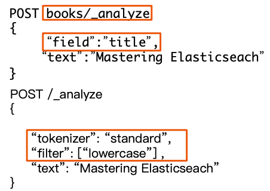

### 5、Standard Analyzer

* 默认分词器 
* 按词切分 
* 小写处理 

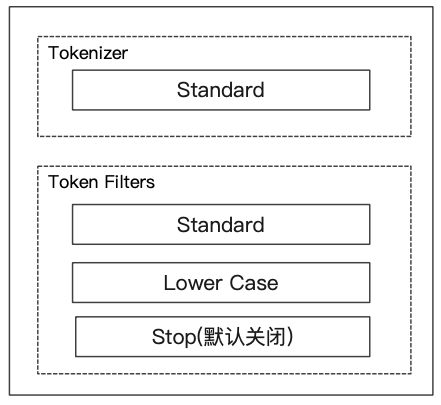

### 6、Simple Analyzer

* 按照非字母切分非字母的都被去除 
* 小写处理 


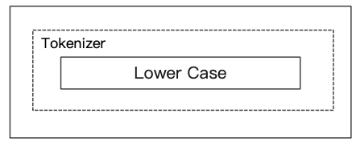

```
#simpe
GET _analyze
{
  "analyzer": "simple",
  "text": "2 running Quick brown-foxes leap over lazy dogs in the summer evening."
}
```

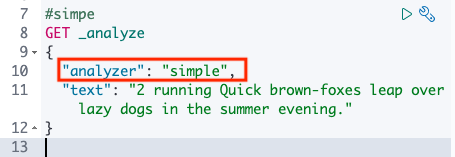

```
...
{
      "token" : "quick",
      "start_offset" : 10,
      "end_offset" : 15,
      "type" : "word",
      "position" : 1
    },
...
```

### 7、White Analyzer

* 按照空格切分 

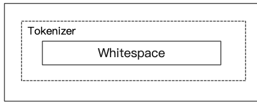

```
#whitespace
GET _analyze
{
  "analyzer": "whitespace",
  "text": "2 running Quick brown-foxes leap over lazy dogs in the summer evening."
}
```

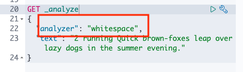

```
  {
      "token" : "brown-foxes",
      "start_offset" : 16,
      "end_offset" : 27,
      "type" : "word",
      "position" : 3
    },
```


### 8、Stop Analyzer

* 相比Simple Analyzer 
* 多了stop filter 
	* 会把the, a, is等修饰性调语去除 


```
GET _analyze
{
  "analyzer": "stop",
  "text": "2 running Quick brown-foxes leap over lazy dogs in the summer evening."
}
```

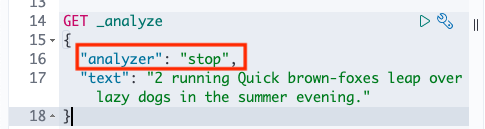

```
...
{
      "token" : "dogs",
      "start_offset" : 43,
      "end_offset" : 47,
      "type" : "word",
      "position" : 7
    },
    {
      "token" : "summer",
      "start_offset" : 55,
      "end_offset" : 61,
      "type" : "word",
      "position" : 10
    },
    {
      "token" : "evening",
      "start_offset" : 62,
      "end_offset" : 69,
      "type" : "word",
      "position" : 11
    }
...
```

* dogs / summer / evening

### 9、Keyword Analyzer

* 不分词直接将输入当一个term输出 

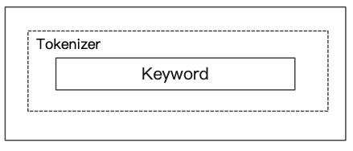

```
#keyword
GET _analyze
{
  "analyzer": "keyword",
  "text": "2 running Quick brown-foxes leap over lazy dogs in the summer evening."
}
```

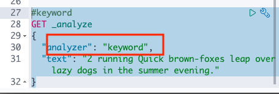

```
{
  "tokens" : [
    {
      "token" : "2 running Quick brown-foxes leap over lazy dogs in the summer evening.",
      "start_offset" : 0,
      "end_offset" : 70,
      "type" : "word",
      "position" : 0
    }
  ]
}
```

### 10、Pattern Analyzer

* 通过正则表达式进行分词 
* 默认是`\W+`非字符的符号进行分隔 

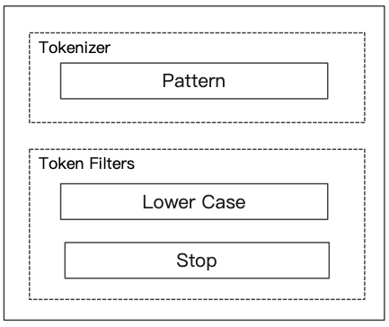

```
GET _analyze
{
  "analyzer": "pattern",
  "text": "2 running Quick brown-foxes leap over lazy dogs in the summer evening."
}
```


### 11、Language Analyzer 

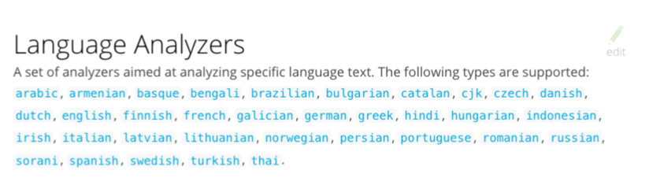


```
#english
GET _analyze
{
  "analyzer": "english",
  "text": "2 running Quick brown-foxes leap over lazy dogs in the summer evening."
}
```

### 12、中文分词的难点 

* 中文句子切分成一个一个词（不是一个个字） 
* 英文中单词有自然的空格作为分隔 
* 一句中文在不同的上下文有不通的理解 
	* 这个苹果，不大好吃／这个苹果，不大，好吃 
* 一些例子 
	* 他说的确实在理／这事的确定不下来 

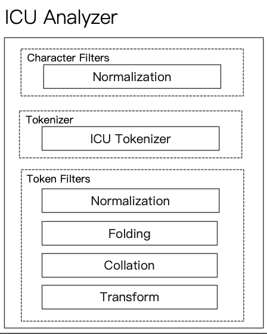


* 需要安装Plugin
	* `Elasticsearch-plugin install analysis-icu` 
* 提供了Unicode的支持更好的支持亚洲语言 


**Docker中安装icu-plugin**

```
$ docker exec -it es7_01 bash
# pwd
/usr/share/elasticsearch

# bin/elasticsearch-plugin install analysis-icu
-> Installing analysis-icu
-> Downloading analysis-icu from elastic
[=================================================] 100%?? 
-> Installed analysis-icu

$ docker exec -it es7_02 bash
# bin/elasticsearch-plugin install analysis-icu
-> Installing analysis-icu
-> Downloading analysis-icu from elastic
[=================================================] 100%?? 
-> Installed analysis-icu 
```

```
docker restart es7_01
docker restart es7_02
```

```
http://192.168.33.12:9200/_cat/plugins
es79   analysis-icu 7.9.1
es7_02 analysis-icu 7.9.1
```

**icu_analyzer**

```
POST _analyze
{
  "analyzer": "icu_analyzer",
  "text": "他说的确实在理”"
}
```

```
{
  "tokens" : [
    {
      "token" : "他",
      "start_offset" : 0,
      "end_offset" : 1,
      "type" : "<IDEOGRAPHIC>",
      "position" : 0
    },
    {
      "token" : "说的",
      "start_offset" : 1,
      "end_offset" : 3,
      "type" : "<IDEOGRAPHIC>",
      "position" : 1
    },
    {
      "token" : "确实",
      "start_offset" : 3,
      "end_offset" : 5,
      "type" : "<IDEOGRAPHIC>",
      "position" : 2
    },
    {
      "token" : "在",
      "start_offset" : 5,
      "end_offset" : 6,
      "type" : "<IDEOGRAPHIC>",
      "position" : 3
    },
    {
      "token" : "理",
      "start_offset" : 6,
      "end_offset" : 7,
      "type" : "<IDEOGRAPHIC>",
      "position" : 4
    }
  ]
}
```


```
"他","说的","确实","在","理"
```

### 13、更多的中文分词器 

**IK**

* 支持自定义调库支持热更新分词宇典 

https://github.com/medcl/elasticsearch-analysis-ik

**THULAC**

http://thulac.thunlp.org/


**ik分析器安装：**

```
bin/elasticsearch-plugin install https://github.com/medcl/elasticsearch-analysis-ik/releases/download/v7.9.1/elasticsearch-analysis-ik-7.9.1.zip
```

```
 bin/elasticsearch-plugin install https://github.com/medcl/elasticsearch-analysis-ik/releases/download/v7.9.1/elasticsearch-analysis-ik-7.9.1.zip
-> Installing https://github.com/medcl/elasticsearch-analysis-ik/releases/download/v7.9.1/elasticsearch-analysis-ik-7.9.1.zip
-> Downloading https://github.com/medcl/elasticsearch-analysis-ik/releases/download/v7.9.1/elasticsearch-analysis-ik-7.9.1.zip
[=================================================] 100%?? 
@@@@@@@@@@@@@@@@@@@@@@@@@@@@@@@@@@@@@@@@@@@@@@@@@@@@@@@@@@@
@     WARNING: plugin requires additional permissions     @
@@@@@@@@@@@@@@@@@@@@@@@@@@@@@@@@@@@@@@@@@@@@@@@@@@@@@@@@@@@
* java.net.SocketPermission * connect,resolve
See http://docs.oracle.com/javase/8/docs/technotes/guides/security/permissions.html
for descriptions of what these permissions allow and the associated risks.

Continue with installation? [y/N]y
-> Installed analysis-ik
```

```
docker restart es7_01
docker restart es7_02
```

```
es7_02 analysis-icu 7.9.1
es7_02 analysis-ik  7.9.1
es79   analysis-icu 7.9.1
es79   analysis-ik  7.9.1
```


* `ik_smart`: 会做最粗粒度的拆分，比如会将“中华人民共和国国歌”拆分为“中华人民共和国,国歌”，适合 Phrase 查询
* ` ik_max_word:` 会将文本做最细粒度的拆分，比如会将“中华人民共和国国歌”拆分为“中华人民共和国,中华人民,中华,华人,人民共和国,人民,人,民,共和国,共和,和,国国,国歌”，会穷尽各种可能的组合，适合 Term Query；
* 生成索引时候可以使用`ik_max_word`，查询的时候使用`ik_smart`


```
POST _analyze
{
  "analyzer": "ik_smart",
  "text": "中华人民共和国国歌"
}
```

```
{
  "tokens" : [
    {
      "token" : "中华人民共和国",
      "start_offset" : 0,
      "end_offset" : 7,
      "type" : "CN_WORD",
      "position" : 0
    },
    {
      "token" : "国歌",
      "start_offset" : 7,
      "end_offset" : 9,
      "type" : "CN_WORD",
      "position" : 1
    }
  ]
}
```

```
POST _analyze
{
  "analyzer": "ik_max_word",
  "text": "中华人民共和国国歌"
}

```

```
{
  "tokens" : [
    {
      "token" : "中华人民共和国",
      "start_offset" : 0,
      "end_offset" : 7,
      "type" : "CN_WORD",
      "position" : 0
    },
    {
      "token" : "中华人民",
      "start_offset" : 0,
      "end_offset" : 4,
      "type" : "CN_WORD",
      "position" : 1
    },
    {
      "token" : "中华",
      "start_offset" : 0,
      "end_offset" : 2,
      "type" : "CN_WORD",
      "position" : 2
    },
    {
      "token" : "华人",
      "start_offset" : 1,
      "end_offset" : 3,
      "type" : "CN_WORD",
      "position" : 3
    },
    {
      "token" : "人民共和国",
      "start_offset" : 2,
      "end_offset" : 7,
      "type" : "CN_WORD",
      "position" : 4
    },
    {
      "token" : "人民",
      "start_offset" : 2,
      "end_offset" : 4,
      "type" : "CN_WORD",
      "position" : 5
    },
    {
      "token" : "共和国",
      "start_offset" : 4,
      "end_offset" : 7,
      "type" : "CN_WORD",
      "position" : 6
    },
    {
      "token" : "共和",
      "start_offset" : 4,
      "end_offset" : 6,
      "type" : "CN_WORD",
      "position" : 7
    },
    {
      "token" : "国",
      "start_offset" : 6,
      "end_offset" : 7,
      "type" : "CN_CHAR",
      "position" : 8
    },
    {
      "token" : "国歌",
      "start_offset" : 7,
      "end_offset" : 9,
      "type" : "CN_WORD",
      "position" : 9
    }
  ]
}
```