# **第五节 ElasticSearch Search语句**

## **1、Search API 概览**

* **URI Search**
	* 在URL中使用查询参数 
* **Request Body Search**
	* 使用`Elasticsearch`提供的，基于`JSON`格式的更加完备的`Query Domain Specific Language (DSL) `

### 1-1、指定查询的索引 

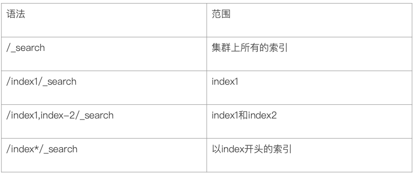

### 1-2、URI查询 

* **使用"q", 指定查询字符串**
* "query string syntex", `KV`键值对 


```
GET kibana_sample_data_ecommerce/_search?q=customer_first_name:Eddie
```

**Output**

```
{
  "took" : 114,
  "timed_out" : false,
  "_shards" : {
    "total" : 1,
    "successful" : 1,
    "skipped" : 0,
    "failed" : 0
  },
  "hits" : {
    "total" : {
      "value" : 100,
      "relation" : "eq"
    },
    "max_score" : 4.016948,
    "hits" : [
      {
        "_index" : "kibana_sample_data_ecommerce",
        "_type" : "_doc",
        "_id" : "kw_fsnQBiZ4B72YzxCce",
        "_score" : 4.016948,
        "_source" : {
          "category" : [
            "Men's Clothing"
          ],
          "currency" : "EUR",
          "customer_first_name" : "Eddie",
          "customer_full_name" : "Eddie Underwood",
          "customer_gender" : "MALE",
          "customer_id" : 38,
...
```

```
GET kibana*/_search?q=customer_first_name:Eddie
```

```
{
  "took" : 6,
  "timed_out" : false,
  "_shards" : {
    "total" : 3,
    "successful" : 3,
    "skipped" : 0,
    "failed" : 0
  },
 ...
```

```
GET /_all/_search?q=customer_first_name:Eddie
```

```
{
  "took" : 76,
  "timed_out" : false,
  "_shards" : {
    "total" : 13,
    "successful" : 13,
    "skipped" : 0,
    "failed" : 0
  },
  "hits
...
```

### 1-3、Request Body

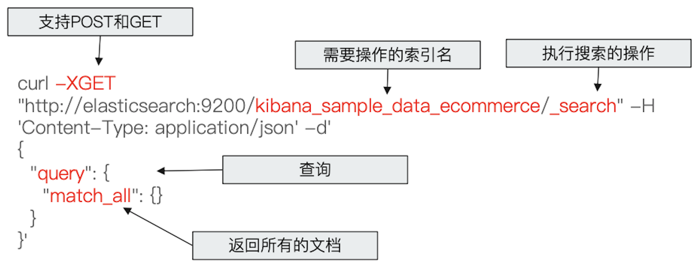

```
#REQUEST Body
POST kibana_sample_data_ecommerce/_search
{
	"profile": true,
	"query": {
		"match_all": {}
	}
}
```

```
{
  "took" : 76,
  "timed_out" : false,
  "_shards" : {
    "total" : 13,
    "successful" : 13,
    "skipped" : 0,
    "failed" : 0
  },
  "hits" : {
    "total" : {
      "value" : 100,
      "relation" : "eq"
    },
    "max_score" : 4.016948,
    "hits" : [
      {
        "_index" : "kibana_sample_data_ecommerce",
        "_type" : "_doc",
        "_id" : "kw_fsnQBiZ4B72YzxCce",
        "_score" : 4.016948,
...
```

**搜索的Reponse**

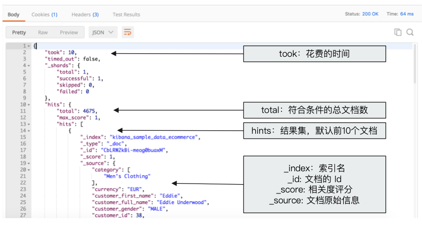


### 1-4、搜索的相关性Relevance 

* 搜索是用户和搜索引擎的对话 
* 用户关心的是搜索结果的相关性 
	* 是否可以找到所有相关的内容 
	* 有多少不相关的内容被返回了 
	* 文档的打分是否合理 
	* 结合业务需求，平衡结果排名 


### 1-5、Web搜索 

* Page Rank算法 
	* 不仅仅是内容 
	* 更重要的是内容的可信度 


**电商搜索**

搜索引擎扮演一**销售**的角色 

* 提高用户购物体验 
* 提升网站销售业绩 
* 去库存 


### 1-6、衡量相关性

* Information Retrieval
	* Precision（查准率）一尽可能返回较少的无关文档 
	* Recall（查全率）一尽量返回较多的相关文档 
	* Ranking一是否能够按照相关度进行排序？ 

### 1-7、Precision&Recall

* Precision一True Positive ／全部返回的结果（True and False Positives) 
* Recall一True Positive/ 所有应该返回的结果 (True positives+false Negtives)

**使用Elasticsearch的查询和相关的参数改善搜索的Precision和Recall**

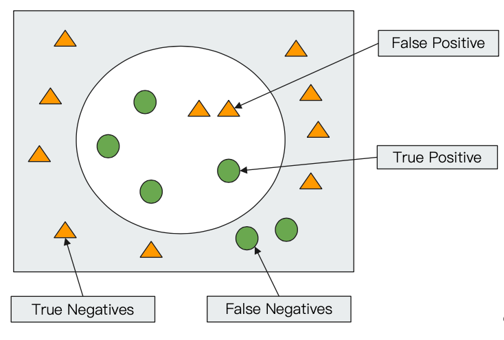


## **2、URI Search详解** 

### 2-1 URI Search——通过`URI query`实现搜索 

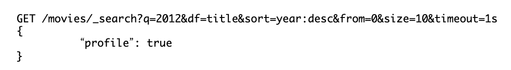


* `q` 指定查询语句，使用`Query String Syntax` 
* `df`默认字段，不指定时 
* `Sort`排序 / `from`和`size`用于分页 
* `Profile`可以查看查询是如何被执行的 

```
#基本查询
GET /movies/_search?q=2012&df=title&sort=year:desc&from=0&size=10&timeout=1s
```

```
{
  "took" : 172,
  "timed_out" : false,
  "_shards" : {
    "total" : 1,
    "successful" : 1,
    "skipped" : 0,
    "failed" : 0
  },
  "hits" : {
    "total" : {
      "value" : 2,
      "relation" : "eq"
    },
    "max_score" : null,
    "hits" : [
      {
        "_index" : "movies",
        "_type" : "_doc",
        "_id" : "105254",
        "_score" : null,
        "_source" : {
          "genre" : [
            "Adventure",
            "Comedy"
          ],
          "title" : "Crystal Fairy & the Magical Cactus and 2012",
          "year" : 2013,
          "id" : "105254",
          "@version" : "1"
        },
        "sort" : [
          2013
        ]
      },
      {
        "_index" : "movies",
        "_type" : "_doc",
        "_id" : "72378",
        "_score" : null,
        "_source" : {
          "genre" : [
            "Action",
            "Drama",
            "Sci-Fi",
            "Thriller"
          ],
          "title" : "2012",
          "year" : 2009,
          "id" : "72378",
          "@version" : "1"
        },
        "sort" : [
          2009
        ]
      }
    ]
  }
}
```

#### 带profile

```
GET /movies/_search?q=2012&df=title
{
	"profile":"true"
}
```

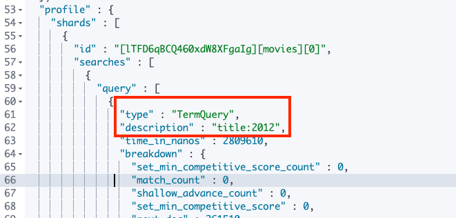


### 2-2 Query String Syntax

#### 2-2-1 **指定字段 v.s. 泛查询**
	* `q=title:2012/q=2O12`

```
#泛查询，正对_all,所有字段
GET /movies/_search?q=2012
{
	"profile":"true"
}
```

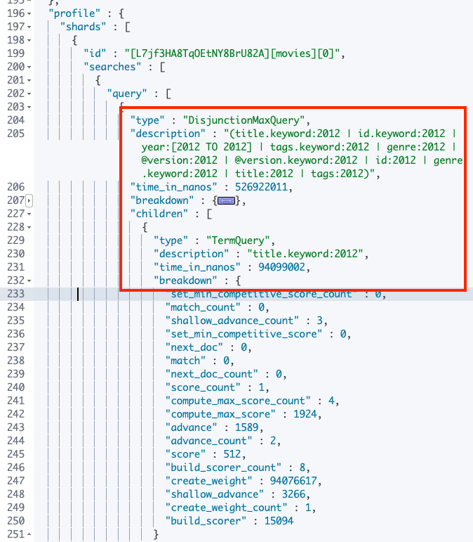

```
#指定字段
GET /movies/_search?q=title:2012&sort=year:desc&from=0&size=10&timeout=1s
{
	"profile":"true"
}
```


```
# 泛查询
GET /movies/_search?q=title:2012
{
	"profile":"true"
}
```


#### 2-2-2 **Term vs Phrase** 
	
* `Beautifual Mind`等效于`Beautiful OR Mind` 
* `"Beautifual Mind"`等效于`Beautiful AND Mind`, `Phrase`查询还要求前后顺序保待一致 


```
# 查找美丽心灵, Mind为泛查询
GET /movies/_search?q=title:Beautiful Mind
{
	"profile":"true"
}
```

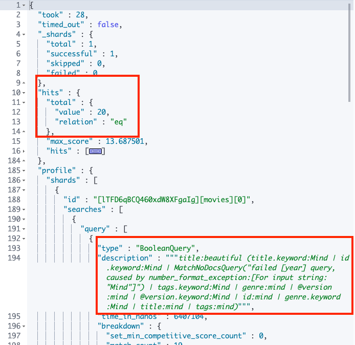


#### 2-2-3 **分组与引号** 

* `title:(Beautiful AND Mind)`
* `title="Beautifual Mind"`


```
#使用引号，Phrase查询
GET /movies/_search?q=title:"Beautiful Mind"
{
	"profile":"true"
}
```


```
#分组，Bool查询
GET /movies/_search?q=title:(Beautiful Mind)
{
	"profile":"true"
}
```

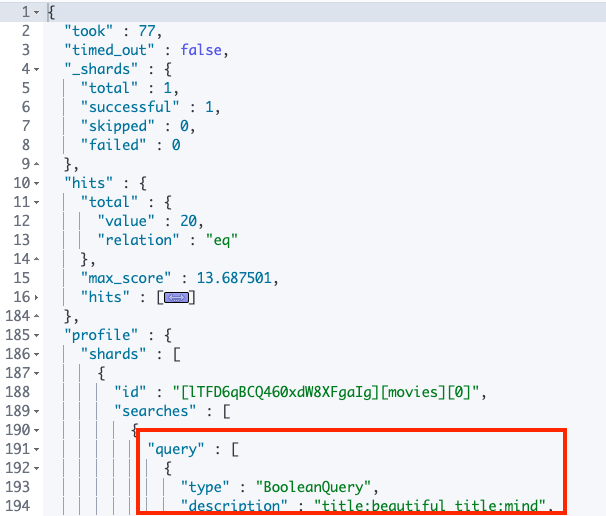


#### 2-2-4 **布尔操作** 

* `AND/OR/NOT` 或者 `&& / || / !` 
	* 必须大写 
	* `title:(matrix NOT reloaded)` 

```
#布尔操作符
# 查找美丽心灵
GET /movies/_search?q=title:(Beautiful AND Mind)
{
	"profile":"true"
}
```

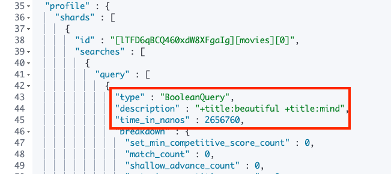

```
# 查找美丽心灵
GET /movies/_search?q=title:(Beautiful NOT Mind)
{
	"profile":"true"
}
```

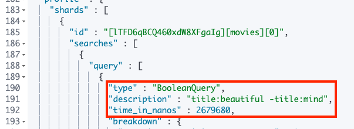


```
# 查找美丽心灵
GET /movies/_search?q=title:(Beautiful %2BMind)
{
	"profile":"true"
}
```

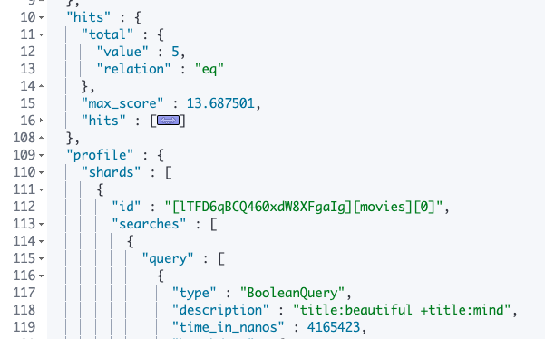

#### 2-2-5 **分组** 

* 表示`must`
* 表示`must_not` 
* `title:(+matrix -reloaded)` 

#### 2-2-6 范围查询 

* 区间表示：**`[]` 闭区间,` {}`开区间**
	* `year:{2019 TO 2018] `
	* `year:[＊ TO 2018]` 

* 算数符号 
	* `year:>2010` 
	* `year:(>2010 && <=2018)` 
	* `year: (+>2010 +<=2018)`

	
```
#范围查询 ,区间写法
GET /movies/_search?q=title:beautiful AND year:[2002 TO 2018%7D
{
	"profile":"true"
}

```	 

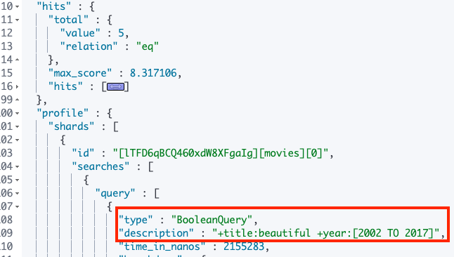


#### 2-2-7 通配符查询（通配符查询效率低, 占用内存大,不建议使用。特别是放在最前面） 

* **?代表1个宇符，＊代表0或多个宇符** 
	* **`title:mi?d`** 
	* **`title:be*`** 

```
#通配符查询
GET /movies/_search?q=title:b*
{
	"profile":"true"
}
```

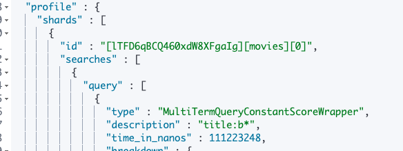

* **正则表达**
	* `title:[bt]oy`

* **模糊匹配与近似查询**
	* `title:befutifl~1`
	* `title:"lord rings"~2`

```
//模糊匹配&近似度匹配
GET /movies/_search?q=title:beautifl~1
{
	"profile":"true"
}
```

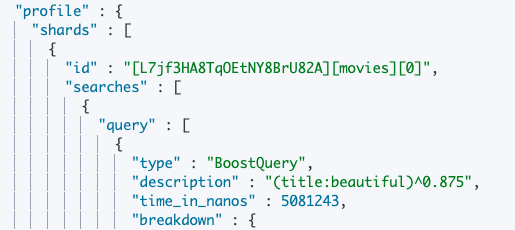

```
GET /movies/_search?q=title:"Lord Rings"~2
{
	"profile":"true"
}
```

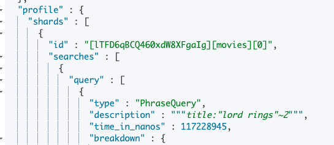


* https://www.elastic.co/guide/en/elasticsearch/reference/7.0/search-uri-request.html
* https://www.elastic.co/guide/en/elasticsearch/reference/7.0/search-search.html

## **3、Request Body & Query DSL介绍** 

### 3-1 Request Body Search 

* 将查询语句通过 HTTP Requedt Body发送给Elasticsearch 
* Query DSL 

```
#查询movies分页
POST /movies,404_idx/_search?ignore_unavailable=true
{
  "profile": true,
	"query": {
		"match_all": {}
	}
}
```

* `ignore_unavailable=true`，可以忽略尝试访问不存在的索引`“404_idx”`导致的报错


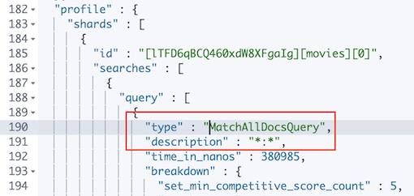


### 3-1-1分页

* From从0开始，默认返回10个结果 
* 获取靠后的翻页成本较高 
 
```
POST /kibana_sample_data_ecommerce/_search
{
  "from":10,
  "size":20,
  "query":{
    "match_all": {}
  }
}
```

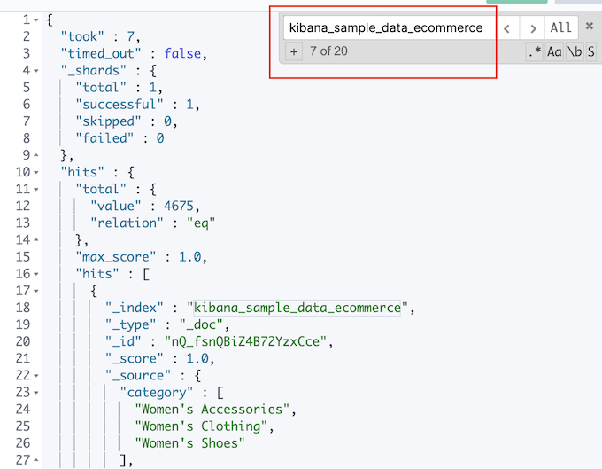


### 3-1-2 排序

1. 最好在“数字型”与"日期型"字段上排序 
2. 因为对于多值类型或分析过的字段排序，系统会选一个值，无法得知该值 

```
#对日期排序
POST kibana_sample_data_ecommerce/_search
{
  "sort":[{"order_date":"desc"}],
  "query":{
    "match_all": {}
  }

}
```

**`"sort":[{"order_date":"desc"}],`**

```
...
"order_date" : "2020-10-10T23:45:36+00:00",
...
"order_date" : "2020-10-10T23:31:12+00:00",
...
"order_date" : "2020-10-10T23:22:34+00:00",
...
"order_date" : "2020-10-10T23:15:22+00:00",
```

### 3-1-3 `_source filerting`

* 如果 `_source`没有存储 ，那就只返回匹配的文档的元数据 
* `_source`支持使用通配符， `_source["name*","desc*"]`

```
#source filtering
POST kibana_sample_data_ecommerce/_search
{
  "_source":["order_date"],
  "query":{
    "match_all": {}
  }
}
```

**`"_source":["order_date"],`**

```
{
  "took" : 28,
  "timed_out" : false,
  "_shards" : {
    "total" : 1,
    "successful" : 1,
    "skipped" : 0,
    "failed" : 0
  },
  "hits" : {
    "total" : {
      "value" : 4675,
      "relation" : "eq"
    },
    "max_score" : 1.0,
    "hits" : [
      {
        "_index" : "kibana_sample_data_ecommerce",
        "_type" : "_doc",
        "_id" : "kw_fsnQBiZ4B72YzxCce",
        "_score" : 1.0,
        "_source" : {
          "order_date" : "2020-10-05T09:28:48+00:00"
        }
      },
      {
        "_index" : "kibana_sample_data_ecommerce",
        "_type" : "_doc",
        "_id" : "lA_fsnQBiZ4B72YzxCce",
        "_score" : 1.0,
        "_source" : {
          "order_date" : "2020-10-04T21:59:02+00:00"
        }
      },
      {
        "_index" : "kibana_sample_data_ecommerce",
        "_type" : "_doc",
        "_id" : "lQ_fsnQBiZ4B72YzxCce",
        "_score" : 1.0,
        "_source" : {
          "order_date" : "2020-10-04T22:32:10+00:00"
        }
      },
      {
        "_index" : "kibana_sample_data_ecommerce",
        "_type" : "_doc",
        "_id" : "lg_fsnQBiZ4B72YzxCce",
        "_score" : 1.0,
        "_source" : {
          "order_date" : "2020-10-04T22:58:05+00:00"
        }
      },
      {
        "_index" : "kibana_sample_data_ecommerce",
        "_type" : "_doc",
        "_id" : "lw_fsnQBiZ4B72YzxCce",
        "_score" : 1.0,
        "_source" : {
          "order_date" : "2020-09-28T03:48:58+00:00"
        }
      },
      {
        "_index" : "kibana_sample_data_ecommerce",
        "_type" : "_doc",
        "_id" : "mA_fsnQBiZ4B72YzxCce",
        "_score" : 1.0,
        "_source" : {
          "order_date" : "2020-09-27T21:44:38+00:00"
        }
      },
      {
        "_index" : "kibana_sample_data_ecommerce",
        "_type" : "_doc",
        "_id" : "mQ_fsnQBiZ4B72YzxCce",
        "_score" : 1.0,
        "_source" : {
          "order_date" : "2020-09-21T09:27:22+00:00"
        }
      },
      {
        "_index" : "kibana_sample_data_ecommerce",
        "_type" : "_doc",
        "_id" : "mg_fsnQBiZ4B72YzxCce",
        "_score" : 1.0,
        "_source" : {
          "order_date" : "2020-10-05T02:19:41+00:00"
        }
      },
      {
        "_index" : "kibana_sample_data_ecommerce",
        "_type" : "_doc",
        "_id" : "mw_fsnQBiZ4B72YzxCce",
        "_score" : 1.0,
        "_source" : {
          "order_date" : "2020-09-27T00:59:02+00:00"
        }
      },
      {
        "_index" : "kibana_sample_data_ecommerce",
        "_type" : "_doc",
        "_id" : "nA_fsnQBiZ4B72YzxCce",
        "_score" : 1.0,
        "_source" : {
          "order_date" : "2020-10-05T03:41:46+00:00"
        }
      }
    ]
  }
}
```

### 3-1-4 脚本字段

用例：订单中有不同的汇率， 需要结合汇率对，订单价格进行排序 

```
#脚本字段
GET kibana_sample_data_ecommerce/_search
{
  "script_fields": {
    "new_field": {
      "script": {
        "lang": "painless",
        "source": "doc['order_date'].value+'hello'"
      }
    }
  },
  "query": {
    "match_all": {}
  }
}
```

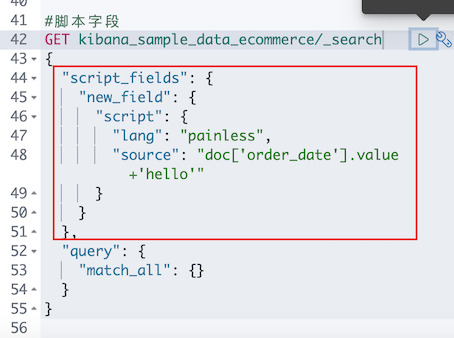

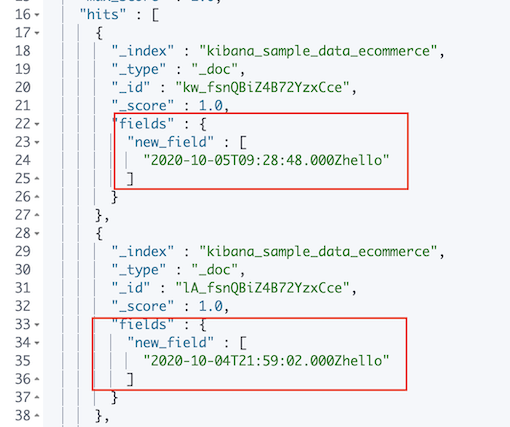

### 3-1-5 使用查询表达式一Match 

```
POST movies/_search
{
  "query": {
    "match": {
      "title": {
        "query": "last christmas",
        "operator": "and"
      }
    }
  }
}
```

***Output: `last christmas`连在一起输出***

```
   "hits" : [
      {
        "_index" : "movies",
        "_type" : "_doc",
        "_id" : "147372",
        "_score" : 8.835976,
        "_source" : {
          "genre" : [
            "Adventure",
            "Drama",
            "Fantasy",
            "Sci-Fi"
          ],
          "title" : "Doctor Who: Last Christmas",
          "year" : 2014,
          "id" : "147372",
          "@version" : "1"
        }
      }
    ]
```

```
POST movies/_search
{
  "query": {
    "match_phrase": {
      "title":{
        "query": "one love"

      }
    }
  }
}
```

***Output: `one love`连在一起输出***

```
{
  "took" : 43,
  "timed_out" : false,
  "_shards" : {
    "total" : 1,
    "successful" : 1,
    "skipped" : 0,
    "failed" : 0
  },
  "hits" : {
    "total" : {
      "value" : 0,
      "relation" : "eq"
    },
    "max_score" : null,
    "hits" : [ ]
  }
}
```

```
POST movies/_search
{
  "query": {
    "match_phrase": {
      "title":{
        "query": "one love",
        "slop": 1

      }
    }
  }
}
```

**`"slop": 1`: 中间可有一个插入单词**

***Output: `one love`中间可有一个插入单词***

```
   "max_score" : 5.3235893,
    "hits" : [
      {
        "_index" : "movies",
        "_type" : "_doc",
        "_id" : "113829",
        "_score" : 5.3235893,
        "_source" : {
          "genre" : [
            "Comedy",
            "Drama",
            "Romance"
          ],
          "title" : "One I Love, The",
          "year" : 2014,
          "id" : "113829",
          "@version" : "1"
        }
      }
    ]
```

## **4、Query String&Simple Query String查询** 

* Query String
* Simple Query String


```
PUT /users/_doc/1
{
  "name":"Xi Jacob",
  "about":"java, golang, node, swift, elasticsearch"
}

PUT /users/_doc/2
{
  "name":"John Jacob",
  "about":"Hadoop"
}
```
***Output:***

```
{
  "_index" : "users",
  "_type" : "_doc",
  "_id" : "2",
  "_version" : 1,
  "result" : "created",
  "_shards" : {
    "total" : 2,
    "successful" : 2,
    "failed" : 0
  },
  "_seq_no" : 14,
  "_primary_term" : 4
}
```

### 4-1 Query String Query 

* 类似URI Query 

```
POST users/_search
{
  "query": {
    "query_string": {
      "default_field": "name",
      "query": "Xi AND Jacob"
    }
  }
}
```

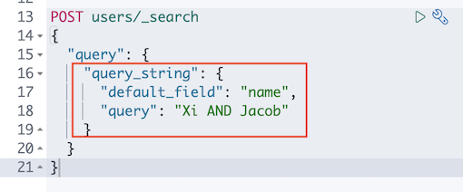

```
POST users/_search
{
  "query": {
    "query_string": {
      "fields":["name","about"],
      "query": "(Xi AND Jacob) OR (Java AND Elasticsearch)"
    }
  }
}
```

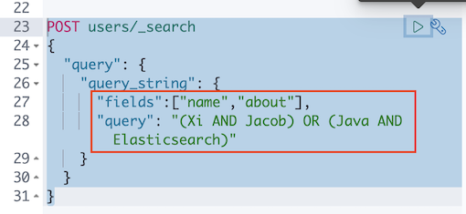

***Output:***

```
"hits" : [
      {
        "_index" : "users",
        "_type" : "_doc",
        "_id" : "1",
        "_score" : 0.8754687,
        "_source" : {
          "name" : "Xi Jacob",
          "about" : "java, golang, node, swift, elasticsearch"
        }
      }
    ]
```


### 4-1 Simple Query String Query 

* 类似Query String，但是会忽略错误的语法， 同时只支持部分查询语法 
* 不支持`AND OR NOT`，会当作字符串处理 
* `Term`之间默认的关系是`OR`，可以指定 `Operator` 
* 支持 部分逻辑 
	* `＋`替代`AND` 
	* `| `替代`OR `
	* `-`替代`NOT`

```
#Simple Query 默认的operator是 Or
POST users/_search
{
  "query": {
    "simple_query_string": {
      "query": "Xi AND Jacob",
      "fields": ["name"]
    }
  }
}
```

* **Simple Query 默认的operator是 Or**
* **And**：**并没有起到作用**

```
 "max_score" : 0.8754687,
    "hits" : [
      {
        "_index" : "users",
        "_type" : "_doc",
        "_id" : "1",
        "_score" : 0.8754687,
        "_source" : {
          "name" : "Xi Jacob",
          "about" : "java, golang, node, swift, elasticsearch"
        }
      },
      {
        "_index" : "users",
        "_type" : "_doc",
        "_id" : "2",
        "_score" : 0.18232156,
        "_source" : {
          "name" : "John Jacob",
          "about" : "Hadoop"
        }
      }
    ]
```

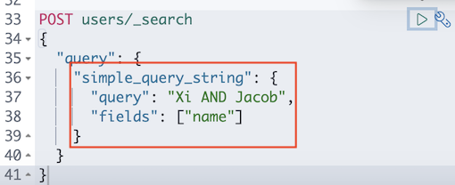

```
POST users/_search
{
  "query": {
    "simple_query_string": {
      "query": "Xi Jacob",
      "fields": ["name"],
      "default_operator": "AND"
    }
  }
}
```

**` "default_operator": "AND"`**: AND 起到了作用

```
"hits" : {
    "total" : {
      "value" : 1,
      "relation" : "eq"
    },
    "max_score" : 0.8754687,
    "hits" : [
      {
        "_index" : "users",
        "_type" : "_doc",
        "_id" : "1",
        "_score" : 0.8754687,
        "_source" : {
          "name" : "Xi Jacob",
          "about" : "java, golang, node, swift, elasticsearch"
        }
      }
    ]
```

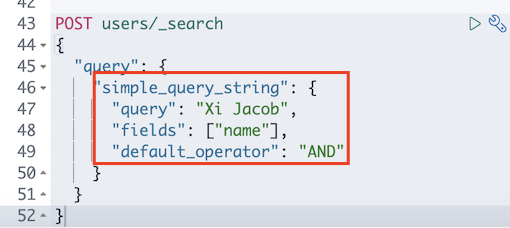

### 4-2 Query String&Simple Query String on Movies

### 4-2-1 Single field Query String

```
GET /movies/_search
{
	"profile": true,
	"query":{
		"query_string":{
			"default_field": "title",
			"query": "Beafiful AND Mind"
		}
	}
}
```

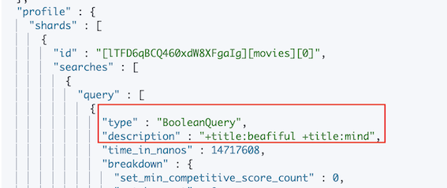

### 4-2-2 Multiple Simple Query String 

```
# 多fields
GET /movies/_search
{
	"profile": true,
	"query":{
		"query_string":{
			"fields":[
				"title",
				"year"
			],
			"query": "2012"
		}
	}
}
```
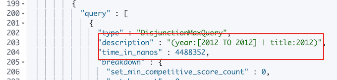

### 4-2-3  Simple Query String 

```
GET /movies/_search
{
	"profile":true,
	"query":{
		"simple_query_string":{
			"query":"Beautiful +mind",
			"fields":["title"]
		}
	}
}
```

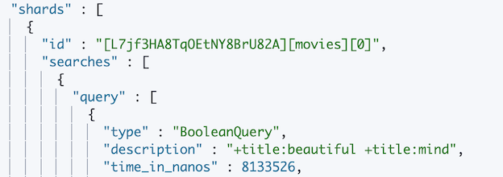


## **5、ES Query 本章总结**

### 5-1 ES Query 分类:

* URI查询
* DSL查询

### 5-2 三种查询的区别

* `query` 功能强大易出错
* `query_string` 功能简单灵活性低
* `simple_query_string` 功能简单灵活性低


 
