# **第六节 ElasticSearch Mapping 介绍**

## 1、**Dynamic Mapping和常见字段类型** 

**本节知识点**

* Mapping&Dynamic Mapping 
* 字段类型自动识别 
* 控制Mapping的Dynamic属性

### 1-1 什么是Mapping 

* **Mapping类似数据库中的schema的定义**，作用如下 
	* 定义索引中的字段的名称 
	* 定义字段的数据类型，例如字符串，数字，布尔…… 
	* **字段，倒排索引的相关配置，(Analyzed or Not Analyzed Analyzer)**
* **Mapping会把JSON文档映射成Lucene所需要的扁平格式** 
* **一个Mapping属于一个索引的Type** 
	* 每个文档都属于一个Type 
	* 一个Type有一个Mapping定义 
	* **7.0开始，不需要在Mapping定义中指定type信息** 

***Mapping中的字段一旦设定后，禁止直接修改。因为倒排索引生成后不允许直接修改。需要重新建立新的索引，做reindex操作。***

类似数据库中的表结构定义，主要作用

* 定义所以下的字段名字
* 定义字段的类型
* 定义倒排索引相关的配置（是否被索引？采用的Analyzer）

对新增字段的处理 **true false strict**

在object下，支持做dynamic的属性的定义

### 1-2 字段的数据类型 

* **简单类型**
	* Text/Keyword 
	* Date
	* Integer/Floating 
	* Boolean 
	* IPv4&IPv6 

* **复杂类型一对象和嵌套对象**
	* 对象类型／嵌套类型 

* **特殊类型**
	*  `geo_point`&`geo_shape`/`percolator `


### 1-3 什么是Dynamic Mapping 

* 在写入文档时候，如果索引不存在，会自动创建索引 
* Dynamic Mapping的机制，使得我们无需手动定义Mappings
* Elasticsearch会自动根据文档信息，推算出字段的类型 
* 但是有时候会推算的不对，例如**地理位置**信息 
* **当类型如果设置不对时，会导致一些功能无法正常运行，例如 Range查询** 

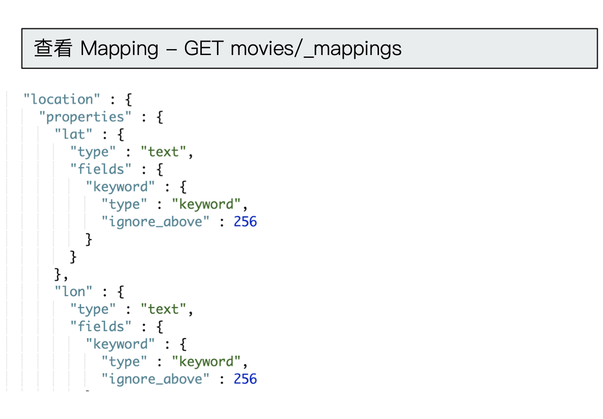

### 1-4 类型的自动识别

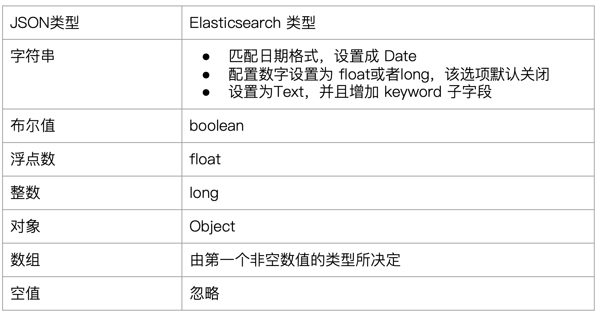

**Demo**

* 写入文档，看Elasticsearch会如何推导数据类型 
	* 数字用引号，默认当下TEXT
	* 日期格式会推导成Date 
* 有一些类型会推导出错，例如地理位置信息。 

#### 写入文档，查看 Mapping

```
#写入文档，查看 Mapping
PUT mapping_test/_doc/1
{
  "firstName":"Chan",
  "lastName": "Jackie",
  "loginDate":"2018-07-24T10:29:48.103Z"
}
```

***Output***

```
{
  "_index" : "mapping_test",
  "_type" : "_doc",
  "_id" : "1",
  "_version" : 1,
  "result" : "created",
  "_shards" : {
    "total" : 2,
    "successful" : 1,
    "failed" : 0
  },
  "_seq_no" : 0,
  "_primary_term" : 1
}
```

#### 查看 Mapping文件

```
#查看 Mapping文件
GET mapping_test/_mapping
```

***Output***

```
{
  "mapping_test" : {
    "mappings" : {
      "properties" : {
        "firstName" : {
          "type" : "text",
          "fields" : {
            "keyword" : {
              "type" : "keyword",
              "ignore_above" : 256
            }
          }
        },
        "lastName" : {
          "type" : "text",
          "fields" : {
            "keyword" : {
              "type" : "keyword",
              "ignore_above" : 256
            }
          }
        },
        "loginDate" : {
          "type" : "date"
        }
      }
    }
  }
}
```

#### Delete index

```
DELETE mapping_test
```

```
{
  "acknowledged" : true
}
```

#### dynamic mapping，推断字段的类型

```
PUT mapping_test/_doc/1
{
    "uid" : "123",
    "isVip" : false,
    "isAdmin": "true",
    "age":19,
    "heigh":180
}
```

```
{
  "_index" : "mapping_test",
  "_type" : "_doc",
  "_id" : "1",
  "_version" : 1,
  "result" : "created",
  "_shards" : {
    "total" : 2,
    "successful" : 2,
    "failed" : 0
  },
  "_seq_no" : 0,
  "_primary_term" : 1
}
```

```
#查看 Dynamic
GET mapping_test/_mapping

{
  "mapping_test" : {
    "mappings" : {
      "properties" : {
        "age" : {
          "type" : "long"
        },
        "heigh" : {
          "type" : "long"
        },
        "isAdmin" : {
          "type" : "text",
          "fields" : {
            "keyword" : {
              "type" : "keyword",
              "ignore_above" : 256
            }
          }
        },
        "isVip" : {
          "type" : "boolean"
        },
        "uid" : {
          "type" : "text",
          "fields" : {
            "keyword" : {
              "type" : "keyword",
              "ignore_above" : 256
            }
          }
        }
      }
    }
  }
}
```

### 1-5 能否更改Mapping的字段类型 

**两种情况** 

* 新增加字段 
	* **Dynamic设为true时**，一旦有新增字段的文档写入，Mapping也同时被更新 
	* **Dynamic设为false**, Mapping不会被更新，**新增字段的数据无法被索引** ,但是信息会出现在`_source`中 
	* **Dynamic设置成Strict**，文档写入失败 
* **对已有字段，一旦已经有数据写入，就不再支持修改字段定义** 
	* Lucene实现的倒排索引，一旦生成后，就不允许修改 
* 如果希望改变字段类型，**必须Reindex API，重建索引** 

**原因** 

* 如果修改了字段的数据类型，会导致已被索引的属于无法被搜索 
* 但是如果是增加新的字段，就不会有这样的影响 


### 1-6 控制Dynamic Mappings 

* 当dynamic被设置成false时候，存在新增字段的数据写入，该数据可以被索引但是新增字段被丢弃 
* 当设置成Strict模式时候，数据写入直接出错 

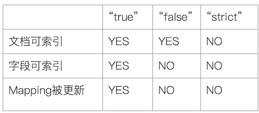

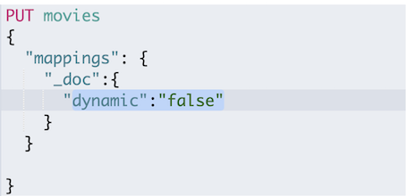


#### 默认Mapping支持dynamic，写入的文档中加入新的字段

```
PUT dynamic_mapping_test/_doc/1
{
  "newField":"someValue"
}
```

```
GET dynamic_mapping_test/_mapping

{
  "dynamic_mapping_test" : {
    "mappings" : {
      "properties" : {
        "newField" : {
          "type" : "text",
          "fields" : {
            "keyword" : {
              "type" : "keyword",
              "ignore_above" : 256
            }
          }
        }
      }
    }
  }
}
```

#### 该字段可以被搜索，数据也在`_source`中出现

```
POST dynamic_mapping_test/_search
{
  "query":{
    "match":{
      "newField":"someValue"
    }
  }
}
```

***Output***

```
"hits" : [
      {
        "_index" : "dynamic_mapping_test",
        "_type" : "_doc",
        "_id" : "1",
        "_score" : 0.2876821,
        "_source" : {
          "newField" : "someValue"
        }
      }
    ]
```


#### 修改为dynamic false

```
PUT dynamic_mapping_test/_mapping
{
  "dynamic": false
}
```
 
```
{
  "acknowledged" : true
}
```

#### 新增 anotherField

```
PUT dynamic_mapping_test/_doc/10
{
  "anotherField":"someValue"
}
```

**` "dynamic": false`**: 可以插入，无法被搜索到

```
POST dynamic_mapping_test/_search
{
  "query":{
    "match":{
      "anotherField":"someValue"
    }
  }
}
```

#### 该字段不可以被搜索，因为dynamic已经被设置为false

```
{
  "took" : 168,
  "timed_out" : false,
  "_shards" : {
    "total" : 1,
    "successful" : 1,
    "skipped" : 0,
    "failed" : 0
  },
  "hits" : {
    "total" : {
      "value" : 0,
      "relation" : "eq"
    },
    "max_score" : null,
    "hits" : [ ]
  }
}
```

```
GET dynamic_mapping_test/_doc/10
```
```
{
  "_index" : "dynamic_mapping_test",
  "_type" : "_doc",
  "_id" : "10",
  "_version" : 1,
  "_seq_no" : 1,
  "_primary_term" : 1,
  "found" : true,
  "_source" : {
    "anotherField" : "someValue"
  }
}
```

#### 修改为strict

```
PUT dynamic_mapping_test/_mapping
{
  "dynamic": "strict"
}
```

```
{
  "acknowledged" : true
}
```

#### 写入数据出错，HTTP Code 400

```
PUT dynamic_mapping_test/_doc/12
{
  "lastField":"value"
}
```

```
{
  "error" : {
    "root_cause" : [
      {
        "type" : "strict_dynamic_mapping_exception",
        "reason" : "mapping set to strict, dynamic introduction of [lastField] within [_doc] is not allowed"
      }
    ],
    "type" : "strict_dynamic_mapping_exception",
    "reason" : "mapping set to strict, dynamic introduction of [lastField] within [_doc] is not allowed"
  },
  "status" : 400
}
```

```
GET dynamic_mapping_test/_doc/12

{
  "_index" : "dynamic_mapping_test",
  "_type" : "_doc",
  "_id" : "12",
  "found" : false
}
```

## **2、显式Mapping设置与常见参数介绍**

### 2-1 如何显示定义一个Mapping 

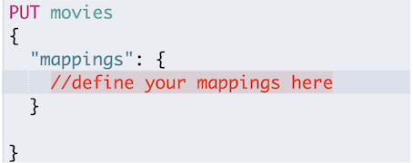

### 2-2 自定义Mapping的一些建议 

* 可以参考API手册，纯手写 
* 为了减少输入的工作量，减少出错概率，可以依照以下步骤 
	* 创建一个临时的index，写入一些样本数据 
	* 通过访问Mapping API获得该临时文件的动态Mapping定义 
	* 修改后用，使用该配置创建你的索引 
	* 删除临时索引 

```
#设置 Mobile index 为 false
DELETE users


PUT users
{
    "mappings" : {
      "properties" : {
        "firstName" : {
          "type" : "text"
        },
        "lastName" : {
          "type" : "text"
        },
        "mobile" : {
          "type" : "text",
          "index": false
        }
      }
    }
}
```

***Output :***

```
{
  "acknowledged" : true,
  "shards_acknowledged" : true,
  "index" : "users"
}
```


```
PUT users/_doc/1
{
  "firstName":"Jacob",
  "lastName": "Xi",
  "mobile": "12345678"
}
```

```
POST /users/_search
{
  "query": {
    "match": {
      "mobile":"12345678"
    }
  }
}
```
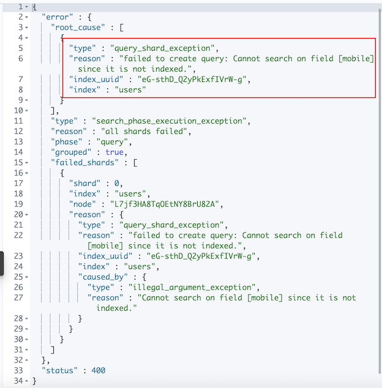

### 2-3 Index Options

* 四种不同级别的Index Options配置，可以控制倒排索引记录的内容 
	* docs——记录`doc id `
	* freqs——记录`doc id`和`term frequencies` 
	* positions一记录`doc id` / `term frequencies` / `term position` 
	* offsets一`doc id`/`term frequencies`/`term posistion`/`character offects` 
* Text类型默认记录postions，其他默认为docs 
* 记录内容越多，占用存储空间越大 

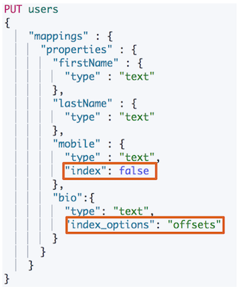

### 2-4 null_values

* 需要对Null值实现搜索 
* 只有Keyword类型支持设定`null_value`

```
#设定Null_value
DELETE users


PUT users
{
    "mappings" : {
      "properties" : {
        "firstName" : {
          "type" : "text"
        },
        "lastName" : {
          "type" : "text"
        },
        "mobile" : {
          "type" : "keyword",
          "null_value": "NULL"
        }

      }
    }
}
```

***Output***

```
{
  "acknowledged" : true,
  "shards_acknowledged" : true,
  "index" : "users"
}
```

```
PUT users/_doc/1
{
  "firstName":"Jacob",
  "lastName": "Xi",
  "mobile": null
}
```

```
PUT users/_doc/2
{
  "firstName":"Jacob2",
  "lastName": "xi2"

}
```

```
GET users/_search
{
  "query": {
    "match": {
      "mobile":"NULL"
    }
  }

}

GET users/_search?q=mobile:NULL
```

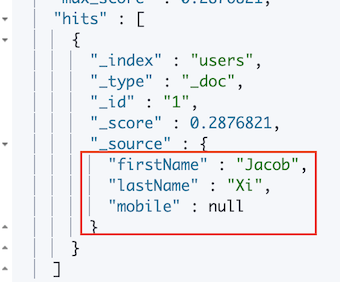

### 2-5 copy_to 设置

* `_all`在7中被`copy_to`所替代 
* 满足一些特定的搜索需求 
* `copy_to`将字段的数值拷贝到目标字段，实现类似`_all`的作用 
* `copy_to`的目标字段不出现在`_source`中 

```
#设置 Copy to
DELETE users
PUT users
{
  "mappings": {
    "properties": {
      "firstName":{
        "type": "text",
        "copy_to": "fullName"
      },
      "lastName":{
        "type": "text",
        "copy_to": "fullName"
      }
    }
  }
}
```

```
PUT users/_doc/1
{
  "firstName":"Jacob",
  "lastName": "Xi"
}
```

```
GET users/_search?q=fullName:(Jacob Xi)
```

```
POST users/_search
{
  "query": {
    "match": {
       "fullName":{
        "query": "Jacob Xi",
        "operator": "and"
      }
    }
  }
}
```

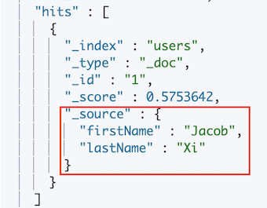


### 2-6 数组类型 

* **Elasticsearch中不提供专门的数组类型。但是任何字段，都可以包含多个相同类类型的数值** 

```
#数组类型
PUT users/_doc/1
{
  "name":"onebird",
  "interests":"reading"
}

PUT users/_doc/1
{
  "name":"twobirds",
  "interests":["reading","music"]
}
```

```
POST users/_search
{
  "query": {
		"match_all": {}
	}
}
```

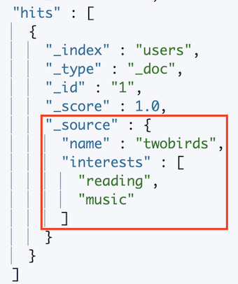

```
GET users/_mapping

{
  "users" : {
    "mappings" : {
      "properties" : {
        "firstName" : {
          "type" : "text",
          "copy_to" : [
            "fullName"
          ]
        },
        "fullName" : {
          "type" : "text",
          "fields" : {
            "keyword" : {
              "type" : "keyword",
              "ignore_above" : 256
            }
          }
        },
        "interests" : {
          "type" : "text",
          "fields" : {
            "keyword" : {
              "type" : "keyword",
              "ignore_above" : 256
            }
          }
        },
        "lastName" : {
          "type" : "text",
          "copy_to" : [
            "fullName"
          ]
        },
        "name" : {
          "type" : "text",
          "fields" : {
            "keyword" : {
              "type" : "keyword",
              "ignore_above" : 256
            }
          }
        }
      }
    }
  }
}
```

## **3、多字段特性及Mapping中配置自定义Analyzer**

### 3-1 多字段类型

* 多字段特性 
	* 厂商名字实现精确匹配 
		* **增加一个keyword字段** 
	* 使用不同的analyzer 
		* 不同语言 
		* pinyin字段的搜索 
		* 还支持为搜索和索引指定不同的analyzer 


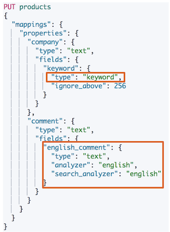

### 3-2 Exact Values v.s Full Text 

* Exact Values v.s Full Text 
	* Exact Value:包括数字／日期／具体一个字符串（例如"Apple Store") 
		* **Elasticseach中的keyword** 
	* 全文本，非结构化的文本数据 
		* **Elasticsearch中的text** 

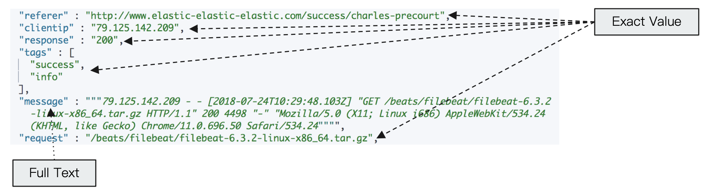	
### 3-3 Exact Values不需要被分词 

* Elasticsearch为每一个字段创建一个**倒排索引** 
	* `Exact Value`在索引时，不需要做特殊的分词处理 

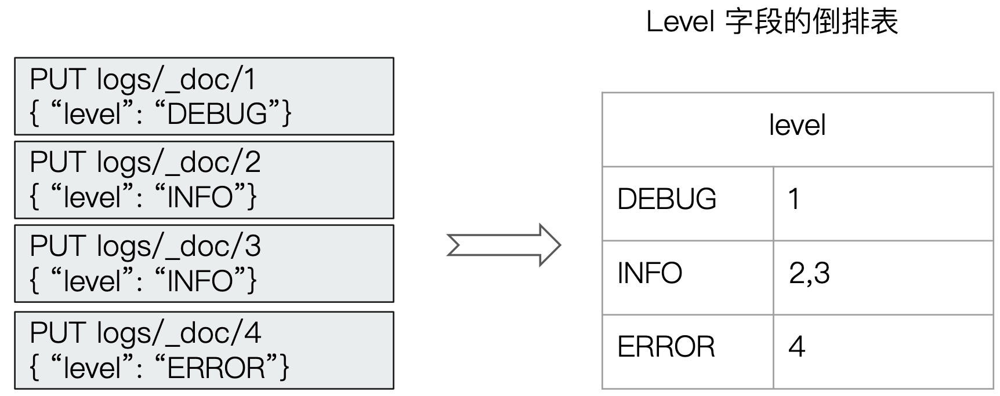

```
PUT logs/_doc/1
{"level":"DEBUG"}

GET /logs/_mapping
```

***Output***

```
{
  "logs" : {
    "mappings" : {
      "properties" : {
        "level" : {
          "type" : "text",
          "fields" : {
            "keyword" : {
              "type" : "keyword",
              "ignore_above" : 256
            }
          }
        }
      }
    }
  }
}
```


### 3-4 自定义分词 

* 当Elasticsearch自带的分词器无法满足时，可以自定义分词器。通过自组合不同的组件实现 
	* **Character Filter** 
	* **Tokenizer** 
	* **Token Filter**

### 3-5 Character Filters 

* 在Tokenizer之前对文本进行处理，例如增加删除及替换字符。可以配置多个`Character Filters`。会影响`Tokenizer`的`position`和`offset`信息 
* 一些自带的`Character Filters`
	* HTML strip —— 去除html标签 
	* Mapping —— 字符串替换 
	* Pattern replace —— 正则匹配替换 

#### 3-5-1 HTML strip —— 去除html标签 

```
POST _analyze
{
  "tokenizer":"keyword",
  "char_filter":["html_strip"],
  "text": "<b>hello world</b>"
}
```

```
{
  "tokens" : [
    {
      "token" : "hello world",
      "start_offset" : 3,
      "end_offset" : 18,
      "type" : "word",
      "position" : 0
    }
  ]
}
```

#### 3-5-2 Mapping —— 字符串替换

```
#使用char filter进行替换
POST _analyze
{
  "tokenizer": "standard",
  "char_filter": [
      {
        "type" : "mapping",
        "mappings" : [ "- => _"]
      }
    ],
  "text": "123-456, I-test! test-990 650-555-1234"
}
```

***Output :***

```
{
  "tokens" : [
    {
      "token" : "123_456",
      "start_offset" : 0,
      "end_offset" : 7,
      "type" : "<NUM>",
      "position" : 0
    },
    {
      "token" : "I_test",
      "start_offset" : 9,
      "end_offset" : 15,
      "type" : "<ALPHANUM>",
      "position" : 1
    },
    {
      "token" : "test_990",
      "start_offset" : 17,
      "end_offset" : 25,
      "type" : "<ALPHANUM>",
      "position" : 2
    },
    {
      "token" : "650_555_1234",
      "start_offset" : 26,
      "end_offset" : 38,
      "type" : "<NUM>",
      "position" : 3
    }
  ]
}
```
```
//char filter 替换表情符号
POST _analyze
{
  "tokenizer": "standard",
  "char_filter": [
      {
        "type" : "mapping",
        "mappings" : [ ":) => happy", ":( => sad"]
      }
    ],
    "text": ["I am felling :)", "Feeling :( today"]
}
```
***Output :***

```
...
 {
      "token" : "felling",
      "start_offset" : 5,
      "end_offset" : 12,
      "type" : "<ALPHANUM>",
      "position" : 2
    },
    {
      "token" : "happy",
      "start_offset" : 13,
      "end_offset" : 15,
      "type" : "<ALPHANUM>",
      "position" : 3
    },
    {
      "token" : "Feeling",
      "start_offset" : 16,
      "end_offset" : 23,
      "type" : "<ALPHANUM>",
      "position" : 104
    },
    {
      "token" : "sad",
      "start_offset" : 24,
      "end_offset" : 26,
      "type" : "<ALPHANUM>",
      "position" : 105
    },
 ...
```

* `felling`  \ `happy` \ `Feeling` \ `sad`

#### 3-5-3 Pattern replace —— 正则匹配替换

```
//正则表达式
GET _analyze
{
  "tokenizer": "standard",
  "char_filter": [
      {
        "type" : "pattern_replace",
        "pattern" : "http://(.*)",
        "replacement" : "$1"
      }
    ],
    "text" : "http://www.elastic.co"
}
```

***Output***

```
{
  "tokens" : [
    {
      "token" : "www.elastic.co",
      "start_offset" : 0,
      "end_offset" : 21,
      "type" : "<ALPHANUM>",
      "position" : 0
    }
  ]
}
```

### 3-6 Tokenizer 

* 将原始的文本按照一定的规则，切分为词（term or token) 
* Elasticsearch内置的Tokenizers 
	* whitespace/standard/`uax_url_email`/pattern/keyword/path hierarchy 
* 可以用Java开发插件，实现自己的Tokenizer 


#### 3-6-1 whitespace

```
// white space and snowball
GET _analyze
{
  "tokenizer": "whitespace",
  "filter": ["stop","snowball"],
  "text": ["The gilrs in China are playing this game!"]
}
```
```
{
  "tokens" : [
    {
      "token" : "The",
      "start_offset" : 0,
      "end_offset" : 3,
      "type" : "word",
      "position" : 0
    },
    {
      "token" : "gilr",
      "start_offset" : 4,
      "end_offset" : 9,
      "type" : "word",
      "position" : 1
    },
    {
      "token" : "China",
      "start_offset" : 13,
      "end_offset" : 18,
      "type" : "word",
      "position" : 3
    },
...
```

* The \ gilr \ China \ play \ game!

```
// whitespace与stop
GET _analyze
{
  "tokenizer": "whitespace",
  "filter": ["stop","snowball"],
  "text": ["The rain in Spain falls mainly on the plain."]
}
```

* The  \ rain \ Spain \ falls  \ mainly \  plain


#### 3-6-2 `path hierarchy`

```
POST _analyze
{
  "tokenizer":"path_hierarchy",
  "text":"/user/ymruan/a/b/c/d/e"
}
```

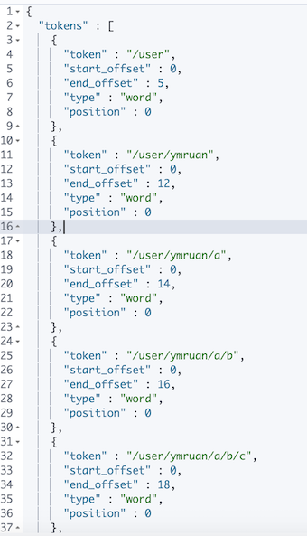

### 3-7 Token Filters 

* 将Tokenizer输出的单词（term)，进行增加，修改，删除 
* 自带的`Token Filters` 
	* `Lowercase`/`stop`/`synonym`（添加近义词） 


```
//remove 加入lowercase后，The被当成 stopword删除
GET _analyze
{
  "tokenizer": "whitespace",
  "filter": ["lowercase","stop","snowball"],
  "text": ["The gilrs in China are playing this game!"]
}
```

* gilr \ china \ play \ game


### 3-8 设置一个Custom Analyzer 

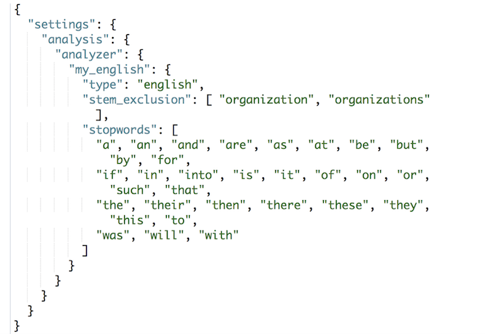


