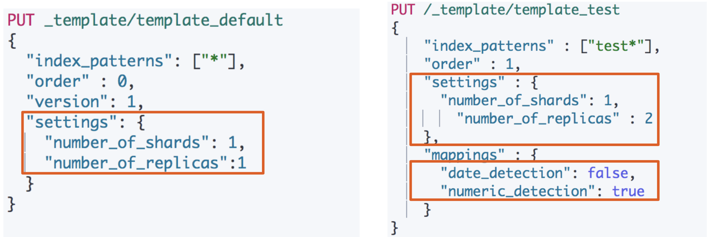
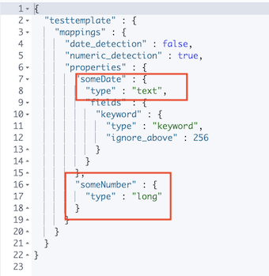
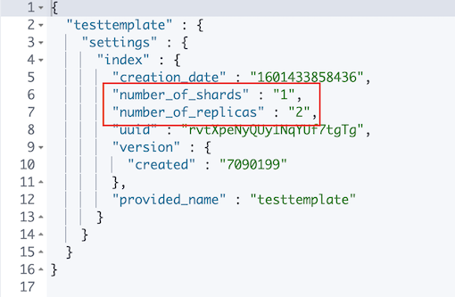
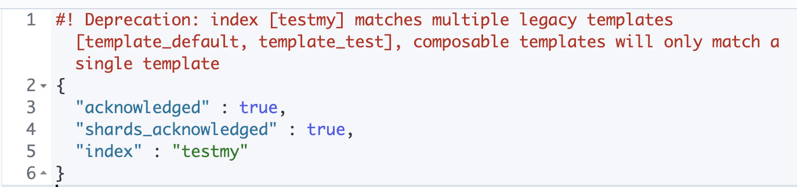
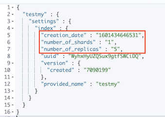
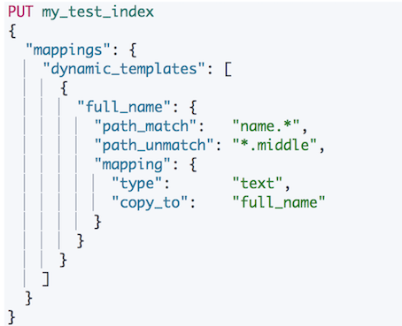
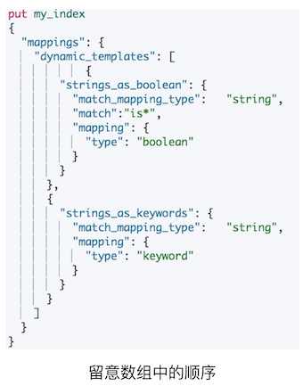
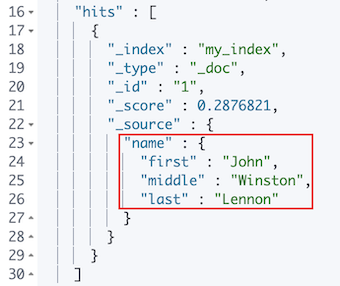

# **第七节 Index Template和Dynamic Template**

## **1、管理很多的索引** 

* 集群上的索引会越来越多，例如，你会为你的日志每天创建一个索引 
	* 使用多个索引可以让你更好的管理你的数据，提高性能 
	* logs-2019-05-01 
	* logs-2019-05-02 
	* logs-2019-05-03 


## **2、什么是Index Template** 

* **Index Templates —— 帮助你设定Mappings和Settings，并按照一定的规则自动匹配到新创建的索引之上** 
	* **模版仅在一个索引被新创建时，才会产生作用。修改模版不会影响已创建的索引** 
	* 你可以设定多个索引模版，这些设置会被`"merge"`在一起 
	* 你可以指定`"order"`的数值，控制`"merging"`的过程 

### 2-1 两个Index Templates 




#### 2-1-1 没有设定Mappings和Settings

```
PUT template/_doc/1
{
	"someNumber":"1",
	"someDate":"2019/01/01"
}
```

***Output :***

```
{
  "template" : {
    "mappings" : {
      "properties" : {
        "someDate" : {
          "type" : "date",
          "format" : "yyyy/MM/dd HH:mm:ss||yyyy/MM/dd||epoch_millis"
        },
        "someNumber" : {
          "type" : "text",
          "fields" : {
            "keyword" : {
              "type" : "keyword",
              "ignore_above" : 256
...
```

### 2-2 Index Template的工作方式 

* 当一个索引被新创建时 
	* `Elasticsearch`默认的`settings`和`mappings` 
	* 应用`order`数值低的`Index Template`中的设定 
	* 应用`order`高的`Index Template`中的设定，之前的设定会被覆盖
	* 应用创建索引时，用户所指定的Settings和Mappings，并覆盖之前模版中的设定 

**Demo**

* 创建`2`个`Index Templates` 
* 查看根据名字查看`Templates` 
* 查看所有templates, `_template/*` 
* 创建一个临时索引，查看replica和数据类型推断 
* 将索引名字设为能Index Template匹配时，查看所生成的Index的mappings和Settings 


### 2-3 设定Mappings和Settings

```
#Create a default template
PUT _template/template_default
{
  "index_patterns": ["*"],
  "order" : 0,
  "version": 1,
  "settings": {
    "number_of_shards": 1,
    "number_of_replicas":1
  }
}
```
```
PUT /_template/template_test
{
    "index_patterns" : ["test*"],
    "order" : 1,
    "settings" : {
    	"number_of_shards": 1,
        "number_of_replicas" : 2
    },
    "mappings" : {
    	"date_detection": false,
    	"numeric_detection": true
    }
}
```

***查看template信息***

```
#查看template信息
GET /_template/template_default
GET /_template/temp*
```

***Output :***

```
GET /_template/template_default

{
  "template_default" : {
    "order" : 0,
    "version" : 1,
    "index_patterns" : [
      "*"
    ],
    "settings" : {
      "index" : {
        "number_of_shards" : "1",
        "number_of_replicas" : "1"
      }
    },
    "mappings" : { },
    "aliases" : { }
  }
}

```

```
GET /_template/temp*

{
  "template_test" : {
    "order" : 1,
    "index_patterns" : [
      "test*"
    ],
    "settings" : {
      "index" : {
        "number_of_shards" : "1",
        "number_of_replicas" : "2"
      }
    },
    "mappings" : {
      "numeric_detection" : true,
      "date_detection" : false
    },
    "aliases" : { }
  },
  "template_default" : {
    "order" : 0,
    "version" : 1,
    "index_patterns" : [
      "*"
    ],
    "settings" : {
      "index" : {
        "number_of_shards" : "1",
        "number_of_replicas" : "1"
      }
    },
    "mappings" : { },
    "aliases" : { }
  }
}
```

#### 写入新的数据，index以`test`开头

```
PUT testtemplate/_doc/1
{
	"someNumber":"1",
	"someDate":"2019/01/01"
}
```

***Output :***

```
GET testtemplate/_mapping
```



```
GET testtemplate/_settings
```



```
PUT testmy
{
	"settings":{
		"number_of_replicas":5
	}
}
```


```
PUT testmy/_doc/1
{
  "key":"value"
}
```

```
GET testmy/_settings
```



```
DELETE testmy
DELETE /_template/template_default
DELETE /_template/template_test
```


## **3、什么是Dynamic Template** 

* 根据Elasticsearch识别的数据类型，结合字段名称，来动态设定字段类型 
	* **所有的字符串类型都设定成Keyword，或者关闭keyword字段** 
	* **is开头的字段都设置成boolean** 
	* `long_`开头的都设置成`long`类型 

### 3-1 Dynamic Tempate

* Dynamic Tempate是定义在在某个索引的Mapping中 
* Template有一个名称 
* 匹配规则是一个数组 
* 为匹配到字段设置Mapping 




### 3-2 匹配规则参数 

* `match_mapping_type`：匹配自动识别的字段类型 如string, boolean等 
* `match`, `unmatch`：匹配字段名 
* `path_match`,`path_unmatch`


 
### 3-3 Dynaminc Mapping 根据类型和字段名 DEMO

```
#Dynaminc Mapping 根据类型和字段名
DELETE my_index


PUT my_index/_doc/1
{
  "firstName":"Jacob",
  "isVIP":"true"
}

GET my_index/_mapping
```

```
{
  "my_index" : {
    "mappings" : {
      "properties" : {
        "firstName" : {
          "type" : "text",
          "fields" : {
            "keyword" : {
              "type" : "keyword",
              "ignore_above" : 256
            }
          }
        },
        "isVIP" : {
          "type" : "text",
          "fields" : {
            "keyword" : {
              "type" : "keyword",
              "ignore_above" : 256
```

* firstName:  `"type" : "text",`
* isVIP : `"type" : "text",`


```
PUT my_index
{
  "mappings": {
    "dynamic_templates": [
            {
        "strings_as_boolean": {
          "match_mapping_type":   "string",
          "match":"is*",
          "mapping": {
            "type": "boolean"
          }
        }
      },
      {
        "strings_as_keywords": {
          "match_mapping_type":   "string",
          "mapping": {
            "type": "keyword"
          }
        }
      }
    ]
  }
}
```

***Outout***

```
{
  "acknowledged" : true,
  "shards_acknowledged" : true,
  "index" : "my_index"
}
```

```
DELETE my_index
```

**`match`, `unmatch`：匹配字段名**

```
#结合路径
PUT my_index
{
  "mappings": {
    "dynamic_templates": [
      {
        "full_name": {
          "path_match":   "name.*",
          "path_unmatch": "*.middle",
          "mapping": {
            "type":       "text",
            "copy_to":    "full_name"
          }
        }
      }
    ]
  }
}
```

```
{
  "acknowledged" : true,
  "shards_acknowledged" : true,
  "index" : "my_index"
}
```

```
PUT my_index/_doc/1
{
  "name": {
    "first":  "John",
    "middle": "Winston",
    "last":   "Lennon"
  }
}
```

```
GET my_index/_search?q=full_name:John
```

**`_search?q=full_name:John`**




**相关阅读**

* Index Templates https://www.elastic.co/guide/en/elasticsearch/reference/7.1/indices-templates.html
* Dynamic Template https://www.elastic.co/guide/en/elasticsearch/reference/7.1/dynamic-mapping.html