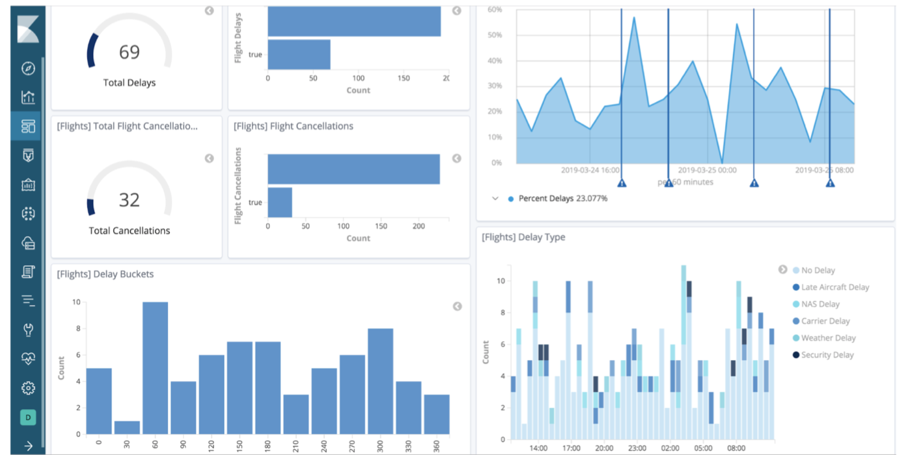
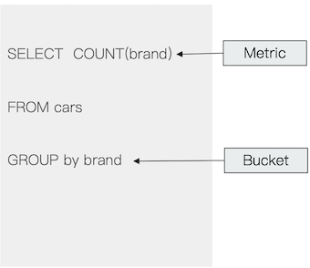
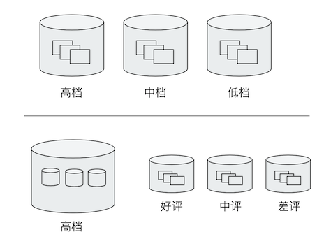
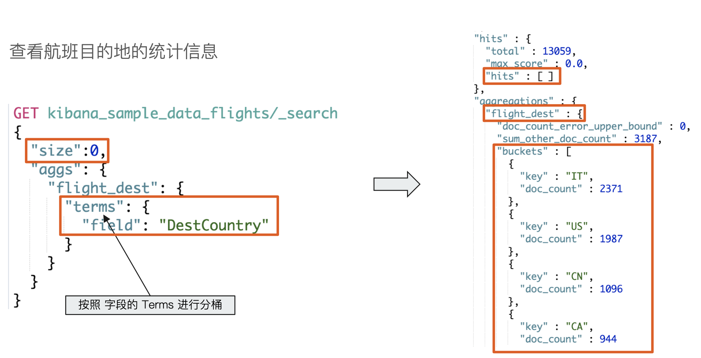
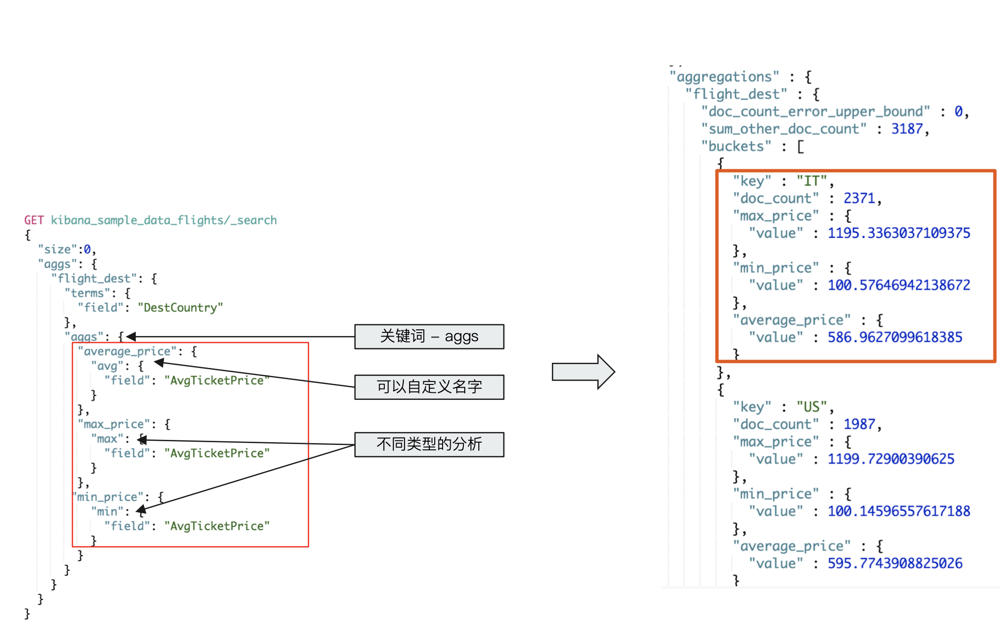
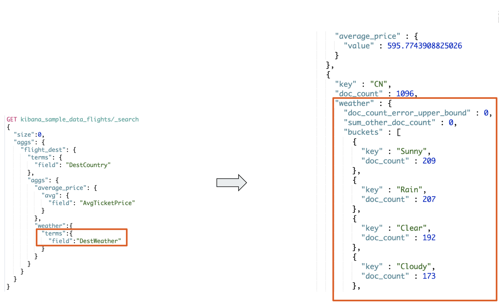
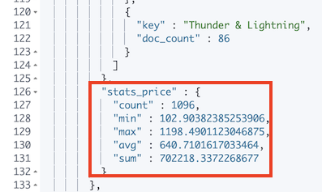

# **第八节 Elasticsearch Aggregations聚合分析简介**

## **1、什么是聚合（Aggregation)** 


* Elasticsearch除搜索以外，提供的针对ES数据进行统计分析的功能 
	* 实时性高 
	* Hadoop(T+1) 

* **通过聚合，我们会得到一个数据的概览，是分析和总结全套的数据，而不是寻找单个文档** 
	* 尖沙咀和香港岛的客房数量 
	* 不同的价格区间，可预定的经济型酒店和五星级酒店的数量 
* **高性能，只需要一条语句，就可以从Elasticsearch得到分析结果** 
	* 无需在客户端自己去实现分析逻辑 


### 1-1 Kibana可视化报表一聚合分析

* 公司程序员的工作岗位分布 
* 公司采用的编程框架分布 
* 公司员工薪水分布 
* 客户的地理位置分布 
* 订单的增长情况 
* 等等



### 1-2 **集合的分类**

* Bucket Aggregation－一些列满足特定条件的文档的集合 
* Metric Aggregation－一些数学运算，可以对文档字段进行统计分析 
* Pipeline Aggregation一对其他的聚合结果进行二次聚合 
* Matrix Aggregration一支持对多个字段的操作并提供一个结果矩阵 

### 1-2 **Bucket & Metric**

* Metric一一些系列的统计方法 
* Bucket一一组满足条件的文档 



### 1-3 **Bucket**

* 一些例子
	* 杭州属于浙江／一个演员属于 男或女性
	* 嵌套关系一杭州属于浙江属于中国属于亚洲 
* Elasticsearch提供了很多类型的Bucket，帮助你用多种方式划分文档 
	* Term&Range（时间／年龄区间／地理位置） 



### 1-4 Metric 

* Metric会基于数据集计算结果，除了支持在字段上进行计算，同样也支持在脚本(painless script）产生的结果之上进行计算 
* 大多数Metric是数学计算，仅输出一个值 
	* `min`/`max`/`sum`/`avg`/`cardinality` 
* 部分metric支持输出多个数值 
	* `stats`/`percentiles`/`percentile_ranks` 


### 1-5 **一个Bucket的例子** 



```
#按照目的地进行分桶统计
GET kibana_sample_data_flights/_search
{
	"size": 0,
	"aggs":{
		"flight_dest":{
			"terms":{
				"field":"DestCountry"
			}
		}
	}
}
```

### 1-6 **加入Metrics** 

查看航班目的地的统计信息，增加均价，最高最低价格 



```
#查看航班目的地的统计信息，增加平均，最高最低价格
GET kibana_sample_data_flights/_search
{
	"size": 0,
	"aggs":{
		"flight_dest":{
			"terms":{
				"field":"DestCountry"
			},
			"aggs":{
				"avg_price":{
					"avg":{
						"field":"AvgTicketPrice"
					}
				},
				"max_price":{
					"max":{
						"field":"AvgTicketPrice"
					}
				},
				"min_price":{
					"min":{
						"field":"AvgTicketPrice"
					}
				}
			}
		}
	}
}
```

***output :***

```
{
          "key" : "CN",
          "doc_count" : 1096,
          "max_price" : {
            "value" : 1198.4901123046875
          },
          "min_price" : {
            "value" : 102.90382385253906
          },
          "avg_price" : {
            "value" : 640.7101617033464
          }
        },
```


### 1-7 **嵌套** 

查看航班目的地的统计信息，平均票价，以及天气状况 



```
#价格统计信息+天气信息
GET kibana_sample_data_flights/_search
{
	"size": 0,
	"aggs":{
		"flight_dest":{
			"terms":{
				"field":"DestCountry"
			},
			"aggs":{
				"stats_price":{
					"stats":{
						"field":"AvgTicketPrice"
					}
				},
				"wather":{
				  "terms": {
				    "field": "DestWeather",
				    "size": 5
				  }
				}

			}
		}
	}
}
```




### 1-8 本节回顾

* Bucket一满足一定条件的文档集合 
* Metric一对数据集进行计算 
* 通过Elasticsearch的聚合功能，可以实现对数据进行统计分析 
	* Bucket Aggregation一Terms&Range 
	* Metrics Aggregation一max, min,avg 
* 聚合支持嵌套 


