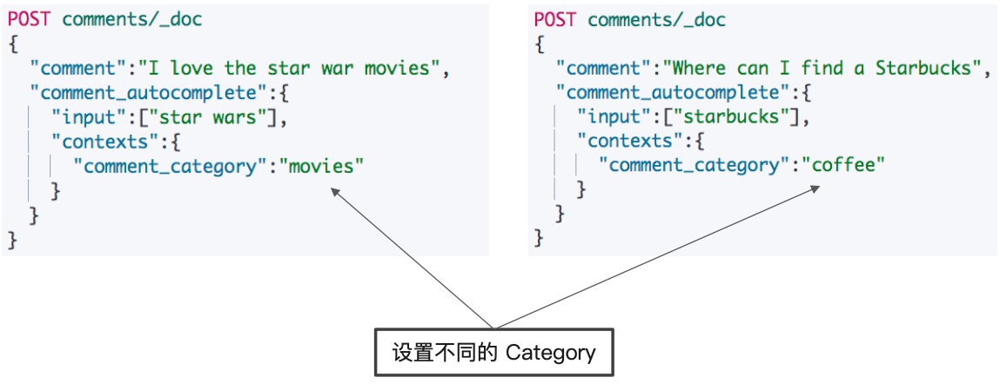

# **第十节 ⾃动补全与基于上下文的提示**

## 1、**The Completion Suggester**

* `Completion Suggester` 提供了了“⾃动完成” (Auto Complete) 的功能。⽤户每输⼊入⼀个字符，就需要即时发送⼀个查询请求到后段查找匹配项
* 对性能要求比较苛刻。Elasticsearch 采⽤了不同的**数据结构**，**并⾮通过倒排索引来完成**。 **而是将 Analyze 的数据编码成 FST 和索引⼀起存放。FST 会被 ES 整个加载进内存**， 速度很快
*  FST 只能⽤于前缀查找


## **2、使⽤ Completion Suggester 的一些步骤**

* **定义 Mapping，使⽤ "completion" type**
* 索引数据
* **运⾏ "suggest" 查询，得到搜索建议**


### 2-1 索引数据

```
DELETE articles
PUT articles
{
  "mappings": {
    "properties": {
      "title_completion":{
        "type": "completion"
      }
    }
  }
}
```

*  `"type": "completion"`

### 2-2 搜索数据

```
POST articles/_search?pretty
{
  "size": 0,
  "suggest": {
    "article-suggester": {
      "prefix": "el ",
      "completion": {
        "field": "title_completion"
      }
    }
  }
}
```

***Output***

```
"suggest" : {
    "article-suggester" : [
      {
        "text" : "el ",
        "offset" : 0,
        "length" : 3,
        "options" : [
          {
            "text" : "Elasticsearch builds on top of lucene",
            "_index" : "articles",
            "_type" : "_doc",
            "_id" : "Jv2OSXUBjbV1yvhlSMxj",
            "_score" : 1.0,
            "_source" : {
              "title_completion" : "Elasticsearch builds on top of lucene"
            }
          },
...
```

## **3、什么是 Context Suggester**

* Completion Suggester 的扩展
* 可以在搜索中加⼊更多的上下⽂信息，例如，输入 “star”
	* 咖啡相关:建议 “Starbucks”
	* 电影相关:”star wars”

	
### **3-1 实现 Context Suggester**

* 可以定义两种类型的 Context
	* **Category – 任意的字符串**
	* **Geo – 地理理位置信息**
* 实现 Context Suggester 的具体步骤
	* 定制一个 Mapping
	* 索引数据，并且为每个⽂档加⼊入 Context 信息
	*  结合 Context 进⾏ Suggestion 查询

### **3-2 定义 Mapping**

* 增加 Contexts 
	* Type
	* name

```
DELETE comments
PUT comments
PUT comments/_mapping
{
  "properties": {
    "comment_autocomplete":{
      "type": "completion",
      "contexts":[{
        "type":"category",
        "name":"comment_category"
      }]
    }
  }
}
```
	
### **3-3 索引数据**

```
POST comments/_doc
{
  "comment":"I love the star war movies",
  "comment_autocomplete":{
    "input":["star wars"],
    "contexts":{
      "comment_category":"movies"
    }
  }
}

POST comments/_doc
{
  "comment":"Where can I find a Starbucks",
  "comment_autocomplete":{
    "input":["starbucks"],
    "contexts":{
      "comment_category":"coffee"
    }
  }
}
```

 

### **3-4 不同的上下⽂，⾃动提示**

```
POST comments/_search
{
  "suggest": {
    "MY_SUGGESTION": {
      "prefix": "sta",
      "completion":{
        "field":"comment_autocomplete",
        "contexts":{
          "comment_category":"coffee"
        }
      }
    }
  }
}
```

***Output :***

```    
"suggest" : {
    "MY_SUGGESTION" : [
      {
        "text" : "sta",
        "offset" : 0,
        "length" : 3,
        "options" : [
          {
            "text" : "starbucks",
            "_index" : "comments",
            "_type" : "_doc",
            "_id" : "Sv27SXUBjbV1yvhlJMyP",
            "_score" : 1.0,
            "_source" : {
              "comment" : "Where can I find a Starbucks",
              "comment_autocomplete" : {
                "input" : [
                  "starbucks"
                ],
                "contexts" : {
                  "comment_category" : "coffee"
                }
              }
            },
            "contexts" : {
              "comment_category" : [
                "coffee"
              ]
            }
          }
        ]
```

```
POST comments/_search
{
  "suggest": {
    "MY_SUGGESTION": {
      "prefix": "sta",
      "completion":{
        "field":"comment_autocomplete",
        "contexts":{
          "comment_category":"movies"
        }
      }
    }
  }
}
```

***Output :***

```
suggest" : {
    "MY_SUGGESTION" : [
      {
        "text" : "sta",
        "offset" : 0,
        "length" : 3,
        "options" : [
          {
            "text" : "star wars",
            "_index" : "comments",
            "_type" : "_doc",
            "_id" : "Sf27SXUBjbV1yvhlG8zu",
            "_score" : 1.0,
            "_source" : {
              "comment" : "I love the star war movies",
              "comment_autocomplete" : {
                "input" : [
                  "star wars"
                ],
                "contexts" : {
                  "comment_category" : "movies"
                }
              }
            },
            "contexts" : {
              "comment_category" : [
                "movies"
              ]
            }
          }
        ]
      }
```

### **3-5 精准度和召回率**

* 精准度
	* Completion > Phrase > Term
* 召回率
	* Term > Phrase > Completion
* 性能
	*  Completion > Phrase > Term


## **4、本节知识点回顾**

* Completion Suggester，对性能要求⽐较苛刻。采⽤了不同的数据结构，并⾮通过倒排索引来完成。⽽是将 Analyze 的数据编码成 FST 和索引⼀起存放。FST 会被 ES 整个加载进内存，速度很快
* 需要设置特定的 Mapping
* Context Completion Suggester ⽀持结合不同的上下文，给出推荐
