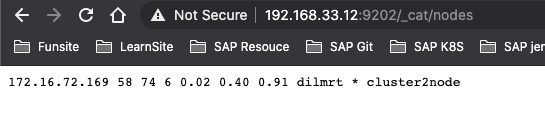

# **第十一节 跨集群搜索**

## **1、水平扩展的痛点**

* 单集群 – 当⽔平扩展时，节点数不能⽆限增加
	* 集群的 meta 信息(节点，索引，集群状态)过多，会导致更新压力变⼤，单个 Active Master 会成为性能瓶颈，导致整个集群⽆法正常⼯作、
* 早期版本，通过 Tribe Node 可以实现多集群访问的需求，但是还存在⼀定的问题
	* Tribe Node 会以 Client Node 的⽅式加⼊每个集群。 集群中 Master 节点的任务变更需要 Tribe Node 的回应才能继续
	* Tribe Node 不保存 Cluster State 信息，⼀旦重启，初始化很慢
	* 当多个集群存在索引重名的情况时，只能设置⼀种 Prefer 规则

## **2、跨集群搜索 - Cross Cluster Search**

* 早期 Tribe Node 的⽅案存在⼀定的问题，现已被 Deprecated
* **Elasticsearch 5.3 引⼊了了跨集群搜索的功能(Cross Cluster Search)，推荐使⽤**
	* **允许任何节点扮演 federated 节点，以轻量的⽅式，将搜索请求进行代理**
	* **不需要以 Client Node 的形式加⼊其他集群**

	
### **2-1 配置及查询**

**启动3个集群:**


```
elasticsearch -E node.name=cluster0node -E cluster.name=cluster0 -E path.data=cluster0_data -E discovery.type=single-node -E http.port=9200 -E transport.port=9300
elasticsearch -E node.name=cluster1node -E cluster.name=cluster1 -E path.data=cluster1_data -E discovery.type=single-node -E http.port=9201 -E transport.port=9301
elasticsearch -E node.name=cluster2node -E cluster.name=cluster2 -E path.data=cluster2_data -E discovery.type=single-node -E http.port=9202 -E transport.port=9302
```

**在每个集群上设置动态的设置**

```

PUT _cluster/settings
{
  "persistent": {
    "cluster": {
      "remote": {
        "cluster0": {
          "seeds": [
            "127.0.0.1:9300"
          ],
          "transport.ping_schedule": "30s"
        },
        "cluster1": {
          "seeds": [
            "127.0.0.1:9301"
          ],
          "transport.compress": true,
          "skip_unavailable": true
        },
        "cluster2": {
          "seeds": [
            "127.0.0.1:9302"
          ]
        }
      }
    }
  }
```
 
 **CURL:**
 
```
curl -XPUT "http://localhost:9200/_cluster/settings" -H 'Content-Type: application/json' -d'
{"persistent":{"cluster":{"remote":{"cluster0":{"seeds":["127.0.0.1:9300"],"transport.ping_schedule":"30s"},"cluster1":{"seeds":["127.0.0.1:9301"],"transport.compress":true,"skip_unavailable":true},"cluster2":{"seeds":["127.0.0.1:9302"]}}}}}'

curl -XPUT "http://localhost:9201/_cluster/settings" -H 'Content-Type: application/json' -d'
{"persistent":{"cluster":{"remote":{"cluster0":{"seeds":["127.0.0.1:9300"],"transport.ping_schedule":"30s"},"cluster1":{"seeds":["127.0.0.1:9301"],"transport.compress":true,"skip_unavailable":true},"cluster2":{"seeds":["127.0.0.1:9302"]}}}}}'

curl -XPUT "http://localhost:9202/_cluster/settings" -H 'Content-Type: application/json' -d'
{"persistent":{"cluster":{"remote":{"cluster0":{"seeds":["127.0.0.1:9300"],"transport.ping_schedule":"30s"},"cluster1":{"seeds":["127.0.0.1:9301"],"transport.compress":true,"skip_unavailable":true},"cluster2":{"seeds":["127.0.0.1:9302"]}}}}}'
```


**创建测试数据**

```
curl -XPOST "http://localhost:9200/users/_doc" -H 'Content-Type: application/json' -d'
{"name":"user1","age":10}'

curl -XPOST "http://localhost:9201/users/_doc" -H 'Content-Type: application/json' -d'
{"name":"user2","age":20}'

curl -XPOST "http://localhost:9202/users/_doc" -H 'Content-Type: application/json' -d'
{"name":"user3","age":30}'
```


```
{
   "took":439,
   "timed_out":false,
   "num_reduce_phases":4,
   "_shards":{
      "total":3,
      "successful":3,
      "skipped":0,
      "failed":0
   },
   "_clusters":{
      "total":3,
      "successful":3,
      "skipped":0
   },
   "hits":{
      "total":{
         "value":2,
         "relation":"eq"
      },
      "max_score":1.0,
      "hits":[
         {
            "_index":"cluster2:users",
            "_type":"_doc",
            "_id":"CG8XSnUBeZ4GOW5EkMpk",
            "_score":1.0,
            "_source":{
               "name":"user3",
               "age":30
            }
         },
         {
            "_index":"cluster1:users",
            "_type":"_doc",
            "_id":"NO4XSnUBuZtUD0itPVYH",
            "_score":1.0,
            "_source":{
               "name":"user2",
               "age":20
            }
         }
      ]
   }
}
```

* http://192.168.33.12:9200/_cat/nodes
* http://192.168.33.12:9201/_cat/nodes
* http://192.168.33.12:9202/_cat/nodes

 

* http://192.168.33.12:9202/_cat/indices
* http://192.168.33.12:9201/_cat/indices
* http://192.168.33.12:9200/_cat/indices

 

**查询**

```
GET /users,cluster1:users,cluster2:users/_search
{
  "query": {
    "range": {
      "age": {
        "gte": 20,
        "lte": 40
      }
    }
  }
}
```

**查询CURL**

```
curl -XGET "http://localhost:9200/users,cluster1:users,cluster2:users/_search" -H 'Content-Type: application/json' -d'{ "query": {"range": { "age": {  "gte": 20,"lte": 40 } } } }'
```

```
{
   "took":439,
   "timed_out":false,
   "num_reduce_phases":4,
   "_shards":{
      "total":3,
      "successful":3,
      "skipped":0,
      "failed":0
   },
   "_clusters":{
      "total":3,
      "successful":3,
      "skipped":0
   },
   "hits":{
      "total":{
         "value":2,
         "relation":"eq"
      },
      "max_score":1.0,
      "hits":[
         {
            "_index":"cluster2:users",
            "_type":"_doc",
            "_id":"CG8XSnUBeZ4GOW5EkMpk",
            "_score":1.0,
            "_source":{
               "name":"user3",
               "age":30
            }
         },
         {
            "_index":"cluster1:users",
            "_type":"_doc",
            "_id":"NO4XSnUBuZtUD0itPVYH",
            "_score":1.0,
            "_source":{
               "name":"user2",
               "age":20
            }
         }
      ]
   }
}
```

## **3、Demo**

* 配置跨集群搜索
* 每个集群创建相同的索引名，并写⼊入数据
* 跨集群搜索
* 在 Kibana 的 Index Pattern 中配置跨集群搜索


## **4、本节知识点回顾**

* 当集群⽆法⽔平扩展，或者需要将不同的集群数据实现数据的 Federation，可以采⽤跨集群搜索(CCS)
* `Tribe Node` 和 `Cross Cluster Search` 的比较，推荐在新版本中使用 `CCS`
* 如何配置并使⽤用 `Cross Cluster Search` 查询数据


