# 第一节 **基于词项和基于全文的搜索**

## 1、基于Term的查询 

* Term的重要性
	* **Term是表达语意的最小单位。**搜索和利用统计语言模型进行自然语言处理都需要处理Term 
* **特点**
	* Term Level Query:`Term Query`／`Range Query`／`Exists Query`／`Prefix Query`/`Wildcard Query` 
	* 在ES中，Term查询，对输入**不做分词**。会将输入作为一个整体，在倒排索引中查找准确的词项，并且使用相关度算分公式为每个包含该词项的文档进行**相关度算分**一例如“Apple Store" 
	* 可以通过`Constant Score`将查询转换成一个**Filtering**,**避免算分，并利用缓存，提高性能** 


### 1-1 关于`Term`的查询例子

```
DELETE products

PUT products
{
  "settings": {
    "number_of_shards": 1
  }
}
```

```
{
  "acknowledged" : true,
  "shards_acknowledged" : true,
  "index" : "products"
}
```

**几个思考题**

* 几个查询的结果分别是什么？ 
* 如果搜不到，为什么？ 
* 应该如何解决 

```
POST /products/_bulk
{ "index": { "_id": 1 }}
{ "productID" : "XHDK-A-1293-#fJ3","desc":"iPhone" }
{ "index": { "_id": 2 }}
{ "productID" : "KDKE-B-9947-#kL5","desc":"iPad" }
{ "index": { "_id": 3 }}
{ "productID" : "JODL-X-1937-#pV7","desc":"MBP" }
```
```
...
{
  "took" : 818,
  "errors" : false,
  "items" : [
    {
      "index" : {
        "_index" : "products",
        "_type" : "_doc",
        "_id" : "1",
        "_version" : 1,
        "result" : "created",
        "_shards" : {
          "total" : 2,
          "successful" : 2,
          "failed" : 0
        },
        "_seq_no" : 0,
        "_primary_term" : 1,
        "status" : 201
      }
    },
...
```
```
GET /products
```

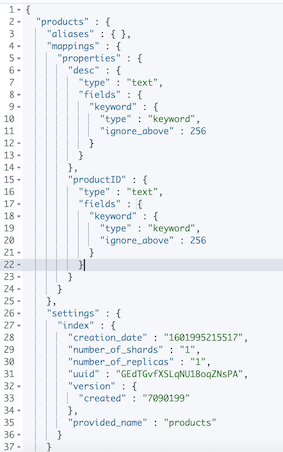

**分词器会自动 —— 小写化**

```
POST /products/_search
{
  "query": {
    "term": {
      "desc": {
        "value": "iPhone"
      }
    }
  }
}
```
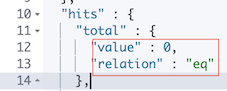

```
POST /products/_search
{
  "query": {
    "term": {
      "desc": {
        "value": "iphone"   
      }
    }
  }
}
```

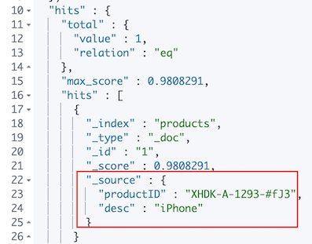

```
POST /products/_search
{
  "query": {
    "term": {
      "productID": {
        "value": "XHDK-A-1293-#fJ3"
      }
    }
  }
}
```

***output***

```
"hits" : {
    "total" : {
      "value" : 0,
      "relation" : "eq"
    },
```

*  ` "value": "XHDK-A-1293-#fJ3"`
*  ` "value": "xhdk-a-1293-#fJ3"`
*  ` "value": "xhdk"`

```
POST /products/_search
{
  "query": {
    "term": {
      "productID": {
        "value": "xhdk-a-1293-#fJ3"
      }
    }
  }
}
```

***output***

```
"hits" : {
    "total" : {
      "value" : 0,
      "relation" : "eq"
    },
```

```
POST /products/_search
{
  "query": {
    "term": {
      "productID": {
        "value": "xhdk"
      }
    }
  }
}
```


### 1-2 多字段Mapping和Term查询 

```
GET /products/_mapping
```

**Output :**

```
{
  "products" : {
    "mappings" : {
      "properties" : {
        "desc" : {
          "type" : "text",
          "fields" : {
            "keyword" : {
              "type" : "keyword",
              "ignore_above" : 256
            }
          }
        },
        "productID" : {
          "type" : "text",
          "fields" : {
            "keyword" : {
              "type" : "keyword",
              "ignore_above" : 251_6
            }
          }
        }
      }
    }
  }
}
```

```
POST /products/_search
{
  "query": {
    "term": {
      "productID.keyword": {
        "value": "XHDK-A-1293-#fJ3"
      }
    }
  }
}
```

* **` "productID.keyword"`**

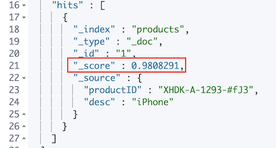

```
POST /products/_search
{
  "explain": true,
  "query": {
    "term": {
      "productID.keyword": {
        "value": "XHDK-A-1293-#fJ3"
      }
    }
  }
}
```

* **`"explain": true,`**

```
"hits" : [
      {
        "_shard" : "[products][0]",
        "_node" : "lTFD6qBCQ460xdW8XFgaIg",
        "_index" : "products",
        "_type" : "_doc",
        "_id" : "1",
        "_score" : 0.9808291,
        "_source" : {
          "productID" : "XHDK-A-1293-#fJ3",
          "desc" : "iPhone"
        },
        "_explanation" : {
          "value" : 0.9808291,
          "description" : "weight(productID.keyword:XHDK-A-1293-#fJ3 in 0) [PerFieldSimilarity], result of:",
          "details" : [
            {
              "value" : 0.9808291,
              "description" : "score(freq=1.0), computed as boost * idf * tf from:",
              "details" : [
                {
                  "value" : 2.2,
                  "description" : "boost",
                  "details" : [ ]
                },
                {
                  "value" : 0.98082924,
                  "description" : "idf, computed as log(1 + (N - n + 0.5) / (n + 0.5)) from:",
                  "details" : [
                    {
                      "value" : 1,
                      "description" : "n, number of documents containing term",
                      "details" : [ ]
                    },
                    {
                      "value" : 3,
                      "description" : "N, total number of documents with field",
                      "details" : [ ]
                    }
                  ]
                },
                {
                  "value" : 0.45454544,
                  "description" : "tf, computed as freq / (freq + k1 * (1 - b + b * dl / avgdl)) from:",
                  "details" : [
                    {
                      "value" : 1.0,
                      "description" : "freq, occurrences of term within document",
                      "details" : [ ]
                    },
                    {
                      "value" : 1.2,
                      "description" : "k1, term saturation parameter",
                      "details" : [ ]
                    },
                    {
                      "value" : 0.75,
                      "description" : "b, length normalization parameter",
                      "details" : [ ]
                    },
                    {
                      "value" : 1.0,
                      "description" : "dl, length of field",
                      "details" : [ ]
                    },
                    {
                      "value" : 1.0,
                      "description" : "avgdl, average length of field",
                      "details" : [ ]
                    }
                  ]
```

### 1-3 复合查询一`Constant Score`转为`Filter` 

* 将Query转成Filter，忽略`TF-IDF`计算，避免相关性算分的开销 
* Filter可以有效利用缓存 

**Demo**

* Term查询查看算分 
* Constant Score Filter 

```
POST /products/_search
{
  "explain": true,
  "query": {
    "constant_score": {
      "filter": {
        "term": {
          "productID.keyword": "XHDK-A-1293-#fJ3"
        }
      }
    }
  }
}
```

**` "productID.keyword": "XHDK-A-1293-#fJ3"`**

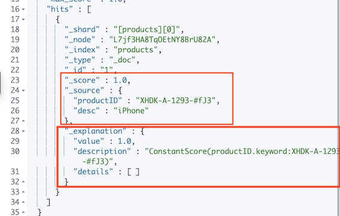


## 2、基于全文的查询 

* 基于全文的查询
	* `Match Query/Match Phrase Query/Query String Query `
* 特点 
	* **索引和搜索时都会进行分词，查询字符串先传递到一个合适的分词器，然后生成一个供查询的词项列表** 
	* 查询时候，**先会对输入的查询进行分词**，然后每个词项逐个进行底层的查询，最终将结果进行合`Matrix`或者`reload`合并。并为每个文档生成一个算分。——例如查“Matrix reloaded"，会查到包括的所有结果。 


### 2-1 Match Query Result

```
POST movies/_search
{
  "query": {
    "match": {
      "title": {
        "query": "Matrix reloaded"
      }
    }
  }
}
```

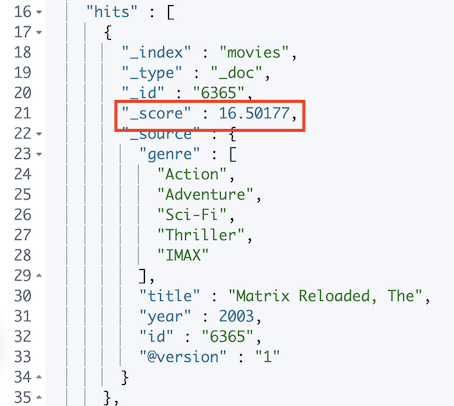

### 2-2 Operator

```
POST movies/_search
{ 
  "profile": true,
  "query": {
    "match": {
      "title": {
        "query": "Matrix reloaded",
        "operator": "AND"
      }
    }
  }
}
```

*  **`"operator": "AND"`**

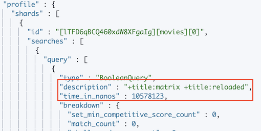


### 2-3 `Minimum_should_match`

```
POST movies/_search
{ 
  "profile": true,
  "query": {
    "match": {
      "title": {
        "query": "Matrix reloaded",
        "minimum_should_match": 2
      }
    }
  }
}
```

* **`"minimum_should_match": 2`**

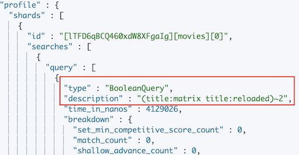

### 2-4 Match Phrase Query

```
POST movies/_search
{ 
  "profile": true,
  "query": {
    "match_phrase": {
      "title": {
        "query": "Matrix reloaded",
        "slop": 1
      }
    }
  }
}
```
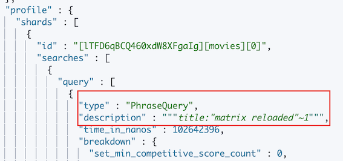

* `"query": "Matrix reloaded"`
*  `"slop": 1`

### 2-5 Match Query查询过程 

* 基于全文的查询
	* `Match Query/Match Phrase Query/Query String Query `

* 基于全文的查询的特点 
	* **索引和搜索时都会进行分词，查询字符串先传递到一个合适的分词器，然后生成一个供查询的词项列表** 
	* 查询时候，**先会对输入的查询进行分词**，然后每个词项逐个进行底层的查询，并为每个文档生成一个算分

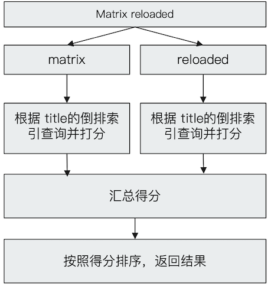
	
## 3、本节知识点回顾 

* 基于词项的查找vs基于全文的查找 
* 通过字段Mapping控制字段的分词 
	* "Text" vs "Keyword" 
* 通过参数控制查询的Precision&Recall 
* 复合查询一`Constant Score`查询 
	* 即便是对`Keyword`进行`term`查询，同样会进行算分 
	* 可以将查询转为`Filtering`，取消相关性算分的环节，以提升性能 


```
#设置 position_increment_gap
DELETE groups
PUT groups
{
  "mappings": {
    "properties": {
      "names":{
        "type": "text",
        "position_increment_gap": 0
      }
    }
  }
```

```
{
  "acknowledged" : true,
  "shards_acknowledged" : true,
  "index" : "groups"
}
```

```
GET groups/_mapping
```

***output :***

```
{
  "groups" : {
    "mappings" : {
      "properties" : {
        "names" : {
          "type" : "text",
          "position_increment_gap" : 0
        }
      }
    }
  }
}
```

```
POST groups/_doc
{
  "names": [ "John Water", "Water Smith"]
}
```

```
POST groups/_search
{
  "query": {
    "match_phrase": {
      "names": {
        "query": "Water Water",
        "slop": 100
      }
    }
  }
}
```

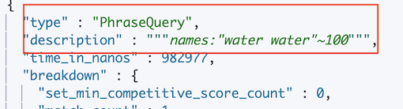

```
POST groups/_search
{
  "profile": true,
  "query": {
    "match_phrase": {
      "names": "Water Smith"
    }
  }
```

```
...
description" : "names:\"water smith\"",
```