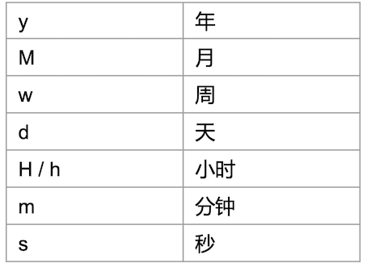
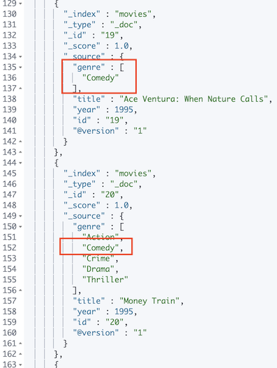
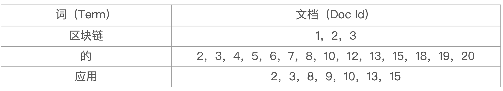
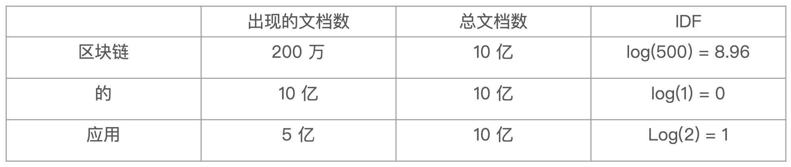
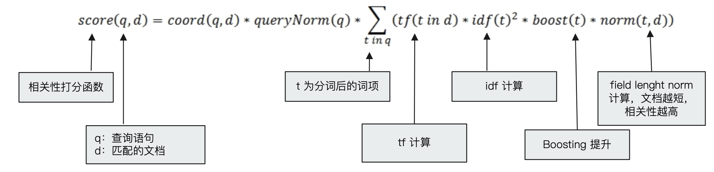
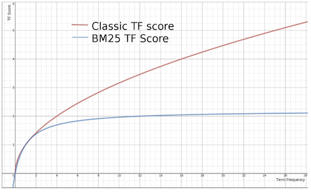
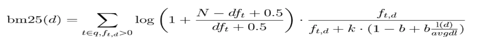
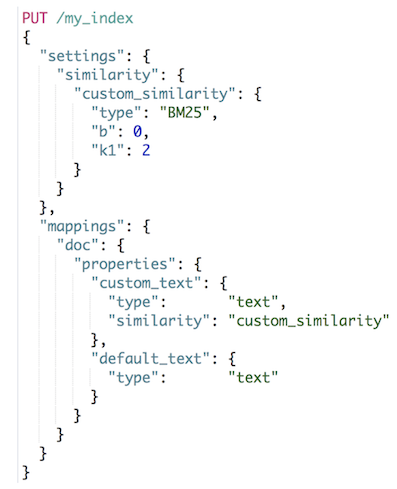
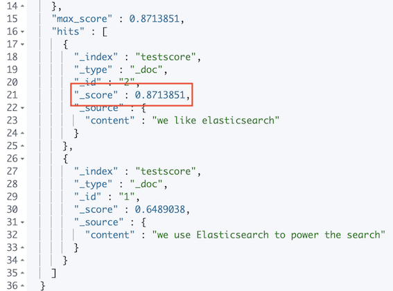
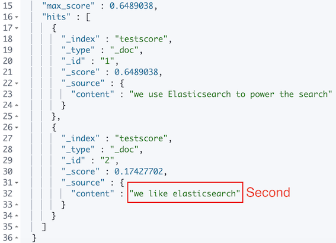

# **第二节 结构化搜索以及搜索的相关性算分**


## **1、结构化搜索**

### 1-1 结构化数据 

* **结构化搜索（`Structured search`)是指对结构化数据的搜索** 
	* 日期，布尔类型和数字都是结构化的 
* **文本也可以是结构化的**。 
	* 如彩色笔可以有离散的颜色集合：红（red)、绿（green)、蓝（blue) 
	* 一个博客可能被标记了标签，例如，分布式（distributed)和搜索（search) 
	* 电商网站上的商品都有UPCs（通用产品码Universal Product Codes)或其他的唯一标识，它们都需要遵从严格规定的、结构化的格式。 


### 1-2 ES中的结构化搜索 

* **布尔，时间，日期和数字这类结构化数据**：有精确的格式，我们可以对这些格式进行逻辑操作。包括比较数字或时间的范围，或判定两个值的大小。 
* **结构化的文本可以做精确匹配或者部分匹配** 
	* Term查询／Prefix前缀查询 
* **结构化结果只有“是”或“否”两个值** 
	* 根据场景需要，可以决定结构化搜索是否需要打分 

```
#结构化搜索，精确匹配
DELETE products

POST /products/_bulk
{ "index": { "_id": 1 }}
{ "price" : 10,"avaliable":true,"date":"2018-01-01", "productID" : "XHDK-A-1293-#fJ3" }
{ "index": { "_id": 2 }}
{ "price" : 20,"avaliable":true,"date":"2019-01-01", "productID" : "KDKE-B-9947-#kL5" }
{ "index": { "_id": 3 }}
{ "price" : 30,"avaliable":true, "productID" : "JODL-X-1937-#pV7" }
{ "index": { "_id": 4 }}
{ "price" : 30,"avaliable":false, "productID" : "QQPX-R-3956-#aD8" }

GET products/_mapping
```

***Output :***

```
{
  "products" : {
    "mappings" : {
      "properties" : {
        "avaliable" : {
          "type" : "boolean"
        },
        "date" : {
          "type" : "date"
        },
        "price" : {
          "type" : "long"
        },
        "productID" : {
          "type" : "text",
          "fields" : {
            "keyword" : {
              "type" : "keyword",
              "ignore_above" : 256
            }
          }
        }
      }
    }
  }
}
```


### 1-3 布尔值

**对布尔值 match 查询，有算分**

```
POST products/_search
{
  "query": {
    "term": {
      "avaliable": {
      	"value": "false"
      }
    }
  }
}
```

***Output :***

```
"max_score" : 1.2039728,
    "hits" : [
      {
        "_index" : "products",
        "_type" : "_doc",
        "_id" : "4",
        "_score" : 1.2039728,
        "_source" : {
          "price" : 30,
          "avaliable" : false,
          "productID" : "QQPX-R-3956-#aD8"
        }
      }
    ]
  }
```

**` "_score" : 1.2039728,`**

```

POST products/_search
{
  "profile": "true",
  "explain": true,
  "query": {
    "term": {
      "avaliable": true
    }
  }
}
```

**对布尔值，通过`constant score` 转成 `filtering`，没有算分**

```
POST products/_search
{
  "query": {
    "constant_score": {
      "filter": {
        "term": {
          "avaliable": "false"
        }
      }
    }
  }
}
```
***Output :***

```
"max_score" : 1.0,
    "hits" : [
      {
        "_index" : "products",
        "_type" : "_doc",
        "_id" : "4",
        "_score" : 1.0,
        "_source" : {
          "price" : 30,
          "avaliable" : false,
          "productID" : "QQPX-R-3956-#aD8"
        }
      }
    ]
```

```
POST products/_search
{
  "profile": "true",
  "explain": true,
  "query": {
    "constant_score": {
      "filter": {
        "term": {
          "avaliable": true
        }
      }
    }
  }
}
```

### 1-4 数字Range

* gt大于 
* It小于 
* gte大于等于 
* lte 小于等于 

**数字类型 Term:**

```
# 数字类型 Term
POST products/_search
{
  "profile": "true",
  "explain": true,
  "query": {
    "term": {
      "price": 30
    }
  }
}
```

***Output***

```
"hits" : [
      {
        "_index" : "products",
        "_type" : "_doc",
        "_id" : "3",
        "_score" : 1.0,
        "_source" : {
          "price" : 30,
          "avaliable" : true,
          "productID" : "JODL-X-1937-#pV7"
        }
      },
      {
        "_index" : "products",
        "_type" : "_doc",
        "_id" : "4",
        "_score" : 1.0,
        "_source" : {
          "price" : 30,
          "avaliable" : false,
          "productID" : "QQPX-R-3956-#aD8"
        }
      }
    ]
```


### 1-5 日期 range

* Date Math Expressions 
	* `2014-01-01 00:00:00||+1M `



```
POST products/_search
{
    "query" : {
        "constant_score" : {
            "filter" : {
                "range" : {
                    "date" : {
                      "gte" : "now-2y"
                    }
                }
            }
        }
    }
}
```

***Output :***

```
"max_score" : 1.0,
    "hits" : [
      {
        "_index" : "products",
        "_type" : "_doc",
        "_id" : "2",
        "_score" : 1.0,
        "_source" : {
          "price" : 20,
          "avaliable" : true,
          "date" : "2019-01-01",
          "productID" : "KDKE-B-9947-#kL5"
        }
      }
    ]
```

### 1-6 处理空值

**exists查询**

```
#exists查询
POST products/_search
{
  "query": {
    "constant_score": {
      "filter": {
        "exists": {
          "field": "date"
        }
      }
    }
  }
}
```

***output :***

```
hits" : [
      {
        "_index" : "products",
        "_type" : "_doc",
        "_id" : "1",
        "_score" : 1.0,
        "_source" : {
          "price" : 10,
          "avaliable" : true,
          "date" : "2018-01-01",
          "productID" : "XHDK-A-1293-#fJ3"
        }
      },
      {
        "_index" : "products",
        "_type" : "_doc",
        "_id" : "2",
        "_score" : 1.0,
        "_source" : {
          "price" : 20,
          "avaliable" : true,
          "date" : "2019-01-01",
          "productID" : "KDKE-B-9947-#kL5"
        }
      }
    ]
```
 
* **"bool": { "must_not" }**
 
```
POST products/_search
{
  "query": {
    "constant_score": {
      "filter": {
        "bool": {
          "must_not": {
            "exists": {
              "field": "date"
            }
          }
        }
      }
    }
  }
}
```

***Output:***

``` 
 "hits" : [
      {
        "_index" : "products",
        "_type" : "_doc",
        "_id" : "3",
        "_score" : 1.0,
        "_source" : {
          "price" : 30,
          "avaliable" : true,
          "productID" : "JODL-X-1937-#pV7"
        }
      },
      {
        "_index" : "products",
        "_type" : "_doc",
        "_id" : "4",
        "_score" : 1.0,
        "_source" : {
          "price" : 30,
          "avaliable" : false,
          "productID" : "QQPX-R-3956-#aD8"
        }
      }
    ]
```


### 1-7 处理多值字段

```
POST /movies/_bulk
{ "index": { "_id": 1 }}
{ "title" : "Father of the Bridge Part II","year":1995, "genre":"Comedy"}
{ "index": { "_id": 2 }}
{ "title" : "Dave","year":1993,"genre":["Comedy","Romance"] }
```

**处理多值字段，term 查询是包含，而不是等于**

```
POST movies/_search
{
  "query": {
    "constant_score": {
      "filter": {
        "term": {
          "genre.keyword": "Comedy"
        }
      }
    }
  }
}
```

* 解决方案：增加一个`genre_count`字段进行计数。会在组合`bool query`给出解决方法 


 
### 1-8 查找多个精确值

```
#数字类型 terms
POST products/_search
{
  "query": {
    "constant_score": {
      "filter": {
        "terms": {
          "price": [
            "20",
            "30"
          ]
        }
      }
    }
  }
}
```

***Output :***

```
"max_score" : 1.0,
    "hits" : [
      {
        "_index" : "products",
        "_type" : "_doc",
        "_id" : "2",
        "_score" : 1.0,
        "_source" : {
          "price" : 20,
          "avaliable" : true,
          "date" : "2019-01-01",
          "productID" : "KDKE-B-9947-#kL5"
        }
      },
      {
        "_index" : "products",
        "_type" : "_doc",
        "_id" : "3",
        "_score" : 1.0,
        "_source" : {
          "price" : 30,
          "avaliable" : true,
          "productID" : "JODL-X-1937-#pV7"
        }
      },
      {
        "_index" : "products",
        "_type" : "_doc",
        "_id" : "4",
        "_score" : 1.0,
        "_source" : {
          "price" : 30,
          "avaliable" : false,
          "productID" : "QQPX-R-3956-#aD8"
        }
      }
    ]
```

* **字符类型 terms**

```
#字符类型 terms
POST products/_search
{
  "query": {
    "constant_score": {
      "filter": {
        "terms": {
          "productID.keyword": [
            "QQPX-R-3956-#aD8",
            "JODL-X-1937-#pV7"
          ]
        }
      }
    }
  }
}
```
***Output :***

```
"hits" : [
      {
        "_index" : "products",
        "_type" : "_doc",
        "_id" : "3",
        "_score" : 1.0,
        "_source" : {
          "price" : 30,
          "avaliable" : true,
          "productID" : "JODL-X-1937-#pV7"
        }
      },
      {
        "_index" : "products",
        "_type" : "_doc",
        "_id" : "4",
        "_score" : 1.0,
        "_source" : {
          "price" : 30,
          "avaliable" : false,
          "productID" : "QQPX-R-3956-#aD8"
        }
      }
    ]
```

### 1-9 Term VS Match

```
POST products/_search
{
  "profile": "true",
  "explain": true,
  "query": {
    "term": {
      "date": "2019-01-01"
    }
  }
}

POST products/_search
{
  "profile": "true",
  "explain": true,
  "query": {
    "match": {
      "date": "2019-01-01"
    }
  }
}
```

```
POST products/_search
{
  "profile": "true",
  "explain": true,
  "query": {
    "constant_score": {
      "filter": {
        "term": {
          "productID.keyword": "XHDK-A-1293-#fJ3"
        }
      }
    }
  }
}

POST products/_search
{
  "profile": "true",
  "explain": true,
  "query": {
    "term": {
      "productID.keyword": "XHDK-A-1293-#fJ3"
    }
  }
}
```

* `"_score" : 1.0,`
* `"_score" : 1.2039728,`


**对布尔数值**

```
POST products/_search
{
  "query": {
    "constant_score": {
      "filter": {
        "term": {
          "avaliable": "false"
        }
      }
    }
  }
}

POST products/_search
{
  "query": {
    "term": {
      "avaliable": {
        "value": "false"
      }
    }
  }
}
```

* `"_score" : 1.0,`
* `"_score" : 1.2039728,`

```
POST products/_search
{
  "profile": "true",
  "explain": true,
  "query": {
    "term": {
      "price": {
        "value": "20"
      }
    }
  }
}

POST products/_search
{
  "profile": "true",
  "explain": true,
  "query": {
    "match": {
      "price": "20"
    }
   }
 }
```

### 1-10 本节知识点回顾 

* 结构化数据＆结构化搜索 
	* 如果不需要算分，可以通过Constant Score，将查询转为Filtering 
* **范围查询和Date Math** 
* **使用Exist查询处理非空Null值**
* **精确值＆多值字段的精确值查找** 
	* **Term查询是包含，不是完全相等。针对多值字段查询要尤其注意** 

## **2、搜索的相关性算分**

### 2-1 相关性和相关性算分 

* **相关性一Relevance** 
	* 搜索的相关性算分，描述了一个**文档**和**查询语句**匹配的程度。ES会对每个匹配查询条件的结 
果进行算分`_score` 
* 打分的本质是排序，**需要把最符合用户需求的文档排在前面**。ES5之前，默认的相关性算分采用`TF-IDF`，现在采用**BM25** 




###  2-2 词频TF 

* `Term Frequency`:检索词在一篇文档中出现的频率 
	* **检索词出现的次数除以文档的总字数** 
* 度量一条查询和结果文档相关性的简单方法：**简单将搜索中每一个词的TF进行相加** 
	* **TF(区块链）＋TF(的）＋TF(应用）** 
* Stop Word 
	* “的”在文档中出现了很多次，但是对贡献相关度几乎没有用处，不应该考虑他们的TF 

### 2-3 逆文档频率IDF 

* **DF: 检索词在所有文档中出现的频率** 
	* “区块链”在相对比较少的文档中出现 
	* “应用”在相对比较多的文档中出现 
	* **"Stop Word”在大量的文档中出现** 

* **`Inverse Document Frequency`：简单说＝log（全部文档数／检索词出现过的文档总数）** 
* `TF-IDF`本质上就是将下F求和变成了加权求和 
	* `TF（区块链)*IDF(区块链）+ TF（的）*IDF(的）+ TF(应用）* IDF(应用）` 




### 2-4 TF-IDF 的概念

* `TF-IDF`被公认为是信息检索领域最重要的发明 
* 除了在信息检索，在文献分类和其他相关领域有着非常广泛的应用 
* IDF的概念，最早是剑桥大学的"斯巴克.琼斯”提出 
	* 1972年一“关键词特殊性的统计解释和它在文献检索中的应用” 
	* 但是没有从理论上解释IDF应该是用log（全部文档数／检索词出现过的文档总数），而不是其他函数。也没有做进一步的研究 
* 1970, 1980年代萨尔顿和罗宾逊，进行了进一步的证明和研究，并用香农信息论做了证明 
* 现代搜索引擎，对下`TF-IDF`进行了大量细微的优化 


### 2-5 Lucene中的TF-IDF评分公式



### 2-6 BM 25

* 从ES 5开始，默认算法改为BM25 
* 和经典的`TF-IDF`相比，当`TF`无限增加时, `BM25`算分会趋于一个数值 



### 2-7 定制Similarity



* **K默认值是1.2，数值越小，饱和度越高，b默认值是0.75（取值范围0-1),0代表禁止`Normalization` **


```
PUT testscore
{
  "settings": {
    "number_of_shards": 1
  },
  "mappings": {
    "properties": {
      "content": {
        "type": "text"
      }
    }
  }
}
```

***Output :***

```
{
  "acknowledged" : true,
  "shards_acknowledged" : true,
  "index" : "testscore"
}
```


### 2-8 通过Explain API查看TF-IDF 

* 4篇文档＋4个Term查询 
* 思考一下 
	* 查询中的TF和IDF？ 
	* 结果如何排序？ 
	* 文档长短／TF / IDF 对相关度算分的影响 

```
PUT testscore/_bulk
{ "index": { "_id": 1 }}
{ "content":"we use Elasticsearch to power the search" }
{ "index": { "_id": 2 }}
{ "content":"we like elasticsearch" }
{ "index": { "_id": 3 }}
{ "content":"The scoring of documents is caculated by the scoring formula" }
{ "index": { "_id": 4 }}
{ "content":"you know, for search" }
```	

***Output :***

```
...
      "index" : {
        "_index" : "testscore",
        "_type" : "_doc",
        "_id" : "1",
        "_version" : 1,
        "result" : "created",
        "_shards" : {
          "total" : 2,
          "successful" : 2,
          "failed" : 0
        },
        "_seq_no" : 0,
        "_primary_term" : 1,
        "status" : 201
      }
    },
```

```
POST /testscore/_search
{
  //"explain": true,
  "query": {
    "match": {
      "content":"you"
      //"content": "elasticsearch"
      //"content":"the"
      //"content": "the elasticsearch"
    }
  }
}
```

***Output :***

```
"max_score" : 1.3940738,
    "hits" : [
      {
        "_index" : "testscore",
        "_type" : "_doc",
        "_id" : "4",
        "_score" : 1.3940738,
        "_source" : {
          "content" : "you know, for search"
        }
      }
    ]
```

* **`"_score" : 1.3940738,`**

```
POST /testscore/_search
{
  //"explain": true,
  "query": {
    "match": {
      // "content":"you"
      "content": "elasticsearch"
      //"content":"the"
      //"content": "the elasticsearch"
    }
  }
}
```

***Output :***




### 2-9 Boosting Relvance
	
* Boosting是控制相关度的一种手段 
	* 索引，字段或查询子条件 
* 参数boost的含义 
	* 当`boost>1`时，打分的相关度相对性提升 
	* 当`0<boost<1`时，打分的权重相对性降低 
	* 当`boost<0`时，贡献负分 

```
POST testscore/_search
{
    "query": {
        "boosting" : {
            "positive" : {
                "term" : {
                    "content" : "elasticsearch"
                }
            },
            "negative" : {
                 "term" : {
                     "content" : "like"
                }
            },
            "negative_boost" : 0.2
        }
    }
}
```


```
POST tmdb/_search
{
  "_source": ["title","overview"],
  "query": {
    "more_like_this": {
      "fields": [
        "title^10","overview"
      ],
      "like": [{"_id":"14191"}],
      "min_term_freq": 1,
      "max_query_terms": 12
    }
  }
}
```
### 2-10 本节知识点回顾 

* 什么是相关性＆相关性算分介绍 
	* TF-IDF／BM25 
* 在Elasticsearch中定制相关度算法的参数 
* ES中可以对索引，字段分别设置Boosting参数 