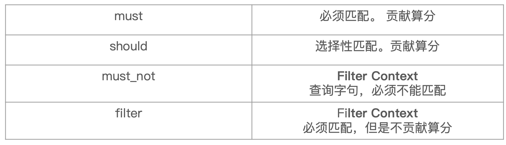
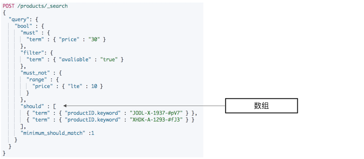
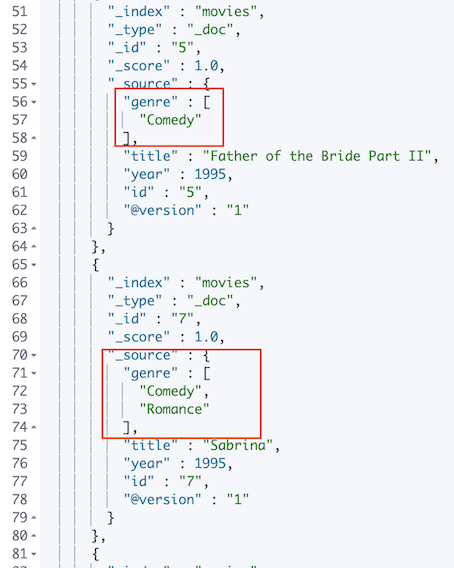
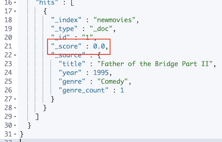
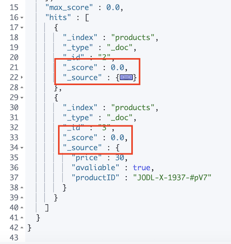
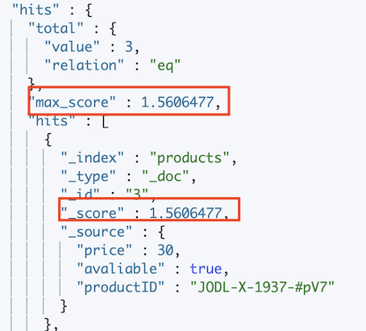
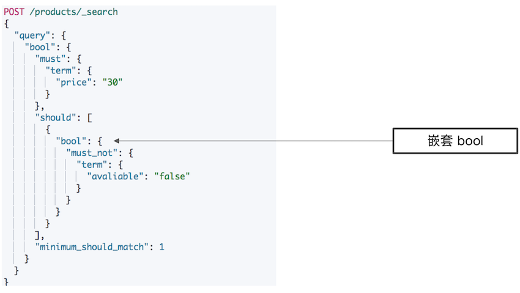
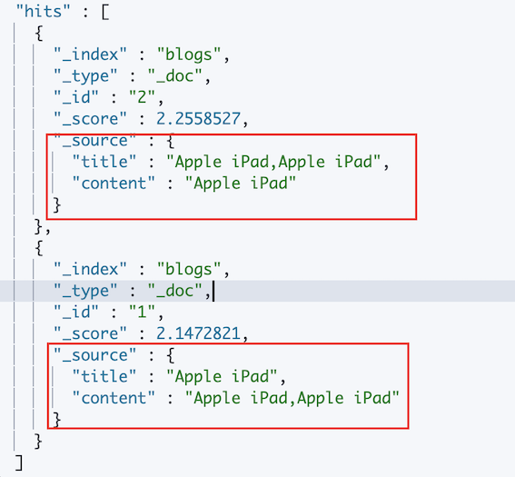
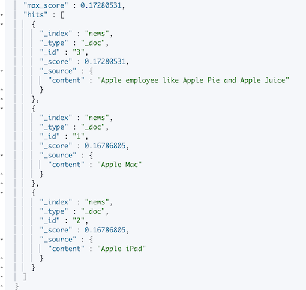
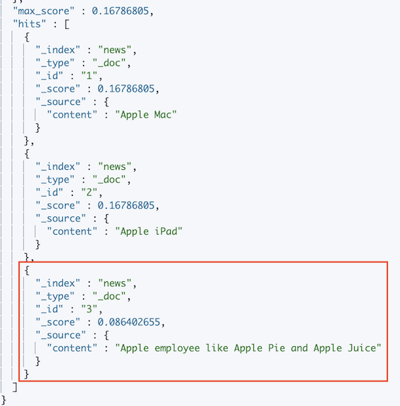

# **第三节 Query & Filtering与多字符串多字段查询**


## **1、Query Context & Filter Context**

* 高级搜索的功能：支持多项**文本**输入，针对多个字段进行搜索。 
* 搜索引擎一般也提供基于时间，价格等条件的过滤 
* Elasticsearch中，有Query和Filter两种不同 Context 
	* **Query Context：相关性算分** 
	* **Filter Context**: **不需要算分（Yes or No)** ，可以利用Cache，获得更好的性能 


## **2、条件组合**

* 假设要搜索一本电影，包含了以下一些条件 
	* 评论中包含了Guitar，用户打分高于3分，同时上映日期要在1993与2000年之间 
* 这个搜索其实包含了3段逻辑，针对不同的字段 
	* 评论字段中要包含`Guitar`／用户评分大于3／上映日期日期需要在给定的范围 
* 同时包含这三个逻辑，并且有比较好的性能？ 
	* 复合查询：`bool Query` 

## **3、bool查询** 

* 一个bool查询，是一个或者多个查询子句的组合 
	* **总共包括4种子句。其中2种会影响算分，2种不影响算分** 
	* 相关性并不只是全文本检索的专利。也适用于`yes | no`的子句，匹配的子句越多，相关性评分越高。
	* 如果多条查询子句被合并为一条复合查询语句，比如`bool`查询，则每个查询子句计算得出的评分会被合并到总的相关性评分中。 



```
POST /products/_bulk
{ "index": { "_id": 1 }}
{ "price" : 10,"avaliable":true,"date":"2018-01-01", "productID" : "XHDK-A-1293-#fJ3" }
{ "index": { "_id": 2 }}
{ "price" : 20,"avaliable":true,"date":"2019-01-01", "productID" : "KDKE-B-9947-#kL5" }
{ "index": { "_id": 3 }}
{ "price" : 30,"avaliable":true, "productID" : "JODL-X-1937-#pV7" }
{ "index": { "_id": 4 }}
{ "price" : 30,"avaliable":false, "productID" : "QQPX-R-3956-#aD8" }
```

```
GET products/_mapping

{
  "products" : {
    "mappings" : {
      "properties" : {
        "avaliable" : {
          "type" : "boolean"
        },
        "date" : {
          "type" : "date"
        },
        "price" : {
          "type" : "long"
        },
        "productID" : {
          "type" : "text",
          "fields" : {
            "keyword" : {
              "type" : "keyword",
              "ignore_above" : 256
            }
          }
        }
      }
    }
  }
}
```

### 3-1 bool查询语句

* 子查询可以任意顺序出现 
* **可以嵌套多个查询** 
* **如果你的`bool`查询中，没有`must`条件,`should`中必须至少满足一条查询** 



```
#基本语法
POST /products/_search
{
  "query": {
    "bool" : {
      "must" : {
        "term" : { "price" : "30" }
      },
      "filter": {
        "term" : { "avaliable" : "true" }
      },
      "must_not" : {
        "range" : {
          "price" : { "lte" : 10 }
        }
      },
      "should" : [
        { "term" : { "productID.keyword" : "JODL-X-1937-#pV7" } },
        { "term" : { "productID.keyword" : "XHDK-A-1293-#fJ3" } }
      ],
      "minimum_should_match" :1
    }
  }
}
```

***Output :***

```
"max_score" : 2.2039728,
    "hits" : [
      {
        "_index" : "products",
        "_type" : "_doc",
        "_id" : "3",
        "_score" : 2.2039728,
        "_source" : {
          "price" : 30,
          "avaliable" : true,
          "productID" : "JODL-X-1937-#pV7"
        }
      }
    ]
```

* `"_score" : 2.2039728,` : Must , should 算分


### 3-2 如何解决结构化查询一“包含而不是相等”的问题 

```
POST /movies/_search
{
  "query": {
    "constant_score": {
      "filter": {
      	"term": {
      		"genre.keyword": "Comedy"
      	}
      }
    }
  }
}
```

***Output :***




* 改变数据模型，增加字段。解决数组包含而不是精确匹配的问题

解决方案：增加一个`genre count`字段进行计数 

### 3-3 增加count字段，使用bool查询解决 

从业务角度，按需改进Elasticsearch数据模型 

```
# 改变数据模型，增加字段。解决数组包含而不是精确匹配的问题
POST /newmovies/_bulk
{ "index": { "_id": 1 }}
{ "title" : "Father of the Bridge Part II","year":1995, "genre":"Comedy","genre_count":1 }
{ "index": { "_id": 2 }}
{ "title" : "Dave","year":1993,"genre":["Comedy","Romance"],"genre_count":2 }
```

```
POST /newmovies/_search
{
  "query": {
    "bool": {
      "must": [
        {"term": {"genre.keyword": {"value": "Comedy"}}},
        {"term": {"genre_count": {"value": 1}}}

      ]
    }
  }
 }
```

**` {"term": {"genre_count": {"value": 1}}}`**

```
"max_score" : 1.2111092,
    "hits" : [
      {
        "_index" : "newmovies",
        "_type" : "_doc",
        "_id" : "1",
        "_score" : 1.2111092,
        "_source" : {
          "title" : "Father of the Bridge Part II",
          "year" : 1995,
          "genre" : "Comedy",
          "genre_count" : 1
        }
      }
    ]
```

**must，有算分: `  "_score" : 1.2111092,`**

```
#Filter。不参与算分，结果的score是0
POST /newmovies/_search
{
  "query": {
    "bool": {
      "filter": [
        {"term": {"genre.keyword": {"value": "Comedy"}}},
        {"term": {"genre_count": {"value": 1}}}
        ]

    }
  }
}
```




### 3-4 Filter Context一不影响算分 

```
#Filtering Context
POST _search
{
  "query": {
    "bool" : {

      "filter": {
        "term" : { "avaliable" : "true" }
      },
      "must_not" : {
        "range" : {
          "price" : { "lte" : 10 }
        }
      }
    }
  }
}
```




### 3-5 Query Context一影响算分 

```
#Query Context
POST /products/_bulk
{ "index": { "_id": 1 }}
{ "price" : 10,"avaliable":true,"date":"2018-01-01", "productID" : "XHDK-A-1293-#fJ3" }
{ "index": { "_id": 2 }}
{ "price" : 20,"avaliable":true,"date":"2019-01-01", "productID" : "KDKE-B-9947-#kL5" }
{ "index": { "_id": 3 }}
{ "price" : 30,"avaliable":true, "productID" : "JODL-X-1937-#pV7" }
{ "index": { "_id": 4 }}
{ "price" : 30,"avaliable":false, "productID" : "QQPX-R-3956-#aD8" }
```

```
POST /products/_search
{
  "query": {
    "bool": {
      "should": [
        {
          "term": {
            "productID.keyword": {
              "value": "JODL-X-1937-#pV7"}}
        },
        {"term": {"avaliable": {"value": true}}
        }
      ]
    }
  }
}
```



### 3-6 Bool嵌套

**实现了should not的逻辑**



```
POST /products/_search
{
  "query": {
    "bool": {
      "must": {
        "term": {
          "price": "30"
        }
      },
      "should": [
        {
          "bool": {
            "must_not": {
              "term": {
                "avaliable": "false"
              }
            }
          }
        }
      ],
      "minimum_should_match": 1
    }
  }
}
```

***Output***

```
"max_score" : 1.0,
    "hits" : [
      {
        "_index" : "products",
        "_type" : "_doc",
        "_id" : "3",
        "_score" : 1.0,
        "_source" : {
          "price" : 30,
          "avaliable" : true,
          "productID" : "JODL-X-1937-#pV7"
        }
      }
    ]
```

### 3-7 Controll the Precision

```
POST _search
{
  "query": {
    "bool" : {
      "must" : {
        "term" : { "price" : "30" }
      },
      "filter": {
        "term" : { "avaliable" : "true" }
      },
      "must_not" : {
        "range" : {
          "price" : { "lte" : 10 }
        }
      },
      "should" : [
        { "term" : { "productID.keyword" : "JODL-X-1937-#pV7" } },
        { "term" : { "productID.keyword" : "XHDK-A-1293-#fJ3" } }
      ],
      "minimum_should_match" :2
    }
  }
}
```


### 3-8 查询语句的结构，会对相关度算分产生影响 

```
POST /animals/_search
{
  "query": {
    "bool": {
      "should": [
        { "term": { "text": "brown" }},
        { "term": { "text": "red" }},
        { "term": { "text": "quick"   }},
        { "term": { "text": "dog"   }}
      ]
    }
  }
}
```
```
POST /animals/_search
{
  "query": {
    "bool": {
      "should": [
        { "term": { "text": "quick" }},
        { "term": { "text": "dog"   }},
        {
          "bool":{
            "should":[
               { "term": { "text": "brown" }},
                 { "term": { "text": "brown" }},
            ]
          }

        }
      ]
    }
  }
}
```

* 同一层级下的竞争字段，具有有相同的权重 
* 通过嵌套bool查询，可以改变对算分的影响 

### 3-9 控制字段的Boosting

```
DELETE blogs
POST /blogs/_bulk
{ "index": { "_id": 1 }}
{"title":"Apple iPad", "content":"Apple iPad,Apple iPad" }
{ "index": { "_id": 2 }}
{"title":"Apple iPad,Apple iPad", "content":"Apple iPad" }
```

* `Boosting`是控制相关度的一种手段 
	* 索引，字段或查询子条件 
* 参数`boost`的含义 
	* 当`boost>1`时，打分的相关度相对性提升 
	* 当`0<boost<1`时，打分的权重相对性降低 
	* 当`boost<0`时，贡献负分 

```
POST blogs/_search
{
  "query": {
    "bool": {
      "should": [
        {"match": {
          "title": {
            "query": "apple,ipad",
            "boost": 4
          }
        }},

        {"match": {
          "content": {
            "query": "apple,ipad",
            "boost": 1
          }
        }}
      ]
    }
  }
}
```



### 3-10 Not Qulte Not 

要求苹果公司的产品信息优先 

```
DELETE news
POST /news/_bulk
{ "index": { "_id": 1 }}
{ "content":"Apple Mac" }
{ "index": { "_id": 2 }}
{ "content":"Apple iPad" }
{ "index": { "_id": 3 }}
{ "content":"Apple employee like Apple Pie and Apple Juice" }
```

```
POST news/_search
{
  "query": {
    "bool": {
      "must": {
        "match":{"content":"apple"}
      }
    }
  }
}
```



### 3-11 Boosting Query

```
POST news/_search
{
  "query": {
    "bool": {
      "must": {
        "match":{"content":"apple"}
      },
      "must_not": {
        "match":{"content":"pie"}
      }
    }
  }
```

***Output***

```
"max_score" : 0.16786805,
    "hits" : [
      {
        "_index" : "news",
        "_type" : "_doc",
        "_id" : "1",
        "_score" : 0.16786805,
        "_source" : {
          "content" : "Apple Mac"
        }
      },
      {
        "_index" : "news",
        "_type" : "_doc",
        "_id" : "2",
        "_score" : 0.16786805,
        "_source" : {
          "content" : "Apple iPad"
        }
      }
    ]
```
 
### 3-11 Negative Boost

```
POST news/_search
{
  "query": {
    "boosting": {
      "positive": {
        "match": {
          "content": "apple"
        }
      },
      "negative": {
        "match": {
          "content": "pie"
        }
      },
      "negative_boost": 0.5
    }
  }
}
```
 
 
 
 
## **4、本节知识点回顾** 

* Query Context vs.Filter Context 
* Bool Query一更多的条件组合 
* 查询结构与相关性算分 
* 如何控制查询的精确度 
	* Boosting&Boosting Query 