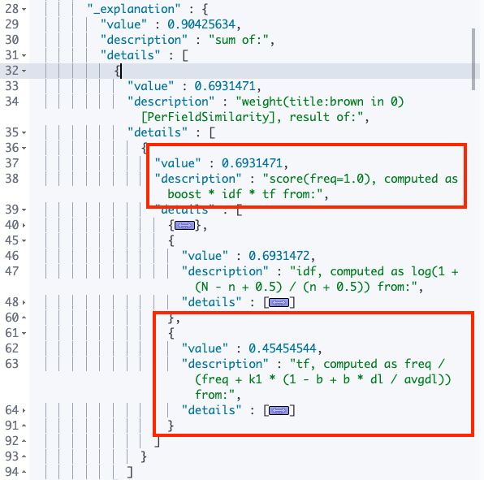
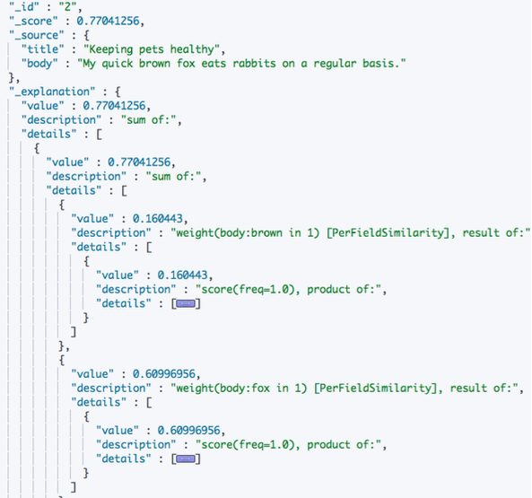
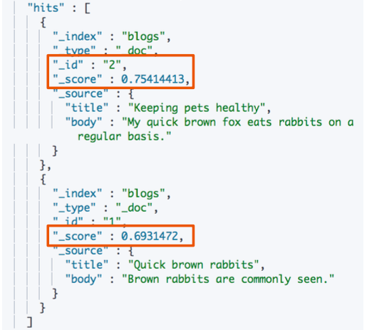
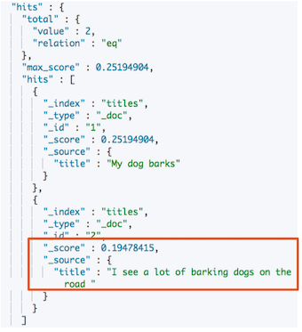
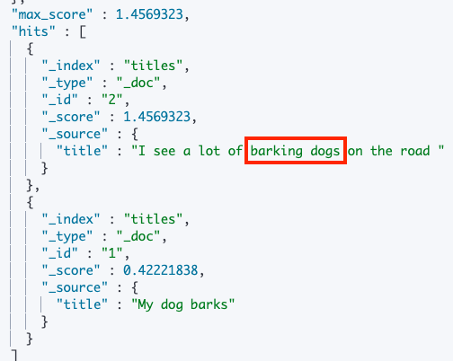

# **第四节 单字符串多字段查询**

## **1、单字符串多字段查询  Dis Max Query**

### 1-1 单字符串查询 

* 单字符串查询 
	* Google**只提供一个输入框**，查询相关的多个字段 
	* 支持按照价格，时间等进行过滤 


### 1-2 单字符串查询的实例 

* 博客标题 
	* 文档1中出现 "Brown" 
* 博客内容 
	* 文档1中出现了  "Brown" 
	* **"Brown fox"．在文档2中全部出现，并且保持和查询一致的顺序 （目测相关性最高）**

```
PUT /blogs/_doc/1
{
    "title": "Quick brown rabbits",
    "body":  "Brown rabbits are commonly seen."
}

PUT /blogs/_doc/2
{
    "title": "Keeping pets healthy",
    "body":  "My quick brown fox eats rabbits on a regular basis."
}
```

### 1-3 算分过程 

* **查询`should`语句中的两个查询**
* **加和两个查询的评分** 
* **乘以匹配语句的总数** 
* **除以所有语句的总数** 
	
**查询结果及分析**

```
POST /blogs/_search
{
    "query": {
        "bool": {
            "should": [
                { "match": { "title": "Brown fox" }},
                { "match": { "body":  "Brown fox" }}
            ]
        }
    }
}
```

```
"hits" : [
      {
        "_index" : "blogs",
        "_type" : "_doc",
        "_id" : "1",
        "_score" : 0.90425634,
        "_source" : {
          "title" : "Quick brown rabbits",
          "body" : "Brown rabbits are commonly seen."
        }
      },
      {
        "_index" : "blogs",
        "_type" : "_doc",
        "_id" : "2",
        "_score" : 0.77041256,
        "_source" : {
          "title" : "Keeping pets healthy",
          "body" : "My quick brown fox eats rabbits on a regular basis."
        }
      }
    ]
```

**`"_score" : 0.90425634,`**

* `"_id" : "1"`的分数大约`"_id" : "2"`此时是不对的





### 1-4 Disjunction Max Query查询 

* 上例中，**title和body相互竞争** 
	* 不应该将分数简单全加而是应该找到单个最佳匹配的字段的评分 
* Disjunction Max Query 
	* **将任何与任一查询匹配的文档作为结果返回。采用字段上最匹配的评分最终评分返回**

```
POST blogs/_search
{
    "query": {
        "dis_max": {
            "queries": [
                { "match": { "title": "Brown fox" }},
                { "match": { "body":  "Brown fox" }}
            ]
        }
    }
}
```

```
 "hits" : [
      {
        "_index" : "blogs",
        "_type" : "_doc",
        "_id" : "2",
        "_score" : 0.77041256,
        "_source" : {
          "title" : "Keeping pets healthy",
          "body" : "My quick brown fox eats rabbits on a regular basis."
        }
      },
      {
        "_index" : "blogs",
        "_type" : "_doc",
        "_id" : "1",
        "_score" : 0.6931471,
        "_source" : {
          "title" : "Quick brown rabbits",
          "body" : "Brown rabbits are commonly seen."
        }
      }
    ]
```

* ` "_id" : "2"` :  `"_score" : 0.77041256,`
* ` "_id" : "1",`: ` "_score" : 0.6931471,`

### 1-5 最佳字段调优

```
POST blogs/_search
{
    "query": {
        "dis_max": {
            "queries": [
                { "match": { "title": "Quick pets" }},
                { "match": { "body":  "Quick pets" }}
            ]
        }
    }
}
```

* 有一些情况下，同时匹配`title`和`body`字段的**文档比只与一个字段匹配的文档的相关度更高** 
* 但`disjunction max query`查询只会简单地使用单个最佳匹配语句的评分`_score`作为整体评分。怎么办？ 


### 1-6 通过Tie Breaker参数调整 

```
POST blogs/_search
{
    "query": {
        "dis_max": {
            "queries": [
                { "match": { "title": "Quick pets" }},
                { "match": { "body":  "Quick pets" }}
            ],
            "tie_breaker": 0.2
        }
    }
}
```



* 获得最佳匹配语句的评分`_score`
* 将其他匹配语句的评分与`tie_breaker`相乘 
* 对以上评分求和并规范化 
* **Tier Breaker是一个介于`0-1`之间的浮点数。`0 `代表使用最佳匹配；`1`代表所有语句同等重要**.

### 1-7 本节回顾

* 使用bool查询实现单字符串多字段查询 
* 单字符串多字段查询时，如何在多个字段上进行算分 
* 复合查询：Disjunction Max Query 
	* 将评分最高的字段评分作为结果返回满足两个字段是竞争关系的场景 
* 对最佳字段查询进行调优：通过控制Tie Breaker参数引入其他字段对算分的一些影响 


## **2、单字符串多字段查询：Multi Match** 

### 2-1 三种场景 


* 最佳字段（Best Fields) 
	* **当字段之间相互竞争又相互关联。例如`title`和`body`这样的字段。评分来自最匹配字段** 
* 多数字段（Most Fields) 
	* 处理英文内容时：一种常见的手段是在主字段（`English Analyzer`)抽取词干加入同义词，以匹配更多的文档。相同的文本，加入子字段(`Standard Analyzer`)，以提供更加精确的匹配。其他字段作为匹配文档提高相关度的信号。匹配字段越多则越好 
* 混合字段（Cross Field) 
	* 对于某些实体例如人名地址图书信息。**需要在多个字段中确定信息单个字段只能作为整体 
的一部分。希望在任何这些列出的字段中找到尽可能多的词** 

### 2-2 Multi Match Query

* `Best Fields`是默认类型可以不用指定 
* `Minimum should match`等参数可以传递到生成的query中 

```
POST blogs/_search
{
    "query": {
        "dis_max": {
            "queries": [
                { "match": { "title": "Quick pets" }},
                { "match": { "body":  "Quick pets" }}
            ],
            "tie_breaker": 0.2
        }
    }
}
```

### 2-3 一个查询案例 

**英文分词器，导致精确度降低，时态信息丢失** 

```
PUT /titles
{
  "mappings": {
    "properties": {
      "title": {
        "type": "text",
        "analyzer": "english"
      }
    }
  }
```

**output**

```
{
  "acknowledged" : true,
  "shards_acknowledged" : true,
  "index" : "titles"
}
```

```
POST titles/_bulk
{ "index": { "_id": 1 }}
{ "title": "My dog barks" }
{ "index": { "_id": 2 }}
{ "title": "I see a lot of barking dogs on the road " }
```


```
GET titles/_search
{
  "query": {
    "match": {
      "title": "barking dogs"
    }
  }
}
```



`I see a lot of barking dogs on the road`, `id 2` 应该排在更高， 但是`"analyzer": "english"` 分词器将`barking dogs`打散成`barking`和`dogs` 所以 dogs 在 更短的`Id: 1` 排名更高

### 2-4 使用多数字段匹配解决

* **用广度匹配字段title包括尽可能多的文档**——以提升召回率——同时又使用字段`title.std`作为**信号**将相关度更高的文档置于结果顶部。 

	* English analyzer  + standard analyzer
	*  多数字段（Most Fields) 

```
DELETE /titles
PUT /titles
{
  "mappings": {
    "properties": {
      "title": {
        "type": "text",
        "analyzer": "english",
        "fields": {"std": {"type": "text","analyzer": "standard"}}
      }
    }
  }
}

POST titles/_bulk
{ "index": { "_id": 1 }}
{ "title": "My dog barks" }
{ "index": { "_id": 2 }}
{ "title": "I see a lot of barking dogs on the road " }
```

```
GET /titles/_search
{
   "query": {
        "multi_match": {
            "query":  "barking dogs",
            "type":   "most_fields",
            "fields": [ "title", "title.std" ]
        }
    }
}
```



* 每个字段对于最终评分的贡献可以通过自定义值`boost`来控制。比如，使`title`字段更为重要， 这样同时也降低了其他信号字段的作用： 

```
GET /titles/_search
{
   "query": {
        "multi_match": {
            "query":  "barking dogs",
            "type":   "most_fields",
            "fields": [ "title^10", "title.std" ]
        }
    }
}
```

**Output**

```
 "hits" : [
      {
        "_index" : "titles",
        "_type" : "_doc",
        "_id" : "2",
        "_score" : 4.3449063,
        "_source" : {
          "title" : "I see a lot of barking dogs on the road "
        }
      },
      {
        "_index" : "titles",
        "_type" : "_doc",
        "_id" : "1",
        "_score" : 4.222184,
        "_source" : {
          "title" : "My dog barks"
        }
      }
    ]
```

### 2-5 跨字段搜索 

* 无法使用`Operator` 
* 可以用`copy_to`解决，但是需要额外的存储空间 

```
PUT address/_doc/1
{
	"street" : "5 Poland Street",
	"city" : "London",
	"coutry" : "United Kingdom",
	"poscode" : "W1V 3DG"
}
```

```
post address/_search
{
	"query": {
        "multi_match": {
            "query" :  "Poland Street W1V",
         // "operator"  : "and",
            "type" :   "most_fields",
            "fields" : [ "street", "city", "coutry",  "poscode"]
        }
    }
}
```

***Output***

```
"hits" : {
    "total" : {
      "value" : 0,
      "relation" : "eq"
    },
    "max_score" : null,
    "hits" : [ ]
  }
```

### 2-6 Cross Field

```
post address/_search
{
	"query": {
        "multi_match": {
            "query" :  "Poland Street W1V",
            "type" :   "cross_fields",
            "operator": "and", 
            "fields" : [ "street", "city", "coutry",  "poscode"]
        }
    }
}
```

**Output**

```
"max_score" : 0.8630463,
    "hits" : [
      {
        "_index" : "address",
        "_type" : "_doc",
        "_id" : "1",
        "_score" : 0.8630463,
        "_source" : {
          "street" : "5 Poland Street",
          "city" : "London",
          "coutry" : "United Kingdom",
          "poscode" : "W1V 3DG"
        }
      }
    ]
```
 
### 2-7  本节知识点回顾 

* Multi Match查询的基本语法 
* 查询的类型 
	* 最佳字段／多数字段／跨字段 
* Boosting 
* 控制Precision 
	* 以及使用子字段多数字段算分，控制 
	* 使用Operator 
