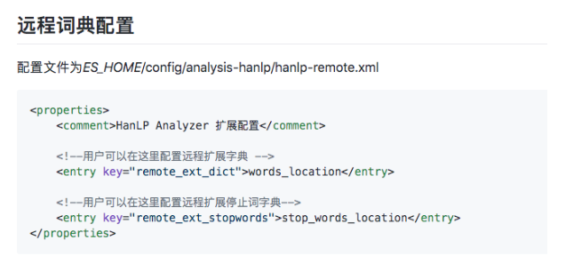
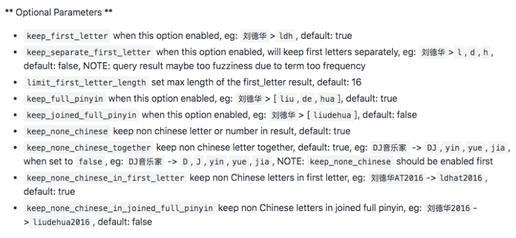

# **第五节 多语言及中文分词与检索**

## *1、自然语言与查询Recall** 

* 当处理人类白然语言时，有些情况，尽管搜索和原文不完全匹配，但是希望搜到一些内容 
	* `Quick browrn fox`和`fast brown fox` / `Jumping fox`和`Jumped foxes` 
* 一些可采取的优化 
	* 归一化调元清除变音符号如`rôle`的时候也会匹配`role` 
	* 抽取词根：**清除单复数和时态的差异** 
	* 包含同义词 
	* 拼写错误：拼写错误或者同音异形调 


## **2、混合多语言的挑战** 

* 一些具体的多语言场景 
	* **不同的索引使用不同的语**
	* **同一个索引中，不同的字段使用不同的语言**
	* **一个文档的一个字段内混合不同的语言** 
* 混合语言存在的一些挑战 
	* 词干提取：以色列文档，包含了希伯来语，阿拉伯语，俄语和英文 
	* 不正确的文档频率——**英文为主的文章中，德文算分高（稀有**） 
	* 需要判断用户搜索时使用的语言语言识别（Compact Language Detector) 
		* 例如根据语言查询不同的索引 


## **3、分词的挑战** 

* 英文分词：·You’re·分成一个还是多个？`Half-baked` 
* 中文分词 
	* 分词标准：哈工大标准中姓和名分开。`HanLP`是在一起的。具体情况需制定不同的标准 
	* **歧义（组合型歧义，交集型歧义，真歧义**） 
		* 中华人民共和国／美国会通过对台售武法案／上海仁和服装厂 

## **4、中文分词方法的演变——字典法** 

* 查字典最容易想到的分词方法（北京航空大学的梁南元教授提出） 
	* 一个句子从左到右扫描一遍。遇到有的调就标示出来。找到复合词，就找最长的 
	* 不认识的字串就分割成单字词 
* 最小词数的分词理论——哈工大王晓龙博士把查字典的方法理论化 
	* 一句话应该分成数量最少的词串 
	* 遇到二异性，无能为力（例如：“发展中国家厂”/ “上海大学城书店”）
	* 用各种文化规则来解决二义性都并不成功 

	
## **5、中文分词方法的演变——基于统计法的机器学习算法备** 

* 统计语言模型一1990年前后清华大学电子工程系郭进博士 
	* 解决了二义性问题将中文分词的错误率降低了一个数量级。概率问题动态规划+利用维特比算 法决速找到最佳分调 
* **基于统计的机器学习算法**
	* 这类目前常用的是算法是`HMM, CRF, SVM`,深度学习等算法。比如`Hanlp`分词工具是基于`CRF`算法以`CRF`为例，基本思路是对汉宇进行标注训练，不仅考虑了调语出现的频率，还考虑上下文，具各转好的学习能力，因此真对歧义调和未登录词的识别都具有良好的效果． 
	* 随着深度学习的兴起，也出现了基于神经网络的分调器有人尝试使用双向`LSTM+CRF`实现分调器，其本质上是序列标注，据报道其分词器字符准确率可高达97.5% 


## **6、中文分词器现状** 

* 中文分词器以统计语言模型为基础，经过几十年的发展，今天基本已经可以看作是一个已经解决的问题 
* 不同分词器的好坏主要的差别在于数据的使用和工程使用的精度 
* 常见的分词器都是使用机器学习算法和词典相结合，一方面能够提高分词准确率，另一方面能够改善领域适应性


## **7、一些中文分词器** 

* HanLP一面向生产环境的自然语言处理工具包 
	* http://hanlp.com/
	* https://github.com/KennFalcon/elasticsearch-analysis-hanlp
* IK分词器
	* https://github.com/medcl/elasticsearch-analysis-ik


## **8、HanLP  Analysis** 

* HanLP 

```
./elasticsearch-plugin install https://github.com/KennFalcon/elasticsearch-analysis-hanlp/releases/download/v7.9.1/elasticsearch-analysis-hanlp-7.9.1.zip
```


 


## **9、IK Analysis** 

### Pinyin
 
```
./elasticsearch-plugin install https://github.com/medcl/elasticsearch-analysis-pinyin/releases/download/v7.9.1/elasticsearch-analysis-pinyin-7.9.1.zip
```

 


## **10、中⽂文分词 Demo**

* 使⽤用不不同的分词器器测试效果
* 索引时，尽量量切分的短，查询的时候，尽量量⽤用⻓长的词 
* 拼⾳音分词器器

```
#stop word

DELETE my_index
PUT /my_index/_doc/1
{ "title": "I'm happy for this fox" }

PUT /my_index/_doc/2
{ "title": "I'm not happy about my fox problem"}
```

```
POST my_index/_search
{
  "query": {
    "match": {
      "title": "not happy fox"
    }
  }
}
```

***Output***

```
 "max_score" : 0.9902718,
    "hits" : [
      {
        "_index" : "my_index",
        "_type" : "_doc",
        "_id" : "2",
        "_score" : 0.9902718,
        "_source" : {
          "title" : "I'm not happy about my fox problem"
        }
      },
      {
        "_index" : "my_index",
        "_type" : "_doc",
        "_id" : "1",
        "_score" : 0.39132434,
        "_source" : {
          "title" : "I'm happy for this fox"
        }
      }
    ]
```

虽然通过使用 english （英语）分析器，使得匹配规则更加宽松，我们也因此提高了召回率，但却降低了精准匹配文档的能力。为了获得两方面的优势，我们可以使用multifields（多字段）对 title 字段建立两次索引： 一次使用 `english`（英语）分析器，另一次使用 `standard`（标准）分析器:

```
PUT /my_index
{
  "mappings": {
    "blog": {
      "properties": {
        "title": {
          "type": "string",
          "analyzer": "english"
        }
      }
    }
  }
}
```

***Error :***

```
"caused_by" : {
      "type" : "mapper_parsing_exception",
      "reason" : "Root mapping definition has unsupported parameters:  [blog : {properties={title={analyzer=english, type=string}}}]"
    }
   },
 "status" : 400
```

1. 去掉`mappings`下面的`blog`，在`put`时已指定`my_index`
2. `"type": "string",`没有这个类型

```
PUT /my_index
{
  "mappings": {
      "properties": {
        "title": {
          "type": "text",
          "fields": {
            "english": {
              "type":     "text",
              "analyzer": "english"
          }
        }
      }
    }
  }
}

PUT /my_index/_doc/1
{ "title": "I'm happy for this fox" }

PUT /my_index/_doc/2
{ "title": "I'm not happy about my fox problem" }


GET /my_index/_search
{
  "query": {
    "multi_match": {
      "type":     "most_fields",
      "query":    "not happy foxes",
      "fields": [ "title", "title.english" ]
    }
  }
}
```

**Output**

```
"max_score" : 1.1404738,
"hits" : [
      {
        "_index" : "my_index",
        "_type" : "_doc",
        "_id" : "2",
        "_score" : 1.1404738,
        "_source" : {
          "title" : "I'm not happy about my fox problem"
        }
      },
      {
        "_index" : "my_index",
        "_type" : "_doc",
        "_id" : "1",
        "_score" : 0.6178806,
        "_source" : {
          "title" : "I'm happy for this fox"
        }
      }
    ]
```

**安装插件**

```
docker exec -it es7_01 bash
docker exec -it es7_02 bash


bin/elasticsearch-plugin install https://github.com/KennFalcon/elasticsearch-analysis-hanlp/releases/download/v7.9.1/elasticsearch-analysis-hanlp-7.9.1.zip
bin/elasticsearch-plugin install https://github.com/medcl/elasticsearch-analysis-pinyin/releases/download/v7.9.1/elasticsearch-analysis-pinyin-7.9.1.zip


bin/elasticsearch-plugin list
analysis-pinyin
```
```
docker restart es7_01
docker restart es7_02

http://192.168.33.12:9200/_cat/plugins
es79   analysis-icu    7.9.1
es79   analysis-pinyin 7.9.1
es7_02 analysis-icu    7.9.1
es7_02 analysis-ik     7.9.1
es7_02 analysis-pinyin 7.9.1
```


```
#ik_max_word
#ik_smart
#hanlp: hanlp默认分词
#hanlp_standard: 标准分词
#hanlp_index: 索引分词
#hanlp_nlp: NLP分词
#hanlp_n_short: N-最短路分词
#hanlp_dijkstra: 最短路分词
#hanlp_crf: CRF分词（在hanlp 1.6.6已开始废弃）
#hanlp_speed: 极速词典分词

POST _analyze
{
  "analyzer": "hanlp_standard",
  "text": ["剑桥分析公司多位高管对卧底记者说，他们确保了唐纳德·特朗普在总统大选中获胜"]

} 
```

```
#Pinyin
PUT /artists/
{
    "settings" : {
        "analysis" : {
            "analyzer" : {
                "user_name_analyzer" : {
                    "tokenizer" : "whitespace",
                    "filter" : "pinyin_first_letter_and_full_pinyin_filter"
                }
            },
            "filter" : {
                "pinyin_first_letter_and_full_pinyin_filter" : {
                    "type" : "pinyin",
                    "keep_first_letter" : true,
                    "keep_full_pinyin" : false,
                    "keep_none_chinese" : true,
                    "keep_original" : false,
                    "limit_first_letter_length" : 16,
                    "lowercase" : true,
                    "trim_whitespace" : true,
                    "keep_none_chinese_in_first_letter" : true
                }
            }
        }
    }
}


GET /artists/_analyze
{
  "text": ["刘德华 张学友 郭富城 黎明 四大天王"],
  "analyzer": "user_name_analyzer"
}

```

***Output :***

```
{
  "tokens" : [
    {
      "token" : "ldh",
      "start_offset" : 0,
      "end_offset" : 3,
      "type" : "word",
      "position" : 0
    },
    {
      "token" : "zxy",
      "start_offset" : 4,
      "end_offset" : 7,
      "type" : "word",
      "position" : 1
    },
    {
      "token" : "gfc",
      "start_offset" : 8,
      "end_offset" : 11,
      "type" : "word",
      "position" : 2
    },
    {
      "token" : "lm",
      "start_offset" : 12,
      "end_offset" : 14,
      "type" : "word",
      "position" : 3
    },
    {
      "token" : "sdtw",
      "start_offset" : 15,
      "end_offset" : 19,
      "type" : "word",
      "position" : 4
    }
  ]
}
```


## **11、相关资源**

* Elasticsearch IK分词插件 https://github.com/medcl/elasticsearch-analysis-ik/releases
* Elasticsearch hanlp 分词插件 https://github.com/KennFalcon/elasticsearch-analysis-hanlp
* 分词算法综述 https://zhuanlan.zhihu.com/p/50444885

