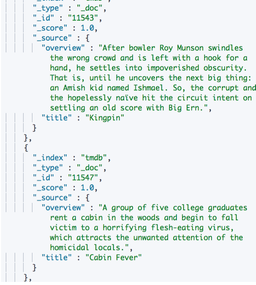
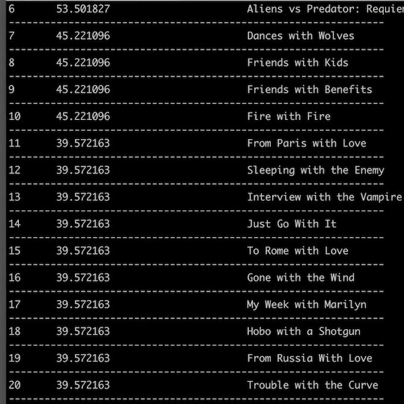
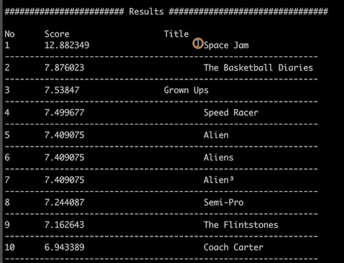
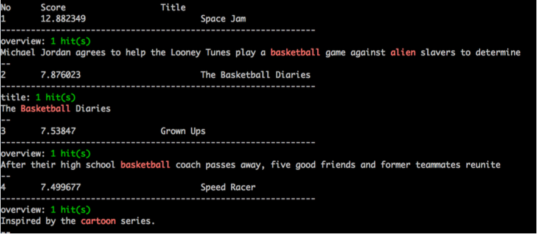

# **第六节 Space Jam，一次全文搜索的实例**

## **1-1 目的**

* 目标:⽤过⼀个具体案例例，帮助你了解并巩固所学的知识点 
	* 写⼊数据 / 设置 `Mapping`，设置 `Analysis`
	* 查询并⾼亮显示结果
	* 分析查询结果，通过修改配置和查询，优化搜索的相关性
* 分析问题，结合原理，分析思考并加以实践

## **1-2 TMDB 数据库**

* 创建于 2008 年年，电影的 Meta Data 库
	* 46 万本电影 / 12万本电视剧 / 230万张图片 / 每周 20万次编辑
* 提供 API。总共有超过20万开发⼈人员和公司在使⽤


## **1-3 数据导入**

* 数据特征 – 标题信息较短 / 概述相对较⻓
* 通过 `TDMB Search API`
* 将查询数据保存在本地 CSV ⽂文件中
* 使⽤ `Python` 导入及查询数据
* 索引的主分片数设置为 `1`，使⽤默认 `Dynamic Mapping`

 

```
curl "https://bootstrap.pypa.io/get-pip.py" -o "get-pip.py"
python get-pip.py
pip install -r requirements.txt
```

```
 tree tmdb-search
tmdb-search
├── ingest_tmdb_from_file.py
├── ingest_tmdb_to_appserarch.py
├── mapping
│   ├── english_analyzer.json
│   └── english_english_3_shards.json
├── query
│   ├── query_space_jam.json
│   ├── query_space_jam_improved.json
│   └── query_space_jam_most_fields.json
├── query_tmdb.py
├── requirements.txt
└── tmdb.json

2 directories, 10 files
```

```
$ python ingest_tmdb_from_file.py 

>> Please select the mapping file. Choose 0 for empty mapping

[0] empty mapping. It will use dynamic mapping with default settings
[1] english_analyzer.json
[2] english_english_3_shards.json
0
return empty
settings:
{}
Response for createing the index with the settings and mappings. {"acknowledged":true,"shards_acknowledged":true,"index":"tmdb"}
Start ingesting data......
Done for ingesting TMDB data into Elasticsearch
```

## **1-4 Use Case – 查找 Space Jam**

* 空中⼤大灌篮 (Space JAM)
	* 华纳公司动画明星 / 篮球巨星乔丹 / 外星小怪物
* 案例:⽤户不记得电影名，⽽希望通过⼀些关键字，搜索到电影的详细信息
* 搜索关键字:“Basketball with Cartoon Aliens”

[测试数据及代码](https://github.com/geektime-geekbang/geektime-ELK/tree/master/tmdb-search)

**`query_space_jam.json`**

```
{
      "_source": ["title","overview"],
      "size":20,
      "query": {
          "multi_match": {
              "query": "basketball with cartoon aliens",
              "fields": ["title^10","overview"]
          }
      },
      "highlight" : {
            "fields" : {
                "overview" : { "pre_tags" : ["<em>"], "post_tags" : ["</em>"] },
                "title" : { "pre_tags" : ["<em>"], "post_tags" : ["</em>"] }
            }
        }

  }
```

```
python query_tmdb.py
```

 


**`query_space_jam_most_fields.json`**

```
{
      "_source": ["title","overview"],
      "size":20,
      "query": {
          "multi_match": {
              "type": "most_fields",
              "query": "basketball with cartoon aliens",
              "fields": ["title","overview"]
          }
      },
      "highlight" : {
            "fields" : {
              "overview" : { "pre_tags" : ["<em>"], "post_tags" : ["</em>"] },
              "title" : { "pre_tags" : ["<em>"], "post_tags" : ["</em>"] }
            }
        }
  }
```

* ` "type": "most_fields",`

 


**`query_space_jam_improved.json`**

```
POST tmdb/_search
{
      "_source": ["title","overview"],
      "size":20,
      "query": {
          "multi_match": {
              "query": "basketball with cartoon aliens",
              "fields": ["title","overview"]
          }
      },
      "highlight" : {
            "fields" : {
              "overview" : { "pre_tags" : ["<em>"], "post_tags" : ["</em>"] },
              "title" : { "pre_tags" : ["<em>"], "post_tags" : ["</em>"] }
            }
        }
  }
```

 

## **1-5 思考与分析**

* “精确值” 还是 “全⽂”?
* 搜索是怎么样的?不同的字段需要配置怎么样的分词器
* 测试不同的的选项
	* 分词期 / 多字段属性 / 是否要 g-grams / what are some critical synonyms / 为字段设置不同的权重
	* 测试不同的选项，测试不同的搜索条件


## **1-6 测试相关性 – 理理解原理理 + 多分析 + 多调整测试**

* 技术分为**道和术**两种
	* 道 – 原理和原则
	* 术 – 具体的做法，具体的解法
* 关于搜索，为了有⼀个好的搜索结果。除了真正理解背后的原理，更需要多加实践与分析
	* 单纯追求“术”，会⼀直很⾟苦。只有掌握了本质和精髓之“道”，做事才能游刃有余
	* 要做好搜索，除了了理解原理，也需要坚持去分析⼀些不好的搜索结果。只有通过⼀定时间的积累，
才能真正有所感觉
	* 总希望⼀个模型，⼀个算法，就能毕其功于⼀役，是不现实的

## **1-7 监控并且理解⽤户⾏为**

* 不要过度调试相关度
* 而要监控搜索结果，监控用户点击最顶端结果的频次
* 将搜索结果提⾼到极⾼水平，唯⼀途径就是
	* 需要具有度量用户⾏为的强⼤能⼒
	* 可以在后台实现统计数据，⽐如，⽤户的查询和结果，有多少被点击了
	* 哪些搜索，没有返回结果	

