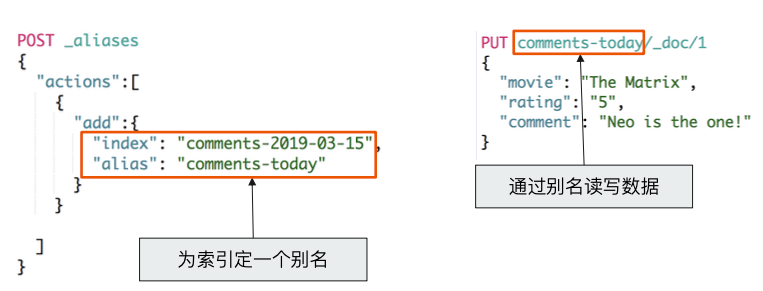

# **第七节 使⽤用 Search Template 和 Index Alias**

## **1、Search Template – 解耦程序 & 搜索 DSL**

* Elasticsearch 的查询语句句
	* 对相关性算分 / 查询性能都⾄关重要
* 在开发初期，虽然可以明确查询参数，但是往往还不能最终定义查询的DSL的具体结构
	* 通过`Search Template` 定义⼀个 `Contract`
* 各司其职，解耦
	* 开发⼈员 / 搜索⼯程师 / 性能工程师

**搜索⼯程师**

```
POST _scripts/tmdb
{
  "script": {
    "lang": "mustache",
    "source": {
      "_source": [
        "title","overview"
      ],
      "size": 20,
      "query": {
        "multi_match": {
          "query": "{{q}}",
          "fields": ["title","overview"]
        }
      }
    }
  }
}
```

### 1-1 使⽤ Search Template 进行查询

**性能工程师**

```
POST tmdb/_search/template
{
    "id":"tmdb",
    "params": {
        "q": "basketball with cartoon aliens"
    }
}
```

```
DELETE _scripts/tmdb

GET _scripts/tmdb
```

## **2、Index Alias 实现零停机运维**

 

### 2-1 使⽤用 Alias 创建不不同查询的视图

```
PUT movies-2019/_doc/1
{
  "name":"the matrix",
  "rating":5
}

PUT movies-2019/_doc/2
{
  "name":"Speed",
  "rating":3
}
```

```
POST _aliases
{
  "actions": [
    {
      "add": {
        "index": "movies-2019",
        "alias": "movies-latest"
      }
    }
  ]
}
```

```
POST movies-latest/_search
{
  "query": {
    "match_all": {}
  }
}
```

***Ouput:***

```
"max_score" : 1.0,
    "hits" : [
      {
        "_index" : "movies-2019",
        "_type" : "_doc",
        "_id" : "1",
        "_score" : 1.0,
        "_source" : {
          "name" : "the matrix",
          "rating" : 5
        }
      },
      {
        "_index" : "movies-2019",
        "_type" : "_doc",
        "_id" : "2",
        "_score" : 1.0,
        "_source" : {
          "name" : "Speed",
          "rating" : 3
        }
      }
    ]
```

### 2-2 使⽤用 Alias 创建不同查询的视图

```
POST _aliases
{
  "actions": [
    {
      "add": {
        "index": "movies-2019",
        "alias": "movies-lastest-highrate",
        "filter": {
          "range": {
            "rating": {
              "gte": 4
            }
          }
        }
      }
    }
  ]
}
```

```
POST movies-lastest-highrate/_search
{
  "query": {
    "match_all": {}
  }
}
```

***Output***

```
 "max_score" : 1.0,
    "hits" : [
      {
        "_index" : "movies-2019",
        "_type" : "_doc",
        "_id" : "1",
        "_score" : 1.0,
        "_source" : {
          "name" : "the matrix",
          "rating" : 5
        }
      }
    ]
```

## **3、本节知识点回顾**

* Search Template 的使⽤场景
	* 如果通过 Mocha 语法定义一个 Search Template
*  Index Alias 的使⽤用场景
* 如何创建与使用 Index Alias
* 通过 Index Alias 创建不同的查询视图

