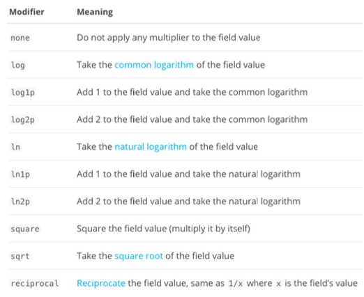
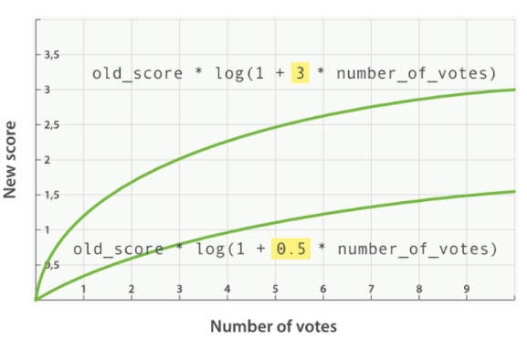

# **第八节 综合排序:Function Score Query 优化算分**

## **1、算分与排序**

*  Elasticsearch 默认会以文档的相关度算分进⾏排序 
*  可以通过指定⼀个或者多个字段进⾏排序
*  使⽤相关度算分(score)排序，不能满足某些特定条件
	*  ⽆法针对相关度，对排序实现更多的控制


## **2、Function Score Query**

###  2-1 Function Score Query

* 可以在查询结束后，对每⼀个匹配的⽂文档进⾏⼀系列列的重新算分，根据新⽣成的分数进行排序。

###  2-2 提供了⼏种默认的计算分值的函数

* Weight :为每⼀个⽂档设置⼀个简单而不被规范化的权重
* Field Value Factor:使⽤用该数值来修改 `_score`，例例如将 “热度”和“点赞数”作为算分的参考因素
* Random Score:为每⼀个用户使⽤⼀个不同的，随机算分结果
* 衰减函数: 以某个字段的值为标准，距离某个值越近，得分越⾼
* Script Score:自定义脚本完全控制所需逻辑

```
DELETE blogs

PUT /blogs/_doc/1
{
  "title":   "About popularity",
  "content": "In this post we will talk about...",
  "votes":   0
}

PUT /blogs/_doc/2
{
  "title":   "About popularity",
  "content": "In this post we will talk about...",
  "votes":   100
}

PUT /blogs/_doc/3
{
  "title":   "About popularity",
  "content": "In this post we will talk about...",
  "votes":   1000000
}
```


## **3、按受欢迎度提升权重**

希望能够将点赞多的 blog，放在搜索列表 对靠前的位置。**同时搜索的评分，还是要作为排序的主要依据**

**新的算分 = ⽼的算分 * 投票数**

* 投票数为0
* 投票数很大时

 

```
POST /blogs/_search
{
  "query": {
    "function_score": {
      "query": {
        "multi_match": {
          "query":    "popularity",
          "fields": [ "title", "content" ]
        }
      },
      "field_value_factor": {
        "field": "votes"
      }
    }
  }
}
```

*  **"`multi_match`"**
*  **"`field_value_factor`"**

***Output :***

```
"max_score" : 133531.39,
    "hits" : [
      {
        "_index" : "blogs",
        "_type" : "_doc",
        "_id" : "3",
        "_score" : 133531.39,
        "_source" : {
          "title" : "About popularity",
          "content" : "In this post we will talk about...",
          "votes" : 1000000
        }
      },
      {
        "_index" : "blogs",
        "_type" : "_doc",
        "_id" : "2",
        "_score" : 13.353139,
        "_source" : {
          "title" : "About popularity",
          "content" : "In this post we will talk about...",
          "votes" : 100
        }
      },
      {
        "_index" : "blogs",
        "_type" : "_doc",
        "_id" : "1",
        "_score" : 0.0,
        "_source" : {
          "title" : "About popularity",
          "content" : "In this post we will talk about...",
          "votes" : 0
        }
      }
    ]
```

* `"_id" : "3",  "_score" : 133531.39,  "votes" : 1000000`
* ` "_id" : "2", "_score" : 13.353139,  "votes" : 100`
* ` "_id" : "1", "_score" : 0.0,  "votes" : 0`


## **4、 使⽤ Modifier 平滑曲线**
 
*  **`新的算分=⽼的算分*log(1+投票数)`**

 

 

```
POST /blogs/_search
{
  "query": {
    "function_score": {
      "query": {
        "multi_match": {
          "query":    "popularity",
          "fields": [ "title", "content" ]
        }
      },
      "field_value_factor": {
        "field": "votes",
        "modifier": "log1p"
      }
    }
  }
}
```

***Output :***

* `"_score" : 0.8011884,`
* ` "_score" : 0.26763982,`
* ` "_score" : 0.0,`


## **5、 引⼊ Factor**

* `新的算分=⽼的算分*log(1+factor*投票数)`

```
POST /blogs/_search
{
  "query": {
    "function_score": {
      "query": {
        "multi_match": {
          "query":    "popularity",
          "fields": [ "title", "content" ]
        }
      },
      "field_value_factor": {
        "field": "votes",
        "modifier": "log1p" ,
        "factor": 0.1
      }
    }
  }
}
```

***Output :***

* `"_score" : 0.66765755,`
* ` "_score" : 0.13905862,`
* ` "_score" : 0.0,`

 


## **6、 Boost Mode 和 Max Boost**

* Boost Mode
	* Multiply:算分与函数值的乘积
	*  Sum:算分与函数的和
	*  Min / Max:算分与函数取最⼩/ 最⼤值
	*  Replace:使⽤用函数值取代算分
* **Max Boost 可以将算分控制在⼀个最⼤值**

```
POST /blogs/_search
{
  "query": {
    "function_score": {
      "query": {
        "multi_match": {
          "query":    "popularity",
          "fields": [ "title", "content" ]
        }
      },
      "field_value_factor": {
        "field": "votes",
        "modifier": "log1p" ,
        "factor": 0.1
      },
      "boost_mode": "sum",
      "max_boost": 3
    }
  }
}
```
***Output :***

### 6-1 Max Boost 可以将算分控制在⼀个最⼤值

*   `"_score" : 3.1335313,`
*   `"_score" : 1.1749241,`
*   `"_score" : 0.13353139,`


## **7、⼀致性随机函数**

* 使⽤用场景:⽹站的⼴告需要提⾼展现率
* 具体需求:让每个⽤户能看到不同的随机排名，但是也希望同⼀个⽤户访问时，结果的相对顺序，保持⼀致 (Consistently Random)

```
POST /blogs/_search
{
  "query": {
    "function_score": {
      "random_score": {
        "seed": 911119
      }
    }
  }
}
```

***Output :***

1 -> 3 -> 2

```
POST /blogs/_search
{
  "query": {
    "function_score": {
      "random_score": {
        "seed": 888
      }
    }
  }
}
```


***Output :***

2-> 1 -> 3


## **8、本节知识点回顾**

* 复合查询:Function Score Query
	* 提供了了多种函数，⾃定义脚本，完全控制算分
* Field Value Factor:搜索的相关度，能够结合投票的数量进⾏重算。通过⼀些参数的设定，对算分进⾏控制
* 随机函数:⽤户提供 Seed，返回⼀个随机⼀致性的排序结果


