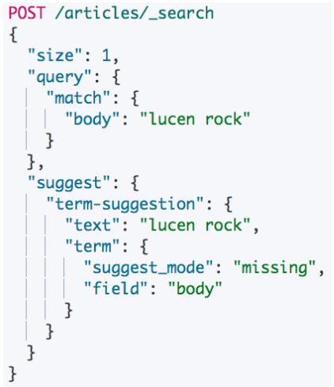
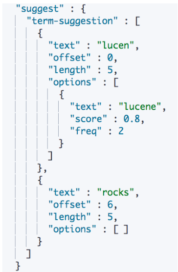

# **第九节 Term & Phrase Suggester**

## **1、什么是搜索建议**

* 现代的搜索引擎，⼀般都会提供 Suggest as you type 的功能
* 帮助⽤户在输入搜索的过程中，进⾏⾃动补全或者纠错。通过协助⽤户输入更加精准的关键词，提⾼后续搜索阶段⽂档匹配的程度
* 在 google上搜索，⼀开始会⾃动补全。当输⼊到一定长度，如因为单词拼写错误无法补全， 就会开始提示相似的词或者句子


 


## **2、Elasticsearch Suggester API**

* 搜索引擎中类似的功能，在 Elasticsearch 中是通过 Suggester API 实现的
* **原理: 将输入的⽂本分解为 Token，然后在索引的字典⾥查找相似的 Term 并返回**
* 根据不同的使⽤用场景，Elasticsearch 设计了了 4 种类别的 Suggesters
	* Term & Phrase Suggester
	* Complete & Context Suggester

## **3、Term Suggester**

* Suggester 就是一种特殊类型的搜索。”text” ⾥是调⽤时候提供的⽂本，通常来⾃于⽤户界面上⽤用户输⼊的内容
* ⽤户输⼊的 `“lucen”` 是⼀个错误的拼写
* 会到指定的字段` “body”` 上搜索，当⽆无法搜索到结果时 (`missing`)，返回建议的词

 

**自动补全与基于上下文的提示**


###3-1 一些测试数据

```
DELETE articles
PUT articles
{
  "mappings": {
    "properties": {
      "title_completion":{
        "type": "completion"
      }
    }
  }
}


POST articles/_bulk
{ "index" : { } }
{ "title_completion": "lucene is very cool"}
{ "index" : { } }
{ "title_completion": "Elasticsearch builds on top of lucene"}
{ "index" : { } }
{ "title_completion": "Elasticsearch rocks"}
{ "index" : { } }
{ "title_completion": "elastic is the company behind ELK stack"}
{ "index" : { } }
{ "title_completion": "Elk stack rocks"}
{ "index" : {} }
```

 默认使⽤用 standard 分词器器 
 
 * 大写转⼩写
 * rocks 和 rock 是两个词

```
POST articles/_search?pretty
{
  "size": 0,
  "suggest": {
    "article-suggester": {
      "prefix": "elk ",
      "completion": {
        "field": "title_completion"
      }
    }
  }
}
```


***Output :***

```
"suggest" : {
    "article-suggester" : [
      {
        "text" : "elk ",
        "offset" : 0,
        "length" : 4,
        "options" : [
          {
            "text" : "Elk stack rocks",
            "_index" : "articles",
            "_type" : "_doc",
            "_id" : "5f0KR3UBjbV1yvhlSMnd",
            "_score" : 1.0,
            "_source" : {
              "title_completion" : "Elk stack rocks"
            }
          },
          {
            "text" : "Elk stack rocks",
            "_index" : "articles",
            "_type" : "_doc",
            "_id" : "6v0MR3UBjbV1yvhlR8mF",
            "_score" : 1.0,
            "_source" : {
              "title_completion" : "Elk stack rocks"
            }
          }
        ]
```

### 3-2 Suggester – Missing Mode
 
* **搜索 “lucen rock”:**

每个建议都包含了⼀个算分，相似性是通过 `Levenshtein Edit Distance` 的算法实现的。

核⼼思想就是⼀个词改动 多少字符就可以和另外⼀个词⼀致。 提供了了很多可选参数来控制相似性的模糊程度。例例如 **“max_edits”**

* **几种 Suggestion Mode**
	* Missing – 如索引中已经存在，就不提供建议
	* Popular – 推荐出现频率更加⾼的词
	* Always – ⽆论是否存在，都提供建议

 

```
DELETE articles

POST articles/_bulk
{ "index" : { } }
{ "body": "lucene is very cool"}
{ "index" : { } }
{ "body": "Elasticsearch builds on top of lucene"}
{ "index" : { } }
{ "body": "Elasticsearch rocks"}
{ "index" : { } }
{ "body": "elastic is the company behind ELK stack"}
{ "index" : { } }
{ "body": "Elk stack rocks"}
{ "index" : {} }
{  "body": "elasticsearch is rock solid"}


POST _analyze
{
  "analyzer": "standard",
  "text": ["Elk stack  rocks rock"]
}
```

***Output***

```
{
  "tokens" : [
    {
      "token" : "elk",
      "start_offset" : 0,
      "end_offset" : 3,
      "type" : "<ALPHANUM>",
      "position" : 0
    },
    {
      "token" : "stack",
      "start_offset" : 4,
      "end_offset" : 9,
      "type" : "<ALPHANUM>",
      "position" : 1
    },
    {
      "token" : "rocks",
      "start_offset" : 11,
      "end_offset" : 16,
      "type" : "<ALPHANUM>",
      "position" : 2
    },
    {
      "token" : "rock",
      "start_offset" : 17,
      "end_offset" : 21,
      "type" : "<ALPHANUM>",
      "position" : 3
    }
  ]
}
```


### 3-3 Term Suggester – Popular Mode

**Popular – 推荐出现频率更加⾼的词**

```
POST /articles/_search
{

  "suggest": {
    "term-suggestion": {
      "text": "lucen rock",
      "term": {
        "suggest_mode": "popular",
        "field": "body"
      }
    }
  }
}
```

*  `"suggest_mode": "popular",`

```
"suggest" : {
    "term-suggestion" : [
      {
        "text" : "lucen",
        "offset" : 0,
        "length" : 5,
        "options" : [
          {
            "text" : "lucene",
            "score" : 0.8,
            "freq" : 2
          }
        ]
      },
      {
        "text" : "rock",
        "offset" : 6,
        "length" : 4,
        "options" : [
          {
            "text" : "rocks",
            "score" : 0.75,
            "freq" : 2
          }
        ]
      }
    ]
```

* `"text" : "lucene",	"score" : 0.8,`
* `"text" : "rocks", "score" : 0.75,`


### 3-4 Term Suggester – Missing Mode

**Missing – 如索引中已经存在，就不提供建议**

```
POST /articles/_search
{
  "size": 1,
  "query": {
    "match": {
      "body": "lucen rock"
    }
  },
  "suggest": {
    "term-suggestion": {
      "text": "lucen rock",
      "term": {
        "suggest_mode": "missing",
        "field": "body"
      }
    }
  }
}
```

### 3-5 Term Suggester – Always Mode

**always – ⽆论是否存在，都提供建议**

```
POST /articles/_search
{
  "suggest": {
    "term-suggestion": {
      "text": "lucen rock",
      "term": {
        "suggest_mode": "always",
        "field": "body"
      }
    }
  }
}
```

* `"text" : "lucene",	"score" : 0.8,`
* `"text" : "rocks", "score" : 0.75,`

### 3-6 Sorting by Frequency & Prefix Length

* 默认按照 score 排序，也可以按照 “frequency”
* **默认⾸首字⺟不⼀致就不会匹配推荐，但是如果将 `prefix_length` 设置为 `0`，就会为 `hock` 建议 `rock`**

```
POST /articles/_search
{

  "suggest": {
    "term-suggestion": {
      "text": "lucen hocks",
      "term": {
        "suggest_mode": "always",
        "field": "body",
        "prefix_length":0,
        "sort": "frequency"
      }
    }
  }
}
```

***Output***

```
 "suggest" : {
    "term-suggestion" : [
      {
        "text" : "lucen",
        "offset" : 0,
        "length" : 5,
        "options" : [
          {
            "text" : "lucene",
            "score" : 0.8,
            "freq" : 2
          }
        ]
      },
      {
        "text" : "hocks",
        "offset" : 6,
        "length" : 5,
        "options" : [
          {
            "text" : "rocks",
            "score" : 0.8,
            "freq" : 2
          }
        ]
      }
    ]
```

## **4、Phrase Suggester**

* `Phrase Suggester` 在 `Term Suggester` 上增加了了一些额外的逻辑

* 一些参数
	* Suggest Mode :missing, popular, always
	* Max Errors:最多可以拼错的 Terms 数
	* Confidence:限制返回结果数，默认为 1

```
POST /articles/_search
{
  "suggest": {
    "my-suggestion": {
      "text": "lucne and elasticsear rock hello world ",
      "phrase": {
        "field": "body",
        "max_errors":2,
        "confidence":0,
        "direct_generator":[{
          "field":"body",
          "suggest_mode":"always"
        }],
        "highlight": {
          "pre_tag": "<em>",
          "post_tag": "</em>"
        }
      }
    }
  }
}
```

* `phrase`
* `"max_errors":2,`
*  `"confidence":0,`


***Output***

```
suggest" : {
    "my-suggestion" : [
      {
        "text" : "lucne and elasticsear rock hello world ",
        "offset" : 0,
        "length" : 39,
        "options" : [
          {
            "text" : "lucene and elasticsearch rock hello world",
            "highlighted" : "<em>lucene</em> and <em>elasticsearch</em> rock hello world",
            "score" : 1.5788074E-4
          },
          {
            "text" : "lucne and elasticsearch rocks hello world",
            "highlighted" : "lucne and <em>elasticsearch rocks</em> hello world",
            "score" : 1.136111E-4
          },
          {
            "text" : "lucne and elasticsearch rock hello world",
            "highlighted" : "lucne and <em>elasticsearch</em> rock hello world",
            "score" : 1.05567684E-4
          },
          {
            "text" : "lucene and elasticsear rocks hello world",
            "highlighted" : "<em>lucene</em> and elasticsear <em>rocks</em> hello world",
            "score" : 9.929376E-5
          },
          {
            "text" : "lucene and elasticsear rock hello world",
            "highlighted" : "<em>lucene</em> and elasticsear rock hello world",
            "score" : 9.2263974E-5
          }
        ]
      }
    ]
```
 
## **5、本节知识点回顾**

* Term Suggester 和 Phrase Suggester 分别有三种不不同类型的 Suggestion Mode
	* Missing / Popular / Always
	* 通过使⽤ Suggestion Phrase 可以提⾼搜索的 Precision 和 Recall