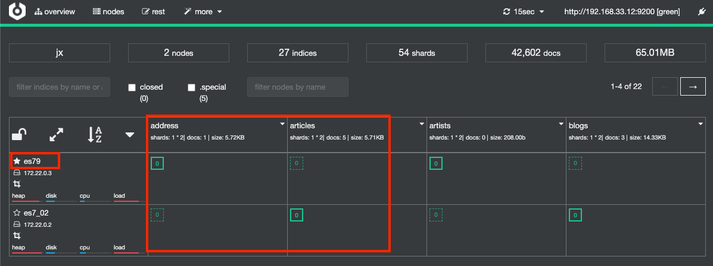
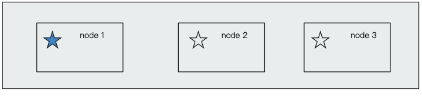
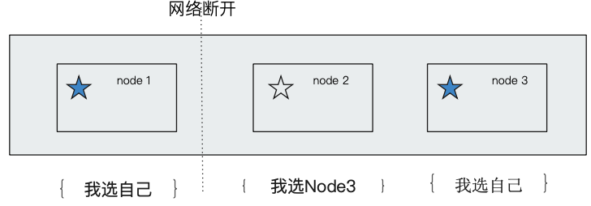
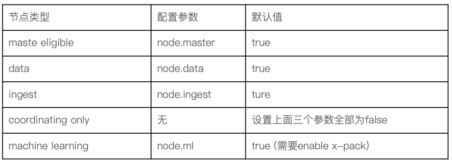

# **第一节 集群分布式模型及选主与脑裂问题**

## **1、分布式特性**

* Elasticsearch 的分布式架构带来的好处
	* 存储的水平扩容，⽀持 PB 级数据
	* 提⾼系统的可⽤性，部分节点停止服务，整个集群的服务不受影响
* Elasticsearch 的分布式架构
	* 不同的集群通过不同的名字来区分，默认名字 `“elasticsearch”`
	* 通过配置⽂件修改，或者在命令行中 `-E cluster.name=jx` 进⾏行行设定
	
```
bin/elasticsearch -E node.name=node1 -E cluster.name=jx -E path.data=node1_data
bin/elasticsearch -E node.name=node2 -E cluster.name=jx -E path.data=node2_data
bin/elasticsearch -E node.name=node3 -E cluster.name=jx -E path.data=node3_data
```


## **2、节点**

* 节点是⼀个 Elasticsearch 的实例
	* 其本质上就是⼀个 JAVA 进程
	*  ⼀台机器器上可以运⾏多个 Elasticsearch 进程，但是⽣产环境⼀般建议⼀台机器器上就运⾏⼀个 Elasticsearch 实例
*  每⼀个节点都有名字，通过配置文件配置，或者启动时候 `-E node.name=jx` 指定
*  每⼀个节点在启动之后，会分配⼀个 UID，保存在 data ⽬录下

## **3、Coordinating Node**

* **处理请求的节点，叫 `Coordinating Node`**
	* **路由请求到正确的节点，例如创建索引的请求，需要路路由到 Master节点**
* 所有节点默认都是 Coordinating Node
*  通过将其他类型设置成 False，使其成为 Dedicated Coordinating Node

### **3-1 Demo – 启动节点，Cerebro 介绍**

* 启动⼀个节点的

```
bin/elasticsearch -E node.name=node1 -E cluster.name=jx -E path.data=node1_data -E http.port=9200
```

[https://github.com/lmenezes/cerebro/releases](https://github.com/lmenezes/cerebro/releases)

* Overview /Filter by node / index
* Nodes
* REST / More
* Health Status


**Demo - 创建⼀个新的索引**

**发送创建索引的请求**

* Settings 3 Primary 和 1 个 Replica
* 请求可以发送到任何的节点，处理理你请求的节点，叫做 Coordinating Node
* 创建 / 删除索引的请求，只能被 Master 节点处理

## **4、Data Node**

* 可以保存数据的节点，叫做 Data Node
	*  节点启动后，默认就是数据节点。可以设置 `node.data: false` 禁⽌
* Data Node的职责
	* 保存分⽚数据。**在数据扩展上起到了⾄关重要的作用**(由 `Master Node` 决定如何把分⽚分发到数据节点上)
* 通过增加数据节点
	* 可以解决**数据⽔水平扩展和解决数据单点**问题

## **5、Master Node**

**5-1 Master Node 的职责**

* 处理创建，删除索引等请求 /决定分⽚被分配到哪个节点 / 负责索引的创建与删除
* 维护并且更新 Cluster State

**5-2 Master Node 的最佳实践**

 * Master 节点⾮常重要，在部署上需要考虑解决单点的问题
 * **为⼀个集群设置多个 Master 节点 / 每个节点只承担 Master 的单⼀⻆⾊**

## **6、Master Eligible Nodes & 选主流程**

* 一个集群，⽀持配置多个 `Master Eligible` 节点。这些节点可以在必要时(如 `Master `节点出现故障，⽹络故障时)参与选主流程，成为 `Master` 节点
* 每个节点启动后，默认就是⼀个 `Master eligible` 节点
	*  **可以设置 `node.master: false` 禁⽌**
* **当集群内第⼀个 `Master eligible`  节点启动时候，它会将⾃己选举成 `Master `节点**

## **7、集群状态**

* **集群状态信息(Cluster State)，维护了⼀个集群中，必要的信息**
	* 所有的节点信息
	* **所有的索引和其相关的 Mapping 与 Setting 信息**
	* 分片的路由信息
* **在每个节点上都保存了集群的状态信息**
* 但是，只有 Master 节点才能修改集群的状态信息，并负责同步给其他节点
	* **因为，任意节点都能修改信息会导致` Cluster State` 信息的不一致**

 

### **7-1 Demo – 增加⼀个新的节点**

* `bin/elasticsearch -E node.name=node2 -E cluster.name=jx -E path.data=node2_data -E http.port=9201`
* Nodes API 看到新增节点
* 发现 Replica 被分配


## **8、Master Eligible Nodes & 选主的过程**

* 互相 Ping 对方，**Node Id** 低的会成为被选举的节点
* 其他节点会加⼊集群，但是不承担 Master 节点的⻆色。⼀旦发现被选中的主节点丢失， 就会选举出新的 Master 节点

 

## **9、脑裂问题**

* `Split-Brain`，**分布式系统的经典⽹络问题**，当出现网络问题，⼀个节点和其他节点⽆法连接
	* Node 2 和 Node 3 会重新选举 Master
	* Node 1 ⾃⼰还是作为 Master，组成⼀个集群，同时更新 Cluster State
	* 导致 2 个 master，维护不同的 cluster state。当⽹络恢复时，⽆法选择正确恢复

 

## **10、如何避免脑裂问题**

* 限定⼀个选举条件，**设置 quorum(仲裁)，只有在 Master eligible 节点数⼤于 quorum 时，才能进⾏选举**

	* `Quorum = (master 节点总数 /2) + 1`
	* 当 `3` 个 `master eligible `时，设置 `discovery.zen.minimum_master_nodes` 为 `2`，即可避免脑裂

* 从 7.0 开始，⽆需这个配置
	* 移除 `minimum_master_nodes` 参数，让`Elasticsearch`⾃己选择可以形成仲裁的节点。
	* 典型的主节点选举现在只需要很短的时间就可以完成。集群的伸缩变得更安全、更容易，并且可能造成丢失数据的系统配置选项更少了
	* 节点更清楚地记录它们的状态，有助于诊断为什么它们不能加⼊集群或为什么⽆法选举出主节点

## **11、配置节点类型**

⼀个节点默认情况下是⼀个 Master eligible，data and ingest node:

 

## **12、本节知识点回顾**

* Elasticsearch 天⽣的分布式架构。为了实现实现数据可⽤用性
	* 部署多台 Data Nodes，可以实现数据存储的⽔平扩展
* 提⾼服务可用性
	* Master 节点⾮常重要。设置多台 Master Eligible Nodes，同时设置合理的 quorum 数，避免脑裂问题
	* 设置多台 Coordinating Node，提升查询的可⽤性和性能


