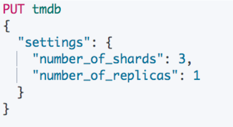
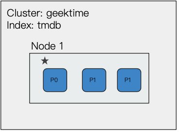
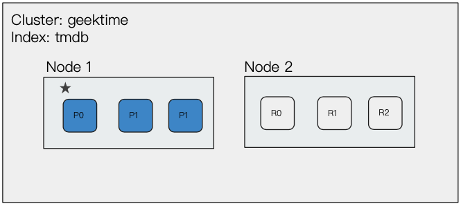
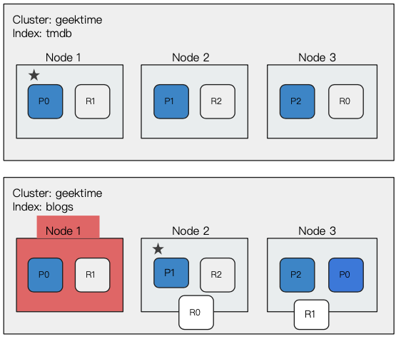
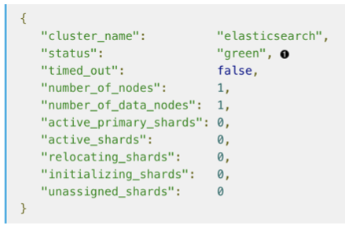

# **第二节 分⽚与集群的故障转移**

## **1、Primary Shard - 提升系统存储容量**

*  分⽚是 Elasticsearch 分布式存储的基⽯
	*  主分片 / 副本分⽚
* 通过主分片，将数据分布在所有节点上
	* Primary Shard，可以将⼀份索引的数据，分散在多个 Data Node 上，实现存储的⽔平扩展
	* **主分片(Primary Shard)数在索引创建时候指定，后续默认不能修改，如要修改，需重建索引**

## **2、Replica Shard - 提高数据可⽤性**

### **2-1 数据可用性**

* **通过引⼊副本分⽚ (Replica Shard) 提⾼数据的可⽤性**
* ⼀旦主分⽚丢失，副本分⽚可以 Promote 成主分片。
* **副本分⽚数可以动态调整**。
* 每个节点上都有完备的数据。如果不设置副本分⽚，⼀旦出现节点硬件故障，就有可能造成数据丢失

### **2-2 提升系统的读取性能**

* 副本分⽚由主分片(`Primary Shard`)同步。通过⽀持增加 `Replica` 个数，⼀定程度可以提高读取的吞吐量

## **3、分⽚数的设定**

* 如何规划⼀个索引的主分⽚数和副本分⽚数
	*  主分片数过⼩:	例如创建了 1 个 Primary Shard 的 Index 
* **主分⽚数设置过⼤:	导致单个 Shard 容量很小，引发⼀个节点上有过多分片，影响性能**
* 副本分⽚数设置过多，会降低集群整体的写入性能


## **4、单节点集群**

**副本⽆法分片，集群状态⻩色**

 

 

## **5、增加⼀个数据节点**

* 集群状态转为绿色
* 集群具备故障转移能⼒
* 尝试着将 Replica 设置成 2 和 3， 查看集群的状况

 


## **6、再增加⼀个数据节点**

* 集群具备故障转移能⼒
* Master 节点会决定分⽚分配到哪个节点
* **通过增加节点，提⾼集群的计算能⼒**


## **7、故障转移**


* 3 个节点共同组成。包含了 1 个索引，索引设置了 3 个 Primary Shard 和 1 个 Replica
* 节点 1 是 Master 节点，节点意外出现故障。集群重新选举 Master 节点
* **Node 3 上的 R0 提升成 P0，集群变⻩**
* R0 和 R1 分配，集群变绿

 


## **8、集群健康状态**

* Green: 健康状态，所有的主分⽚和副本分⽚都可⽤ 
* Yellow:亚健康，所有的主分⽚可用，部分副本分⽚不可⽤ 
* Red:不健康状态，部分主分⽚不可⽤

```
GET /_cluster/health
```

 


## **9、Demo**

* 启动⼀个节点，3 个 Primary shard，⼀个 Replica，集群⻩色，因为⽆法分配 Replica
* 启动三个节点，1 个索引上包含 3 个 Primary Shard，⼀个 Replica
* 关闭 Node 1(Master)
* 查看 Master Node 重新选举
* 集群变⻩，然后重新分配

## **9、本节知识点回顾**

**主分⽚，副本分片的作⽤**

* 主分⽚的分⽚数，设置后不能修改，除⾮重新索引数据
* 副本分片可以随时修改

**集群的故障转移**

*  需要集群具备故障转移的能⼒，必须将索引的副本分⽚数设置为 1，否则，⼀点有节点就是，就会造成数据丢失